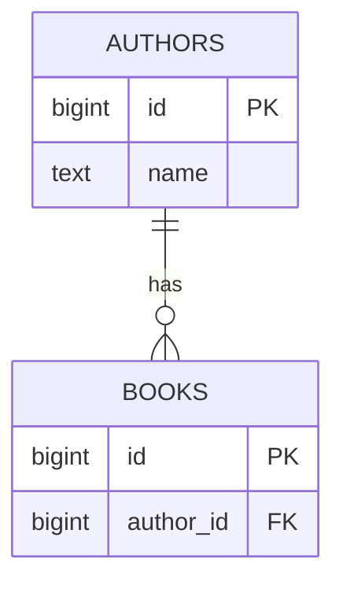

# Your first diagram

## What you'll build

TODO two or three sentences. What is on the canvas at the end, and what it is
for. Then the sketch:



## Before you start

TODO which walkthroughs come first, which dialect is selected in the top bar and
why it matters here.

If you would rather read the finished thing than type it, open
[`diagrams/00-your-first-diagram.dbviz.json`](diagrams/00-your-first-diagram.dbviz.json) with
**File → Open** (`Ctrl+O`), or drop the file on the canvas.

## The mental model

TODO the *why*, anchored to something the reader already knows — the SQL this
becomes, a data structure, a filesystem, a spreadsheet. One or two paragraphs,
no steps.

## Steps

### 1. TODO imperative title

TODO the action, naming the exact control.

**You should see:** TODO the observable change on screen.

### 2. TODO imperative title

TODO

**You should see:** TODO

### 3. TODO imperative title

TODO

**You should see:** TODO

## Other ways to do it

TODO every other route to the same result: the keyboard, the right-click menu,
the command palette (`Ctrl+K`), **Import SQL**, dropping a file, hand-written
`.dbviz.json`.

## Check your work

TODO how the reader proves it worked. Open the bottom drawer → **SQL** and
compare — copy this block from the app, do not write it from memory:

```sql
-- TODO paste the real generated script
```

## Gotchas

- TODO what bites, why, and what to do instead.
- TODO
- TODO

## Where to go next

- TODO [Title](NN-slug.md) — one line on why.
