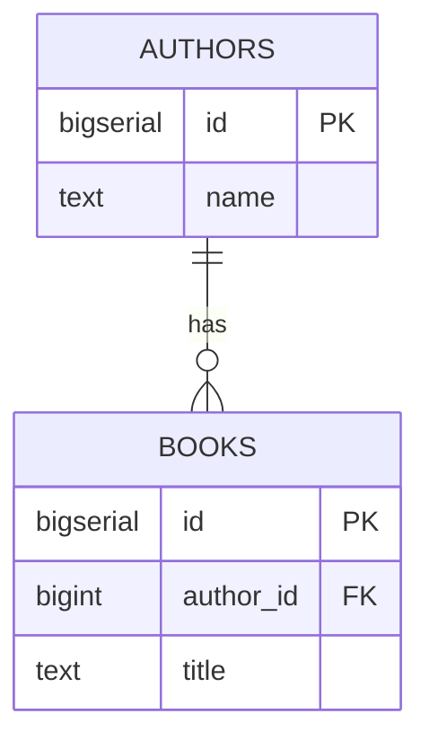

# Your first diagram

## What you'll build

Two tables — `authors` and `books` — joined by one foreign key. It is not much
of a schema, but drawing it touches almost everything the app can do: adding a
table, connecting two of them, reading the SQL that comes out, tidying the
layout, and checking for problems. By the end you will know where everything
in the window lives.

It is also the first two tables of a bookshop database that the whole series
builds, one walkthrough at a time. Nothing here gets thrown away: walkthrough
01 gives these two tables real columns, 02 hangs orders off them, and by the
end of walkthrough 13 the same canvas is running on a real PostgreSQL server.



## Before you start

This is the first walkthrough in the series, so there is nothing to have done
first — just open the app. Press **Set up the canvas** at the top of this
walkthrough (in the drawer's **Walkthrough** tab) and it clears the canvas for
you, which is where this one starts; **File → New workspace** does the same
thing. Check that **PostgreSQL** is selected in the dialect selector
at the top of the window (it is the default). Everything below is spelled the
PostgreSQL way because of that selector; pick a different dialect later and
the app translates what you typed for you.

Take a few seconds to find the five regions you will use for the rest of this
series. The **canvas** in the middle is where tables live and where most of
the mouse work happens. The **sidebar** on the left is a searchable list of
every table in the diagram — click a name there to select it and centre the
canvas on it. The **inspector** on the right always shows the detail of
whatever is currently selected: a table, a connection, a note, or nothing at
all. The **bottom drawer** holds eight tabs — **SQL**, **Types**, **Import
SQL**, **Trace**, **Simulate**, **Problems**, **Query**, **Database** — and
opens on whichever you last had in front. The **top bar** across the top
holds the diagram name, the dialect selector, undo/redo, the buttons that add
things, **Detangle**, **Trace**, **Simulate**, and the **File** and **View**
menus. All three side panels toggle from the icon buttons at the top bar's
right end, or from the **View** menu, if you close one by accident.

If a button named below is ever not where you expect, press `Ctrl+K`. It
opens the command palette: type a few letters of anything you want to do — a
table name, `detangle`, `export` — and it finds it for you. It works from
anywhere, it does not care what is selected, and it is the fastest way out of
being lost in this app. Keep it in your back pocket for the rest of this
walkthrough, and the rest of the series.

Every walkthrough in the series has that same pair of buttons: **Set up the
canvas** puts the diagram it starts from in front of you, and **Check my work**
at the foot of the text tells you whether what you built matches the end of it.
Between them you can start at any walkthrough in the series without doing the
fourteen others first.

If you would rather read the finished diagram than build it, open
[`diagrams/00-your-first-diagram.dbviz.json`](diagrams/00-your-first-diagram.dbviz.json)
with **File → Open** (`Ctrl+O`), or drop the file onto the canvas.

## The mental model

Every region you just found is a different view onto one thing: the diagram.
The sidebar lists it by name, the canvas draws it in space, the inspector
shows the full detail of whichever piece is selected — and the **SQL** tab in
the drawer is not a preview of it or an export of it. It *is* the diagram,
printed as the `CREATE TABLE` statements a database would actually run. There
is no separate model sitting behind the scenes that gets compiled into SQL
later: drag a foreign key on the canvas and the constraint appears in the SQL
tab in the same instant, because it was never anything other than the same
object shown two ways. That is worth internalising on day one, because it
tells you where to look when something needs fixing — if the SQL is wrong,
the diagram is wrong, and the fix is a click on the canvas or in the
inspector, never in the generated text (the SQL tab is read-only, on purpose).

Not everything on the canvas makes it into that text, though. A table's
position and its colour exist purely so a human can find it again — the
`.dbviz.json` file remembers them, but no database has a notion of "the
authors table sits at x=0, painted blue", so neither one is ever emitted.
Keep that distinction in mind as you read the SQL tab through this series:
everything printed there is real; not everything drawn on the canvas is.

## Steps

### 1. Add the authors table

<!-- step
target: ui:add-table
goals:
  - table | authors
-->

Press `T`. (Double-clicking empty canvas, the **+ Table** button, and
right-click → *Add table here* all do the same thing.) A table appears named
`new_table`, already holding one column: `id`, `INTEGER`, primary key, not
null, auto-increment. Rename it — press `F2` and type `authors`, or edit
*Name* at the top of the inspector.

**You should see:** a table node called `authors` on the canvas, selected,
with the inspector open on the right showing *Name*, *Schema*, *Comment*,
*Colour*, *Group*, and one column row underneath.

### 2. Give it a real key and a name

<!-- step
target: section:Columns
goals:
  - column | authors.id : BIGSERIAL
  - flags | authors.id : pk nn ai
  - column | authors.name : TEXT
-->

Click `id`'s type cell and change it to `BIGSERIAL` — PostgreSQL's
auto-incrementing 64-bit integer, and the type every table in this series'
bookshop schema uses for its key (*Set up a table*, next in the series, is
where you find out why). Then click into `id`'s name cell and press `Enter`:
a new row opens below it with the cursor already there. Type `name`, press
`Tab`, and type `TEXT`.

**You should see:** two rows in the column grid, and the bottom drawer's
**SQL** tab — open it now if it is not already in front — showing
`id BIGSERIAL PRIMARY KEY, name TEXT` inside `CREATE TABLE public.authors`.

### 3. Build the books table the same way

<!-- step
target: ui:add-table
goals:
  - table | books
  - column | books.id : BIGSERIAL
  - column | books.author_id : BIGINT
  - column | books.title : TEXT
-->

Press `T` again for a second table and rename it `books`. Change its `id` to
`BIGSERIAL` as you just did, then add two more columns the same way: `Enter`,
type a name, `Tab`, type a type. Add `author_id` as `BIGINT` — the same type
as `authors.id`, which is what makes the connection you are about to draw
possible — and `title` as `TEXT`.

**You should see:** a second table, `books`, with three rows (`id`,
`author_id`, `title`) and no connection to `authors` yet.

### 4. Drag a foreign key between them

<!-- step
target: column:books.author_id
goals:
  - fk | books.author_id -> authors.id
hint: The handle only appears while the pointer is over the table.
-->

Hover the `books` table. A small handle appears beside each column row —
drag the one beside `author_id` onto the `id` row of `authors` and release.

**You should see:** a solid line with a crow's foot at the `books` end joins
the two tables, a small link icon appears beside `author_id` in place of the
blank space that was there, and the inspector switches to the new connection
with **Kind** set to *Foreign key*.

### 5. Say how it reads

<!-- step
target: field:Reads as
goals:
  - reads | books belongs to authors
-->

With the connection still selected, find **Reads as** in the inspector and
change it from the default to *belongs to / has*.

**You should see:** the two preview lines under **Reads as** change to read
`books belongs to authors`, and beneath it, in grey, `authors has books`.

### 6. Watch the SQL tab fill in

<!-- step
target: tab:sql
goals:
  - open | sql
  - contains | FOREIGN KEY (author_id)
-->

Look back at the **SQL** tab in the bottom drawer and read `CREATE TABLE
public.books` from top to bottom.

**You should see:** the statement now ends with `CONSTRAINT fk_books_authors
FOREIGN KEY (author_id) REFERENCES public.authors (id)` — the connection you
just drew, as text — and the header comment above it updates to `-- Tables:
2, foreign keys: 1`.

### 7. Tidy the layout

<!-- step
target: ui:detangle
-->

Press `L` for **Detangle**, then `F` to fit the result to the window.

**You should see:** `authors` and `books` snap into a clean left-to-right
arrangement with the connection routed directly between them, then the
canvas zooms and pans so both tables are fully in view.

### 8. Glance at Problems

<!-- step
target: tab:problems
goals:
  - open | problems
  - lint clean
-->

Open the bottom drawer's **Problems** tab.

**You should see:** one warning — `books(author_id) references authors but
has no index` — with a one-click fix offered beside it. Leave it for now;
*Add indexes that get used* (07 in this series) is where you come back for
it. There are no errors, which is the bar a diagram has to clear to be
"lint clean".

### 9. Save, and notice the other ways back in

<!-- step
target: ui:file-menu
-->

Press `Ctrl+S`.

**You should see:** the browser downloads a `.dbviz.json` file, a toast
confirms *Diagram saved*, and the small unsaved-changes dot beside the
diagram name field disappears. Open the **File** menu once more and notice
**Copy share link** — it compresses the whole diagram into a URL, so anyone
who opens that link gets their own copy with nothing to install — and **Open
recent…**, which lists every diagram this browser has touched, with
thumbnails. Both are ways back to this file besides the one you just
downloaded.

## Other ways to do it

Nothing above is the only route there:

- **Right-click the canvas** → *Add table here* places a new table under the
  pointer instead of a default spot; the same menu has *Add view here* and
  *Add note here*.
- **The `▾` beside + Table** in the top bar adds a view, a note, a group
  region, or an enum or composite type.
- **Right-click a column row** for the same *Primary key*, *Not null*,
  *Unique* and *Auto-increment* toggles as the grid, plus *Add column below*
  and *Delete column*.
- Drew the foreign key backwards (from `authors` onto `books` instead of the
  other way round)? Select it and click **Swap** in the inspector — it moves
  the foreign key to the other table without making you delete and redraw it.
- **Import SQL** (bottom drawer) takes a pasted `CREATE TABLE ... REFERENCES
  ...` script and draws the same two tables and the same foreign key.
  Dropping a `.sql` file on the canvas, or pasting DDL with `Ctrl+V`, does
  the same.
- **Hand-write the `.dbviz.json`.** Everything in this walkthrough — two
  tables, three columns each, one relationship — is about twenty lines of
  JSON once you know the shape. [`../ADVISOR_OUTPUT_FORMAT.md`](../ADVISOR_OUTPUT_FORMAT.md)
  documents every field, and `node scripts/validate-dbviz.mjs file.dbviz.json`
  checks a file before you open it.

## Check your work

Open the bottom drawer → **SQL**, leave it on *Whole schema*, and compare.
This is the entire output for the diagram above:

```sql
-- Bookshop — after 00 Your first diagram (PostgreSQL)
-- Generated by Coditect
-- Tables: 2, foreign keys: 1

CREATE TABLE public.authors (
  id BIGSERIAL PRIMARY KEY,
  name TEXT
);
COMMENT ON TABLE public.authors IS 'One row per person who wrote something we sell.';

CREATE TABLE public.books (
  id BIGSERIAL PRIMARY KEY,
  author_id BIGINT NOT NULL,
  title TEXT,
  CONSTRAINT books_author_id_fkey FOREIGN KEY (author_id) REFERENCES public.authors (id)
);
COMMENT ON TABLE public.books IS 'One row per edition we stock.';
```

(The `COMMENT ON` lines only appear if you typed a description into the
inspector's **Comment** box; the constraint name is whatever the inspector
shows under **Name**.)

Then open **Problems** again. It should show exactly the one warning from
step 8 and nothing else.

Or press **Check my work** at the foot of this walkthrough in the
**Walkthrough** tab: it runs this walkthrough's own checks against whatever is
on your canvas right now and tells you, line by line, what is still missing.

## Try it yourself

- Switch the dialect selector to **MariaDB**, then to **SQLite**, and watch
  `BIGSERIAL` become `BIGINT AUTO_INCREMENT` and then `INTEGER PRIMARY KEY
  AUTOINCREMENT` in the SQL tab. `Ctrl+Z` undoes a whole translation in one
  step.
- Select the connection and press `Delete`. Open **Problems** — the foreign
  key comes back as a *Suggested foreign key*, read straight off the matching
  column names (`author_id` next to a table called `authors`), one click
  from being real again.
- Turn off **Cardinality labels** in the **View** menu and watch the small
  markers disappear from the connection; turn it back on.

## Gotchas

- **Everything here runs on your machine, on purpose.** There is no server
  somewhere holding your schema. The one local process this app does run — a
  small API server — binds to `127.0.0.1` only, because it can run arbitrary
  DDL against whatever database you point it at; nothing in this walkthrough
  needs it at all, since drawing tables and reading the SQL tab is entirely
  in the browser.
- **Opening a `.dbviz.json` replaces the whole diagram**, not just adds to
  it — that is what **File → Open** and dropping a file on the canvas both
  do. If you want to bring more tables into a diagram you are keeping,
  paste or drop DDL into **Import SQL** instead and pick *Add to the current
  diagram*; only that path merges.
- **The handle you drag from decides which table becomes the child.** Drag
  from `books.author_id` onto `authors.id` and `books` is the referencing
  table (correct, since a book belongs to one author). Do it the other way
  and you get a foreign key running backwards — not an error the app stops
  you from making, just a schema that says the opposite of what you meant.
  **Swap**, in the inspector, fixes it without a redraw.
- **A warning on `Problems` is not a broken diagram.** Step 8's
  `fk-without-index` warning was there the moment the foreign key existed,
  and it stays until you add an index — this walkthrough leaves it, since
  indexing is its own topic later in the series.
- **The SQL tab is read-only.** You cannot fix a mistake by editing the
  generated text; every change has to happen on the canvas or in the
  inspector, because the text is only ever a rendering of those, recomputed
  on every keystroke.

## Where to go next

- [Set up a table](01-set-up-a-table.md) — next in the series, and it picks up
  this canvas exactly as you left it: the two sketched tables get every type,
  key, flag, default and check they should have had, and `customers` joins them.

Each walkthrough from here on starts where the last one stopped, so the schema
you can see grows the whole way down. If you want to skip ahead, open the one
you want and press **Set up the canvas** — you get the diagram it expects
without having typed the ones before it.
