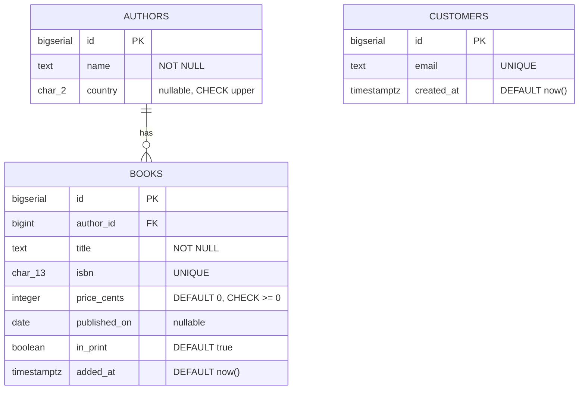

# Set up a table

## What you'll build

Walkthrough 00 sketched `authors` and `books` in about four columns between
them. Here they get the rest: every column carrying the type, nullability, key,
default and check it should have. Then you add `customers` from nothing, which
is the one table in this series you type end to end — it is where the orders in
the next walkthrough will hang from.

The foreign key you dragged in walkthrough 00 stays exactly where it is.
Nothing in this series is rebuilt from scratch; each walkthrough picks the
canvas up where the last one put it down.



## Before you start

You need what [Your first diagram](00-your-first-diagram.md) leaves behind:
`authors` and `books`, joined by one foreign key. If you have just done it, it
is already on your canvas. If not, press **Set up the canvas** at the top of
this walkthrough in the drawer's **Walkthrough** tab — it loads exactly that
diagram, and you can start here without having typed walkthrough 00.

Keep **PostgreSQL** selected in the dialect selector at the top: the types below
are spelled the PostgreSQL way, and `BIGSERIAL` in particular has no MariaDB or
SQLite equivalent. If you switch dialects later the app translates the known
types for you and `Ctrl+Z` puts them back.

If you would rather read the finished thing than type it, open
[`diagrams/01-set-up-a-table.dbviz.json`](diagrams/01-set-up-a-table.dbviz.json)
with **File → Open** (`Ctrl+O`), or just drop the file on the canvas.

## The mental model

A table node on the canvas is a `CREATE TABLE` statement with a position. That
is the whole abstraction — there is no separate "model" that gets compiled into
SQL later, and no field in the inspector that does not correspond to something
in the statement. The bottom drawer's **SQL** tab is not a preview of the
diagram; it *is* the diagram, printed. Keep it open while you work and you can
watch each click land in the DDL.

That correspondence is worth leaning on, because it tells you where each piece
of information belongs. The four toggles on a column row — **PK**, **NN**,
**UQ**, **AI** — are the four constraints that live *on the column definition*
(`PRIMARY KEY`, `NOT NULL`, `UNIQUE`, and PostgreSQL's identity spelling). A
condition that mentions one column goes in that column's *Check*; a condition
that mentions two goes in the table's *Table checks*, exactly as it would if
you were writing the statement by hand. A comment becomes `COMMENT ON`, which
means notes you leave here survive an export, a round trip through
**Import SQL**, and the Markdown data dictionary.

Two things are *not* in the statement: the position and the colour. Those exist
so a human can find the table again, and they are saved in the `.dbviz.json`
but never emitted as DDL.

## Steps

### 1. Tighten what walkthrough 00 left loose

<!-- step
target: section:Columns
goals:
  - flags | authors.name : nn
-->

Select `authors`. Its `id` is already `BIGSERIAL` with **PK**, **NN** and **AI**
lit, from the last walkthrough. `name` is not: it has no flags at all, which
means a row with no author name is legal today. Tick **NN** on it.

While you are there, expand the `id` row with the chevron at its left and put
something in *Comment*: `Surrogate key. Nothing outside the database ever sees
it.` A comment becomes a `COMMENT ON` statement, so the reasoning survives an
export, a round trip through **Import SQL**, and the Markdown data dictionary —
it is the cheapest documentation in the app.

**You should see:** `name TEXT NOT NULL` in the drawer's **SQL** tab, and a
`COMMENT ON COLUMN public.authors.id` statement under the `CREATE TABLE`.

### 2. Type the rest of the columns without touching the mouse

<!-- step
target: section:Columns
goals:
  - column | authors.country : CHAR(2)
-->

Click into the `name` row's name cell and press `Enter`. A new row appears below
and the cursor is already in it. Type a name, `Tab` across to the type, and
press `Enter` again for the next one. Add one column to `authors`:

| Name | Type | Flags |
| --- | --- | --- |
| `country` | `CHAR(2)` | — |

`Shift+Enter` inserts a row *above* the current one instead, and
`Ctrl+Backspace` on an empty name deletes the row you are in — so a mistyped
column costs one keystroke, not a trip to the context menu.

**You should see:** three rows in the grid, and three column lines in the
generated `CREATE TABLE public.authors`.

### 3. Put a check on a single column

<!-- step
target: section:Columns
goals:
  - check | authors.country : country = upper(country)
hint: *Check* only appears once the row is expanded with the chevron at its left.
-->

Expand the `country` row using the chevron at its left. Under the row you get
*Default*, *Check* and *Comment*. In *Check*, type:

```
country = upper(country)
```

Write the **body only** — no `CHECK` keyword, no outer parentheses. The
generator adds those. In *Comment*, write why the column is nullable:
`ISO 3166-1 alpha-2. Nullable: we often do not know.`

**You should see:** `country CHAR(2) CHECK (country = upper(country))` in the
SQL tab, followed by a `COMMENT ON COLUMN public.authors.country` statement.

### 4. Finish books, and use UQ for the natural key

<!-- step
target: section:Columns
goals:
  - flags | books.title : nn
  - column | books.isbn : CHAR(13)
  - flags | books.isbn : nn uq -pk
  - column | books.price_cents : INTEGER
  - default | books.price_cents : 0
  - check | books.price_cents : price_cents >= 0
  - column | books.published_on : DATE
  - column | books.in_print : BOOLEAN
  - column | books.added_at : TIMESTAMPTZ
  - default | books.added_at : now()
-->

Select `books`. It has `id`, `author_id` and `title` from walkthrough 00. Tick
**NN** on `title`, then add the five columns it is missing:

| Name | Type | Flags | Default | Check |
| --- | --- | --- | --- | --- |
| `isbn` | `CHAR(13)` | **NN** **UQ** | | |
| `price_cents` | `INTEGER` | **NN** | `0` | `price_cents >= 0` |
| `published_on` | `DATE` | | | |
| `in_print` | `BOOLEAN` | **NN** | `true` | |
| `added_at` | `TIMESTAMPTZ` | **NN** | `now()` | |

Two decisions worth noticing. `isbn` is **UQ** but not **PK**: it really does
identify a book, but natural keys get reassigned, mistyped and reissued, and a
primary key that can change is a primary key that has to cascade. And money is
`INTEGER` cents rather than a floating-point currency, because binary floating
point cannot represent 0.10 exactly — this is the same reason you would not
write `float` in application code either. (Walkthrough 10 meets a table that
got this wrong.)

Defaults are raw SQL expressions, written exactly as they appear in the
statement: `0`, `true`, `now()`. A string default needs its own quotes inside
the field, like `'pending'`.

**You should see:** eight rows, with `UQ` lit on `isbn`, a small key glyph on
`id` in the table node, and the foreign-key constraint from walkthrough 00
still sitting at the bottom of the generated statement.

### 5. Add a check that spans the table

<!-- step
target: section:Table checks
goals:
  - check | books : published_on IS NULL OR published_on >= DATE '1450-01-01'
-->

A condition on one column belongs to that column. A condition that mentions two
belongs to the table. With `books` still selected, scroll the inspector to
*Table checks (0)*, add one, and type:

```
published_on IS NULL OR published_on >= DATE '1450-01-01'
```

**You should see:** the count read *Table checks (1)*, and a bare
`CHECK (...)` line after the last column in the generated statement rather than
attached to a column.

### 6. Add customers from nothing

<!-- step
target: ui:add-table
goals:
  - table | customers
  - column | customers.id : BIGSERIAL
  - flags | customers.id : pk ai
  - column | customers.email : TEXT
  - flags | customers.email : nn uq
  - column | customers.created_at : TIMESTAMPTZ
  - default | customers.created_at : now()
-->

Press `T`. (Double-clicking empty canvas, the **+ Table** button, and
right-click → *Add table here* all do the same thing; the last two put the table
where you clicked.) The new table is called `new_table` and already has one
column: `id`, `INTEGER`, primary key, not null, auto-increment. Press `F2` and
type `customers` to rename it.

Then change `id`'s type from `INTEGER` to `BIGSERIAL`, leaving **PK**, **NN**
and **AI** on, and type the other two columns:

| Name | Type | Flags | Default |
| --- | --- | --- | --- |
| `id` | `BIGSERIAL` | **PK** **NN** **AI** | |
| `email` | `TEXT` | **NN** **UQ** | |
| `created_at` | `TIMESTAMPTZ` | **NN** | `now()` |

`BIGSERIAL` is PostgreSQL's shorthand for "64-bit integer, backed by a
sequence, defaulted from that sequence". Use it rather than `SERIAL` by habit:
the day a table passes two billion rows is a bad day to discover the column was
32 bits, and the four extra bytes cost nothing you will notice.

**You should see:** a third table node on the canvas, and
`id BIGSERIAL PRIMARY KEY` in its generated statement — note that the generator
drops the redundant `NOT NULL`, because a primary key is already not null.

### 7. Tidy the canvas

<!-- step
target: table:customers
-->

Drag `customers` clear of the other two, or select it and nudge with the
`Arrow keys` (10 px a press, `Shift+Arrow keys` for 50). Turn on **View → Snap to
grid** if you would like the nudges to land on a grid. Set a colour in the
inspector's *Colour* row — the convention across these walkthroughs is `blue`
for source tables.

**You should see:** three tidy nodes, and no change at all in the SQL tab —
position and colour are for you, not for the database.

## Other ways to do it

Nothing above is the only route:

- **Right-click the canvas** → *Add table here*, *Add view here*, *Add note
  here*. This places the table under the pointer instead of at a default spot.
- **The `▾` next to + Table** adds a view, a note, a group region, or an enum or
  composite type.
- **Right-click a column row** to toggle *Primary key*, *Not null*, *Unique* and
  *Auto-increment*, to *Add column below*, *Move up* / *Move down*, or
  *Delete column* — the same operations as the grid, if your hands are already
  on the mouse.
- **Drag the grip** at the left of a column row to reorder columns.
- **`Ctrl+K`** opens the command palette: type a few letters of any action, or a
  table name to jump to that table.
- **Import SQL** (bottom drawer) takes a `CREATE TABLE` script and draws it. If
  you already have the DDL, paste it there — or press `Ctrl+V` on the canvas, or
  drop a `.sql` file on it. See
  [Import an existing schema](09-import-an-existing-schema.md).
- **Copy and paste** whole tables with `Ctrl+C` / `Ctrl+V`, including between
  two browser tabs, which is the quickest way to reuse a table you already built.
- **Hand-write the `.dbviz.json`** and open it. The format is documented in
  [`../ADVISOR_OUTPUT_FORMAT.md`](../ADVISOR_OUTPUT_FORMAT.md), and
  `node scripts/validate-dbviz.mjs file.dbviz.json` checks it before you open it.

## Check your work

Open the bottom drawer → **SQL**, leave it on *Whole schema*, and compare. This
is the entire output for the diagram above:

```sql
-- Bookshop — after 01 Set up a table (PostgreSQL)
-- Generated by Database Visualizer
-- Tables: 3, foreign keys: 1

CREATE TABLE public.authors (
  id BIGSERIAL PRIMARY KEY,
  name TEXT NOT NULL,
  country CHAR(2) CHECK (country = upper(country))
);
COMMENT ON TABLE public.authors IS 'One row per person who wrote something we sell.';
COMMENT ON COLUMN public.authors.id IS 'Surrogate key. Nothing outside the database ever sees it.';
COMMENT ON COLUMN public.authors.country IS 'ISO 3166-1 alpha-2. Nullable: we often do not know.';

CREATE TABLE public.books (
  id BIGSERIAL PRIMARY KEY,
  author_id BIGINT NOT NULL,
  title TEXT NOT NULL,
  isbn CHAR(13) NOT NULL UNIQUE,
  price_cents INTEGER NOT NULL DEFAULT 0 CHECK (price_cents >= 0),
  published_on DATE,
  in_print BOOLEAN NOT NULL DEFAULT true,
  added_at TIMESTAMPTZ NOT NULL DEFAULT now(),
  CHECK (published_on IS NULL OR published_on >= DATE '1450-01-01'),
  CONSTRAINT books_author_id_fkey FOREIGN KEY (author_id) REFERENCES public.authors (id)
);

CREATE TABLE public.customers (
  id BIGSERIAL PRIMARY KEY,
  email TEXT NOT NULL UNIQUE,
  created_at TIMESTAMPTZ NOT NULL DEFAULT now()
);
```

Then press **Check my work** at the foot of this walkthrough in the
**Walkthrough** tab. It runs the same checks CI runs against the finished
diagram — the three tables, the columns above, no indexes yet, and a clean
**Problems** tab — against whatever you actually built, and names anything that
does not match.

**Problems** itself should report no errors. It will offer
`customers.id`-shaped suggestions under *Suggested foreign keys* only once
something references it, which is what the next walkthrough is about.

## Try it yourself

- Switch the dialect to **MariaDB** and watch `BIGSERIAL` become
  `BIGINT AUTO_INCREMENT` and `TIMESTAMPTZ` become `TIMESTAMP`. `Ctrl+Z` undoes
  the whole translation in one step. Now try **SQLite** and notice
  `INTEGER PRIMARY KEY AUTOINCREMENT`.
- Turn **UQ** off on `isbn` and back on, watching the SQL line change. Then try
  making it **PK** as well and see how the generator moves the key into a
  `PRIMARY KEY (id, isbn)` clause once two columns claim it.
- Set `price_cents` to `NUMERIC(10,2)` and ask yourself what the check
  `price_cents >= 0` now means. (Nothing different — but the column name is
  suddenly a lie. Names are part of the schema.)

## Gotchas

- **Checks are bodies, not statements.** Typing `CHECK (x > 0)` into the
  *Check* field produces `CHECK (CHECK (x > 0))`. Same for table checks.
- **Defaults are raw SQL.** A string default needs quotes you type yourself:
  `'pending'`, not `pending`. Without them the generator emits a bare identifier
  and the database rejects it.
- **AI only means something on an integer column.** Ticking it on a `TEXT`
  column is not an error the app will stop you from making; the generated DDL
  will simply not do what you meant.
- **PK implies NN.** The generator drops the redundant `NOT NULL`, so do not go
  looking for it in the output.
- **Types are free text, deliberately.** The app does not have a fixed list, so
  `VARHCAR(50)` is accepted and reaches the database as a syntax error. The
  **Problems** tab catches type *mismatches* across a foreign key, not typos.
- **Renaming a column does not rename it anywhere else.** Checks, defaults and
  tagged queries that mention the old name are plain text and will not follow.
- **The `id` you get for free is `INTEGER`, not `BIGSERIAL`.** Every new table
  starts with the same default column; changing it is step two, every time.

## Where to go next

- [Connect two tables](02-connect-two-tables.md) — next in the series. It adds
  `orders` against the `customers` table you just typed, and uses the foreign
  key between them to explain what walkthrough 00 did by feel — then meets the
  three other kinds of connection a foreign key cannot express.
