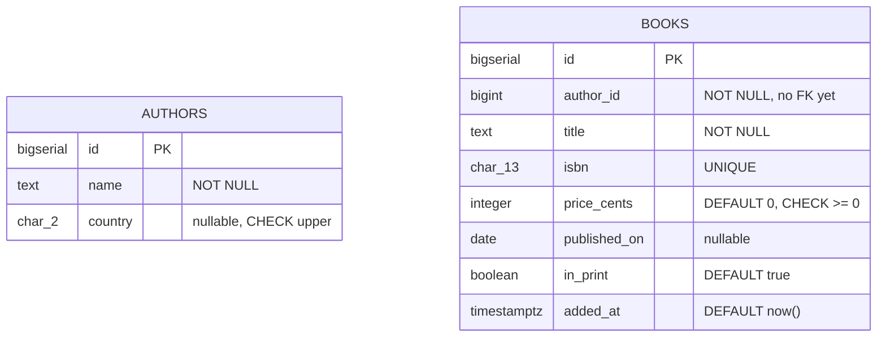

# Set up a table

## What you'll build

Two tables of a bookshop schema — `authors` and `books` — with every column
carrying the type, nullability, key and default it should have. No connections
yet: `books.author_id` is deliberately left as a plain number so that
[Connect two tables](02-connect-two-tables.md) has something to connect.



## Before you start

Have the app open on an empty diagram (**File → New diagram**) with
**PostgreSQL** selected in the dialect selector at the top — the types below are
spelled the PostgreSQL way, and `BIGSERIAL` in particular has no MariaDB or
SQLite equivalent. If you switch dialects later the app translates the known
types for you and `Ctrl+Z` puts them back.

If you would rather read the finished thing than type it, open
[`diagrams/01-set-up-a-table.dbviz.json`](diagrams/01-set-up-a-table.dbviz.json)
with **File → Open** (`Ctrl+O`), or just drop the file on the canvas.

## The mental model

A table node on the canvas is a `CREATE TABLE` statement with a position. That
is the whole abstraction — there is no separate "model" that gets compiled into
SQL later, and no field in the inspector that does not correspond to something
in the statement. The bottom drawer's **SQL** tab is not a preview of the
diagram; it *is* the diagram, printed. Keep it open while you work and you can
watch each click land in the DDL.

That correspondence is worth leaning on, because it tells you where each piece
of information belongs. The four toggles on a column row — **PK**, **NN**,
**UQ**, **AI** — are the four constraints that live *on the column definition*
(`PRIMARY KEY`, `NOT NULL`, `UNIQUE`, and PostgreSQL's identity spelling). A
condition that mentions one column goes in that column's *Check*; a condition
that mentions two goes in the table's *Table checks*, exactly as it would if
you were writing the statement by hand. A comment becomes `COMMENT ON`, which
means notes you leave here survive an export, a round trip through
**Import SQL**, and the Markdown data dictionary.

Two things are *not* in the statement: the position and the colour. Those exist
so a human can find the table again, and they are saved in the `.dbviz.json`
but never emitted as DDL.

## Steps

### 1. Add the authors table

Press `T`. (Double-clicking empty canvas, the **+ Table** button, and
right-click → *Add table here* all do the same thing; the last two put the table
where you clicked.)

The new table is called `new_table` and already has one column: `id`, `INTEGER`,
primary key, not null, auto-increment. Rename it by pressing `F2` and typing
`authors`, or by editing *Name* at the top of the inspector.

**You should see:** a table node called `authors` on the canvas, selected, with
the inspector open on the right showing *Name*, *Schema*, *Comment*, *Colour*,
*Group* and a column grid holding one row.

### 2. Fix the primary key's type

The default `id` is `INTEGER`. Click its type cell and change it to
`BIGSERIAL`. Leave **PK**, **NN** and **AI** on.

`BIGSERIAL` is PostgreSQL's shorthand for "64-bit integer, backed by a
sequence, defaulted from that sequence". Use `BIGSERIAL` rather than `SERIAL`
by habit: the day a table passes two billion rows is a bad day to discover the
column was 32 bits, and the four extra bytes cost nothing you will notice.

**You should see:** the drawer's **SQL** tab change to `id BIGSERIAL PRIMARY KEY`
— note that the generator drops the redundant `NOT NULL`, because a primary key
is already not null.

### 3. Type the rest of the columns without touching the mouse

Click into the `id` row's name cell and press `Enter`. A new row appears below
and the cursor is already in it. Type a name, `Tab` across to the type, and
press `Enter` again for the next one. Add:

| Name | Type | Flags |
| --- | --- | --- |
| `name` | `TEXT` | **NN** |
| `country` | `CHAR(2)` | — |

`Shift+Enter` inserts a row *above* the current one instead, and
`Ctrl+Backspace` on an empty name deletes the row you are in — so a mistyped
column costs one keystroke, not a trip to the context menu.

**You should see:** three rows in the grid, and three column lines in the
generated `CREATE TABLE public.authors`.

### 4. Put a check on a single column

Expand the `country` row using the chevron at its left. Under the row you get
*Default*, *Check* and *Comment*. In *Check*, type:

```
country = upper(country)
```

Write the **body only** — no `CHECK` keyword, no outer parentheses. The
generator adds those. In *Comment*, write why the column is nullable:
`ISO 3166-1 alpha-2. Nullable: we often do not know.`

**You should see:** `country CHAR(2) CHECK (country = upper(country))` in the
SQL tab, followed by a `COMMENT ON COLUMN public.authors.country` statement.

### 5. Build books, and use UQ for the natural key

Press `T` again for a second table and name it `books`. Give it these columns —
the `id` row is already there, so change its type to `BIGSERIAL` as before:

| Name | Type | Flags | Default | Check |
| --- | --- | --- | --- | --- |
| `id` | `BIGSERIAL` | **PK** **NN** **AI** | | |
| `author_id` | `BIGINT` | **NN** | | |
| `title` | `TEXT` | **NN** | | |
| `isbn` | `CHAR(13)` | **NN** **UQ** | | |
| `price_cents` | `INTEGER` | **NN** | `0` | `price_cents >= 0` |
| `published_on` | `DATE` | | | |
| `in_print` | `BOOLEAN` | **NN** | `true` | |
| `added_at` | `TIMESTAMPTZ` | **NN** | `now()` | |

Two decisions worth noticing. `isbn` is **UQ** but not **PK**: it really does
identify a book, but natural keys get reassigned, mistyped and reissued, and a
primary key that can change is a primary key that has to cascade. And money is
`INTEGER` cents rather than a floating-point currency, because binary floating
point cannot represent 0.10 exactly — this is the same reason you would not
write `float` in application code either.

Defaults are raw SQL expressions, written exactly as they appear in the
statement: `0`, `true`, `now()`. A string default needs its own quotes inside
the field, like `'pending'`.

**You should see:** eight rows, with `UQ` lit on `isbn` and a small key glyph on
`id` in the table node on the canvas.

### 6. Add a check that spans the table

A condition on one column belongs to that column. A condition that mentions two
belongs to the table. Scroll the inspector to *Table checks (0)*, add one, and
type:

```
published_on IS NULL OR published_on >= DATE '1450-01-01'
```

**You should see:** the count read *Table checks (1)*, and a bare
`CHECK (...)` line after the last column in the generated statement rather than
attached to a column.

### 7. Tidy the canvas

Drag `books` to the right of `authors`, or select it and nudge with the
`Arrow keys` (10 px a press, `Shift+Arrow keys` for 50). Turn on **View → Snap to
grid** if you would like the nudges to land on a grid. Set a colour in the
inspector's *Colour* row — the convention across these walkthroughs is `blue`
for source tables.

**You should see:** two tidy nodes, and no change at all in the SQL tab — position
and colour are for you, not for the database.

## Other ways to do it

Nothing above is the only route:

- **Right-click the canvas** → *Add table here*, *Add view here*, *Add note
  here*. This places the table under the pointer instead of at a default spot.
- **The `▾` next to + Table** adds a view, a note, a group region, or an enum or
  composite type.
- **Right-click a column row** to toggle *Primary key*, *Not null*, *Unique* and
  *Auto-increment*, to *Add column below*, *Move up* / *Move down*, or
  *Delete column* — the same operations as the grid, if your hands are already
  on the mouse.
- **Drag the grip** at the left of a column row to reorder columns.
- **`Ctrl+K`** opens the command palette: type a few letters of any action, or a
  table name to jump to that table.
- **Import SQL** (bottom drawer) takes a `CREATE TABLE` script and draws it. If
  you already have the DDL, paste it there — or press `Ctrl+V` on the canvas, or
  drop a `.sql` file on it. See
  [Import an existing schema](09-import-an-existing-schema.md).
- **Copy and paste** whole tables with `Ctrl+C` / `Ctrl+V`, including between
  two browser tabs, which is the quickest way to reuse a table you already built.
- **Hand-write the `.dbviz.json`** and open it. The format is documented in
  [`../ADVISOR_OUTPUT_FORMAT.md`](../ADVISOR_OUTPUT_FORMAT.md), and
  `node scripts/validate-dbviz.mjs file.dbviz.json` checks it before you open it.

## Check your work

Open the bottom drawer → **SQL**, leave it on *Whole schema*, and compare. This
is the entire output for the diagram above:

```sql
-- Set up a table — authors and books (PostgreSQL)
-- Generated by Database Visualizer
-- Tables: 2, foreign keys: 0

CREATE TABLE public.authors (
  id BIGSERIAL PRIMARY KEY,
  name TEXT NOT NULL,
  country CHAR(2) CHECK (country = upper(country))
);
COMMENT ON TABLE public.authors IS 'One row per person who wrote something we sell.';
COMMENT ON COLUMN public.authors.id IS 'Surrogate key. Nothing outside the database ever sees it.';
COMMENT ON COLUMN public.authors.country IS 'ISO 3166-1 alpha-2. Nullable: we often do not know.';

CREATE TABLE public.books (
  id BIGSERIAL PRIMARY KEY,
  author_id BIGINT NOT NULL,
  title TEXT NOT NULL,
  isbn CHAR(13) NOT NULL UNIQUE,
  price_cents INTEGER NOT NULL DEFAULT 0 CHECK (price_cents >= 0),
  published_on DATE,
  in_print BOOLEAN NOT NULL DEFAULT true,
  added_at TIMESTAMPTZ NOT NULL DEFAULT now(),
  CHECK (published_on IS NULL OR published_on >= DATE '1450-01-01')
);
```

Then open **Problems**. It should be empty. It will, however, offer
`books.author_id → authors.id` under *Suggested foreign keys*, read off the
column name — which is exactly what the next walkthrough is about.

## Try it yourself

- Switch the dialect to **MariaDB** and watch `BIGSERIAL` become
  `BIGINT AUTO_INCREMENT` and `TIMESTAMPTZ` become `TIMESTAMP`. `Ctrl+Z` undoes
  the whole translation in one step. Now try **SQLite** and notice
  `INTEGER PRIMARY KEY AUTOINCREMENT`.
- Turn **UQ** off on `isbn` and back on, watching the SQL line change. Then try
  making it **PK** as well and see how the generator moves the key into a
  `PRIMARY KEY (id, isbn)` clause once two columns claim it.
- Set `price_cents` to `NUMERIC(10,2)` and ask yourself what the check
  `price_cents >= 0` now means. (Nothing different — but the column name is
  suddenly a lie. Names are part of the schema.)

## Gotchas

- **Checks are bodies, not statements.** Typing `CHECK (x > 0)` into the
  *Check* field produces `CHECK (CHECK (x > 0))`. Same for table checks.
- **Defaults are raw SQL.** A string default needs quotes you type yourself:
  `'pending'`, not `pending`. Without them the generator emits a bare identifier
  and the database rejects it.
- **AI only means something on an integer column.** Ticking it on a `TEXT`
  column is not an error the app will stop you from making; the generated DDL
  will simply not do what you meant.
- **PK implies NN.** The generator drops the redundant `NOT NULL`, so do not go
  looking for it in the output.
- **Types are free text, deliberately.** The app does not have a fixed list, so
  `VARHCAR(50)` is accepted and reaches the database as a syntax error. The
  **Problems** tab catches type *mismatches* across a foreign key, not typos.
- **Renaming a column does not rename it anywhere else.** Checks, defaults and
  tagged queries that mention the old name are plain text and will not follow.
- **The `id` you get for free is `INTEGER`, not `BIGSERIAL`.** Every new table
  starts with the same default column; changing it is step two, every time.

## Where to go next

- [Connect two tables](02-connect-two-tables.md) — turn `books.author_id` into a
  real foreign key, and meet the three other kinds of connection.
- [Create an enum and use it](04-create-an-enum.md) — when a column should only
  ever hold one of a fixed set of strings.
- [Add indexes that get used](07-add-indexes.md) — including the one
  **Problems** is about to tell you that `books.author_id` needs.
