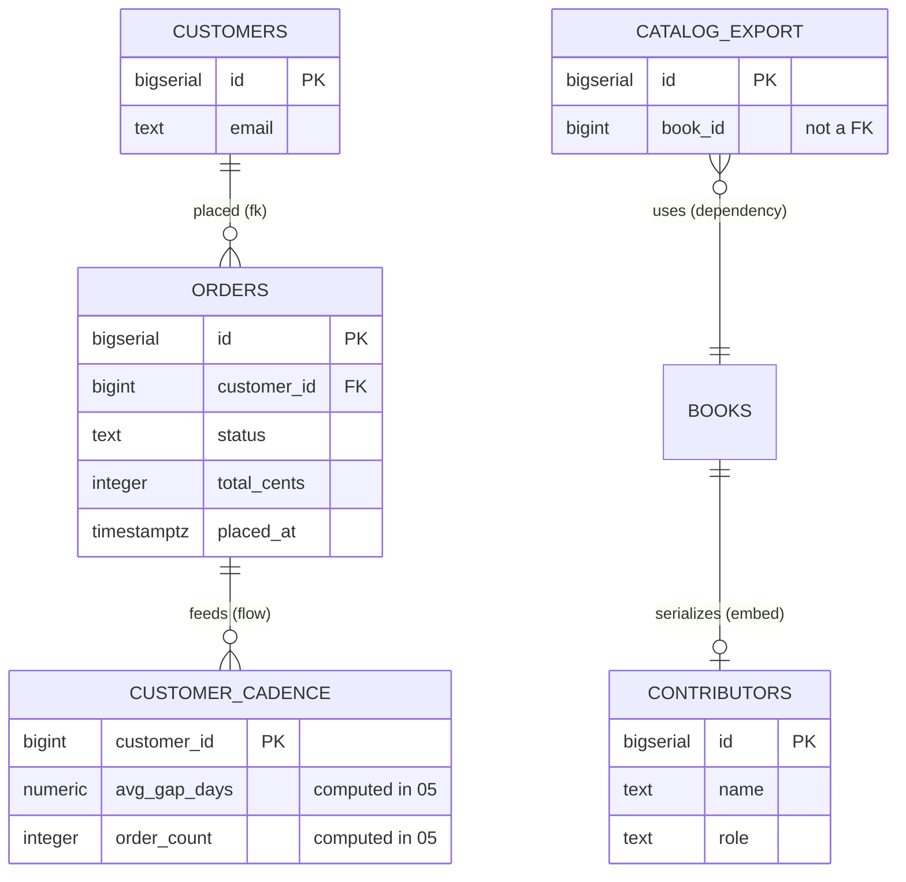

# Connect two tables

## What you'll build

`orders` joins the canvas and gets a real foreign key into the `customers`
table you typed in walkthrough 01 — the same move you made by feel in
walkthrough 00, this time with every field in the inspector explained. Then
three more tables show up — `contributors`, `customer_cadence`,
`catalog_export` — each joined by one of the three connection kinds a foreign
key cannot express: a serialized copy, a data flow, and a plain dependency. By
the end, one diagram carries all four kinds side by side so you can see them
drawn differently and read differently in the generated script.

`customer_cadence` is deliberately left as an empty promise here: a rollup
table with a data-flow edge pointing at it and nothing yet saying how its
columns are computed. Walkthrough 05 keeps that promise.



## Before you start

You need what [Set up a table](01-set-up-a-table.md) leaves behind: `authors`,
`books` and `customers`, with one foreign key already drawn between `books` and
`authors`. Press **Set up the canvas** at the top of this walkthrough in the
drawer's **Walkthrough** tab if it is not already in front of you.

Keep **PostgreSQL** selected in the dialect selector: this walkthrough leans on
`JSONB` for the serialized column and on `RESTRICT` as a deliberate choice for
`ON DELETE`, both spelled the PostgreSQL way.

If you would rather read the finished thing than type it, open
[`diagrams/02-connect-two-tables.dbviz.json`](diagrams/02-connect-two-tables.dbviz.json) with
**File → Open** (`Ctrl+O`), or drop the file on the canvas.

## The mental model

Every connection on the canvas has two independent halves, and it pays to
keep them apart in your head the way you keep a variable's *type* apart from
its *name*. **Kind** is the type: it decides what the database actually does
— whether the connection reaches the generated `CREATE TABLE` script at all,
whether **Trace** can build a real `JOIN` out of it, whether it even needs a
column on each side. **Reads as** is the name: it only changes the sentence
the inspector shows you, never a single line of SQL. You can switch a
connection's Kind from *Foreign key* to *Dependency* and watch a whole
`CONSTRAINT` clause vanish from the SQL tab; you can switch its verb from
*references* to *belongs to* and the script will not change by one character.

That split is also why the verb list is shorter than it looks. Every verb is
stored **source → target**, so reading the same edge from the other end gives
you its inverse for free: *belongs to* read backwards is *has*, *is part of*
read backwards is *contains*, *uses* read backwards is *used by*. "Has",
"contains" and "used by" are not separate connections you pick — they are
readings, which is why the inspector shows you both sentences side by side
before you commit to one.

## Steps

### 1. Add the orders table

<!-- step
target: ui:add-table
goals:
  - table | orders
  - column | orders.id : BIGSERIAL
  - column | orders.customer_id : BIGINT
  - column | orders.status : TEXT
  - default | orders.status : 'pending'
  - column | orders.total_cents : INTEGER
  - check | orders.total_cents : total_cents >= 0
  - column | orders.placed_at : TIMESTAMPTZ
  - default | orders.placed_at : now()
-->

Press `T`, rename the new table `orders` with `F2`, and give it these columns
(the `id` row is already there — change its type):

| Name | Type | Flags | Default |
| --- | --- | --- | --- |
| `id` | `BIGSERIAL` | **PK** **NN** **AI** | |
| `customer_id` | `BIGINT` | **NN** | |
| `status` | `TEXT` | **NN** | `'pending'` |
| `total_cents` | `INTEGER` | **NN** | `0` |
| `placed_at` | `TIMESTAMPTZ` | **NN** | `now()` |

Leave `status` as plain `TEXT` for now: walkthrough 04 turns it into an enum,
and the difference is easier to feel once you have seen what `TEXT` lets
through. Give `total_cents` the check `total_cents >= 0` while you are in the
row.

**You should see:** a fourth table on the canvas with five columns, and
`customer_id BIGINT NOT NULL` sitting in the SQL tab as a plain number that
points at nothing.

### 2. Make the foreign key

<!-- step
target: column:orders.customer_id
goals:
  - fk | orders.customer_id -> customers.id
-->

Hover `orders` and drag the small handle beside `customer_id` onto the `id`
row of `customers`.

Which table you start the drag from is not a detail — it is the whole
decision. The table you drag *from* becomes the connection's **source**, the
one you drop *onto* becomes its **target**, and for a foreign key those map
directly onto SQL: source is the referencing (child, "many") side, target is
the referenced (parent, "one") side. You started at `orders`, so `orders`
referencing `customers` is exactly what gets built. Starting at `customers`
instead would still draw a line — the app never refuses a drag — and it would
mean the opposite: `customers` referencing `orders.customer_id`, a column that
does not happen to be unique. Sometimes a backwards foreign key still runs,
quietly meaning the opposite of what you intended; this one does not even get
that far, because **Problems** rejects a reference onto a non-unique column
on sight (more on that below). Either way, checking the direction is cheaper
than finding out later, and two places tell you at a glance: the crow's foot
sits on the *referencing* end, and the inspector spells it out in words.

**You should see:** a solid line with a crow's foot at the `orders` end and a
plain bar at the `customers` end, and the inspector opens on the new connection
with **Kind** set to *Foreign key* and the **Referencing → referenced** row
reading `orders` → `customers`.

### 3. Choose how it reads

<!-- step
target: field:Reads as
goals:
  - reads | orders belongs to customers
-->

With the connection selected, open **Reads as** and pick *belongs to*.

The dropdown only offers verbs that fit a foreign key: *references*,
*belongs to*, *is part of*, *extends*, *uses* — flow and embed have their own,
shorter lists, because "feeds" makes no sense on a constraint and "references"
makes no sense on a copy. Below the dropdown the inspector previews both
directions at once, so you do not have to hold the sentence in your head:
forward it reads `orders belongs to customers`, and underneath, in grey, the
reading you get for free — `customers has orders`.

**You should see:** the edge's label change from the default `FK` tag to
*belongs to*, and the preview lines update to `orders belongs to customers` /
`customers has orders`.

### 4. Give the far end its own words

<!-- step
target: field:Reverse label
goals:
  - reverse label | orders -> customers : placed
-->

Still on the same connection, type `placed` into **Reverse label**.

*Reverse label* overrides only the inverse phrasing — the one shown at the
target end, read target → source — without touching the verb, which still
governs the forward sentence and the SQL tab. Leave it empty and you get the
verb's own inverse, which is *has*; typed in, `customers placed orders` reads
better than *has* does for a table that is really about ordering.

**You should see:** the label near the `customers` end of the edge switch from
*has* to *placed*.

### 5. Decide what happens on delete

<!-- step
target: field:On delete
goals:
  - ondelete | orders -> customers : RESTRICT
-->

Scroll to **On delete** and **On update**, still on the `orders` → `customers`
connection. Leave **On update** on its default, *NO ACTION*. Set **On delete**
to *RESTRICT*.

*Belongs to*'s own hint says it is "usually paired with `ON DELETE CASCADE`,"
and for plenty of ownership relationships that is the right call — delete the
parent, delete the children. Here it is not: cascading would let deleting a
`customers` row silently erase every order they ever placed, including the
money. *RESTRICT* makes PostgreSQL refuse the delete until a human closes or
anonymises those orders on purpose. These two fields are the only place `ON
DELETE` / `ON UPDATE` live, and they mean nothing at all on the other three
kinds — flow, embed and dependency move no rows and enforce nothing, so the
inspector does not even show the fields once you switch away from *Foreign
key*.

**You should see:** `ON DELETE RESTRICT` appear after the `REFERENCES` clause
in the SQL tab; `ON UPDATE` stays absent, because `NO ACTION` is the
generator's silent default.

### 6. Turn on cardinality labels

<!-- step
target: ui:view-menu
goals:
  - cardinality | on
-->

Open **View** in the top bar and tick **Cardinality labels**.

**You should see:** small `N` and `1` markers appear on the `orders` ↔
`customers` edge — `N` by the crow's foot at `orders`, `1` by the bar at
`customers` — because `orders.customer_id` is not itself unique but
`customers.id` is. The same markers appear on the `books` ↔ `authors` edge you
drew in walkthrough 00, for the same reason. (A table whose primary key is made
entirely of foreign-key columns into two or more other tables gets its own
badge instead — **N:M** in its header — because that shape *is* a many-to-many
join table; nothing on this canvas is one yet.)

### 7. Add contributors and connect it

<!-- step
target: ui:add-table
goals:
  - table | contributors
  - column | contributors.name : TEXT
  - column | contributors.role : TEXT
-->

Press `T`, rename the new table `contributors`, and give it `id BIGSERIAL
PRIMARY KEY`, `name TEXT NOT NULL` and `role TEXT NOT NULL`. Then hover
`books` and drag the small orange handle at the right edge of its header onto
`contributors`.

The orange handle is the one to reach for whenever the connection is not a
foreign key: unlike the per-column handles, it is not asking for a column
pair, so the app cannot guess your intent beyond "these two tables are
related." It defaults to the most common case.

**You should see:** a new `contributors` table, and a dashed arrow from
`books` to `contributors` with **Kind** already open in the inspector, set to
*Data flow* — the header handle's default, not yet what you want here.

### 8. Turn that connection into a serialized copy

<!-- step
target: field:Stored in column
goals:
  - column | books.contributors_json : JSONB
  - embed | books.contributors_json -> contributors
-->

With the new connection still selected, click **Serialized** in the **Kind**
row, then set **Stored in column** to `contributors_json` — add that column
to `books` first if you have not (`JSONB`, nullable) using the same column
grid from the previous walkthrough.

Serialized is the odd one out among the four: it needs exactly one column,
and it belongs to the *source* (the container), not a pair. That is what
**Stored in column** is for — it replaces the **Column pairs** grid you saw on
the foreign key, because there is no second side to pair against. Nothing
here reaches the DDL: `books.contributors_json` will be a plain `JSONB`
column with no constraint tying it to `contributors` at all, exactly like a
column you typed by hand.

**You should see:** the dashed arrow become a solid line with a filled
diamond at the `books` end, the **Kind** hint change to describe a serialized
copy, and the direction row relabel itself **Container → embedded**.

### 9. Promise customer_cadence a feed

<!-- step
target: ui:add-table
goals:
  - table | customer_cadence
  - column | customer_cadence.customer_id : BIGINT
  - flags | customer_cadence.customer_id : pk
  - no column | customer_cadence.id
  - column | customer_cadence.avg_gap_days : NUMERIC(10,2)
  - column | customer_cadence.order_count : INTEGER
  - flow | orders -> customer_cadence
  - label | orders -> customer_cadence : nightly rollup
-->

Press `T` for a table named `customer_cadence` with `customer_id BIGINT`
(**PK**), `avg_gap_days NUMERIC(10,2)` (nullable) and `order_count INTEGER NOT
NULL DEFAULT 0`. Colour it `orange` — the convention in these walkthroughs for
a table whose rows are computed rather than entered. Then drag the orange
header handle from `orders` onto `customer_cadence`, and name the connection
`nightly rollup` in the inspector.

Leave **Kind** exactly where it lands. A header-handle drag already defaults
to *Data flow*, and that is what this edge should be: `customer_cadence` holds
no facts of its own — every column in it is a summary of that customer's rows
in `orders`, produced by a job rather than kept in step by a constraint.

Right now the edge says only *that* rows flow, not *how*: the inspector's
**Derived columns** section is empty, and it will stay empty until
[Fill one table from another](05-fill-one-table-from-another.md), which is
where you write the expressions that compute each column. An unfilled data
flow is a perfectly honest thing to leave on a diagram — it is a promise, and
the diagram is where you keep track of promises.

**You should see:** a dashed arrow from `orders` to `customer_cadence` labelled
*nightly rollup*, **Kind** reading *Data flow*, and **Derived columns (0)** in
the inspector.

### 10. Add catalog_export and mark it a dependency

<!-- step
target: ui:add-table
goals:
  - table | catalog_export
  - column | catalog_export.book_id : BIGINT
  - column | catalog_export.title : TEXT
  - column | catalog_export.price_cents : INTEGER
  - column | catalog_export.exported_at : TIMESTAMPTZ
  - dependency | catalog_export -> books
  - label | catalog_export -> books : nightly feed
-->

Press `T` for a table named `catalog_export` with `id BIGSERIAL PRIMARY KEY`,
`book_id BIGINT NOT NULL`, `title TEXT NOT NULL`, `price_cents INTEGER NOT
NULL` and `exported_at TIMESTAMPTZ NOT NULL DEFAULT now()`. This time hover
`catalog_export` itself and drag its orange handle onto `books` — the
direction is deliberately the other way round from the last two steps.

`catalog_export` is the one *reading* `books`, so it has to be the source; get
this backwards and the sentence — and later, the **Trace** query — would read
as if `books` depended on its own export. Once the edge exists, click
**Dependency** in **Kind**. A dependency needs no columns and moves no rows;
it exists purely so the diagram remembers that a nightly export job reads
`books`, with nothing in the schema to enforce or even notice it.

**You should see:** a dotted line with an open arrowhead pointing at `books`,
**Kind** reading *Dependency*, and **Reads as** defaulted to *uses* — read
forward as `catalog_export uses books`.

## Other ways to do it

- **Right-click any connection** for *Swap direction* and the four **Kind**
  buttons directly, without opening the inspector.
- The **column-to-column** drag you used in step 2 only ever produces a
  foreign key; the **header-handle** drag you used from step 7 onward only
  ever produces a data flow. Every other kind starts as one of those two and
  gets switched afterward.
- **`Ctrl+K`** opens the command palette to jump to a table by name, but it
  cannot draw a connection for you — dragging a handle is the only way in.
- **Import SQL** (bottom drawer) reads a `FOREIGN KEY` clause out of pasted
  DDL and creates a real foreign-key connection automatically. It cannot
  create the other three kinds at all — plain SQL has no syntax for "this is
  a data flow" — so a schema round-tripped through DDL only ever comes back
  with the foreign keys it left with.
- **Hand-write the `.dbviz.json`.** A relationship is one object in the
  `relationships` array: `kind`, `sourceTableId` / `sourceColumnIds`,
  `targetTableId` / `targetColumnIds`, and everything this walkthrough set in
  the inspector — `verb`, `onDelete`, `onUpdate`, `inverseName`. The full
  shape is in [`../ADVISOR_OUTPUT_FORMAT.md`](../ADVISOR_OUTPUT_FORMAT.md).
  `node scripts/validate-dbviz.mjs file.dbviz.json` catches a backwards or
  dangling reference before you open it.

## Check your work

Open the bottom drawer → **SQL**, leave it on *Whole schema*, and read the
header comment first:

```sql
-- Bookshop — after 02 Connect two tables (PostgreSQL)
-- Generated by Database Visualizer
-- Tables: 7, foreign keys: 2, documented connections: 3
```

`foreign keys: 2` next to `documented connections: 3` is the whole lesson in
one line: five connections exist on the canvas, and only the two built from a
column-to-column drag became something PostgreSQL enforces.

The statements the other tables get are the ones you would expect, unchanged
from walkthrough 01. These are the new ones — `orders` with its constraint, and
the appendix the three unenforced connections go into:

```sql
CREATE TABLE public.customer_cadence (
  customer_id BIGINT PRIMARY KEY,
  avg_gap_days NUMERIC(10,2),
  order_count INTEGER NOT NULL DEFAULT 0
);

CREATE TABLE public.orders (
  id BIGSERIAL PRIMARY KEY,
  customer_id BIGINT NOT NULL,
  status TEXT NOT NULL DEFAULT 'pending',
  total_cents INTEGER NOT NULL DEFAULT 0 CHECK (total_cents >= 0),
  placed_at TIMESTAMPTZ NOT NULL DEFAULT now(),
  CONSTRAINT orders_customer_id_fkey FOREIGN KEY (customer_id) REFERENCES public.customers (id) ON DELETE RESTRICT
);

-- ----------------------------------------------------------------
-- Connections the schema does not enforce, and tagged queries
-- (documentation only, not executed)
-- [embed] books serializes contributors in books.contributors_json (contributors_json)
-- [flow] orders feeds customer_cadence (nightly rollup)
-- [uses] catalog_export uses books (nightly feed)
```

Three connections, three comments, in the order you built them, each tagged
with its short kind (`[embed]`, `[flow]`, and the dependency kind's own short
tag, which is literally `uses`) and the sentence it reads as. Nothing about
`contributors_json` says it holds contributors; nothing about
`customer_cadence` says where its rows come from. That is not the app being
lazy — SQL has no syntax for either statement.

Press **Check my work** at the foot of this walkthrough to have the seven
tables, the four kinds and the `ON DELETE RESTRICT` checked against your
canvas.

Then open **Problems**. It reports warnings, not errors — `books(author_id)`
and `orders(customer_id)` each reference a table with no index to read them
by — which is exactly what [Add indexes that get used](07-add-indexes.md)
picks up later in the series.

## Try it yourself

- Right-click the `orders` → `customers` connection and choose **Swap
  direction**. **Problems** immediately reports an error — `customers → orders
  references orders(customer_id), which is not a primary key or UNIQUE.
  PostgreSQL and SQLite reject the constraint` — the exact mistake you would
  have built in step 2 by starting the drag at `customers` instead of `orders`.
  Swap it back (or `Ctrl+Z`) to clear the error.
- With that connection selected, click through **Data flow** and
  **Dependency** in **Kind**: watch **Column pairs** disappear (composite
  keys no longer make sense once nothing constrains anything), then click
  **Serialized** and watch it reappear as **Stored in column** instead.
  `Ctrl+Z` back to *Foreign key* when you are done — nothing here needs to
  stay.
- Open the bottom drawer → **Trace**, pick `catalog_export` as *From table…*
  and `authors` as *To table…*. The query reaches `books` with a `CROSS JOIN`
  and a comment saying there is nothing to join on, then reaches `authors`
  with a real `JOIN … ON` — one query, two very different lines, because only
  one of the two hops is a foreign key.
- Try tracing `authors` to `customer_cadence` and watch it fail. Nothing
  connects the `books` half of this diagram to the `orders` half yet:
  walkthrough 05 adds `order_items`, which is the table that finally joins
  them.
- Toggle **View → Cardinality labels** off, then on again, and compare the
  `orders` ↔ `customers` edge with the `orders` ↔ `customer_cadence` edge
  sitting right next to it. Only the foreign key ever grows numbers.

## Gotchas

- **A serialized connection with no column chosen is a lint error, not a
  warning.** Skip **Stored in column** and **Problems** stops you with "no
  column of `books` is picked to hold it" — unlike a data flow or dependency,
  which are happy with no columns at all.
- **A foreign key onto a non-unique column is not a suggestion away from
  working — it is rejected outright.** PostgreSQL and SQLite refuse to create
  the constraint at all. **Problems** catches it as soon as you draw the edge,
  with a one-click fix (*Add a unique index on…*) rather than making you find
  out from a failed migration.
- **Only foreign keys become a real `JOIN` in a Trace.** The other three kinds
  are still walked — a path can cross a data flow, a serialized edge or a
  dependency — but the generated query renders them as `CROSS JOIN` plus a
  comment saying why there is no join condition, never a real `ON`.
- **Swapping a serialized connection forgets its column.** `books` and
  `contributors` swap sides cleanly on a foreign key, but on an embed the
  container is part of the meaning: after a swap, `contributors` would be the
  container and `contributors_json` no longer means anything on it, so
  **Stored in column** resets to empty and you have to pick again.
- **Dragging onto — or from — a view always makes a data flow**, even if you
  started on a column handle expecting a foreign key. Views cannot take part
  in a `FOREIGN KEY` constraint, so the app substitutes the one kind that can
  still describe "this view reads that table," and says so in a toast rather
  than leaving you to notice the swap yourself.
- **Cardinality labels only ever appear on foreign keys.** Turn them on and
  the three other kinds stay unlabeled — there is no "1" or "N" to compute
  when nothing constrains uniqueness on either end.

## Where to go next

- [Group tables, and read another database](03-group-tables.md) — next in the
  series. Box the sales tables you just built into a named region, then add two
  tables that live in someone else's database entirely.

The canvas now has seven tables and one of each kind of connection on it.
Everything from here builds on exactly this.
