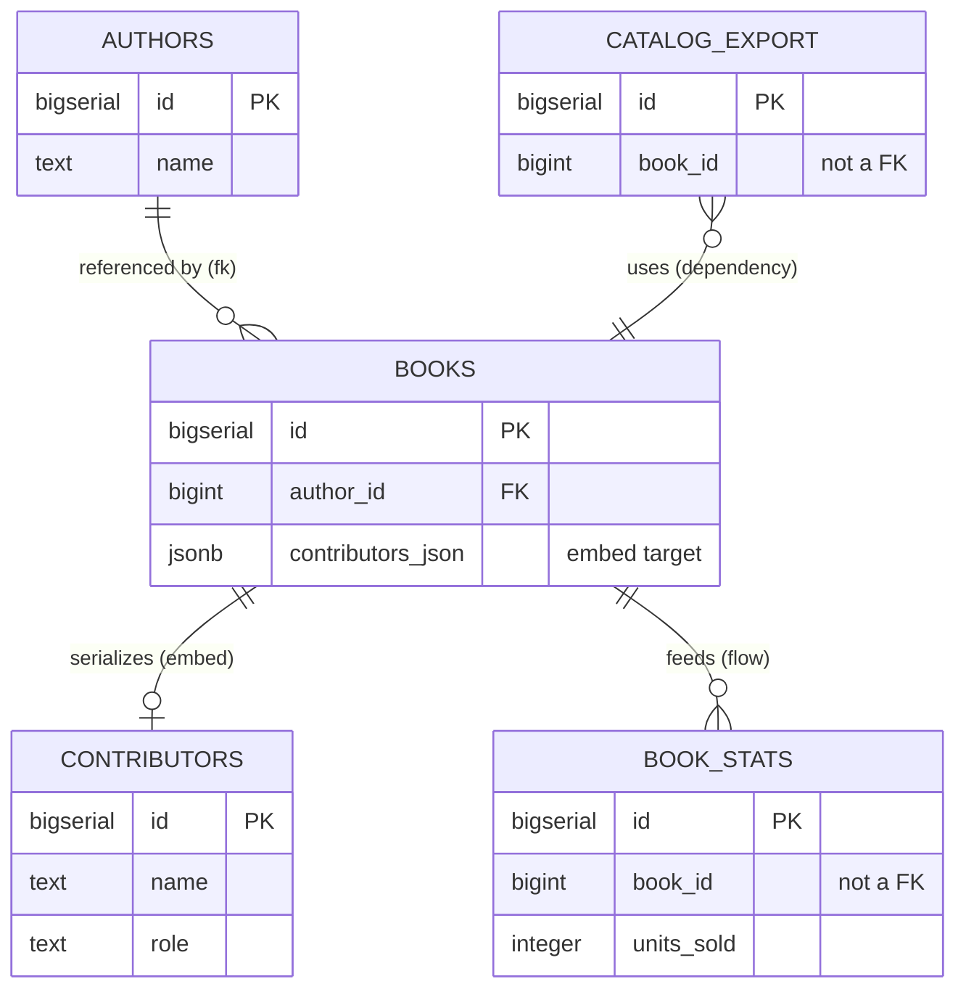

# Connect two tables

## What you'll build

`books.author_id` stops being a bare number and becomes a real foreign key
into `authors`. Then three more tables show up around it — `contributors`,
`book_stats`, `catalog_export` — each joined to `books` by one of the three
connection kinds a foreign key cannot express: a serialized copy, a data flow,
and a plain dependency. By the end, one diagram carries all four kinds side by
side so you can see them drawn differently and read differently in the
generated script.



## Before you start

Do [Set up a table](01-set-up-a-table.md) first, or at least have an `authors`
table and a `books` table with a plain `author_id BIGINT` column on the
canvas — that column is exactly where this walkthrough picks up. Keep
**PostgreSQL** selected in the dialect selector: this walkthrough leans on
`JSONB` for the serialized column and on `RESTRICT` as a deliberate choice for
`ON DELETE`, both spelled the PostgreSQL way.

If you would rather read the finished thing than type it, open
[`diagrams/02-connect-two-tables.dbviz.json`](diagrams/02-connect-two-tables.dbviz.json) with
**File → Open** (`Ctrl+O`), or drop the file on the canvas.

## The mental model

Every connection on the canvas has two independent halves, and it pays to
keep them apart in your head the way you keep a variable's *type* apart from
its *name*. **Kind** is the type: it decides what the database actually does
— whether the connection reaches the generated `CREATE TABLE` script at all,
whether **Trace** can build a real `JOIN` out of it, whether it even needs a
column on each side. **Reads as** is the name: it only changes the sentence
the inspector shows you, never a single line of SQL. You can switch a
connection's Kind from *Foreign key* to *Dependency* and watch a whole
`CONSTRAINT` clause vanish from the SQL tab; you can switch its verb from
*references* to *belongs to* and the script will not change by one character.

That split is also why the verb list is shorter than it looks. Every verb is
stored **source → target**, so reading the same edge from the other end gives
you its inverse for free: *belongs to* read backwards is *has*, *is part of*
read backwards is *contains*, *uses* read backwards is *used by*. "Has",
"contains" and "used by" are not separate connections you pick — they are
readings, which is why the inspector shows you both sentences side by side
before you commit to one.

## Steps

### 1. Make the foreign key

Hover `books` and drag the small handle beside `author_id` onto the `id` row
of `authors`.

Which table you start the drag from is not a detail — it is the whole
decision. The table you drag *from* becomes the connection's **source**, the
one you drop *onto* becomes its **target**, and for a foreign key those map
directly onto SQL: source is the referencing (child, "many") side, target is
the referenced (parent, "one") side. You started at `books`, so `books`
referencing `authors` is exactly what gets built. Starting at `authors`
instead would still draw a line — the app never refuses a drag — and it would
mean the opposite: `authors` referencing `books.author_id`, a column that
does not happen to be unique. Sometimes a backwards foreign key still runs,
quietly meaning the opposite of what you intended; this one does not even get
that far, because **Problems** rejects a reference onto a non-unique column
on sight (more on that below). Either way, checking the direction is cheaper
than finding out later, and two places tell you at a glance: the crow's foot
sits on the *referencing* end, and the inspector spells it out in words.

**You should see:** a solid line with a crow's foot at the `books` end and a
plain bar at the `authors` end, and the inspector opens on the new connection
with **Kind** set to *Foreign key* and the **Referencing → referenced** row
reading `books` → `authors`.

### 2. Choose how it reads

With the connection selected, open **Reads as** and pick *belongs to*.

The dropdown only offers verbs that fit a foreign key: *references*,
*belongs to*, *is part of*, *extends*, *uses* — flow and embed have their own,
shorter lists, because "feeds" makes no sense on a constraint and "references"
makes no sense on a copy. Below the dropdown the inspector previews both
directions at once, so you do not have to hold the sentence in your head:
forward it reads `books belongs to authors`, and underneath, in grey, the
reading you get for free — `authors has books`.

**You should see:** the edge's label change from the default `FK` tag to
*belongs to*, and the preview lines update to `books belongs to authors` /
`authors has books`.

### 3. Give the far end its own words

Still on the same connection, type `wrote` into **Reverse label**.

*Reverse label* overrides only the inverse phrasing — the one shown at the
target end, read target → source — without touching the verb, which still
governs the forward sentence and the SQL tab. Leave it empty and you get the
verb's own inverse, which is *has*; typed in, `authors wrote books` reads
better than *has* does for a table that is really about authorship.

**You should see:** the label near the `authors` end of the edge switch from
*has* to *wrote*.

### 4. Decide what happens on delete

Scroll to **On delete** and **On update**, still on the `books` → `authors`
connection. Leave **On update** on its default, *NO ACTION*. Set **On delete**
to *RESTRICT*.

*Belongs to*'s own hint says it is "usually paired with `ON DELETE CASCADE`,"
and for plenty of ownership relationships that is the right call — delete the
parent, delete the children. Here it is not: cascading would let deleting an
`authors` row silently erase every book (and every sale) attached to it.
*RESTRICT* makes PostgreSQL refuse the delete until a human reassigns or
removes those books on purpose. These two fields are the only place `ON
DELETE` / `ON UPDATE` live, and they mean nothing at all on the other three
kinds — flow, embed and dependency move no rows and enforce nothing, so the
inspector does not even show the fields once you switch away from *Foreign
key*.

**You should see:** `ON DELETE RESTRICT` appear after the `REFERENCES` clause
in the SQL tab; `ON UPDATE` stays absent, because `NO ACTION` is the
generator's silent default.

### 5. Turn on cardinality labels

Open **View** in the top bar and tick **Cardinality labels**.

**You should see:** small `N` and `1` markers appear on the `books` ↔
`authors` edge — `N` by the crow's foot at `books`, `1` by the bar at
`authors` — because `books.author_id` is not itself unique but `authors.id`
is. (A table whose primary key is made entirely of foreign-key columns into
two or more other tables gets its own badge instead — **N:M** in its header —
because that shape *is* a many-to-many join table; `books` only ever
references one parent here, so you will not see the badge on this diagram.)

### 6. Add contributors and connect it

Press `T`, rename the new table `contributors`, and give it `id BIGSERIAL
PRIMARY KEY`, `name TEXT NOT NULL` and `role TEXT NOT NULL`. Then hover
`books` and drag the small orange handle at the right edge of its header onto
`contributors`.

The orange handle is the one to reach for whenever the connection is not a
foreign key: unlike the per-column handles, it is not asking for a column
pair, so the app cannot guess your intent beyond "these two tables are
related." It defaults to the most common case.

**You should see:** a new `contributors` table, and a dashed arrow from
`books` to `contributors` with **Kind** already open in the inspector, set to
*Data flow* — the header handle's default, not yet what you want here.

### 7. Turn that connection into a serialized copy

With the new connection still selected, click **Serialized** in the **Kind**
row, then set **Stored in column** to `contributors_json` — add that column
to `books` first if you have not (`JSONB`, nullable) using the same column
grid from the previous walkthrough.

Serialized is the odd one out among the four: it needs exactly one column,
and it belongs to the *source* (the container), not a pair. That is what
**Stored in column** is for — it replaces the **Column pairs** grid you saw on
the foreign key, because there is no second side to pair against. Nothing
here reaches the DDL: `books.contributors_json` will be a plain `JSONB`
column with no constraint tying it to `contributors` at all, exactly like a
column you typed by hand.

**You should see:** the dashed arrow become a solid line with a filled
diamond at the `books` end, the **Kind** hint change to describe a serialized
copy, and the direction row relabel itself **Container → embedded**.

### 8. Add book_stats and feed it from books

Press `T` for a table named `book_stats` with `id BIGSERIAL PRIMARY KEY`,
`book_id BIGINT NOT NULL`, `units_sold INTEGER NOT NULL DEFAULT 0` and
`updated_at TIMESTAMPTZ NOT NULL DEFAULT now()`. Drag the orange handle from
`books` onto `book_stats`.

Leave **Kind** exactly where it lands. A header-handle drag already defaults
to *Data flow*, and that is what this edge should be: `book_stats.book_id` is
a plain `BIGINT`, not a foreign key, because a nightly rollup job — not a
constraint — is what keeps this table filled in.

**You should see:** a second dashed arrow, this one from `books` to
`book_stats`, with **Kind** already reading *Data flow* — no change needed.

### 9. Add catalog_export and mark it a dependency

Press `T` for a table named `catalog_export` with `id BIGSERIAL PRIMARY KEY`,
`book_id BIGINT NOT NULL`, `title TEXT NOT NULL`, `price_cents INTEGER NOT
NULL` and `exported_at TIMESTAMPTZ NOT NULL DEFAULT now()`. This time hover
`catalog_export` itself and drag its orange handle onto `books` — the
direction is deliberately the other way round from the last two steps.

`catalog_export` is the one *reading* `books`, so it has to be the source; get
this backwards and the sentence — and later, the **Trace** query — would read
as if `books` depended on its own export. Once the edge exists, click
**Dependency** in **Kind**. A dependency needs no columns and moves no rows;
it exists purely so the diagram remembers that a nightly export job reads
`books`, with nothing in the schema to enforce or even notice it.

**You should see:** a dotted line with an open arrowhead pointing at `books`,
**Kind** reading *Dependency*, and **Reads as** defaulted to *uses* — read
forward as `catalog_export uses books`.

## Other ways to do it

- **Right-click any connection** for *Swap direction* and the four **Kind**
  buttons directly, without opening the inspector.
- The **column-to-column** drag you used in step 1 only ever produces a
  foreign key; the **header-handle** drag you used from step 6 onward only
  ever produces a data flow. Every other kind starts as one of those two and
  gets switched afterward.
- **`Ctrl+K`** opens the command palette to jump to a table by name, but it
  cannot draw a connection for you — dragging a handle is the only way in.
- **Import SQL** (bottom drawer) reads a `FOREIGN KEY` clause out of pasted
  DDL and creates a real foreign-key connection automatically. It cannot
  create the other three kinds at all — plain SQL has no syntax for "this is
  a data flow" — so a schema round-tripped through DDL only ever comes back
  with the foreign keys it left with.
- **Hand-write the `.dbviz.json`.** A relationship is one object in the
  `relationships` array: `kind`, `sourceTableId` / `sourceColumnIds`,
  `targetTableId` / `targetColumnIds`, and everything this walkthrough set in
  the inspector — `verb`, `onDelete`, `onUpdate`, `inverseName`. The full
  shape is in [`../ADVISOR_OUTPUT_FORMAT.md`](../ADVISOR_OUTPUT_FORMAT.md).
  `node scripts/validate-dbviz.mjs file.dbviz.json` catches a backwards or
  dangling reference before you open it.

## Check your work

Open the bottom drawer → **SQL**, leave it on *Whole schema*, and compare.
This is the entire output for the diagram above:

```sql
-- Connect two tables — the four kinds (PostgreSQL)
-- Generated by Database Visualizer
-- Tables: 5, foreign keys: 1, documented connections: 3

CREATE TABLE public.authors (
  id BIGSERIAL PRIMARY KEY,
  name TEXT NOT NULL,
  country CHAR(2)
);
COMMENT ON TABLE public.authors IS 'One row per person who wrote something we sell.';
COMMENT ON COLUMN public.authors.country IS 'ISO 3166-1 alpha-2. Nullable: we often do not know.';

CREATE TABLE public.book_stats (
  id BIGSERIAL PRIMARY KEY,
  book_id BIGINT NOT NULL,
  units_sold INTEGER NOT NULL DEFAULT 0,
  updated_at TIMESTAMPTZ NOT NULL DEFAULT now()
);
COMMENT ON TABLE public.book_stats IS 'Fed by a nightly rollup, not a constraint. See the Data flow connection from books.';
COMMENT ON COLUMN public.book_stats.book_id IS 'Not a foreign key: this table is fed by a data flow, not constrained by one.';

CREATE TABLE public.books (
  id BIGSERIAL PRIMARY KEY,
  author_id BIGINT NOT NULL,
  title TEXT NOT NULL,
  isbn CHAR(13) NOT NULL UNIQUE,
  price_cents INTEGER NOT NULL DEFAULT 0 CHECK (price_cents >= 0),
  published_on DATE,
  contributors_json JSONB,
  CONSTRAINT books_author_id_fkey FOREIGN KEY (author_id) REFERENCES public.authors (id) ON DELETE RESTRICT
);
COMMENT ON TABLE public.books IS 'One row per edition we stock. author_id is now a real foreign key into authors.';
COMMENT ON COLUMN public.books.author_id IS 'The referencing (child) side of the foreign key into authors.id.';
COMMENT ON COLUMN public.books.isbn IS 'The natural key. UNIQUE, but not the primary key.';
COMMENT ON COLUMN public.books.contributors_json IS 'Denormalized snapshot of this edition''s contributors, embedded so a page render needs no join. contributors stays the source of truth; see the Kind: Serialized connection below.';

CREATE TABLE public.catalog_export (
  id BIGSERIAL PRIMARY KEY,
  book_id BIGINT NOT NULL,
  title TEXT NOT NULL,
  price_cents INTEGER NOT NULL,
  exported_at TIMESTAMPTZ NOT NULL DEFAULT now()
);
COMMENT ON TABLE public.catalog_export IS 'Nightly feed pushed to the retailer catalog API. Reads books; nothing here is a foreign key.';

CREATE TABLE public.contributors (
  id BIGSERIAL PRIMARY KEY,
  name TEXT NOT NULL,
  role TEXT NOT NULL
);
COMMENT ON TABLE public.contributors IS 'Illustrators, translators and editors credited besides the author of record.';
COMMENT ON COLUMN public.contributors.role IS 'e.g. illustrator, translator, editor.';

-- ----------------------------------------------------------------
-- Connections the schema does not enforce, and tagged queries
-- (documentation only, not executed)
-- [embed] books serializes contributors in books.contributors_json (contributors snapshot)
--   Denormalized on purpose: a book page reads books alone. contributors is still a real table for the roster itself.
-- [flow] books feeds book_stats (nightly stats rollup)
--   Nightly job, not a constraint: dropping a book does not touch its stale book_stats row.
-- [uses] catalog_export uses books (reads books nightly)
--   Nothing enforces this. Dropping books would silently break the export job with no constraint violation to warn you.
```

Read the header comment first: `foreign keys: 1` next to `documented
connections: 3` is the whole lesson in one line — four connections exist, and
only the one built from a column-to-column drag ever became something
PostgreSQL enforces. The other three live entirely in the appendix at the
bottom, as comments, in the order you built them, each tagged with its short
kind (`[embed]`, `[flow]`, the dependency kind's own short tag is literally
`uses`) and the sentence it reads as.

Then open **Problems**. It reports one warning, not an error — lint clean
only demands zero errors — `books(author_id) references authors but has no
index`, which is exactly what [Add indexes that get used](07-add-indexes.md)
picks up next.

## Try it yourself

- Right-click the `books` → `authors` connection and choose **Swap
  direction**. **Problems** immediately reports an error — `authors → books
  references books(author_id), which is not a primary key or UNIQUE.
  PostgreSQL and SQLite reject the constraint` — the exact mistake you would
  have built in step 1 by starting the drag at `authors` instead of `books`.
  Swap it back (or `Ctrl+Z`) to clear the error.
- With that connection selected, click through **Data flow** and
  **Dependency** in **Kind**: watch **Column pairs** disappear (composite
  keys no longer make sense once nothing constrains anything), then click
  **Serialized** and watch it reappear as **Stored in column** instead.
  `Ctrl+Z` back to *Foreign key* when you are done — nothing here needs to
  stay.
- Open the bottom drawer → **Trace**, pick `authors` as *From table…* and
  `book_stats` as *To table…*. The query joins `authors` to `books` with a
  real `JOIN … ON`, then reaches `book_stats` with `CROSS JOIN` and a comment
  explaining there is nothing to join on — one query, two very different
  lines, because only one of the two hops is a foreign key.
- Toggle **View → Cardinality labels** off, then on again, and compare the
  `books` ↔ `authors` edge with the `books` ↔ `book_stats` edge sitting right
  next to it. Only the foreign key ever grows numbers.

## Gotchas

- **A serialized connection with no column chosen is a lint error, not a
  warning.** Skip **Stored in column** and **Problems** stops you with "no
  column of `books` is picked to hold it" — unlike a data flow or dependency,
  which are happy with no columns at all.
- **A foreign key onto a non-unique column is not a suggestion away from
  working — it is rejected outright.** PostgreSQL and SQLite refuse to create
  the constraint at all. **Problems** catches it as soon as you draw the edge,
  with a one-click fix (*Add a unique index on…*) rather than making you find
  out from a failed migration.
- **Only foreign keys become a real `JOIN` in a Trace.** The other three kinds
  are still walked — a path can cross a data flow, a serialized edge or a
  dependency — but the generated query renders them as `CROSS JOIN` plus a
  comment saying why there is no join condition, never a real `ON`.
- **Swapping a serialized connection forgets its column.** `books` and
  `contributors` swap sides cleanly on a foreign key, but on an embed the
  container is part of the meaning: after a swap, `contributors` would be the
  container and `contributors_json` no longer means anything on it, so
  **Stored in column** resets to empty and you have to pick again.
- **Dragging onto — or from — a view always makes a data flow**, even if you
  started on a column handle expecting a foreign key. Views cannot take part
  in a `FOREIGN KEY` constraint, so the app substitutes the one kind that can
  still describe "this view reads that table," and says so in a toast rather
  than leaving you to notice the swap yourself.
- **Cardinality labels only ever appear on foreign keys.** Turn them on and
  the three other kinds stay unlabeled — there is no "1" or "N" to compute
  when nothing constrains uniqueness on either end.

## Where to go next

- [Group tables](03-group-tables.md) — put `catalog_export` and its nightly
  job in a region of their own, or mark a whole group as a database you only
  read from.
- [Add indexes that get used](07-add-indexes.md) — close out the warning
  **Problems** just raised on `books.author_id`.
- [Trace a path between tables](11-trace-a-path-between-tables.md) — the
  `Try it yourself` trace above, with more than two hops and an external
  group in the mix.
