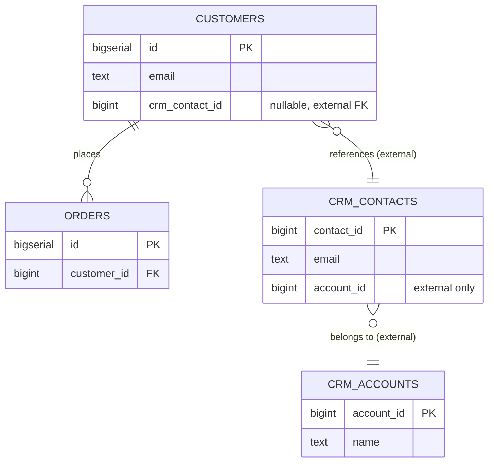

# Group tables, and read another database

## What you'll build

Two tables you own, `customers` and `orders`, sitting beside a purple region
named **CRM (read-only)**. Inside it are two tables you do not own —
`crm_contacts` and `crm_accounts` — pulled in from the sales team's CRM over a
read-only connection. A foreign key runs from `customers.crm_contact_id` into
the group; the generated script will still show you that link, but it will
never try to create the tables on the other side of it.



## Before you start

Read [Set up a table](01-set-up-a-table.md) and
[Connect two tables](02-connect-two-tables.md) first — this walkthrough moves
quickly through typing columns and dragging a foreign key handle, and spends
its time on what is new: regions and the *external* flag. Have **PostgreSQL**
selected in the dialect selector; nothing here is dialect-specific, but the
generated script below was copied on PostgreSQL and a different dialect will
spell the types differently.

If you would rather read the finished thing than type it, open
[`diagrams/03-group-tables.dbviz.json`](diagrams/03-group-tables.dbviz.json)
with **File → Open** (`Ctrl+O`), or drop the file on the canvas.

## The mental model

A group is a namespace for the *canvas*, not for the database — that is the
**Schema** field's job, and the two do not talk to each other. You can put
`sales.customers` and `analytics.customers` in the same region, or leave every
table in one region unschema'd; the region is purely "these belong together
when I look at the picture."

What a region does *not* have is its own rectangle. Open
[`src/lib/groups.ts`](../../src/lib/groups.ts) and the whole file is one idea:
`groupBounds()` recomputes a group's box, every render, as the bounding box of
whichever tables currently carry that group's id in `Table.groupId`, plus a
padding and a header strip. Nothing about the box is ever saved. That is
deliberate — a stored rectangle is a second copy of the truth, and second
copies drift: Detangle would have to know to resize regions after it moves
their tables, an import would have to guess where to draw a box around tables
it just placed, and a person could drag the region's border away from its own
members. Because the box is *derived*, none of that is a special case to get
right; membership changes, and the rectangle just recomputes from wherever the
tables already are.

Membership itself is refreshingly ordinary: it is one field, `groupId`, on the
table, the same way `authors.id` is one field on a row. Move a table's
`groupId` and its picture-membership moves with it, instantly, with no second
step to keep the box in sync — because there is no box to keep in sync.

The second idea, external, is a statement about *ownership*, not geography.
Ticking *These tables live in another database* does not move the tables
anywhere on the canvas or change how they are drawn — it tells the generator
"you are not responsible for creating this," the same distinction you would
make by hand between `CREATE TABLE` and a comment describing a table someone
else owns.

## Steps

### 1. Build `customers` and `orders`, connected

Press `T` twice for two tables, named `customers` and `orders`, and give them
these columns the way you did in [Set up a table](01-set-up-a-table.md) —
`Enter` for the next row, `Tab` across to the type:

| Table | Column | Type | Flags | Default |
| --- | --- | --- | --- | --- |
| `customers` | `id` | `BIGSERIAL` | **PK NN AI** | |
| `customers` | `email` | `TEXT` | **NN UQ** | |
| `customers` | `crm_contact_id` | `BIGINT` | | |
| `customers` | `created_at` | `TIMESTAMPTZ` | **NN** | `now()` |
| `orders` | `id` | `BIGSERIAL` | **PK NN AI** | |
| `orders` | `customer_id` | `BIGINT` | **NN** | |
| `orders` | `status` | `TEXT` | **NN** | `'pending'` |
| `orders` | `total_cents` | `INTEGER` | **NN** | `0` |
| `orders` | `placed_at` | `TIMESTAMPTZ` | **NN** | `now()` |

Then, as in [Connect two tables](02-connect-two-tables.md), drag the handle
beside `orders.customer_id` onto `customers.id` to turn it into a real foreign
key.

**You should see:** two tables with a solid, crow's-foot line between them,
and `customers.crm_contact_id` still a plain, unconnected `BIGINT` — that
connection is what the rest of this walkthrough is for.

### 2. Add the two CRM tables

Add two more tables, `crm_contacts` (`contact_id BIGINT` **PK**, `email
TEXT` **NN**, `account_id BIGINT`) and `crm_accounts` (`account_id BIGINT`
**PK**, `name TEXT` **NN**, `tier TEXT`). Drag the handle beside
`crm_contacts.account_id` onto `crm_accounts.account_id` — an ordinary foreign
key, for now, between two tables that happen to sit off to the side.

**You should see:** four tables on the canvas: two connected pairs,
`customers`↔`orders` and `crm_contacts`↔`crm_accounts`, with nothing yet
joining the two pairs to each other.

### 3. Select the CRM pair and group them

Click `crm_contacts`, then `Shift+click` `crm_accounts` to add it to the
selection, then press `G`. (The `▾` beside **+ Table** reads *Group the 2
selected tables* while both are selected — same action.)

**You should see:** a rectangle drawn around both tables with a title bar
reading *New group*, and the inspector switch to the **Group** panel showing
*Name*, the checkbox *These tables live in another database*, *Note*,
*Colour*, and *Tables (2)* listing both members.

### 4. Name it, colour it, and mark it external

In the inspector, set *Name* to `CRM (read-only)` and *Colour* to `purple` —
the convention this series uses for external tables and their group. Tick
*These tables live in another database*, then type into *Note*: `Vendor CRM,
reached over a foreign data wrapper. We only ever SELECT from it.`

**You should see:** the field hint under the checkbox change to *"Left out of
the generated CREATE TABLE script and out of anything run against a
database. References into them are written as comments, because a foreign key
cannot cross databases."* — read that line once; it is the entire feature.

### 5. Connect a customer to their CRM contact

Drag the handle beside `customers.crm_contact_id` onto `crm_contacts.contact_id`,
exactly as you connected `orders` to `customers`. Set **On delete** to *SET
NULL* in the inspector — if the CRM record disappears, a customer should not
be deleted along with it.

**You should see:** the connection drawn the same solid, crow's-foot way any
other foreign key is — a region does not change how the *edge* looks, only
what the generator does with it once it crosses the boundary.

### 6. Read what Problems says about it

Open the bottom drawer → **Problems**.

**You should see:** exactly one finding, at *info* severity: *"customers
references crm_contacts, which lives in another database; the script
documents the link instead of creating a constraint."* Nothing here is an
error or a warning — Problems is telling you the shape of the schema, not
flagging a mistake.

### 7. Read the generated script

Open the bottom drawer → **SQL**, leave it on *Whole schema*. Above the code, a
generator warning reads: *"customers references crm_contacts in the external
group 'CRM (read-only)'; a foreign key cannot cross databases, so it is
written as a comment."*

**You should see:** `CREATE TABLE public.customers` and
`CREATE TABLE public.orders`, and — nowhere in the script — a `CREATE TABLE`
for `crm_contacts` or `crm_accounts`. Scroll to the very end instead, and see
them documented in an **External sources** appendix.

## Other ways to do it

Every route above has a sibling:

- **The group icon button** in the top bar does the same as `G`.
- **Right-click the canvas** → *Group tables by schema* boxes every table that
  carries the same **Schema** value into its own region in one pass — useful
  the moment several tables already say `crm.` or `warehouse.` in their Schema
  field, which is not the case in this walkthrough's two CRM tables (they were
  left schema-less on purpose, since the schema they actually live under is
  the vendor's business, not yours).
- **Right-click a group's title bar** → *In another database* toggles the same
  checkbox as step 4, without opening the inspector at all — the fastest way
  to flip a region's ownership once it already exists.
- **The table inspector's Group row** is the other way to move a table in or
  out: pick a group by name from the dropdown, or *New group…* to create one
  with just that table in it.
- **Drag a table across a region's border** to add or remove it — drop it
  inside another group's box and it joins that group instantly; drag it far
  enough outside its own group's box (more than a fixed margin, so a small
  wobble near the edge does not eject it by accident) and it leaves.
- **Import SQL** and **Database → Read schema** both have a *Put them in a
  group* checkbox with the same *Another database* toggle, ticked by default —
  so tables you pull in from somewhere else start out external until you say
  otherwise.

## Check your work

Open the bottom drawer → **SQL** and compare. This is the entire generated
script for the diagram above:

```sql
-- Group tables, and read another database (PostgreSQL)
-- Generated by Database Visualizer
-- Tables: 2, foreign keys: 1
-- 2 table(s) live in another database and are not created here; see "External sources" at the end.

CREATE TABLE public.customers (
  id BIGSERIAL PRIMARY KEY,
  email TEXT NOT NULL UNIQUE,
  crm_contact_id BIGINT,
  created_at TIMESTAMPTZ NOT NULL DEFAULT now()
);
CREATE INDEX customers_crm_contact_id_idx ON public.customers (crm_contact_id);
COMMENT ON TABLE public.customers IS 'One row per shopper. crm_contact_id links out to the CRM group below when the sales team has one on file.';
COMMENT ON COLUMN public.customers.crm_contact_id IS 'Points into the external CRM group. Nullable: not every customer has been synced yet.';

CREATE TABLE public.orders (
  id BIGSERIAL PRIMARY KEY,
  customer_id BIGINT NOT NULL,
  status TEXT NOT NULL DEFAULT 'pending',
  total_cents INTEGER NOT NULL DEFAULT 0 CHECK (total_cents >= 0),
  placed_at TIMESTAMPTZ NOT NULL DEFAULT now(),
  CONSTRAINT orders_customer_id_fkey FOREIGN KEY (customer_id) REFERENCES public.customers (id) ON DELETE CASCADE
);
CREATE INDEX orders_customer_id_idx ON public.orders (customer_id);
COMMENT ON TABLE public.orders IS 'One row per order placed by a customer.';

-- ----------------------------------------------------------------
-- External sources: other databases this schema reads from.
-- Nothing below is executed; it is here so the script documents where the data comes from.
--
-- CRM (read-only) (2 tables)
--   Vendor CRM, reached over a foreign data wrapper. We only ever SELECT from it, and only two of its tables matter to us.
--   crm_contacts (contact_id, email, account_id)
--   crm_accounts (account_id, name, tier)
--
-- References into CRM (read-only), as foreign keys would look if the tables were local:
-- ALTER TABLE public.customers ADD CONSTRAINT customers_crm_contact_id_fkey FOREIGN KEY (crm_contact_id) REFERENCES crm_contacts (contact_id) ON DELETE SET NULL;

-- ----------------------------------------------------------------
-- Connections the schema does not enforce, and tagged queries
-- (documentation only, not executed)
-- [FK] customers references crm_contacts (customers_crm_contact_id_fkey)
--   Sales wants this join for the customer 360 report. The CRM is the vendor's database, not ours, so nothing here is enforced by our schema.
--   SELECT c.id, c.email, k.email AS crm_email
--   FROM public.customers c
--   JOIN crm_contacts k ON k.contact_id = c.crm_contact_id
--   -- crm_contacts is read over the FDW, not a table in this database
```

Notice two things the appendix does *not* do. It lists `crm_contacts` and
`crm_accounts` themselves, but it never mentions the foreign key *between*
them (`crm_contacts.account_id → crm_accounts.account_id`) anywhere — a
foreign key with both ends inside the external group is entirely the other
database's business, so the generator skips it, not just from the `CREATE
TABLE` output but from the appendix too. And the tagged query you set in step
5's inspector (not shown above until you add it) rides along in the second
appendix exactly like any other tagged query — crossing the group boundary
does not disqualify it.

Toggle **Prefix DROP TABLE statements** in the same tab and check the top: the
`DROP TABLE` list names `orders` and `customers` only, in that order —
`crm_contacts` and `crm_accounts` were never created, so there is nothing to
drop.

Finally, select `customers` and `crm_contacts` and press **Trace** in the top
bar. The **Trace** tab's *Join along the path* prints:

```sql
-- Heads up: this path crosses into another database (crm_contacts).
-- The query below will not run as one statement; stage those tables first.
SELECT t0.*, t1.*
FROM customers AS t0
JOIN crm_contacts AS t1 ON t0.crm_contact_id = t1.contact_id;
```

The `JOIN` is still written — a trace does not refuse to cross a group
boundary — but the comment above it tells you why running it as one statement
against your own database will not work.

## Try it yourself

- Untick *These tables live in another database* on the CRM group and watch
  the **SQL** tab grow two more `CREATE TABLE` statements and the warning
  disappear — the region did not move, only what the script does with it
  changed.
- Drag `crm_accounts` far enough outside the purple rectangle that it pops
  out of the group, then look at the region: it shrank to fit just
  `crm_contacts`. Drag it back in and it grows again. Nothing you typed
  changed — only where the table sits.
- Give `crm_contacts` a **Schema** of `crm` and `crm_accounts` a **Schema** of
  `crm` too, remove them from the group (drag them out, or set *Group* to *No
  group*), then right-click the canvas → *Group tables by schema* and watch it
  rebuild the same region for you from the schema name alone.

## Gotchas

- **A group name is not a schema.** `CRM (read-only)` is a label for the
  picture; the tables inside can carry any **Schema** value, or none, and it
  has no bearing on grouping. Do not expect renaming a group to change a
  `CREATE TABLE`'s schema prefix, or vice versa.
- **External is about ownership, not location.** Marking a group external does
  not move its tables anywhere, hide them, or change how connections into it
  are drawn on the canvas — it only changes what the *generator* does: skip
  the `CREATE TABLE`, skip it in **Run schema** and the `DROP TABLE` prefix,
  and turn a crossing foreign key into a comment.
- **You cannot resize a region directly.** There is no handle on its border
  to drag, because the border is not real state — it is recomputed from the
  tables inside. To make the box bigger or smaller, move the tables; to
  reshape it, move the tables that define its corners.
- **A foreign key from inside the group to outside it is invisible.** Only a
  connection whose *source* is local and *target* is external gets documented
  in the "References into…" appendix. Point an external table's foreign key
  back at one of your own tables and the generator says nothing about it at
  all — the same rule ("the other database's business") applies in both
  directions, but only one direction is yours to document.
- **Deleting a region with `Delete region and its N table(s)`** removes the
  tables, not just the box — and any connection crossing the boundary goes
  with them. The confirmation dialog tells you the count first; `Ctrl+Z`
  undoes the whole thing as one step if you meant *Remove the region, keep the
  tables* instead.

## Where to go next

- [Create an enum and use it](04-create-an-enum.md) — replace `orders.status`'s
  free-text `'pending'` with a real constrained type.
- [Trace a path between two tables](11-trace-a-path-between-tables.md) — more
  on what happens when the shortest path between two tables leaves the schema
  you are designing.
- [Import an existing schema](09-import-an-existing-schema.md) — the *Put them
  in a group* checkbox this walkthrough's "Other ways to do it" mentioned, in
  full.
