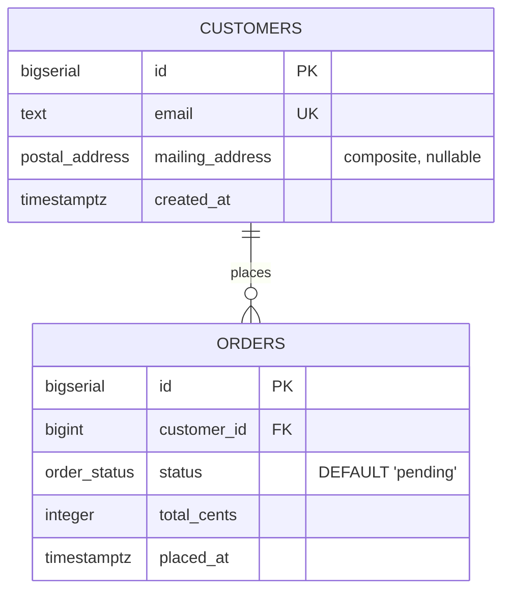

# Create an enum and use it

## What you'll build

A small orders schema — `customers` and `orders` — where two columns are typed
as custom types instead of raw SQL: `orders.status` is an `order_status` enum
with a default of `'pending'`, and `customers.mailing_address` is a
`postal_address` composite (a struct of `street`, `city`, `postal_code` and
`country`). Both types are defined once in the **Types** drawer tab and reused
just by name.



## Before you start

Do [Set up a table](01-set-up-a-table.md) first if you have not — this
walkthrough assumes you can already add a table and type a column without
looking. Have **PostgreSQL** selected in the dialect selector at the top: it
is the only one of the three that has a real named type system, so it is the
dialect where the feature does the most. The last section shows what happens
on the other two.

If you would rather read the finished thing than type it, open
[`diagrams/04-create-an-enum.dbviz.json`](diagrams/04-create-an-enum.dbviz.json) with
**File → Open** (`Ctrl+O`), or drop the file on the canvas.

## The mental model

A custom type is a symbol table entry, not a picker. The diagram keeps one
list of named types (`customTypes`), and every column's *type* field is free
text — so when you type `order_status` into a type cell, the generator does
exactly one thing: it looks that word up against the list, case-insensitively,
with surrounding quotes stripped. Find a match and the column is generated
specially, per dialect. Find no match and it is just a raw SQL type, spelled
however you typed it. Nothing on the canvas visually distinguishes "resolves
to a type" from "meant to be `INTEGER` but is `INTGER`" except that highlighted
border on the type cell — the same free-text honesty from
[Set up a table](01-set-up-a-table.md) applies here too, now with higher
stakes, because a typo doesn't just misname a column type, it silently drops
the enum's meaning.

The two kinds model two different things. An **enum** is a closed *set of
values* — PostgreSQL really does create a type with that name in the catalog,
and a column typed as one can only ever hold something from the list. A
**composite** is a *shape* — named fields, like a struct or a record — and
nothing about it constrains what a column holds beyond having that shape; it
is documentation for a group of related columns that happen to travel
together, the same way you might define an `Address` type in application code
without it implying any validation.

One consequence of types living in their own named list, rather than being
copied into every column that uses them: renaming a custom type in the
**Types** tab rewrites every column and composite field that names it, in the
same keystroke. That is the opposite of renaming a column, which — as
[Set up a table](01-set-up-a-table.md) warns — touches nothing else in the
diagram. A type's name is a reference other things point at; a column's name
is just a label.

## Steps

### 1. Add the order_status enum type

Click the `▾` beside **+ Table**, then choose *Enum type*. This adds a new
custom type and opens the bottom drawer on the **Types** tab.

**You should see:** a card in the **Types** tab with an "enum" badge, an
editable name field reading `my_enum`, and *Values (1)* holding one row,
`value_1`.

### 2. Name it and fill in its values

Edit the name field to `order_status`. In *Values (1)*, replace `value_1`
with `pending`, then click **+ Value** three more times and type `paid`,
`shipped` and `cancelled` — one value per row, in the order you want them to
mean something (PostgreSQL's `ORDER BY` on an enum column follows this order,
not alphabetical). In *Comment*, write why this is a type and not a bare
string: `A closed set the application code already branches on.`

**You should see:** *Values (4)*, and the type's row order matching what you
typed — there is no drag handle here, so getting the order right means typing
it right the first time or deleting and re-adding a value.

### 3. Add the postal_address composite type

With the **Types** tab still open, click **+ Struct type** at the top of the
panel (the same thing the top bar's `▾` → *Composite type* does, and jumping
straight there is one click fewer once the drawer is already open). Rename it
`postal_address`. In *Fields (1)*, rename the first field to `street` and
leave its type `TEXT`; click **+ Field** three more times for `city` (`TEXT`),
`postal_code` (`TEXT`) and `country` (`CHAR(2)`) — each field's type is the
same free-text box a column's type is, so it can name a plain SQL type, as
here, or the name of another custom type in the diagram.

**You should see:** *Fields (4)*, a "struct" badge, and — because this is
PostgreSQL — no dialect hint under the fields. Switch the dialect selector to
**MariaDB** for a moment and the hint appears: *MariaDB has no composite
type: generated SQL will store columns of this type as JSON.* Switch back to
PostgreSQL before continuing.

### 4. Build customers and orders, and use both types by name

Press `T` twice for two tables, named `customers` and `orders`. Type their
columns:

| Table | Column | Type | Flags | Default |
| --- | --- | --- | --- | --- |
| `customers` | `id` | `BIGSERIAL` | **PK NN AI** | |
| `customers` | `email` | `TEXT` | **NN UQ** | |
| `customers` | `mailing_address` | `postal_address` | | |
| `customers` | `created_at` | `TIMESTAMPTZ` | **NN** | `now()` |
| `orders` | `id` | `BIGSERIAL` | **PK NN AI** | |
| `orders` | `customer_id` | `BIGINT` | **NN** | |
| `orders` | `status` | `order_status` | **NN** | `'pending'` |
| `orders` | `total_cents` | `INTEGER` | **NN** | `0` |
| `orders` | `placed_at` | `TIMESTAMPTZ` | **NN** | `now()` |

For `mailing_address` and `status`, just type the type's name — `postal_address`,
`order_status` — into the type cell the same way you would type `TEXT` or
`BIGINT`. There is no dropdown, no "insert custom type" button: the box you
already know how to type into is the whole mechanism, and both names are
offered in the autocomplete as you type. Add the table check on `total_cents`
(`total_cents >= 0`) as you did in [Set up a table](01-set-up-a-table.md).
Finally, hover `orders` and drag the small handle beside `customer_id` onto
the `id` row of `customers` to connect them.

**You should see:** the `status` and `mailing_address` type cells grow a
highlighted border, and hovering either shows the tooltip *Custom enum
type — edit it in the Types drawer tab* or *Custom struct type — edit it in
the Types drawer tab*. Open **Types** again and both cards now carry a
`used by 1` badge. The **SQL** tab shows two `CREATE TYPE` statements ahead of
both `CREATE TABLE` statements — types are always emitted first, because a
table cannot be created with a column typed as something that does not exist
yet.

## Other ways to do it

- **`Ctrl+K`** → type "enum" or "composite" to run *Add enum type* / *Add
  composite type* from the command palette — the same action as the top
  bar's `▾` menu, including opening the **Types** tab.
- The **Types** tab has its own **+ Enum** and **+ Struct type** buttons at
  the top, so once the drawer is open you never need to go back to the top
  bar.
- **Import SQL** (bottom drawer) parses `CREATE TYPE … AS ENUM (…)` and
  `CREATE TYPE … AS (…)` the same as it parses `CREATE TABLE`, so pasting an
  existing PostgreSQL schema recreates its custom types along with its
  tables. See [Import an existing schema](09-import-an-existing-schema.md).
- **Hand-write the `.dbviz.json`**: a type is an object in the top-level
  `customTypes` array with `"kind": "enum"` and a `values` array, or
  `"kind": "composite"` and a `fields` array of `{ name, type }`. A column
  reaches it by putting the type's `name` — nothing else — in that column's
  `type` string. [`../ADVISOR_OUTPUT_FORMAT.md`](../ADVISOR_OUTPUT_FORMAT.md)
  documents the exact shape.

## Check your work

Open the bottom drawer → **SQL**, leave it on *Whole schema*. This is the
entire PostgreSQL output for the diagram above — notice both `CREATE TYPE`
statements ahead of either table:

```sql
-- Create an enum and use it — customers and orders (PostgreSQL)
-- Generated by Database Visualizer
-- Tables: 2, foreign keys: 1

-- Custom types
CREATE TYPE order_status AS ENUM ('pending', 'paid', 'shipped', 'cancelled');
CREATE TYPE postal_address AS (street TEXT, city TEXT, postal_code TEXT, country CHAR(2));

CREATE TABLE public.customers (
  id BIGSERIAL PRIMARY KEY,
  email TEXT NOT NULL UNIQUE,
  mailing_address postal_address,
  created_at TIMESTAMPTZ NOT NULL DEFAULT now()
);
COMMENT ON TABLE public.customers IS 'One row per person who has ordered. mailing_address is a postal_address, typed by writing the type''s name into the column''s type cell.';
COMMENT ON COLUMN public.customers.mailing_address IS 'Composite type. Nullable: we only have it once an order ships.';

CREATE TABLE public.orders (
  id BIGSERIAL PRIMARY KEY,
  customer_id BIGINT NOT NULL,
  status order_status NOT NULL DEFAULT 'pending',
  total_cents INTEGER NOT NULL DEFAULT 0 CHECK (total_cents >= 0),
  placed_at TIMESTAMPTZ NOT NULL DEFAULT now(),
  CONSTRAINT orders_customer_id_fkey FOREIGN KEY (customer_id) REFERENCES public.customers (id) ON DELETE CASCADE
);
CREATE INDEX orders_customer_id_idx ON public.orders (customer_id);
COMMENT ON TABLE public.orders IS 'status is an order_status, not a raw string — the column''s type cell names the enum by name, same mechanism as mailing_address above.';
COMMENT ON COLUMN public.orders.status IS 'Every order starts pending. The quotes around pending are part of the default text you type.';
```

Then open **Problems**. It should be empty — the index on `orders.customer_id`
is already there so PostgreSQL's foreign key does not force a table scan on
every delete from `customers`.

## Reference

Only PostgreSQL emits `CREATE TYPE`. Switching the dialect selector changes
what `order_status` and `postal_address` become, silently — nothing warns you
in the UI beyond the hint under a composite's fields:

| Dialect | `orders.status` becomes | `customers.mailing_address` becomes |
| --- | --- | --- |
| **PostgreSQL** | `order_status` — a real named type, `CREATE TYPE order_status AS ENUM (...)` runs first | `postal_address` — a real named type, `CREATE TYPE postal_address AS (...)` runs first |
| **MariaDB** | inlined per column: `ENUM('pending','paid','shipped','cancelled')` | falls back to `JSON` — there is no MariaDB struct type |
| **SQLite** | `TEXT` plus a same-column `CHECK`: `TEXT ... CHECK (status IN ('pending', 'paid', 'shipped', 'cancelled'))` | `TEXT`, unconstrained — SQLite cannot express a struct at all |

Switch to **MariaDB** and `orders` reads, in full:

```sql
CREATE TABLE public.orders (
  id BIGINT NOT NULL AUTO_INCREMENT PRIMARY KEY,
  customer_id BIGINT NOT NULL,
  status ENUM('pending','paid','shipped','cancelled') NOT NULL DEFAULT 'pending' COMMENT 'Every order starts pending. The quotes around pending are part of the default text you type.',
  total_cents INTEGER NOT NULL DEFAULT 0 CHECK (total_cents >= 0),
  placed_at TIMESTAMPTZ NOT NULL DEFAULT now(),
  KEY orders_customer_id_idx (customer_id),
  CONSTRAINT orders_customer_id_fkey FOREIGN KEY (customer_id) REFERENCES public.customers (id) ON DELETE CASCADE
) ENGINE=InnoDB DEFAULT CHARSET=utf8mb4 COMMENT='...';
```

No `CREATE TYPE` runs at all, and the generator's warnings say so plainly:
*MariaDB has no CREATE TYPE: enum types were inlined per column and composite
types fell back to JSON.*

Switch to **SQLite** and `status` becomes a `CHECK` doing the enum's job by
hand:

```sql
status TEXT NOT NULL DEFAULT 'pending' CHECK (status IN ('pending', 'paid', 'shipped', 'cancelled'))
```

with the warning *SQLite has no CREATE TYPE: enum types became CHECK
constraints and composite types TEXT.*

## Try it yourself

- Add a fifth value, `refunded`, to `order_status`. Watch the `CREATE TYPE`
  statement in the **SQL** tab pick it up immediately, in the position you put
  it.
- Type `order_staus` (missing the "t") into a new column's type cell instead
  of `order_status`. Nothing turns red: the column just gets a plain,
  unrecognised type named `order_staus`, exactly as if you had typed
  `VARHCAR(50)` in [Set up a table](01-set-up-a-table.md). Open **Problems**
  and confirm it stays quiet about it too — misspelling a custom type is not
  one of its rules.
- Rename `order_status` to `order_state` in the **Types** tab and watch the
  `orders.status` type cell update itself, unprompted. Then rename the
  `orders.status` *column* to `order_state` and watch nothing else follow —
  same app, opposite behaviour, because one is a reference and the other is a
  label.
- Switch through all three dialects with the **SQL** tab open and watch
  `postal_address` become a real type, then `JSON`, then `TEXT`, without
  touching the diagram.

## Gotchas

- **Adding a value to a live enum is cheap; removing one is not.** PostgreSQL
  gives you `ALTER TYPE order_status ADD VALUE 'refunded'` for growth, but
  there is no `DROP VALUE` — deleting a value means creating a replacement
  type and migrating every column, default and stored row across by hand. If
  the set of allowed strings is going to grow *and shrink* over the table's
  life (categories, tags, statuses a product manager keeps redefining), a
  lookup table with a foreign key ages much better than an enum. Reach for an
  enum only for sets that are closed for good: a fixed protocol, a currency
  code, `order_status` here.
- **The type cell has no picker.** You type the exact name, case-insensitive,
  quotes optional. A typo does not error in the app — it just becomes an
  ordinary unresolved SQL type, and the database is what eventually rejects
  it.
- **Problems has nothing to say about this today.** `src/lib/lint.ts` exports
  `isEnumTyped()`, but no lint rule in the **Problems** tab currently calls
  it — so an enum-typed column gets exactly the same (empty) treatment from
  **Problems** as any other column, misspelled name and all.
- **No drag-to-reorder on values or fields.** Both *Values (N)* and
  *Fields (N)* only append at the bottom and delete; to move something,
  retype it into a different row or delete-and-re-add.
- **Deleting a type in use does not touch its columns.** The confirmation
  dialog tells you how many columns reference it by name, but choosing
  **Delete** anyway leaves every one of them holding the old name as
  ordinary, unresolved text — nothing renames or blanks them for you.
- **MariaDB and SQLite never had this feature to begin with.** A composite
  type is not just weaker there, it is JSON with no structure enforced at
  all — do not rely on a `postal_address` "shape" surviving a dialect switch;
  it survives as documentation on the canvas, not as anything the database
  checks.

## Where to go next

- [Fill one table from another](05-fill-one-table-from-another.md) — the
  next walkthrough in the series, on data flows instead of custom types.
- [Import an existing schema](09-import-an-existing-schema.md) — paste a real
  PostgreSQL dump and watch its `CREATE TYPE` statements turn into the same
  **Types** tab cards you just built by hand.
