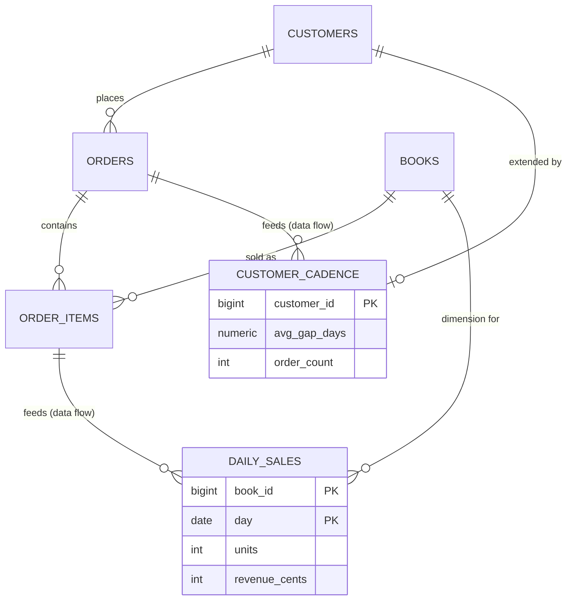

# Fill one table from another

## What you'll build

Two rollup tables that actually compute. `order_items` joins the canvas — the
grain everything downstream aggregates from — and under it `daily_sales`, filled
by grouping and summing `order_items` through the `orders` it joins to via
foreign key. Then the data flow you drew into `customer_cadence` back in
walkthrough 02, and left deliberately empty, finally gets its derivations:
the gap between each customer's orders in sequence, averaged.

Neither rollup is ever `INSERT`ed into by hand. The dashed **data flow** edge
into each one carries structured *derivations* that say exactly how, and the
app turns those into a real `INSERT ... SELECT` you can read in the SQL tab.



## Before you start

You need what [Create an enum and use it](04-create-an-enum.md) leaves behind:
nine tables, an `order_status` enum on `orders.status`, and the empty data flow
from `orders` into `customer_cadence` that walkthrough 02 drew. Press **Set up
the canvas** at the top of this walkthrough in the drawer's **Walkthrough** tab
if it is not already in front of you.

Both matter here. Everything below leans on the foreign keys already being
right, and one of the two flows filters on `status = 'paid'` — a comparison
worth trusting only because the enum stops the column holding anything else.

Select **PostgreSQL** in the dialect selector at the top. It matters twice
over: the sequence derivation below leans on PostgreSQL's own rule that
subtracting one `DATE` from another gives a whole number of days, and the
tagged query in step 7 is a PostgreSQL `ON CONFLICT` upsert that has no
equivalent spelling in the other two dialects.

If you would rather read the finished thing than type it, open
[`diagrams/05-fill-one-table-from-another.dbviz.json`](diagrams/05-fill-one-table-from-another.dbviz.json)
with **File → Open** (`Ctrl+O`), or drop the file on the canvas.

## The mental model

A foreign key says a row *points at* another row. A data flow says something
different and, until now, harder to write down: rows in the target *come
from* rows in the source, computed. The edge itself only draws the arrow —
"`order_items` feeds `daily_sales`" — the same way `feeds` reads on any flow.
What actually fills each column lives one level down, in the connection's
**Derived columns**: one entry per target column, each an *expression* on the
source, an optional *aggregate*, a *Group by*, a *Filter (WHERE)*, and an
optional *Sequence (window)*. Put together, one derivation is a single
column of a `SELECT` list; the whole set is the `INSERT ... SELECT` you would
otherwise write and maintain by hand.

The part that makes this worth using rather than a comment reading "rolled up
nightly" is that an expression, a group-by key, or a filter can name a column
of *another* table as `table.column` — not the source table itself, a table
the source *reaches through a foreign key already on the diagram*. Write
`orders.status` inside a derivation on a flow that starts at `order_items`,
and the app walks `order_items.order_id → orders.id`, the exact foreign key
you drew, to find it. It does not ask you to restate the join: it resolves
it from the diagram, and writes the `JOIN` into the generated skeleton
itself. This is why foreign keys have to be right *before* you build a flow
on top of them — a derivation cannot join through a foreign key that is
missing, backwards, or pointed at the wrong column, and the diagram is the
only place that join lives.

A sequence derivation is a second, orthogonal idea: put the source rows in
order, and compute each one from its neighbours before anything else
happens. Anchor it to code you already know: `DIFF` is `x[i] - x[i-1]`,
`RUNNING_SUM` is a running total (a prefix sum), `ROW_NUMBER` is `enumerate()`
starting at 1, and a *Partition by* key is a `groupby()` that restarts the
sequence for every distinct value — one series per customer, per sensor, per
whatever you partition on. Critically, the window runs **first**, over the
ordered rows, and only *then* does grouping and aggregation happen on the
result — so `AVG` of a `DIFF` is the mean of the gaps, not a single gap
divided by a count.

## Steps

### 1. Add order_items

<!-- step
target: ui:add-table
goals:
  - table | order_items
  - column | order_items.order_id : BIGINT
  - column | order_items.book_id : BIGINT
  - column | order_items.quantity : INTEGER
  - default | order_items.quantity : 1
  - check | order_items.quantity : quantity > 0
  - column | order_items.unit_price_cents : INTEGER
  - check | order_items.unit_price_cents : unit_price_cents >= 0
-->

Press `T`, rename the new table `order_items`, and give it these columns:

| Name | Type | Flags | Default | Check |
| --- | --- | --- | --- | --- |
| `id` | `BIGSERIAL` | **PK NN AI** | | |
| `order_id` | `BIGINT` | **NN** | | |
| `book_id` | `BIGINT` | **NN** | | |
| `quantity` | `INTEGER` | **NN** | `1` | `quantity > 0` |
| `unit_price_cents` | `INTEGER` | **NN** | | `unit_price_cents >= 0` |

`unit_price_cents` is not a mistake or a duplicate of `books.price_cents`. It
is the price *at the moment of sale*, copied at checkout, so that repricing a
book tomorrow does not silently rewrite what somebody paid last week. Rollups
downstream read this column, never `books.price_cents`, for the same reason.

**You should see:** a tenth table on the canvas with five columns, and
`order_items` in the `shop` region if you dropped it inside the slate
rectangle (drag it in if not).

### 2. Connect order_items to its two parents

<!-- step
target: field:On delete
goals:
  - fk | order_items.order_id -> orders.id
  - fk | order_items.book_id -> books.id
  - reads | order_items is part of orders
  - ondelete | order_items -> orders : CASCADE
  - ondelete | order_items -> books : RESTRICT
-->

Drag the handle beside `order_items.order_id` onto `orders.id`, and the handle
beside `order_items.book_id` onto `books.id`. In the inspector, set the first
connection's **Reads as** to *is part of* and its **On delete** to *CASCADE*;
set the second's **On delete** to *RESTRICT*.

The two `ON DELETE` choices are opposites on purpose. An order line is part of
its order and means nothing without it, so deleting the order should take its
lines with it. A book is referenced *by* order lines and outlives them, so
deleting a book that has ever been sold should be refused outright.

**You should see:** two more solid, crow's-foot connections, and — importantly
for the next steps — a path from `order_items` to `orders`, which is what lets
a derivation say `orders.status` without you restating the join.

### 3. Add daily_sales

<!-- step
target: ui:add-table
goals:
  - table | daily_sales
  - column | daily_sales.book_id : BIGINT
  - flags | daily_sales.book_id : pk
  - column | daily_sales.day : DATE
  - flags | daily_sales.day : pk
  - no column | daily_sales.id
  - column | daily_sales.units : INTEGER
  - column | daily_sales.revenue_cents : INTEGER
-->

Press `T`, rename the new table `daily_sales`, and colour it *orange* — the
convention for a derived table across these walkthroughs. Give it four
columns:

| Name | Type | Flags | Default |
| --- | --- | --- | --- |
| `book_id` | `BIGINT` | **PK** **NN** | |
| `day` | `DATE` | **PK** **NN** | |
| `units` | `INTEGER` | **NN** | `0` |
| `revenue_cents` | `INTEGER` | **NN** | `0` |

Two columns flagged **PK** makes a composite primary key, exactly like
`PRIMARY KEY (a, b)` written by hand.

**You should see:** a key glyph on both `book_id` and `day`, and
`PRIMARY KEY (book_id, day)` as a standalone line in the generated
`CREATE TABLE public.daily_sales` once you open the SQL tab.

### 4. Connect the dimension keys

<!-- step
target: field:Reads as
goals:
  - fk | daily_sales.book_id -> books.id
  - fk | customer_cadence.customer_id -> customers.id
  - reads | customer_cadence extends customers
-->

Drag from `daily_sales.book_id`'s handle onto `books.id`, and from
`customer_cadence.customer_id`'s handle onto `customers.id` — that second
table has been sitting there since walkthrough 02 with its key pointing at
nothing. Both land as **Foreign key** connections automatically, because you
dragged column to column rather than from a header. Open the second one in the
inspector and set **Reads as** to *extends*: `customer_cadence` shares its
primary key with the row of `customers` it summarises, which is exactly what
*extends* means.

**You should see:** two solid, crow's-foot connections, and no new
**Problems** — `book_id` already leads `daily_sales`'s composite primary key
and `customer_id` *is* `customer_cadence`'s whole primary key, so both
foreign keys already have the index PostgreSQL needs without you adding one.

### 5. Draw the first data flow

<!-- step
target: table:order_items
goals:
  - flow | order_items -> daily_sales
hint: The orange handle sits at the right edge of the table header, not beside a column.
-->

Hover `order_items` and drag the small orange handle at the right edge of its
header — the same one the empty **Simulate** tab calls out as "drag from the
orange handle in a table header onto another table to draw a data flow" —
onto `daily_sales`.

**You should see:** a dashed arrow from `order_items` to `daily_sales`, and
the inspector open on the new connection with **Kind** already *Data flow*
and **Reads as** *feeds*.

### 6. Derive day, units and revenue_cents

<!-- step
target: section:Derived columns
goals:
  - derivation | daily_sales.day : CAST(orders.placed_at AS DATE) group by book_id, CAST(orders.placed_at AS DATE) where orders.status = 'paid'
  - derivation | daily_sales.units : SUM(quantity) group by book_id, CAST(orders.placed_at AS DATE) where orders.status = 'paid'
  - derivation | daily_sales.revenue_cents : SUM(quantity * unit_price_cents) group by book_id, CAST(orders.placed_at AS DATE) where orders.status = 'paid'
-->

In the **Derived columns (0)** section, click **Add** three times and fill
each entry. All three share the same *Group by* and *Filter (WHERE)* — after
the first, **Add** copies both forward from the entry above it, so you are
only changing the target column, the aggregate and the expression each time.

**Entry 1 — `day`:** target column `day`, no aggregate. *Expression on
order_items*: type `CAST(orders.placed_at AS DATE)` — or click **Columns you
can use**, find `orders` under "through `order_items.order_id`", and click
its `placed_at` chip, then wrap it in `CAST( ... AS DATE)` yourself; chips
insert bare column references, not SQL you write around them. Under *Group
by*, click **+ Add key** twice: set the first to `book_id` from the dropdown,
and set the second to *— expression —* and type the same
`CAST(orders.placed_at AS DATE)`. Under *Filter (WHERE)*, type
`orders.status = 'paid'`.

**Entry 2 — `units`:** target column `units`, aggregate `SUM`. *Expression on
order_items*: `quantity`. Group by and filter already match entry 1.

**Entry 3 — `revenue_cents`:** target column `revenue_cents`, aggregate
`SUM`. *Expression on order_items*: `quantity * unit_price_cents`.

**You should see:** **Derived columns (3)**, and — this is the payoff —
*Generated from these derivations* showing one `INSERT ... SELECT` with a
`JOIN public.orders ON orders.id = order_items.order_id` the app wrote for
you, a `WHERE orders.status = 'paid'`, and only two columns in the `GROUP BY`
even though you typed three group-by keys: `book_id` never got its own
derivation because its group-by text is literally the name of a column of
`daily_sales`, so the generator carries it into the `INSERT` list on its own.

### 7. Add the upsert as a tagged query

<!-- step
target: field:Tagged query
goals:
  - query | order_items -> daily_sales
-->

The structured form describes a `SELECT`, not what happens when a day's
numbers are recomputed the next night and the rows already exist — that is
`ON CONFLICT`, which derivations cannot express. Scroll to **Tagged query**
and paste:

```sql
INSERT INTO daily_sales (book_id, day, units, revenue_cents)
SELECT oi.book_id, CAST(o.placed_at AS DATE), SUM(oi.quantity), SUM(oi.quantity * oi.unit_price_cents)
FROM order_items oi
JOIN orders o ON o.id = oi.order_id
WHERE o.status = 'paid'
GROUP BY oi.book_id, CAST(o.placed_at AS DATE)
ON CONFLICT (book_id, day) DO UPDATE
  SET units = daily_sales.units + EXCLUDED.units,
      revenue_cents = daily_sales.revenue_cents + EXCLUDED.revenue_cents;
```

**You should see:** a query badge on the edge, and the SQL tab's appendix for
this flow grow a second block, **Tagged query**, printed right after **Built
from the derivation metadata** — both live side by side; neither replaces the
other.

### 8. Simulate daily_sales

<!-- step
target: panel:simulate
goals:
  - simulate | daily_sales
  - simulating | daily_sales
-->

Click **Simulate** beside **Derived columns (3)** (or select `daily_sales`
and press `S`).

**You should see:** one stage, `order_items → daily_sales`, "group and
aggregate WHERE orders.status = 'paid'" under it, no warnings, and rows
landing in `daily_sales` on the right — at the defaults (*Rows per input*
10, *Seed* 1) that is 7 rows. Double-click a cell in `order_items` on the
left to edit it and watch the right side recompute.

### 9. Keep the promise: derive avg_gap_days and order_count

<!-- step
target: section:Derived columns
goals:
  - derivation | customer_cadence.avg_gap_days : AVG(DIFF(CAST(placed_at AS DATE))) group by customer_id order by placed_at partition by customer_id where status <> 'cancelled'
  - derivation | customer_cadence.order_count : COUNT(*) group by customer_id where status <> 'cancelled'
-->

Select the dashed edge from `orders` to `customer_cadence` — the one you drew
in walkthrough 02 and left with **Derived columns (0)**. Nothing about it needs
redrawing; it has been waiting for exactly this. Add two derivations.

**Entry 1 — `avg_gap_days`:** target column `avg_gap_days`, aggregate `AVG`.
*Expression on orders*: `CAST(placed_at AS DATE)`. Set **Sequence (window)**
to *Change since the previous row* (`DIFF`). Under its *Order by*, add
`placed_at`; under *Partition by*, add `customer_id`. Under *Group by* (the
derivation's own, below the window), add `customer_id`. *Filter (WHERE)*:
`status <> 'cancelled'`.

**Entry 2 — `order_count`:** target column `order_count`, aggregate `COUNT`.
*Expression on orders*: `*`. Group by `customer_id`, same filter as entry 1.

**You should see:** *Generated from these derivations* showing `AVG` and
`COUNT` computed in an outer `SELECT ... GROUP BY customer_id` over a `FROM
(SELECT ...) AS w` subquery — the window has to run to completion before
`AVG` can see its results, and SQL cannot nest a window function directly
inside an aggregate, so the generator builds the inner query first.

### 10. Simulate customer_cadence and read the numbers

<!-- step
target: panel:simulate
goals:
  - simulate | customer_cadence
  - simulating | customer_cadence
-->

Select `customer_cadence` and press `S`.

**You should see:** at the defaults, three rows land — one customer with
`order_count` 2 and a real `avg_gap_days` (120, in the sample this book
ships with), and two more with `order_count` 1 and `avg_gap_days` **NULL**,
exactly as the column's comment promises: one order has no previous order to
measure a gap against. Click **Reshuffle** for a different sample, or raise
*Rows per input* until more customers cross two orders.

## Other ways to do it

- **Right-click a table** → *Simulate* does the same as pressing `S` with it
  selected; right-click a connection → *Edit in inspector* jumps straight to
  its derivations, and *Copy tagged query* grabs the free-text query alone.
- **`Ctrl+K`** finds any table by name while you work, without reaching for
  the mouse.
- **Hand-write the `.dbviz.json`.** Every derivation is plain JSON —
  `targetColumnId`, `expression`, `aggregate`, `groupBy`, `filter`, `window`
  — documented in [`../ADVISOR_OUTPUT_FORMAT.md`](../ADVISOR_OUTPUT_FORMAT.md).
  This walkthrough's own companion diagram was built that way; open it and
  read the `derivations` arrays directly.
- **Import SQL** only ever gives you tables, columns, indexes and foreign
  keys — never flows or derivations, because there is no DDL for "and this
  one is computed from that one." Type the two rollup tables' *columns*
  through Import SQL if you like (a second `CREATE TABLE` in the same paste),
  but the flow and its derivations still have to be drawn and filled in on
  the canvas.

## Check your work

Open the bottom drawer → **SQL**, leave it on *Whole schema* — **Selected
table** only shows a table's own `CREATE TABLE`, not the flows that feed it.
The two new tables are ordinary:

```sql
CREATE TABLE public.order_items (
  id BIGSERIAL PRIMARY KEY,
  order_id BIGINT NOT NULL,
  book_id BIGINT NOT NULL,
  quantity INTEGER NOT NULL DEFAULT 1 CHECK (quantity > 0),
  unit_price_cents INTEGER NOT NULL CHECK (unit_price_cents >= 0),
  CONSTRAINT order_items_order_id_fkey FOREIGN KEY (order_id) REFERENCES public.orders (id) ON DELETE CASCADE,
  CONSTRAINT order_items_book_id_fkey FOREIGN KEY (book_id) REFERENCES public.books (id) ON DELETE RESTRICT
);

CREATE TABLE public.daily_sales (
  book_id BIGINT NOT NULL,
  day DATE NOT NULL,
  units INTEGER NOT NULL DEFAULT 0,
  revenue_cents INTEGER NOT NULL DEFAULT 0,
  PRIMARY KEY (book_id, day),
  CONSTRAINT daily_sales_book_id_fkey FOREIGN KEY (book_id) REFERENCES public.books (id) ON DELETE RESTRICT
);
```

The interesting part is the appendix at the very end, which is where the two
flows now write themselves out in full. Nothing here executes — it is the
`INSERT ... SELECT` the app builds from your derivation metadata, so you can
read what the diagram claims and check it against what your job really does:

```sql
-- [flow] order_items feeds daily_sales (nightly rollup)
--   Derived columns:
--     day = CAST(orders.placed_at AS DATE) GROUP BY book_id, CAST(orders.placed_at AS DATE) WHERE orders.status = 'paid'
--     units = SUM(quantity) GROUP BY book_id, CAST(orders.placed_at AS DATE) WHERE orders.status = 'paid'
--     revenue_cents = SUM(quantity * unit_price_cents) GROUP BY book_id, CAST(orders.placed_at AS DATE) WHERE orders.status = 'paid'
--   Built from the derivation metadata:
--   INSERT INTO public.daily_sales (book_id, day, units, revenue_cents)
--   SELECT order_items.book_id, CAST(orders.placed_at AS DATE), SUM(order_items.quantity), SUM(order_items.quantity * order_items.unit_price_cents)
--   FROM public.order_items
--   JOIN public.orders ON orders.id = order_items.order_id
--   WHERE orders.status = 'paid'
--   GROUP BY order_items.book_id, CAST(orders.placed_at AS DATE);
-- [flow] orders feeds customer_cadence (nightly rollup)
--   Derived columns:
--     avg_gap_days = AVG(DIFF(CAST(placed_at AS DATE)) OVER (PARTITION BY customer_id ORDER BY placed_at)) GROUP BY customer_id WHERE status <> 'cancelled'
--     order_count = COUNT(*) GROUP BY customer_id WHERE status <> 'cancelled'
--   Built from the derivation metadata:
--   INSERT INTO public.customer_cadence (customer_id, avg_gap_days, order_count)
--   SELECT customer_id, AVG(avg_gap_days), COUNT(order_count)
--   FROM (
--     SELECT customer_id AS customer_id, CAST(placed_at AS DATE) - LAG(CAST(placed_at AS DATE)) OVER (PARTITION BY customer_id ORDER BY placed_at) AS avg_gap_days, 1 AS order_count
--     FROM public.orders
--     WHERE status <> 'cancelled'
--   ) AS w
--   GROUP BY customer_id;
```

Read the first `JOIN` line twice. You never typed it. The derivation said
`orders.status`, and the generator walked `order_items.order_id →
orders.id` — a foreign key you drew in step 2 — to work out how those two
tables meet. Get that foreign key wrong and this join is wrong with it, which
is why the flows come after the keys and not before.

Under the `daily_sales` flow, the tagged query you pasted in step 7 rides
along after the generated one: the `ON CONFLICT` upsert, printed as you typed
it, because the derivation metadata has no way to express "and if the row is
already there, add to it."

Press **Check my work** at the foot of this walkthrough. Alongside the tables
and connections it checks `derivations | 5` and runs both simulations — so a
derivation you left half-finished shows up as a failed line rather than as a
surprise three walkthroughs later.

## Try it yourself

- Delete the `orders.status = 'paid'` filter on the `day` derivation only,
  leaving it on `units` and `revenue_cents`. Look at *Generated from these
  derivations*: three derivations that no longer share one `(GROUP BY,
  WHERE)` signature split into two separate `INSERT` statements instead of
  one. Put the filter back and watch them merge again.
- Switch `avg_gap_days`'s window from `DIFF` to *Previous row's value*
  (`LAG`), keep `AVG` on top, and simulate again. You are now averaging
  *order dates*, which is meaningless — a reminder that the aggregate has to
  match what the window actually produces.
- Rename the `book_id` group-by key on the `day` derivation to `book_id `
  (a trailing space). Watch it stop being carried automatically — the match
  against `daily_sales.book_id` is exact text, not "looks like a column
  name" — and `daily_sales.book_id` starts showing up unset in **Simulate**.
- Add a third derivation with no target column picked yet. Open **Problems**
  and find the new `derivation-incomplete` warning, then check the SQL tab:
  the incomplete entry is left out of the generated statement entirely.

## Gotchas

- **The expression language is a SQL subset, not a database.** Arithmetic,
  comparisons, `AND`/`OR`/`NOT` with three-valued `NULL` logic, `IN`,
  `BETWEEN`, `LIKE`, `IS NULL`, `CASE`, `CAST` (both spellings), `EXTRACT`
  and the common scalar functions all parse; a correlated subquery or a
  vendor-only function does not, and **Simulate** reports it as a warning on
  the stage rather than silently accepting it.
- **`table.column` only resolves through foreign keys that exist on this
  diagram.** Delete the `order_items.order_id → orders.id` foreign key and
  every `orders.status` and `orders.placed_at` reference in this walkthrough
  breaks — the generator drops the `JOIN` with a warning, and Simulate warns
  the same way. Get the foreign keys right first; the lookup depends on them.
- **A derivation with no target column or no expression is a lint warning
  and is skipped**, quietly, by both the generated skeleton and the tagged
  query's neighbour block — it does not block the other, complete
  derivations on the same flow.
- **`ROW_NUMBER` and `RANK` ignore the expression entirely.** They only look
  at the ordering, so whatever you leave in *Expression on {source}* for one
  of those two is inert.
- **A window needs an `Order by` key or it is incomplete**, the same as a
  missing target column — "previous row" means nothing without an order, so
  `isDerivationComplete` refuses it and the generator leaves it out.
- **`DIFF`'s unit comes from the type you feed it, not the column name you
  are filling.** `DIFF` over a `TIMESTAMPTZ` gives seconds; over a `DATE`, or
  a value cast to one, it gives whole days. Nothing stops you from naming a
  seconds-producing derivation `avg_gap_days` — casting to `DATE` first, as
  this walkthrough does, is what makes the name true.

## Where to go next

- [Simulate a data flow](06-simulate-a-data-flow.md) — next in the series. The
  **Simulate** tab you glanced at in steps 8 and 10 gets a walkthrough of its
  own: stage-by-stage playback, row lineage, and editing a raw input cell to
  watch a value ripple all the way through. It is the only walkthrough in the
  series that changes nothing on the canvas, because Simulate never does.
