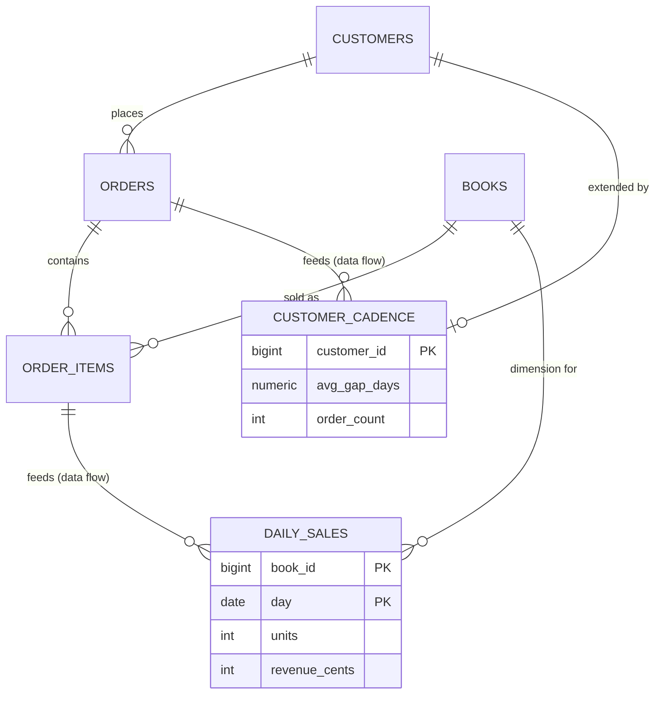

# Fill one table from another

## What you'll build

A bookshop schema with two rollup tables at the bottom: `daily_sales`, filled by
grouping and summing `order_items` through the `orders` it joins to via foreign
key, and `customer_cadence`, filled by measuring the gap between each
customer's orders in sequence and then averaging it. Neither table is ever
`INSERT`ed into by hand — a dashed **data flow** edge into each one carries the
structured *derivations* that say exactly how, and the app turns those into a
real `INSERT ... SELECT` you can read in the SQL tab.



## Before you start

Read [Connect two tables](02-connect-two-tables.md) first — everything here
leans on foreign keys already being right, and on knowing the difference
between a **Foreign key** connection and the other three kinds. [Create an
enum and use it](04-create-an-enum.md) is the other prerequisite: `orders`
carries an `order_status` enum (`pending`, `paid`, `shipped`, `cancelled`),
and one of the two flows below filters on it.

Select **PostgreSQL** in the dialect selector at the top. It matters twice
over: the sequence derivation below leans on PostgreSQL's own rule that
subtracting one `DATE` from another gives a whole number of days, and the
tagged query in step 7 is a PostgreSQL `ON CONFLICT` upsert that has no
equivalent spelling in the other two dialects.

If you would rather read the finished thing than type it, open
[`diagrams/05-fill-one-table-from-another.dbviz.json`](diagrams/05-fill-one-table-from-another.dbviz.json)
with **File → Open** (`Ctrl+O`), or drop the file on the canvas.

## The mental model

A foreign key says a row *points at* another row. A data flow says something
different and, until now, harder to write down: rows in the target *come
from* rows in the source, computed. The edge itself only draws the arrow —
"`order_items` feeds `daily_sales`" — the same way `feeds` reads on any flow.
What actually fills each column lives one level down, in the connection's
**Derived columns**: one entry per target column, each an *expression* on the
source, an optional *aggregate*, a *Group by*, a *Filter (WHERE)*, and an
optional *Sequence (window)*. Put together, one derivation is a single
column of a `SELECT` list; the whole set is the `INSERT ... SELECT` you would
otherwise write and maintain by hand.

The part that makes this worth using rather than a comment reading "rolled up
nightly" is that an expression, a group-by key, or a filter can name a column
of *another* table as `table.column` — not the source table itself, a table
the source *reaches through a foreign key already on the diagram*. Write
`orders.status` inside a derivation on a flow that starts at `order_items`,
and the app walks `order_items.order_id → orders.id`, the exact foreign key
you drew, to find it. It does not ask you to restate the join: it resolves
it from the diagram, and writes the `JOIN` into the generated skeleton
itself. This is why foreign keys have to be right *before* you build a flow
on top of them — a derivation cannot join through a foreign key that is
missing, backwards, or pointed at the wrong column, and the diagram is the
only place that join lives.

A sequence derivation is a second, orthogonal idea: put the source rows in
order, and compute each one from its neighbours before anything else
happens. Anchor it to code you already know: `DIFF` is `x[i] - x[i-1]`,
`RUNNING_SUM` is a running total (a prefix sum), `ROW_NUMBER` is `enumerate()`
starting at 1, and a *Partition by* key is a `groupby()` that restarts the
sequence for every distinct value — one series per customer, per sensor, per
whatever you partition on. Critically, the window runs **first**, over the
ordered rows, and only *then* does grouping and aggregation happen on the
result — so `AVG` of a `DIFF` is the mean of the gaps, not a single gap
divided by a count.

## Steps

### 1. Bring in the source tables

Open the bottom drawer's **Import SQL** tab and paste this — it is exactly
what [Connect two tables](02-connect-two-tables.md) and [Create an
enum](04-create-an-enum.md) would leave you with:

```sql
CREATE TYPE order_status AS ENUM ('pending', 'paid', 'shipped', 'cancelled');

CREATE TABLE customers (
  id BIGSERIAL PRIMARY KEY,
  email TEXT NOT NULL UNIQUE,
  created_at TIMESTAMPTZ NOT NULL DEFAULT now()
);

CREATE TABLE books (
  id BIGSERIAL PRIMARY KEY,
  title TEXT NOT NULL,
  isbn CHAR(13) NOT NULL UNIQUE,
  price_cents INTEGER NOT NULL DEFAULT 0 CHECK (price_cents >= 0)
);

CREATE TABLE orders (
  id BIGSERIAL PRIMARY KEY,
  customer_id BIGINT NOT NULL REFERENCES customers (id) ON DELETE CASCADE,
  status order_status NOT NULL DEFAULT 'pending',
  total_cents INTEGER NOT NULL DEFAULT 0 CHECK (total_cents >= 0),
  placed_at TIMESTAMPTZ NOT NULL DEFAULT now()
);
CREATE INDEX orders_customer_id_idx ON orders (customer_id);

CREATE TABLE order_items (
  id BIGSERIAL PRIMARY KEY,
  order_id BIGINT NOT NULL REFERENCES orders (id) ON DELETE CASCADE,
  book_id BIGINT NOT NULL REFERENCES books (id) ON DELETE RESTRICT,
  quantity INTEGER NOT NULL DEFAULT 1 CHECK (quantity > 0),
  unit_price_cents INTEGER NOT NULL CHECK (unit_price_cents >= 0)
);
CREATE INDEX order_items_order_id_idx ON order_items (order_id);
CREATE INDEX order_items_book_id_idx ON order_items (book_id);
```

Click **Add to the current diagram**.

**You should see:** four tables — `customers`, `books`, `orders`,
`order_items` — laid out on the canvas, an `order_status` badge in the
**Types** tab, and **Problems** empty.

### 2. Add daily_sales

Press `T`, rename the new table `daily_sales`, and colour it *orange* — the
convention for a derived table across these walkthroughs. Give it four
columns:

| Name | Type | Flags | Default |
| --- | --- | --- | --- |
| `book_id` | `BIGINT` | **PK** **NN** | |
| `day` | `DATE` | **PK** **NN** | |
| `units` | `INTEGER` | **NN** | `0` |
| `revenue_cents` | `INTEGER` | **NN** | `0` |

Two columns flagged **PK** makes a composite primary key, exactly like
`PRIMARY KEY (a, b)` written by hand.

**You should see:** a key glyph on both `book_id` and `day`, and
`PRIMARY KEY (book_id, day)` as a standalone line in the generated
`CREATE TABLE public.daily_sales` once you open the SQL tab.

### 3. Add customer_cadence

Press `T` again, rename it `customer_cadence`, colour it orange, and add:

| Name | Type | Flags | Default |
| --- | --- | --- | --- |
| `customer_id` | `BIGINT` | **PK** **NN** | |
| `avg_gap_days` | `NUMERIC(10,2)` | — | |
| `order_count` | `INTEGER` | **NN** | `0` |

Leave `avg_gap_days` nullable: a customer with only one real order has no gap
to average yet, and `AVG` of zero numbers is `NULL`, not `0`.

**You should see:** a single-column primary key on `customer_id`, and
`avg_gap_days NUMERIC(10,2)` with no `NOT NULL` in the SQL tab.

### 4. Connect the dimension keys

Drag from `daily_sales.book_id`'s left-side handle onto `books.id`, and from
`customer_cadence.customer_id`'s handle onto `customers.id`. Both land as
**Foreign key** connections automatically, because you dragged column to
column rather than from a header. Open the second one in the inspector and
set **Reads as** to *extends* — `customer_cadence` shares its primary key
with the row of `customers` it summarises, which is exactly what *extends*
means.

**You should see:** two solid, crow's-foot connections, and **Problems**
still empty — `book_id` already leads `daily_sales`'s composite primary key
and `customer_id` *is* `customer_cadence`'s whole primary key, so both
foreign keys already have the index PostgreSQL needs without you adding one.

### 5. Draw the first data flow

Hover `order_items` and drag the small orange handle at the right edge of its
header — the same one the empty **Simulate** tab calls out as "drag from the
orange handle in a table header onto another table to draw a data flow" —
onto `daily_sales`.

**You should see:** a dashed arrow from `order_items` to `daily_sales`, and
the inspector open on the new connection with **Kind** already *Data flow*
and **Reads as** *feeds*.

### 6. Derive day, units and revenue_cents

In the **Derived columns (0)** section, click **Add** three times and fill
each entry. All three share the same *Group by* and *Filter (WHERE)* — after
the first, **Add** copies both forward from the entry above it, so you are
only changing the target column, the aggregate and the expression each time.

**Entry 1 — `day`:** target column `day`, no aggregate. *Expression on
order_items*: type `CAST(orders.placed_at AS DATE)` — or click **Columns you
can use**, find `orders` under "through `order_items.order_id`", and click
its `placed_at` chip, then wrap it in `CAST( ... AS DATE)` yourself; chips
insert bare column references, not SQL you write around them. Under *Group
by*, click **+ Add key** twice: set the first to `book_id` from the dropdown,
and set the second to *— expression —* and type the same
`CAST(orders.placed_at AS DATE)`. Under *Filter (WHERE)*, type
`orders.status = 'paid'`.

**Entry 2 — `units`:** target column `units`, aggregate `SUM`. *Expression on
order_items*: `quantity`. Group by and filter already match entry 1.

**Entry 3 — `revenue_cents`:** target column `revenue_cents`, aggregate
`SUM`. *Expression on order_items*: `quantity * unit_price_cents`.

**You should see:** **Derived columns (3)**, and — this is the payoff —
*Generated from these derivations* showing one `INSERT ... SELECT` with a
`JOIN public.orders ON orders.id = order_items.order_id` the app wrote for
you, a `WHERE orders.status = 'paid'`, and only two columns in the `GROUP BY`
even though you typed three group-by keys: `book_id` never got its own
derivation because its group-by text is literally the name of a column of
`daily_sales`, so the generator carries it into the `INSERT` list on its own.

### 7. Add the upsert as a tagged query

The structured form describes a `SELECT`, not what happens when a day's
numbers are recomputed the next night and the rows already exist — that is
`ON CONFLICT`, which derivations cannot express. Scroll to **Tagged query**
and paste:

```sql
INSERT INTO daily_sales (book_id, day, units, revenue_cents)
SELECT oi.book_id, CAST(o.placed_at AS DATE), SUM(oi.quantity), SUM(oi.quantity * oi.unit_price_cents)
FROM order_items oi
JOIN orders o ON o.id = oi.order_id
WHERE o.status = 'paid'
GROUP BY oi.book_id, CAST(o.placed_at AS DATE)
ON CONFLICT (book_id, day) DO UPDATE
  SET units = daily_sales.units + EXCLUDED.units,
      revenue_cents = daily_sales.revenue_cents + EXCLUDED.revenue_cents;
```

**You should see:** a query badge on the edge, and the SQL tab's appendix for
this flow grow a second block, **Tagged query**, printed right after **Built
from the derivation metadata** — both live side by side; neither replaces the
other.

### 8. Simulate daily_sales

Click **Simulate** beside **Derived columns (3)** (or select `daily_sales`
and press `S`).

**You should see:** one stage, `order_items → daily_sales`, "group and
aggregate WHERE orders.status = 'paid'" under it, no warnings, and rows
landing in `daily_sales` on the right — at the defaults (*Rows per input*
10, *Seed* 1) that is 7 rows. Double-click a cell in `order_items` on the
left to edit it and watch the right side recompute.

### 9. Derive avg_gap_days and order_count

Drag from `orders`'s header handle onto `customer_cadence` to start the
second flow. Add two derivations.

**Entry 1 — `avg_gap_days`:** target column `avg_gap_days`, aggregate `AVG`.
*Expression on orders*: `CAST(placed_at AS DATE)`. Set **Sequence (window)**
to *Change since the previous row* (`DIFF`). Under its *Order by*, add
`placed_at`; under *Partition by*, add `customer_id`. Under *Group by* (the
derivation's own, below the window), add `customer_id`. *Filter (WHERE)*:
`status <> 'cancelled'`.

**Entry 2 — `order_count`:** target column `order_count`, aggregate `COUNT`.
*Expression on orders*: `*`. Group by `customer_id`, same filter as entry 1.

**You should see:** *Generated from these derivations* showing `AVG` and
`COUNT` computed in an outer `SELECT ... GROUP BY customer_id` over a `FROM
(SELECT ...) AS w` subquery — the window has to run to completion before
`AVG` can see its results, and SQL cannot nest a window function directly
inside an aggregate, so the generator builds the inner query first.

### 10. Simulate customer_cadence and read the numbers

Select `customer_cadence` and press `S`.

**You should see:** at the defaults, three rows land — one customer with
`order_count` 2 and a real `avg_gap_days` (120, in the sample this book
ships with), and two more with `order_count` 1 and `avg_gap_days` **NULL**,
exactly as the column's comment promises: one order has no previous order to
measure a gap against. Click **Reshuffle** for a different sample, or raise
*Rows per input* until more customers cross two orders.

## Other ways to do it

- **Right-click a table** → *Simulate* does the same as pressing `S` with it
  selected; right-click a connection → *Edit in inspector* jumps straight to
  its derivations, and *Copy tagged query* grabs the free-text query alone.
- **`Ctrl+K`** finds any table by name while you work, without reaching for
  the mouse.
- **Hand-write the `.dbviz.json`.** Every derivation is plain JSON —
  `targetColumnId`, `expression`, `aggregate`, `groupBy`, `filter`, `window`
  — documented in [`../ADVISOR_OUTPUT_FORMAT.md`](../ADVISOR_OUTPUT_FORMAT.md).
  This walkthrough's own companion diagram was built that way; open it and
  read the `derivations` arrays directly.
- **Import SQL** only ever gives you tables, columns, indexes and foreign
  keys — never flows or derivations, because there is no DDL for "and this
  one is computed from that one." Type the two rollup tables' *columns*
  through Import SQL if you like (a second `CREATE TABLE` in the same paste),
  but the flow and its derivations still have to be drawn and filled in on
  the canvas.

## Check your work

Open the bottom drawer → **SQL**, leave it on *Whole schema* — **Selected
table** only shows a table's own `CREATE TABLE`, not the flows that feed it —
and scroll past the five tables to the appendix at the end. This is the
whole generated script for the diagram above:

```sql
-- Fill one table from another — daily sales and customer cadence (PostgreSQL)
-- Generated by Database Visualizer
-- Tables: 6, foreign keys: 5, documented connections: 2

-- Custom types
CREATE TYPE order_status AS ENUM ('pending', 'paid', 'shipped', 'cancelled');

CREATE TABLE public.books (
  id BIGSERIAL PRIMARY KEY,
  title TEXT NOT NULL,
  isbn CHAR(13) NOT NULL UNIQUE,
  price_cents INTEGER NOT NULL DEFAULT 0 CHECK (price_cents >= 0)
);
COMMENT ON TABLE public.books IS 'One row per edition we stock.';

CREATE TABLE public.customers (
  id BIGSERIAL PRIMARY KEY,
  email TEXT NOT NULL UNIQUE,
  created_at TIMESTAMPTZ NOT NULL DEFAULT now()
);
COMMENT ON TABLE public.customers IS 'One row per shopper.';

CREATE TABLE public.customer_cadence (
  customer_id BIGINT PRIMARY KEY,
  avg_gap_days NUMERIC(10,2),
  order_count INTEGER NOT NULL DEFAULT 0,
  CONSTRAINT customer_cadence_customer_id_fkey FOREIGN KEY (customer_id) REFERENCES public.customers (id) ON DELETE CASCADE
);
COMMENT ON TABLE public.customer_cadence IS 'One row per customer. Rebuilt nightly from orders — see the data-flow edge.';
COMMENT ON COLUMN public.customer_cadence.avg_gap_days IS 'NULL for a customer with fewer than two paid orders: there is no gap yet to average.';

CREATE TABLE public.daily_sales (
  book_id BIGINT NOT NULL,
  day DATE NOT NULL,
  units INTEGER NOT NULL DEFAULT 0,
  revenue_cents INTEGER NOT NULL DEFAULT 0,
  PRIMARY KEY (book_id, day),
  CONSTRAINT daily_sales_book_id_fkey FOREIGN KEY (book_id) REFERENCES public.books (id) ON DELETE RESTRICT
);
COMMENT ON TABLE public.daily_sales IS 'One row per book per day it sold at least one copy. Rebuilt nightly from order_items — see the data-flow edge and its Tagged query for the upsert this diagram cannot draw directly.';

CREATE TABLE public.orders (
  id BIGSERIAL PRIMARY KEY,
  customer_id BIGINT NOT NULL,
  status order_status NOT NULL DEFAULT 'pending',
  total_cents INTEGER NOT NULL DEFAULT 0 CHECK (total_cents >= 0),
  placed_at TIMESTAMPTZ NOT NULL DEFAULT now(),
  CONSTRAINT orders_customer_id_fkey FOREIGN KEY (customer_id) REFERENCES public.customers (id) ON DELETE CASCADE
);
CREATE INDEX orders_customer_id_idx ON public.orders (customer_id);
COMMENT ON TABLE public.orders IS 'One row per checkout. status drives the paid-only filter that daily_sales relies on; placed_at is the sequence customer_cadence measures gaps over.';

CREATE TABLE public.order_items (
  id BIGSERIAL PRIMARY KEY,
  order_id BIGINT NOT NULL,
  book_id BIGINT NOT NULL,
  quantity INTEGER NOT NULL DEFAULT 1 CHECK (quantity > 0),
  unit_price_cents INTEGER NOT NULL CHECK (unit_price_cents >= 0),
  CONSTRAINT order_items_order_id_fkey FOREIGN KEY (order_id) REFERENCES public.orders (id) ON DELETE CASCADE,
  CONSTRAINT order_items_book_id_fkey FOREIGN KEY (book_id) REFERENCES public.books (id) ON DELETE RESTRICT
);
CREATE INDEX order_items_order_id_idx ON public.order_items (order_id);
CREATE INDEX order_items_book_id_idx ON public.order_items (book_id);
COMMENT ON TABLE public.order_items IS 'The grain daily_sales rolls up: one row per book per order.';

-- ----------------------------------------------------------------
-- Connections the schema does not enforce, and tagged queries
-- (documentation only, not executed)
-- [flow] order_items feeds daily_sales (nightly rollup)
--   Rebuilt nightly, not on write: a day's sales are not final until the day is over. The upsert below is what makes re-running it safe.
--   Derived columns:
--     day = CAST(orders.placed_at AS DATE) GROUP BY book_id, CAST(orders.placed_at AS DATE) WHERE orders.status = 'paid'
--     units = SUM(quantity) GROUP BY book_id, CAST(orders.placed_at AS DATE) WHERE orders.status = 'paid'
--     revenue_cents = SUM(quantity * unit_price_cents) GROUP BY book_id, CAST(orders.placed_at AS DATE) WHERE orders.status = 'paid'
--   Built from the derivation metadata:
--   INSERT INTO public.daily_sales (book_id, day, units, revenue_cents)
--   SELECT order_items.book_id, CAST(orders.placed_at AS DATE), SUM(order_items.quantity), SUM(order_items.quantity * order_items.unit_price_cents)
--   FROM public.order_items
--   JOIN public.orders ON orders.id = order_items.order_id
--   WHERE orders.status = 'paid'
--   GROUP BY order_items.book_id, CAST(orders.placed_at AS DATE);
--   Tagged query:
--   INSERT INTO daily_sales (book_id, day, units, revenue_cents)
--   SELECT oi.book_id, CAST(o.placed_at AS DATE), SUM(oi.quantity), SUM(oi.quantity * oi.unit_price_cents)
--   FROM order_items oi
--   JOIN orders o ON o.id = oi.order_id
--   WHERE o.status = 'paid'
--   GROUP BY oi.book_id, CAST(o.placed_at AS DATE)
--   ON CONFLICT (book_id, day) DO UPDATE
--     SET units = daily_sales.units + EXCLUDED.units,
--         revenue_cents = daily_sales.revenue_cents + EXCLUDED.revenue_cents;
-- [flow] orders feeds customer_cadence (nightly rollup)
--   Full rebuild, not incremental: one new order can change the average gap for every order this customer ever placed, so there is nothing sane to upsert.
--   Derived columns:
--     avg_gap_days = AVG(DIFF(CAST(placed_at AS DATE)) OVER (PARTITION BY customer_id ORDER BY placed_at)) GROUP BY customer_id WHERE status <> 'cancelled'
--     order_count = COUNT(*) GROUP BY customer_id WHERE status <> 'cancelled'
--   Built from the derivation metadata:
--   INSERT INTO public.customer_cadence (customer_id, avg_gap_days, order_count)
--   SELECT customer_id, AVG(avg_gap_days), COUNT(order_count)
--   FROM (
--     SELECT customer_id AS customer_id, CAST(placed_at AS DATE) - LAG(CAST(placed_at AS DATE)) OVER (PARTITION BY customer_id ORDER BY placed_at) AS avg_gap_days, 1 AS order_count
--     FROM public.orders
--     WHERE status <> 'cancelled'
--   ) AS w
--   GROUP BY customer_id;
```

## Try it yourself

- Delete the `orders.status = 'paid'` filter on the `day` derivation only,
  leaving it on `units` and `revenue_cents`. Look at *Generated from these
  derivations*: three derivations that no longer share one `(GROUP BY,
  WHERE)` signature split into two separate `INSERT` statements instead of
  one. Put the filter back and watch them merge again.
- Switch `avg_gap_days`'s window from `DIFF` to *Previous row's value*
  (`LAG`), keep `AVG` on top, and simulate again. You are now averaging
  *order dates*, which is meaningless — a reminder that the aggregate has to
  match what the window actually produces.
- Rename the `book_id` group-by key on the `day` derivation to `book_id `
  (a trailing space). Watch it stop being carried automatically — the match
  against `daily_sales.book_id` is exact text, not "looks like a column
  name" — and `daily_sales.book_id` starts showing up unset in **Simulate**.
- Add a third derivation with no target column picked yet. Open **Problems**
  and find the new `derivation-incomplete` warning, then check the SQL tab:
  the incomplete entry is left out of the generated statement entirely.

## Gotchas

- **The expression language is a SQL subset, not a database.** Arithmetic,
  comparisons, `AND`/`OR`/`NOT` with three-valued `NULL` logic, `IN`,
  `BETWEEN`, `LIKE`, `IS NULL`, `CASE`, `CAST` (both spellings), `EXTRACT`
  and the common scalar functions all parse; a correlated subquery or a
  vendor-only function does not, and **Simulate** reports it as a warning on
  the stage rather than silently accepting it.
- **`table.column` only resolves through foreign keys that exist on this
  diagram.** Delete the `order_items.order_id → orders.id` foreign key and
  every `orders.status` and `orders.placed_at` reference in this walkthrough
  breaks — the generator drops the `JOIN` with a warning, and Simulate warns
  the same way. Get the foreign keys right first; the lookup depends on them.
- **A derivation with no target column or no expression is a lint warning
  and is skipped**, quietly, by both the generated skeleton and the tagged
  query's neighbour block — it does not block the other, complete
  derivations on the same flow.
- **`ROW_NUMBER` and `RANK` ignore the expression entirely.** They only look
  at the ordering, so whatever you leave in *Expression on {source}* for one
  of those two is inert.
- **A window needs an `Order by` key or it is incomplete**, the same as a
  missing target column — "previous row" means nothing without an order, so
  `isDerivationComplete` refuses it and the generator leaves it out.
- **`DIFF`'s unit comes from the type you feed it, not the column name you
  are filling.** `DIFF` over a `TIMESTAMPTZ` gives seconds; over a `DATE`, or
  a value cast to one, it gives whole days. Nothing stops you from naming a
  seconds-producing derivation `avg_gap_days` — casting to `DATE` first, as
  this walkthrough does, is what makes the name true.

## Where to go next

- [Simulate a data flow](06-simulate-a-data-flow.md) — the **Simulate** tab
  used in steps 8 and 10 gets its own walkthrough: stage-by-stage playback,
  row lineage, and editing a raw input cell to see a value ripple through.
- [Fix what Problems finds](10-fix-what-problems-finds.md) — for the lint
  findings this diagram deliberately avoids, like the missing index step 4's
  key placement sidesteps.
- [Trace a path between tables](11-trace-a-path-between-tables.md) — the same
  foreign-key walk that resolves a `table.column` reference inside a
  derivation is what **Trace** does explicitly, hop by hop, on demand.
