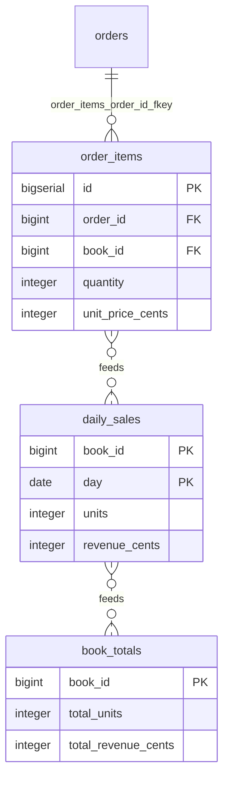

# Simulate a data flow

## What you'll build

One new table, `book_totals`, fed from `daily_sales` — which is itself fed
from `order_items`. That makes the flow two stages deep, and two stages is
what this walkthrough is really about: everything after step 1 happens in the
**Simulate** drawer tab, running those flows over sample rows the app invents
for you, so you can watch a value travel from a raw input row all the way to a
twice-aggregated one.



## Before you start

You need what [Fill one table from another](05-fill-one-table-from-another.md)
leaves behind: eleven tables, with `order_items` feeding `daily_sales` and
`orders` feeding `customer_cadence`, both with real derivations on them. Press
**Set up the canvas** at the top of this walkthrough in the drawer's
**Walkthrough** tab if it is not already in front of you.

Have **PostgreSQL** selected in the dialect selector. Nothing about Simulate
itself is dialect-specific — the expression language it evaluates is the app's
own, not the database's — but the generated `INSERT … SELECT` skeleton in the
**SQL** tab is written in whatever dialect is selected, and the
`CAST(… AS DATE)` in the flow you built last time is spelled the PostgreSQL
way.

The numbers quoted below are what you get at the panel's defaults: *Rows per
input* `10`, *Seed* `1`. The sample data is seeded, not random, so leaving both
alone means your screen matches this page exactly. Change either and every
number below changes with it — which is the point of **Reshuffle**, but do it
after you have followed along once.

## The mental model

A flow's derived columns are already a description of an `INSERT … SELECT`
you have not run — walkthrough 05's whole point. **Simulate** is running that
statement exactly once, against fixture rows the app invents on the spot,
so you can watch it work before it ever touches a real table. That is also
why it is worth doing even for a flow you are confident about: the same
reason you would not trust a migration you had not dry-run, a derivation with
a typo in a column name or an unreachable table reference fails the same way
here as it would in production, except here it shows up as a warning on the
stage instead of a broken nightly job.

The other half of the model is *what* it runs. **Simulate** only ever walks
`flow` connections — never foreign keys, dependencies or serialized copies —
and only the ones upstream of the table you picked. Pick `book_totals` here
and the engine first finds `daily_sales → book_totals`, then keeps walking
backwards and finds `order_items → daily_sales` behind it, so simulating into
`book_totals` quietly reruns `daily_sales` too. Nothing you do in the
Simulate panel touches the diagram or a real database: it is scratch data,
computed once, thrown away the moment you close it or edit the flow.

## Steps

### 1. Add book_totals and feed it from daily_sales

<!-- step
target: ui:add-table
goals:
  - table | book_totals
  - column | book_totals.book_id : BIGINT
  - flags | book_totals.book_id : pk
  - no column | book_totals.id
  - column | book_totals.total_units : INTEGER
  - column | book_totals.total_revenue_cents : INTEGER
  - fk | book_totals.book_id -> books.id
  - flow | daily_sales -> book_totals
  - label | daily_sales -> book_totals : lifetime rollup
  - derivation | book_totals.total_units : SUM(units) group by book_id
  - derivation | book_totals.total_revenue_cents : SUM(revenue_cents) group by book_id
-->

Press `T`, name the new table `book_totals`, colour it *orange*, and give it
`book_id BIGINT` (**PK**), `total_units INTEGER NOT NULL DEFAULT 0` and
`total_revenue_cents INTEGER NOT NULL DEFAULT 0`. Connect `book_id` to
`books.id` with a column-to-column drag, the way you connected `daily_sales`
last time.

Now drag the orange header handle from **`daily_sales`** — not `order_items` —
onto `book_totals`, name the flow `lifetime rollup`, and give it two
derivations:

| Target column | Aggregate | Expression on daily_sales | Group by |
| --- | --- | --- | --- |
| `total_units` | `SUM` | `units` | `book_id` |
| `total_revenue_cents` | `SUM` | `revenue_cents` | `book_id` |

Reading from `daily_sales` rather than from `order_items` again is the whole
design of this step. It makes the flow a *chain*: `order_items → daily_sales →
book_totals`. You could have summed `order_items` directly and got the same
totals, but then the two rollups would drift apart the day one of them changed
its filter — and there would be nothing two stages deep to step through.

**You should see:** a second dashed arrow, from `daily_sales` down to
`book_totals`, and *Generated from these derivations* reading `INSERT INTO
public.book_totals … SELECT book_id, SUM(units), SUM(revenue_cents) FROM
public.daily_sales GROUP BY book_id` — no join this time, because everything
it needs is in one table.

### 2. Select daily_sales and press S

<!-- step
target: table:daily_sales
goals:
  - simulating | daily_sales
-->

Click the `daily_sales` table on the canvas to select it, then press `S`.

**You should see:** the bottom drawer switches to **Simulate**, headed
**Simulate data flow**; the `order_items → daily_sales` connection pulses on
the canvas as a dot travels it. Playback runs on its own and settles on a
single stage in the list: "order_items → daily_sales (nightly rollup)",
subtitled "group and aggregate WHERE orders.status = 'paid' · reads orders",
with the count **10 → 8**.

Only one stage, even though three flows exist on this canvas. `orders →
customer_cadence` is not upstream of `daily_sales`, and neither is the flow
you just drew — Simulate runs what feeds the table you asked about, not
everything on the diagram.

### 3. Read where a produced row came from

<!-- step
target: panel:simulate
-->

In the lower grid (`daily_sales`), click the first row — book `3`, day
`2024-08-06`.

**You should see:** the `order_items` grid above highlights the row that fed
it and dims the rest. Below both grids the explanation reads:

```
Group: book_id = 3, CAST(orders.placed_at AS DATE) = 2024-08-06 (1 of 10 order_items rows, WHERE orders.status = 'paid')
book_id = book_id (group key) = 3
day = CAST(orders.placed_at AS DATE) on the group's first row #1 = 2024-08-06
units = SUM(quantity) over 1 row [#1: 578] = 578
revenue_cents = SUM(quantity * unit_price_cents) over 1 row [#1: 364718] = 364718
```

Read the first line again: *1 of 10*. Two of the ten sample order lines never
made it into any group at all, because the orders they belong to are not
`paid` — the filter you wrote in walkthrough 05, doing its job on data you can
see.

### 4. Switch the target to book_totals

<!-- step
target: panel:simulate
goals:
  - simulating | book_totals
-->

Change the **Into** dropdown at the top of the panel from `daily_sales` to
`book_totals`.

**You should see:** the stage list now holds two rows — stage 1 unchanged,
plus "daily_sales → book_totals (lifetime rollup)", subtitled "group and
aggregate", count **8 → 6**. Switching by dropdown starts paused at "stage 0
/ 2"; nothing has arrived in either grid until you press **Play** or click a
stage directly.

### 5. Step to stage 2 and read its lineage

<!-- step
target: panel:simulate
-->

Click the "daily_sales → book_totals" row in the stage list, then click the
first row of the lower grid — book `3`.

**You should see:** the upper grid becomes `daily_sales`, now labelled
*derived · 8 rows* rather than *raw input* — at this stage it is not sample
data any more, it is the output of the stage before. The lower grid is
`book_totals` with 6 rows, and the explanation for the row you clicked reads:

```
Group: book_id = 3 (2 of 8 daily_sales rows)
book_id = book_id (group key) = 3
total_units = SUM(units) over 2 rows [#1: 578, #7: 134] = 712
total_revenue_cents = SUM(revenue_cents) over 2 rows [#1: 364718, #7: 100768] = 465486
```

Book 3 sold on two different days, so it has two `daily_sales` rows and one
`book_totals` row. That is the shape of every rollup you will ever write, and
here you can see both ends of it at once.

### 6. Try a what-if edit

<!-- step
target: panel:simulate
-->

Click stage 1 in the list to go back to it, then double-click `order_items`
row 1's `quantity` cell — it reads `578` — type `100`, and press `Enter`.

**You should see:** the cell marked as edited, and `daily_sales` row 1
recompute on the spot: `units` drops from `578` to `100`, and
`revenue_cents` from `364718` to `63100` (100 × 631). Switch **Into** back to
`book_totals` and book 3's totals have followed: `712` units becomes `234`,
and `465486` cents becomes `163868`. One cell, two stages, no `UPDATE`
anywhere — and nothing at all written to the diagram, which still says exactly
what it said before you typed.

## Other ways to do it

Simulate has more doors into it than any single control:

- **The top bar's Simulate button.** With a table a flow feeds selected, it
  starts the same as `S`; with the mode already on, it stops it (title
  *Leave simulation mode (Esc)*).
- **Right-click a table** → *Simulate data flowing in* (or *Stop simulating*
  while it is already the target). If nothing feeds that table the item is
  disabled and its hint reads *nothing feeds it* instead of a shortcut.
- **Right-click the dashed flow connection itself** → *Simulate rows flowing
  into {target}*. If the flow has no derived columns yet the hint reads *add
  derived columns first* rather than letting you start into an empty flow.
- **`Ctrl+K`** — the command palette lists *Simulate data flowing into
  {table}* for every table a flow feeds (the one you have selected sorts
  first, with a hint of `S`), *Stop the simulation* once one is running, and
  *Simulate data flow…*, which just opens the tab.
- **The Simulate tab's own Into dropdown**, whether or not anything is
  selected on the canvas — the route step 4 used above.
- **Press `S` with nothing suitable selected** — no table selected, or a
  table selected that no flow feeds — and the app does not guess: it opens
  the drawer on **Simulate** with the *— pick a table a flow feeds —* menu
  instead of starting on the wrong table or doing nothing.

`S` again, or `Esc`, leaves simulation mode from anywhere, canvas or drawer.

## Check your work

Nothing you did in the **Simulate** panel is supposed to leave a mark, so the
first thing to check is that it did not. Open the bottom drawer → **SQL**. The
only difference from walkthrough 05's script is the table you added in step 1
and the flow that feeds it:

```sql
CREATE TABLE public.book_totals (
  book_id BIGINT PRIMARY KEY,
  total_units INTEGER NOT NULL DEFAULT 0,
  total_revenue_cents INTEGER NOT NULL DEFAULT 0,
  CONSTRAINT book_totals_book_id_fkey FOREIGN KEY (book_id) REFERENCES public.books (id) ON DELETE RESTRICT
);
```

and, in the appendix at the end:

```sql
-- [flow] daily_sales feeds book_totals (lifetime rollup)
--   Derived columns:
--     total_units = SUM(units) GROUP BY book_id
--     total_revenue_cents = SUM(revenue_cents) GROUP BY book_id
--   Built from the derivation metadata:
--   INSERT INTO public.book_totals (book_id, total_units, total_revenue_cents)
--   SELECT book_id, SUM(units), SUM(revenue_cents)
--   FROM public.daily_sales
--   GROUP BY book_id;
```

The `578` you overwrote with `100` in step 6 is nowhere in it. Sample rows,
edits to sample rows and everything computed from them live in the panel and
die with it — the diagram is a description of a job, never a place data is
kept.

Press **Check my work** at the foot of this walkthrough. Three of its checks
are `simulate` checks: they run the flows into `daily_sales`, `book_totals`
and `customer_cadence` and fail if any of them warns or produces no rows. That
is a stronger promise than "the diagram parses" — it is "every rollup on this
canvas can actually be computed".

## Try it yourself

- Increase **Rows per input** from 10 to 50 and watch stage 1's counts.
  Both the matched and the produced counts grow — but so does the number of
  sample `books`, so groups of one stay common. Rollups collide when the
  dimension is small and the fact table is large; the sample data has the
  opposite shape, which is worth knowing before you read too much into it.
- Click **Reshuffle** a few times. The row counts stay in the same rough
  range each time (roughly half of `orders` is seeded `'paid'`), but which
  specific rows matched, and every number in the lineage explanation, changes
  — the seed is what makes a run reproducible, not the shape of the data.
- Select the `order_items → daily_sales` connection and change its filter
  from `orders.status = 'paid'` to `orders.status = 'shipped'`. The
  simulation recomputes on its own, and a completely different set of source
  rows gets dimmed as skipped. `Ctrl+Z` when you have seen it — that edit
  *is* a diagram change, unlike anything in the panel.
- Switch **Into** to `customer_cadence` — the other flow you built last time,
  which has nothing to do with either of these stages. One stage, a different
  source table, and `avg_gap_days` sitting at `NULL` for every customer with
  a single order, exactly as the column's comment promised.

## Gotchas

- **Only tables a flow feeds show up in "Into."** `simulationTargets` is
  every table with at least one `flow` connection pointing at it from a
  *different* table — a table that only has foreign keys pointing at it, or
  a flow that points at itself, never appears in the picker at all.
- **A `table.column` reference needs a real foreign-key path**, walked
  child → parent only, exactly like a `JOIN` you would write by hand. Delete
  or repoint the foreign key behind one and every derivation that named that
  table stops resolving; the stage runs with a warning instead of guessing
  which row you meant.
- **A filter's literal is planted in the sample data, not assumed.** The
  engine reads `orders.status = 'paid'` and seeds roughly half of `orders`
  with `'paid'` so the filter has something to match — this is why
  `status = 'paid'` reliably produces rows instead of a mysteriously empty
  stage, and also why you should not read too much into the exact row
  counts: they depend on the seed, not on anything real.
- **What you see is 10 rows per raw input, not your data.** A rollup that
  looks pointless on sample rows (every group holding exactly one row) can be
  the most valuable table in the schema on real ones. Simulate is there to
  show you *how* a column is computed, not how much it will compress.
- **Only the current stage's source grid is editable**, and only when its
  role is *raw input*. `orders` here is reached solely through the foreign
  key inside a derivation, so it is never drawn as its own grid and its
  cells cannot be what-if-edited from this panel at all — even though its
  values feed both `orders.status` and `orders.placed_at` on every row.
  `daily_sales` is not editable either when it appears as stage 2's source,
  because it is a derived table: edit `order_items` further upstream and let
  the change flow through instead.
- **Simulate is a model of the derivations, not the database.** Expressions
  run through this app's own SQL subset (arithmetic, comparisons,
  `AND`/`OR`/`NOT` with `NULL` logic, `IN`, `BETWEEN`, `LIKE`, `CASE`,
  `CAST`, `EXTRACT`, the common scalar functions) — a construct your real
  database accepts that this evaluator does not throws and shows up as a
  stage warning, never a silently wrong number.
- **A join that is not a foreign key has nowhere to go in a derivation.** It
  belongs in the flow's free-text *Tagged query*; Simulate never reads that
  text, so a join hidden there is invisible to it entirely, not
  approximated.
- **Simulate lives outside the diagram's undo history.** It is a separate
  store from the diagram on purpose, so nothing you do here — playback,
  overrides, rows, seed — lands in `Ctrl+Z`. Editing the diagram itself
  (say, that filter in Try it yourself) does land in undo, and Simulate
  quietly recomputes to match a moment later.

## Where to go next

- [Add indexes that get used](07-add-indexes.md) — next in the series. Twelve
  tables, eleven foreign keys and not one index between them: **Problems** has
  had something to say about that since walkthrough 02, and this is where you
  answer it.
