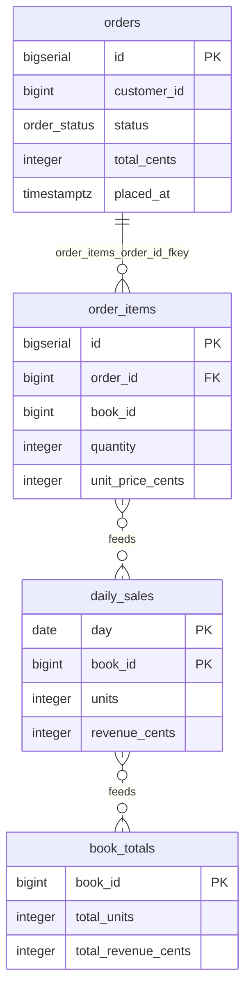

# Simulate a data flow

## What you'll build

Four tables already wired up with two data flows, deliberately two stages
deep: `order_items` feeds `daily_sales` (filtered to paid orders, grouped by
day and book), and `daily_sales` feeds `book_totals` (summed across every
day). You will not draw anything new — every step happens in the **Simulate**
drawer tab and on the canvas it animates, running those two flows over sample
rows the app invents for you.



## Before you start

[Fill one table from another](05-fill-one-table-from-another.md) is where a
data flow and its derived columns get built from scratch; this walkthrough
assumes you already have one — either that diagram, or the companion one
below, which exists purely so there is something worth stepping through stage
by stage. Have **PostgreSQL** selected in the dialect selector; nothing about
Simulate itself is dialect-specific (the expression language it evaluates is
the app's own, not the database's), but the generated `INSERT … SELECT`
skeleton in the **SQL** tab is written in whatever dialect is selected, and
the `CAST(… AS DATE)` in the diagram below is spelled the PostgreSQL way.

If you would rather read the finished thing than rebuild it, open
[`diagrams/06-simulate-a-data-flow.dbviz.json`](diagrams/06-simulate-a-data-flow.dbviz.json)
with **File → Open** (`Ctrl+O`), or drop the file on the canvas.

## The mental model

A flow's derived columns are already a description of an `INSERT … SELECT`
you have not run — walkthrough 05's whole point. **Simulate** is running that
statement exactly once, against fixture rows the app invents on the spot,
so you can watch it work before it ever touches a real table. That is also
why it is worth doing even for a flow you are confident about: the same
reason you would not trust a migration you had not dry-run, a derivation with
a typo in a column name or an unreachable table reference fails the same way
here as it would in production, except here it shows up as a warning on the
stage instead of a broken nightly job.

The other half of the model is *what* it runs. **Simulate** only ever walks
`flow` connections — never foreign keys, dependencies or serialized copies —
and only the ones upstream of the table you picked. Pick `book_totals` here
and the engine first finds `daily_sales → book_totals`, then keeps walking
backwards and finds `order_items → daily_sales` behind it, so simulating into
`book_totals` quietly reruns `daily_sales` too. Nothing you do in the
Simulate panel touches the diagram or a real database: it is scratch data,
computed once, thrown away the moment you close it or edit the flow.

## Steps

### 1. Open the companion diagram

Press `Ctrl+O` and pick `06-simulate-a-data-flow.dbviz.json` (or drop the
file on the canvas).

**You should see:** four tables — `orders` and `order_items` in blue,
`daily_sales` and `book_totals` in orange underneath `order_items` — with a
solid foreign-key line from `order_items` to `orders` and two dashed arrows:
`order_items → daily_sales` and `daily_sales → book_totals`. The **Problems**
tab reports nothing.

### 2. Select daily_sales and press S

Click the `daily_sales` table on the canvas to select it, then press `S`.

**You should see:** the bottom drawer switches to **Simulate**, headed
**Simulate data flow**; the `order_items → daily_sales` connection pulses on
the canvas as a dot travels it. Playback runs on its own and settles on a
single stage in the list: "order_items → daily_sales (daily rollup)",
subtitled "group and aggregate WHERE orders.status = 'paid' · reads orders",
with the count **7 → 6**.

### 3. Read where a produced row came from

In the lower grid (`daily_sales`), click the second row — `2023-10-06`,
book `1`.

**You should see:** the `order_items` grid above highlights rows `4` and `9`
as the ones that fed it, and dims the rest. Below both grids the explanation
reads:

```
daily_sales row 2 ← order_items rows 4, 9
Group: CAST(orders.placed_at AS DATE) = 2023-10-06, book_id = 1 (2 of 10 order_items rows, WHERE orders.status = 'paid')
day = CAST(orders.placed_at AS DATE) on the group's first row #4 = 2023-10-06
book_id = book_id on the group's first row #4 = 1
units = SUM(quantity) over 2 rows [#4: 893, #9: 306] = 1199
revenue_cents = SUM(quantity * unit_price_cents) over 2 rows [#4: 343805, #9: 286722] = 630527
```

### 4. Switch the target to book_totals

Change the **Into** dropdown at the top of the panel from `daily_sales` to
`book_totals`.

**You should see:** the stage list now holds two rows — stage 1 unchanged,
plus "daily_sales → book_totals (book totals rollup)", subtitled "group and
aggregate", count **6 → 4**. Switching by dropdown starts paused at "stage 0
/ 2"; nothing has arrived in either grid until you press **Play** or click a
stage directly.

### 5. Step to stage 2 and read its lineage

Click the "daily_sales → book_totals" row in the stage list, then click the
first row of the lower grid — book `2`.

**You should see:** the upper grid becomes `daily_sales`, now labelled
*derived · 6 rows*; the lower grid is `book_totals` with 4 rows. The
explanation for the row you clicked reads `total_units = SUM(units) over 2
rows [#1: 760, #5: 746] = 1506` and `total_revenue_cents = SUM(revenue_cents)
over 2 rows [#1: 544160, #5: 25364] = 569524` — `daily_sales` row 1 (book 2,
day 2023-02-04) and row 5 (book 2, day 2023-10-06), added together.

### 6. Try a what-if edit

Click stage 1 in the list to go back to it, then double-click `order_items`
row 4's `quantity` cell, type `100`, and press `Enter`.

**You should see:** the cell is marked as edited. `daily_sales` row 2's
`units` drops from `1199` to `406` and `revenue_cents` from `630527` to
`325222` — the row that read row 4 recomputed instantly. Switch **Into**
back to `book_totals` and book 1's total drops the same way, to `1193` units
and `939869` cents: the edit propagated through both stages, not just the
one you were looking at.

## Other ways to do it

Simulate has more doors into it than any single control:

- **The top bar's Simulate button.** With a table a flow feeds selected, it
  starts the same as `S`; with the mode already on, it stops it (title
  *Leave simulation mode (Esc)*).
- **Right-click a table** → *Simulate data flowing in* (or *Stop simulating*
  while it is already the target). If nothing feeds that table the item is
  disabled and its hint reads *nothing feeds it* instead of a shortcut.
- **Right-click the dashed flow connection itself** → *Simulate rows flowing
  into {target}*. If the flow has no derived columns yet the hint reads *add
  derived columns first* rather than letting you start into an empty flow.
- **`Ctrl+K`** — the command palette lists *Simulate data flowing into
  {table}* for every table a flow feeds (the one you have selected sorts
  first, with a hint of `S`), *Stop the simulation* once one is running, and
  *Simulate data flow…*, which just opens the tab.
- **The Simulate tab's own Into dropdown**, whether or not anything is
  selected on the canvas — the route step 4 used above.
- **Press `S` with nothing suitable selected** — no table selected, or a
  table selected that no flow feeds — and the app does not guess: it opens
  the drawer on **Simulate** with the *— pick a table a flow feeds —* menu
  instead of starting on the wrong table or doing nothing.

`S` again, or `Esc`, leaves simulation mode from anywhere, canvas or drawer.

## Check your work

`daily_sales` and `book_totals` are never created or enforced by anything —
flows are documentation, not constraints. Open the bottom drawer → **SQL**;
this is the whole generated script, including the `INSERT … SELECT` skeleton
the two flows' derivations describe, as a comment block after the tables:

```sql
-- Simulate a data flow — order lines to book totals (PostgreSQL)
-- Generated by Database Visualizer
-- Tables: 4, foreign keys: 1, documented connections: 2

-- Custom types
CREATE TYPE order_status AS ENUM ('pending', 'paid', 'shipped', 'cancelled');

CREATE TABLE public.book_totals (
  book_id BIGINT PRIMARY KEY,
  total_units INTEGER NOT NULL DEFAULT 0,
  total_revenue_cents INTEGER NOT NULL DEFAULT 0
);
COMMENT ON TABLE public.book_totals IS 'Stage 2 output. One row per book, built by simulating daily_sales -> book_totals: sum units and revenue across every day daily_sales already produced. The second stage of the chain, so Simulate into book_totals runs both flows.';

CREATE TABLE public.daily_sales (
  day DATE NOT NULL,
  book_id BIGINT NOT NULL,
  units INTEGER NOT NULL DEFAULT 0,
  revenue_cents INTEGER NOT NULL DEFAULT 0,
  PRIMARY KEY (day, book_id)
);
COMMENT ON TABLE public.daily_sales IS 'Stage 1 output. One row per (day, book), built by simulating order_items -> daily_sales: filter to paid orders, group by day and book, sum quantity and revenue.';

CREATE TABLE public.orders (
  id BIGSERIAL PRIMARY KEY,
  customer_id BIGINT NOT NULL,
  status order_status NOT NULL DEFAULT 'pending',
  total_cents INTEGER NOT NULL DEFAULT 0 CHECK (total_cents >= 0),
  placed_at TIMESTAMPTZ NOT NULL DEFAULT now(),
  CHECK (total_cents >= 0)
);
COMMENT ON TABLE public.orders IS 'Raw input. One row per placed order; the flow below reads status and placed_at through order_items'' foreign key.';
COMMENT ON COLUMN public.orders.customer_id IS 'No customers table in this small companion diagram; see walkthrough 02 for a real foreign key.';
COMMENT ON COLUMN public.orders.placed_at IS 'The flow reads this as orders.placed_at and casts it to a DATE for daily_sales.day.';

CREATE TABLE public.order_items (
  id BIGSERIAL PRIMARY KEY,
  order_id BIGINT NOT NULL,
  book_id BIGINT NOT NULL CHECK (book_id BETWEEN 1 AND 5),
  quantity INTEGER NOT NULL CHECK (quantity > 0),
  unit_price_cents INTEGER NOT NULL CHECK (unit_price_cents >= 0),
  CONSTRAINT order_items_order_id_fkey FOREIGN KEY (order_id) REFERENCES public.orders (id) ON DELETE CASCADE
);
CREATE INDEX order_items_order_id_idx ON public.order_items (order_id);
COMMENT ON TABLE public.order_items IS 'Raw input. One row per line item. Feeds daily_sales through the data flow below; every row also reaches orders through order_id.';
COMMENT ON COLUMN public.order_items.book_id IS 'No books table in this small companion diagram; book_id is just the grouping key for the rollup. Bounded to 5 values so sample rows actually collide and the rollup has something to sum.';

-- ----------------------------------------------------------------
-- Connections the schema does not enforce, and tagged queries
-- (documentation only, not executed)
-- [flow] order_items feeds daily_sales (daily rollup)
--   Runs at ingest, one line item at a time, in the same transaction as the order line write.
--   Derived columns:
--     day = CAST(orders.placed_at AS DATE) GROUP BY CAST(orders.placed_at AS DATE), book_id WHERE orders.status = 'paid'
--     book_id = book_id GROUP BY CAST(orders.placed_at AS DATE), book_id WHERE orders.status = 'paid'
--     units = SUM(quantity) GROUP BY CAST(orders.placed_at AS DATE), book_id WHERE orders.status = 'paid'
--     revenue_cents = SUM(quantity * unit_price_cents) GROUP BY CAST(orders.placed_at AS DATE), book_id WHERE orders.status = 'paid'
--   Built from the derivation metadata:
--   INSERT INTO public.daily_sales (day, book_id, units, revenue_cents)
--   SELECT CAST(orders.placed_at AS DATE), order_items.book_id, SUM(order_items.quantity), SUM(order_items.quantity * order_items.unit_price_cents)
--   FROM public.order_items
--   JOIN public.orders ON orders.id = order_items.order_id
--   WHERE orders.status = 'paid'
--   GROUP BY CAST(orders.placed_at AS DATE), order_items.book_id;
-- [flow] daily_sales feeds book_totals (book totals rollup)
--   Runs nightly: re-aggregates every day daily_sales holds for each book. Nothing here reads order_items or orders directly — that is why this is a second stage, not a second derivation on the first flow.
--   Derived columns:
--     book_id = book_id GROUP BY book_id
--     total_units = SUM(units) GROUP BY book_id
--     total_revenue_cents = SUM(revenue_cents) GROUP BY book_id
--   Built from the derivation metadata:
--   INSERT INTO public.book_totals (book_id, total_units, total_revenue_cents)
--   SELECT book_id, SUM(units), SUM(revenue_cents)
--   FROM public.daily_sales
--   GROUP BY book_id;
```

Notice the `JOIN public.orders ON orders.id = order_items.order_id` in the
first skeleton: that is the foreign key from step 1, written in automatically
because the derivation named `orders.status` and `orders.placed_at`. Delete
that foreign key and this join — and the ability to simulate into
`daily_sales` at all — disappears with it.

## Try it yourself

- Increase **Rows per input** from 10 to 50 and press it again. More
  `order_items` rows land in the same five `book_id` values, so stage 1's
  "matched → produced" counts both grow, but the produced count grows more
  slowly than the matched one — more rows are colliding into the same
  `(day, book)` group.
- Click **Reshuffle** a few times. The row counts stay in the same rough
  range each time (roughly half of `order_items` is seeded `'paid'`), but
  which specific rows matched, and the numbers in the lineage explanation,
  change every time — the seed is what makes a run reproducible, not fixed.
- Select the `order_items → daily_sales` connection and change its filter
  from `orders.status = 'paid'` to `orders.status = 'shipped'`. Re-run the
  simulation (it recomputes on its own) and watch a completely different set
  of source rows get dimmed as skipped.
- Simulate into `daily_sales` alone, note the stage 1 numbers, then simulate
  into `book_totals` and check that stage 1 in that run matches exactly —
  proof that "the second stage" really does rerun the first rather than
  reading some cached result.

## Gotchas

- **Only tables a flow feeds show up in "Into."** `simulationTargets` is
  every table with at least one `flow` connection pointing at it from a
  *different* table — a table that only has foreign keys pointing at it, or
  a flow that points at itself, never appears in the picker at all.
- **A `table.column` reference needs a real foreign-key path**, walked
  child → parent only, exactly like a `JOIN` you would write by hand. Delete
  or repoint the foreign key behind one and every derivation that named that
  table stops resolving; the stage runs with a warning instead of guessing
  which row you meant.
- **A filter's literal is planted in the sample data, not assumed.** The
  engine reads `orders.status = 'paid'` and seeds roughly half of `orders`
  with `'paid'` so the filter has something to match — this is why
  `status = 'paid'` reliably produces rows instead of a mysteriously empty
  stage, and also why you should not read too much into the exact row
  counts: they depend on the seed, not on anything real.
- **Only the current stage's source grid is editable**, and only when its
  role is *raw input*. `orders` here is reached solely through the foreign
  key inside a derivation, so it is never drawn as its own grid and its
  cells cannot be what-if-edited from this panel at all — even though its
  values feed both `orders.status` and `orders.placed_at` on every row.
  `daily_sales` is not editable either when it appears as stage 2's source,
  because it is a derived table: edit `order_items` further upstream and let
  the change flow through instead.
- **Simulate is a model of the derivations, not the database.** Expressions
  run through this app's own SQL subset (arithmetic, comparisons,
  `AND`/`OR`/`NOT` with `NULL` logic, `IN`, `BETWEEN`, `LIKE`, `CASE`,
  `CAST`, `EXTRACT`, the common scalar functions) — a construct your real
  database accepts that this evaluator does not throws and shows up as a
  stage warning, never a silently wrong number.
- **A join that is not a foreign key has nowhere to go in a derivation.** It
  belongs in the flow's free-text *Tagged query*; Simulate never reads that
  text, so a join hidden there is invisible to it entirely, not
  approximated.
- **Simulate lives outside the diagram's undo history.** It is a separate
  store from the diagram on purpose, so nothing you do here — playback,
  overrides, rows, seed — lands in `Ctrl+Z`. Editing the diagram itself
  (say, that filter in Try it yourself) does land in undo, and Simulate
  quietly recomputes to match a moment later.

## Where to go next

- [Add indexes that get used](07-add-indexes.md) — `order_items.order_id`
  already has one; see why `daily_sales` and `book_totals` might want their
  own once this stops being a simulation and starts being a real nightly job.
