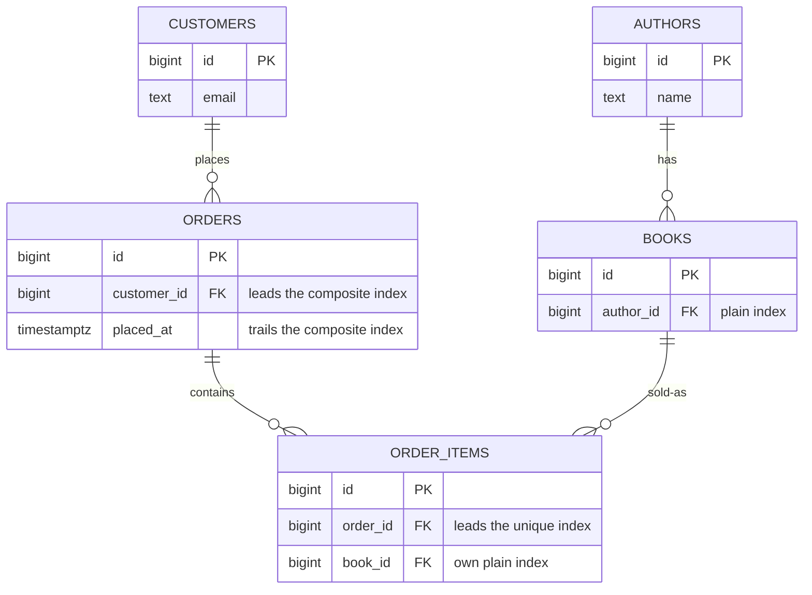

# Add indexes that get used

## What you'll build

The bookshop's order path — `authors`, `books`, `customers`, `orders` and
`order_items` — with every foreign key backed by an index that actually serves
the queries the app runs, and nothing more than that. Four indexes in total: one
plain single-column index, one composite index whose column order is the entire
point, one two-column unique index, and one more plain index that only exists
because the unique one cannot cover it. A sticky note on the canvas records the
two kinds of index this diagram cannot express at all.



## Before you start

Read [Connect two tables](02-connect-two-tables.md) first — this walkthrough
assumes `books.author_id` is already a real foreign key to `authors.id`, and
spends its time on the four other tables and their indexes instead of
retyping that one. Have **PostgreSQL** selected in the dialect selector at
the top: the rule this walkthrough leans on hardest — an unindexed foreign
key gets flagged — applies to PostgreSQL and SQLite, but not MariaDB, which
creates the index for you. That difference is worth seeing directly, and
**Try it yourself** below points at it.

If you would rather read the finished thing than type it, open
[`diagrams/07-add-indexes.dbviz.json`](diagrams/07-add-indexes.dbviz.json) with
**File → Open** (`Ctrl+O`), or drop the file on the canvas.

## The mental model

An index is a second copy of a column (or a few columns), kept sorted and kept
in lock-step with the table by every `INSERT`, `UPDATE` and `DELETE`. Think of
it the way you would a phone book sorted by last name, then first name: you can
binary-search straight to every "Marsil", and straight to "Marsil, Zach" within
that run, because both are prefixes of the sort order. What you cannot do is
binary-search "Zach" — the book isn't sorted by first name, so finding every
Zach means reading every page. A composite index is exactly that phone book:
its column order **is** its sort order, so it serves a lookup on its leading
column alone, and a lookup on a prefix of its columns in order, and nothing
that skips the leading column. `(customer_id, placed_at)` answers "this
customer's orders" and "this customer's orders after this date" from the same
sorted list; it does nothing for "orders placed after this date" across every
customer, because `placed_at` is the second sort key, not the first.

That is also why a primary key and a `UNIQUE` column are never something you
have to index yourself: PostgreSQL builds the sorted structure for you the
moment it enforces the constraint, because enforcing uniqueness and serving a
fast lookup are the same sorted list. A foreign key is the opposite case —
enforcing it only requires the database to check the *referenced* side (which
is already indexed, because it's a primary key or `UNIQUE`), so neither
PostgreSQL nor SQLite bothers indexing the *referencing* side automatically.
That is the gap this walkthrough fills in by hand, one foreign key at a time,
and it is exactly what **Problems** is built to notice.

## Steps

### 1. Bring the rest of the order path onto the canvas

Open the bottom drawer → **Import SQL** and paste this in, then click
*Add to the current diagram* (it should already be selected — there's a
diagram here to add to) and **Import**:

```sql
CREATE TABLE customers (
  id BIGSERIAL PRIMARY KEY,
  email TEXT NOT NULL UNIQUE,
  created_at TIMESTAMPTZ NOT NULL DEFAULT now()
);

CREATE TABLE orders (
  id BIGSERIAL PRIMARY KEY,
  customer_id BIGINT NOT NULL REFERENCES customers (id) ON DELETE RESTRICT,
  status TEXT NOT NULL DEFAULT 'pending' CHECK (status IN ('pending', 'paid', 'shipped', 'cancelled')),
  total_cents INTEGER NOT NULL DEFAULT 0 CHECK (total_cents >= 0),
  placed_at TIMESTAMPTZ NOT NULL DEFAULT now()
);

CREATE TABLE order_items (
  id BIGSERIAL PRIMARY KEY,
  order_id BIGINT NOT NULL REFERENCES orders (id) ON DELETE CASCADE,
  book_id BIGINT NOT NULL REFERENCES books (id) ON DELETE RESTRICT,
  quantity INTEGER NOT NULL DEFAULT 1 CHECK (quantity > 0),
  unit_price_cents INTEGER NOT NULL CHECK (unit_price_cents >= 0)
);
```

**You should see:** three new tables land on the canvas, already connected —
`orders → customers`, `order_items → orders` and `order_items → books` — because
the parser reads the inline `REFERENCES` and matches `books` against the table
you already have. No indexes yet: this DDL doesn't have any.

### 2. Give the plain foreign key a plain index

Select `books`. In the inspector, right-click the `author_id` row and choose
*Create index on this column*. A new row appears under *Indexes (1)* with one
chip lit: `author_id`.

Leave *Name* empty for a moment and look at the drawer's **SQL** tab: it
already shows `CREATE INDEX idx_books_author_id ON public.books (author_id);`
— an empty name isn't an unfinished index, it's the generator naming it for
you (`idx_<table>_<columns>`, or `uq_` instead of `idx_` for a unique one).
Now type `books_author_id_idx` into *Name* anyway, because a name you chose is
one you'll recognize in a slow-query log later.

**You should see:** the SQL tab's line change to
`CREATE INDEX books_author_id_idx ON public.books (author_id);`, right after
`books`'s `CREATE TABLE` and its foreign key.

### 3. Build the composite index — in the wrong order, on purpose

Select `orders`. Under *Indexes (0)*, click **+ Index**. A new index appears
already covering `id` (the button always starts a new index on the table's
first column). Click the `id` chip to remove it, then click `placed_at`, then
`customer_id`. The chips now read `1. placed_at` and `2. customer_id`.

**You should see:** the SQL tab show
`CREATE INDEX idx_orders_placed_at_customer_id ON public.orders (placed_at, customer_id);`
— and **Problems** still listing `orders.customer_id` as an unindexed foreign
key, because this index's leading column is `placed_at`, not `customer_id`.

### 4. Fix the order by re-clicking, not dragging

There's no drag handle on an index's chips — order is click order, so fixing
it means removing a column and re-adding it at the end. Click `placed_at` to
remove it (leaving just `customer_id`), then click `placed_at` again to add it
back — now at the end. The chips read `1. customer_id`, `2. placed_at`. Name
the index `orders_customer_id_placed_at_idx`.

**You should see:** the SQL tab's line become
`CREATE INDEX orders_customer_id_placed_at_idx ON public.orders (customer_id, placed_at);`,
and the `orders.customer_id` finding disappear from **Problems** — the same
two columns, reordered, now serve both "this customer's orders" and "this
customer's orders since a date", and cover the foreign key as a side effect of
`customer_id` leading.

### 5. Make the business rule a unique index, not a UQ toggle

Select `order_items`. Click **+ Index**, remove the default `id` chip, then
click `order_id` and `book_id` in that order. Click this index's own **UQ**
flag (next to its name field, not a column's) to turn it on, and name it
`order_items_order_id_book_id_key`.

A single column's **UQ** toggle can't do this: it marks one column unique on
its own, and "no two rows share this `(order_id, book_id)` pair" is a
statement about two columns together. That's what a unique *index* is for —
the same sorted structure as any other index, just declared to reject
duplicates the moment two rows would collide on it.

**You should see:** the section header read *Indexes (1)*, and the SQL tab
show `CREATE UNIQUE INDEX order_items_order_id_book_id_key ON public.order_items
(order_id, book_id);` right after `order_items`'s two foreign keys.

### 6. Let Problems find the one this doesn't cover

Open the bottom drawer → **Problems**. One warning remains:
*`order_items(book_id) references books but has no index; PostgreSQL does not
add one, so deletes on books and joins scan order_items.`* The unique index
from step 5 leads with `order_id`, so it covers a lookup on `order_id` alone
and on the pair — exactly like step 3's mistake, this is the same
leading-column rule biting a *unique* index instead of a plain one. It does
nothing for "which order_items mention this book", which is its own query
with its own leading column.

Click the fix button next to the finding: **Index order_items(book_id)**.

**You should see:** the warning disappear, and *Indexes (1)* on `order_items`
become *Indexes (2)* — a new, unnamed index on `book_id` alone. Leave its name
blank: the fix never types one, and the generator's fallback
(`idx_order_items_book_id`) is exactly as legible as one you'd have typed.

### 7. Watch Problems catch a duplicate too

Right-click `books`'s `author_id` row again and choose *Create index on this
column* a second time. You now have two indexes on `books(author_id)`. Open
**Problems**: a new warning reads *`Table "books" indexes (author_id) twice.`*
Click its fix, **Remove the duplicate index**.

**You should see:** the count back to four indexes total across the diagram,
and **Problems** empty again. The tab's badge next to its name in the drawer
never lit up red for either of these two warnings — the badge only counts
errors, so an unindexed foreign key or a duplicate index sit there quietly
until you open the tab and look.

## Other ways to do it

- **The `+ Index` button** at the top of *Indexes (N)* always starts a new
  index on the table's first column; you pick the real columns by clicking
  chips afterward, same as every step above.
- **Right-click a column row** → *Create index on this column* is the fastest
  route to a plain single-column index — it's what steps 2 and 7 used.
- **Import SQL** parses `CREATE INDEX` and `CREATE UNIQUE INDEX` directly, so
  pasting DDL that already has your indexes in it (instead of the version in
  step 1, which deliberately had none) gets you to the same place in one move.
- **Hand-write the `.dbviz.json`.** An index is `{ "id", "name", "columnIds",
  "unique" }` on a table's `indexes` array, documented in
  [`../ADVISOR_OUTPUT_FORMAT.md`](../ADVISOR_OUTPUT_FORMAT.md) — `columnIds`
  order is the composite order, exactly as in the UI.
- **`Ctrl+Z`** undoes any of the above one step at a time, including a
  column-order fix from step 4 — if you'd rather undo-and-redo than click
  through the toggle, that works too.

## Check your work

Open the bottom drawer → **SQL**, leave it on *Whole schema*. This is the
entire generated script for the diagram above:

```sql
-- Add indexes that get used — the bookshop order path (PostgreSQL)
-- Generated by Database Visualizer
-- Tables: 5, foreign keys: 4

CREATE TABLE public.authors (
  id BIGSERIAL PRIMARY KEY,
  name TEXT NOT NULL
);
COMMENT ON TABLE public.authors IS 'One row per person who wrote something we sell.';

CREATE TABLE public.books (
  id BIGSERIAL PRIMARY KEY,
  author_id BIGINT NOT NULL,
  title TEXT NOT NULL,
  isbn CHAR(13) NOT NULL UNIQUE,
  price_cents INTEGER NOT NULL DEFAULT 0 CHECK (price_cents >= 0),
  CONSTRAINT books_author_id_fkey FOREIGN KEY (author_id) REFERENCES public.authors (id) ON DELETE RESTRICT
);
CREATE INDEX books_author_id_idx ON public.books (author_id);
COMMENT ON TABLE public.books IS 'author_id is referenced constantly (every catalogue page joins back to its author), so it earns the plainest kind of index there is: one column, leading, done.';

CREATE TABLE public.customers (
  id BIGSERIAL PRIMARY KEY,
  email TEXT NOT NULL UNIQUE,
  created_at TIMESTAMPTZ NOT NULL DEFAULT now()
);
COMMENT ON TABLE public.customers IS 'Unchanged source table; nothing about it needs an extra index.';

CREATE TABLE public.orders (
  id BIGSERIAL PRIMARY KEY,
  customer_id BIGINT NOT NULL,
  status TEXT NOT NULL DEFAULT 'pending' CHECK (status IN ('pending', 'paid', 'shipped', 'cancelled')),
  total_cents INTEGER NOT NULL DEFAULT 0 CHECK (total_cents >= 0),
  placed_at TIMESTAMPTZ NOT NULL DEFAULT now(),
  CONSTRAINT orders_customer_id_fkey FOREIGN KEY (customer_id) REFERENCES public.customers (id) ON DELETE RESTRICT
);
CREATE INDEX orders_customer_id_placed_at_idx ON public.orders (customer_id, placed_at);
COMMENT ON TABLE public.orders IS 'The dashboard''s hot query is ''this customer''s orders, most recent first'', so customer_id leads the index and placed_at rides along — a query that filters on placed_at alone gets nothing from it.';

CREATE TABLE public.order_items (
  id BIGSERIAL PRIMARY KEY,
  order_id BIGINT NOT NULL,
  book_id BIGINT NOT NULL,
  quantity INTEGER NOT NULL DEFAULT 1 CHECK (quantity > 0),
  unit_price_cents INTEGER NOT NULL CHECK (unit_price_cents >= 0),
  CONSTRAINT order_items_order_id_fkey FOREIGN KEY (order_id) REFERENCES public.orders (id) ON DELETE CASCADE,
  CONSTRAINT order_items_book_id_fkey FOREIGN KEY (book_id) REFERENCES public.books (id) ON DELETE RESTRICT
);
CREATE UNIQUE INDEX order_items_order_id_book_id_key ON public.order_items (order_id, book_id);
CREATE INDEX idx_order_items_book_id ON public.order_items (book_id);
COMMENT ON TABLE public.order_items IS 'One book can only appear once per order, so (order_id, book_id) is UNIQUE as well as indexed. That unique index serves lookups by order_id (its leading column) and by the pair, but does nothing for a lookup on book_id alone — book_id gets its own plain index below for that.';
```

Every `CREATE INDEX` sits right after the `CREATE TABLE` (and its inline
foreign key) for the table it belongs to — indexes are never grouped
separately the way foreign keys that close a reference cycle are. Then open
**Problems**: it should be empty.

If you have a database running (see
[Run the schema on a real database](13-run-the-schema-on-a-real-database.md)),
open **Database → Migrate** and diff against it. Indexes show up in that diff
too — matched by their columns, not their name, so renaming an index in the
inspector is not a change Migrate wants to apply.

## Try it yourself

- Switch the dialect selector to **MariaDB**. The `orders.customer_id`
  finding you fixed in step 4 was never there to fix on MariaDB in the first
  place — MariaDB creates an index for every foreign key automatically, so
  the rule only applies to PostgreSQL and SQLite. Watch the SQL tab too: every
  `CREATE INDEX` folds into a `KEY` line inside the `CREATE TABLE` itself.
- On `orders`'s composite index, click the `customer_id` chip to remove it,
  leaving only `placed_at`. Watch **Problems** immediately warn about
  `orders.customer_id` again — the index still exists, it just no longer
  leads with the column the foreign key needs. Put `customer_id` back.
- Turn off the **UQ** flag on `order_items`'s two-column index. The SQL tab's
  `CREATE UNIQUE INDEX` becomes a plain `CREATE INDEX` — same sorted
  structure, but Postgres will now let you insert the same book into the same
  order twice.

## Gotchas

- **An expression index cannot be represented.** `CREATE INDEX ON books
  (lower(title))` has no field on `Index` to hold `lower(title)` — the model
  is `columnIds` only, plain columns. If a real index in your schema needs an
  expression, say so in the table's *Comment* or a sticky note (see the one on
  this diagram), because the diagram itself cannot draw it. Import SQL agrees:
  an expression index in pasted DDL is silently dropped with a warning.
- **A partial index (`WHERE status = 'pending'`) is the same story.** There is
  no `where` field on `Index` either. Note it in prose next to the table, the
  same way.
- **The Problems badge only counts errors.** An unindexed foreign key and a
  duplicate index are both warnings, so the drawer tab never turns red for
  them — open **Problems** on purpose rather than waiting to be told.
- **Composite index chips have no drag handle.** Reordering means removing a
  column and clicking it again, which appends it at the end — there's no way
  to insert a column into the middle of an existing order except rebuilding
  the tail from that point.
- **The `+ Index` button defaults to the table's first column**, not to
  whichever column you last touched. Rebuilding the chips is normal, not a
  sign you did something wrong.
- **A unique index and a `UNIQUE` column constraint compile to the same
  thing** on PostgreSQL — a unique index is exactly what `books.isbn`'s **UQ**
  toggle creates under the hood. The only reason to reach for *Indexes*
  instead of **UQ** is when uniqueness needs more than one column, because
  **UQ** lives on a single column and has nothing to say about a pair.

## Where to go next

- [Build a view](08-build-a-view.md) — the dashboard query this walkthrough's
  indexes were written to serve, as a saved `SELECT`.
- [Fix what Problems finds](10-fix-what-problems-finds.md) — every other
  finding **Problems** reports, beyond the two this walkthrough covered.
- [Run the schema on a real database](13-run-the-schema-on-a-real-database.md)
  — where **Migrate**'s index diff, mentioned above, actually runs against a
  live PostgreSQL container.
