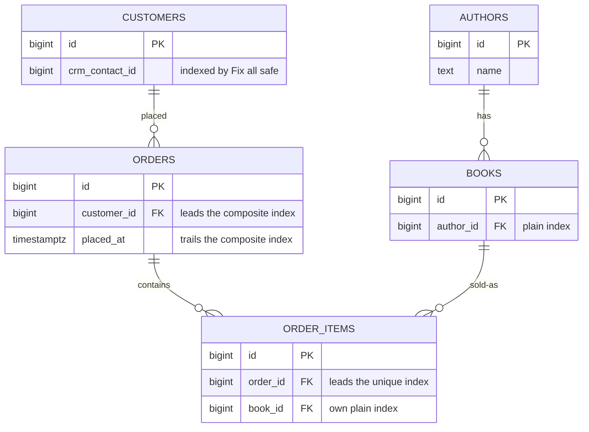

# Add indexes that get used

## What you'll build

Five indexes, and a **Problems** tab that finally has nothing to say. The
schema has had unindexed foreign keys since walkthrough 02, and the tab has
been quietly listing them the whole time; here you answer all five. One is a
plain single-column index, one is a composite whose column order is the entire
point, one is a two-column unique index doing a job a **UQ** toggle cannot do,
one exists only because the unique one cannot cover it, and the last is
applied for you by a one-click fix.

Nothing new is added to the canvas. This is a walkthrough about making the
twelve tables you already have fast to query rather than about having more of
them.



## Before you start

You need what [Simulate a data flow](06-simulate-a-data-flow.md) leaves
behind: twelve tables, nine foreign keys, no indexes at all. Press **Set up
the canvas** at the top of this walkthrough in the drawer's **Walkthrough**
tab if it is not already in front of you.

Have **PostgreSQL** selected in the dialect selector at the top: the rule this
walkthrough leans on hardest — an unindexed foreign key gets flagged — applies
to PostgreSQL and SQLite, but not MariaDB, which creates the index for you.
That difference is worth seeing directly, and **Try it yourself** below points
at it.

If you would rather read the finished thing than type it, open
[`diagrams/07-add-indexes.dbviz.json`](diagrams/07-add-indexes.dbviz.json) with
**File → Open** (`Ctrl+O`), or drop the file on the canvas.

## The mental model

An index is a second copy of a column (or a few columns), kept sorted and kept
in lock-step with the table by every `INSERT`, `UPDATE` and `DELETE`. Think of
it the way you would a phone book sorted by last name, then first name: you can
binary-search straight to every "Marsil", and straight to "Marsil, Zach" within
that run, because both are prefixes of the sort order. What you cannot do is
binary-search "Zach" — the book isn't sorted by first name, so finding every
Zach means reading every page. A composite index is exactly that phone book:
its column order **is** its sort order, so it serves a lookup on its leading
column alone, and a lookup on a prefix of its columns in order, and nothing
that skips the leading column. `(customer_id, placed_at)` answers "this
customer's orders" and "this customer's orders after this date" from the same
sorted list; it does nothing for "orders placed after this date" across every
customer, because `placed_at` is the second sort key, not the first.

That is also why a primary key and a `UNIQUE` column are never something you
have to index yourself: PostgreSQL builds the sorted structure for you the
moment it enforces the constraint, because enforcing uniqueness and serving a
fast lookup are the same sorted list. A foreign key is the opposite case —
enforcing it only requires the database to check the *referenced* side (which
is already indexed, because it's a primary key or `UNIQUE`), so neither
PostgreSQL nor SQLite bothers indexing the *referencing* side automatically.
That is the gap this walkthrough fills in by hand, one foreign key at a time,
and it is exactly what **Problems** is built to notice.

## Steps

### 1. Read the five warnings you have been ignoring

<!-- step
target: tab:problems
goals:
  - open | problems
-->

Open the bottom drawer → **Problems** and read the list. Five warnings, all
the same rule, none of them new:

```
books(author_id) references authors but has no index
customers(crm_contact_id) references crm_contacts but has no index
order_items(book_id) references books but has no index
order_items(order_id) references orders but has no index
orders(customer_id) references customers but has no index
```

Every one of them has been there since you drew the foreign key it names.
They are warnings rather than errors because the schema is *correct* without
them — PostgreSQL will happily create every table and every constraint. What
it will not do is make them fast: PostgreSQL indexes the *referenced* side of a
foreign key (it has to, that side is a key) and leaves the referencing side
bare, so `DELETE FROM authors WHERE id = 7` has to scan the whole of `books` to
find out whether the delete is allowed.

**You should see:** five warnings, no errors, and a **Problems** tab whose
badge is not lit — the badge counts errors only, which is exactly why five
warnings can sit there unread for five walkthroughs.

### 2. Give the plain foreign key a plain index

<!-- step
target: section:Indexes
goals:
  - index | books (author_id)
-->

Select `books`. In the inspector, right-click the `author_id` row and choose
*Create index on this column*. A new row appears under *Indexes (1)* with one
chip lit: `author_id`.

Leave *Name* empty for a moment and look at the drawer's **SQL** tab: it
already shows `CREATE INDEX idx_books_author_id ON public.books (author_id);`
— an empty name isn't an unfinished index, it's the generator naming it for
you (`idx_<table>_<columns>`, or `uq_` instead of `idx_` for a unique one).
Now type `books_author_id_idx` into *Name* anyway, because a name you chose is
one you'll recognize in a slow-query log later.

**You should see:** the SQL tab's line change to
`CREATE INDEX books_author_id_idx ON public.books (author_id);`, right after
`books`'s `CREATE TABLE` and its foreign key.

### 3. Build the composite index — in the wrong order, on purpose

<!-- step
target: section:Indexes
goals:
  - index | orders (placed_at, customer_id)
hint: This one is deliberately the wrong way round — step 4 fixes it, so the tick here goes away again.
transient: true
-->

Select `orders`. Under *Indexes (0)*, click **+ Index**. A new index appears
already covering `id` (the button always starts a new index on the table's
first column). Click the `id` chip to remove it, then click `placed_at`, then
`customer_id`. The chips now read `1. placed_at` and `2. customer_id`.

**You should see:** the SQL tab show
`CREATE INDEX idx_orders_placed_at_customer_id ON public.orders (placed_at, customer_id);`
— and **Problems** still listing `orders.customer_id` as an unindexed foreign
key, because this index's leading column is `placed_at`, not `customer_id`.

### 4. Fix the order by re-clicking, not dragging

<!-- step
target: section:Indexes
goals:
  - index | orders (customer_id, placed_at)
-->

There's no drag handle on an index's chips — order is click order, so fixing
it means removing a column and re-adding it at the end. Click `placed_at` to
remove it (leaving just `customer_id`), then click `placed_at` again to add it
back — now at the end. The chips read `1. customer_id`, `2. placed_at`. Name
the index `orders_customer_id_placed_at_idx`.

**You should see:** the SQL tab's line become
`CREATE INDEX orders_customer_id_placed_at_idx ON public.orders (customer_id, placed_at);`,
and the `orders.customer_id` finding disappear from **Problems** — the same
two columns, reordered, now serve both "this customer's orders" and "this
customer's orders since a date", and cover the foreign key as a side effect of
`customer_id` leading.

### 5. Make the business rule a unique index, not a UQ toggle

<!-- step
target: section:Indexes
goals:
  - unique index | order_items (order_id, book_id)
-->

Select `order_items`. Click **+ Index**, remove the default `id` chip, then
click `order_id` and `book_id` in that order. Click this index's own **UQ**
flag (next to its name field, not a column's) to turn it on, and name it
`order_items_order_id_book_id_key`.

A single column's **UQ** toggle can't do this: it marks one column unique on
its own, and "no two rows share this `(order_id, book_id)` pair" is a
statement about two columns together. That's what a unique *index* is for —
the same sorted structure as any other index, just declared to reject
duplicates the moment two rows would collide on it.

**You should see:** the section header read *Indexes (1)*, and the SQL tab
show `CREATE UNIQUE INDEX order_items_order_id_book_id_key ON public.order_items
(order_id, book_id);` right after `order_items`'s two foreign keys.

### 6. Let Problems find the one this doesn't cover

<!-- step
target: tab:problems
goals:
  - index | order_items (book_id)
-->

Open the bottom drawer → **Problems**. One warning remains:
*`order_items(book_id) references books but has no index; PostgreSQL does not
add one, so deletes on books and joins scan order_items.`* The unique index
from step 5 leads with `order_id`, so it covers a lookup on `order_id` alone
and on the pair — exactly like step 3's mistake, this is the same
leading-column rule biting a *unique* index instead of a plain one. It does
nothing for "which order_items mention this book", which is its own query
with its own leading column.

Click the fix button next to the finding: **Index order_items(book_id)**.

**You should see:** the warning disappear, and *Indexes (1)* on `order_items`
become *Indexes (2)* — a new, unnamed index on `book_id` alone. Leave its name
blank: the fix never types one, and the generator's fallback
(`idx_order_items_book_id`) is exactly as legible as one you'd have typed.

### 7. Watch Problems catch a duplicate too

<!-- step
target: tab:problems
-->

Right-click `books`'s `author_id` row again and choose *Create index on this
column* a second time. You now have two indexes on `books(author_id)`. Open
**Problems**: a new warning reads *`Table "books" indexes (author_id) twice.`*
Click its fix, **Remove the duplicate index**.

**You should see:** the duplicate gone, and one warning left in the list — the
one about `customers(crm_contact_id)`, which nothing in this walkthrough has
touched.

### 8. Clear the last one with Fix all safe

<!-- step
target: panel:problems
goals:
  - index | customers (crm_contact_id)
  - indexes | 5
  - lint clean
-->

Press **Fix all safe (1)** at the top of the **Problems** tab.

*Safe* is a real distinction, not a reassurance: a fix is safe when it only
*adds* something — an index, a key, a widened type — and unsafe when it
renames or removes, because those change what existing queries mean. **Fix all
safe** applies every safe fix in the list at once and leaves the rest for you,
which is why it can be trusted on a schema you have not read carefully. It is
also why it will not be enough in walkthrough 10.

**You should see:** five indexes total across the diagram, and **Problems**
with no errors and no warnings for the first time in the series — only the
note about the foreign key into the CRM, which has been there since
walkthrough 03 and is not a defect.

## Other ways to do it

- **The `+ Index` button** at the top of *Indexes (N)* always starts a new
  index on the table's first column; you pick the real columns by clicking
  chips afterward, same as every step above.
- **Right-click a column row** → *Create index on this column* is the fastest
  route to a plain single-column index — it's what steps 2 and 7 used.
- **Import SQL** parses `CREATE INDEX` and `CREATE UNIQUE INDEX` directly, so
  pasting DDL that already has your indexes in it (instead of the version in
  step 1, which deliberately had none) gets you to the same place in one move.
- **Hand-write the `.dbviz.json`.** An index is `{ "id", "name", "columnIds",
  "unique" }` on a table's `indexes` array, documented in
  [`../ADVISOR_OUTPUT_FORMAT.md`](../ADVISOR_OUTPUT_FORMAT.md) — `columnIds`
  order is the composite order, exactly as in the UI.
- **`Ctrl+Z`** undoes any of the above one step at a time, including a
  column-order fix from step 4 — if you'd rather undo-and-redo than click
  through the toggle, that works too.

## Check your work

Open the bottom drawer → **SQL**, leave it on *Whole schema*, and search it for
`CREATE INDEX`. Five lines, and no others:

```sql
CREATE INDEX books_author_id_idx ON public.books (author_id);
CREATE INDEX idx_customers_crm_contact_id ON public.customers (crm_contact_id);
CREATE INDEX orders_customer_id_placed_at_idx ON public.orders (customer_id, placed_at);
CREATE UNIQUE INDEX order_items_order_id_book_id_key ON public.order_items (order_id, book_id);
CREATE INDEX idx_order_items_book_id ON public.order_items (book_id);
```

Three of those names you typed and two the generator invented, and you can
tell which is which at a glance: `idx_<table>_<columns>` is the fallback. Both
kinds work identically; a name you chose is one you will recognise in a
slow-query log later.

In the script itself, each `CREATE INDEX` sits right after the `CREATE TABLE`
(and its inline foreign key) for the table it belongs to — indexes are never
grouped separately the way foreign keys that close a reference cycle are.

Notice which foreign keys are *not* in that list. `daily_sales.book_id`,
`book_totals.book_id` and `customer_cadence.customer_id` all reference other
tables and none of them got an index, because each one already leads its own
table's primary key — and a primary key is an index. **Problems** knows that,
which is why it never asked.

Then open **Problems**: no errors, no warnings, one note. Press **Check my
work** at the foot of this walkthrough and the `indexes | 5` check says the
same thing from the other direction.

If you have a database running (see
[Run the schema on a real database](13-run-the-schema-on-a-real-database.md)),
open **Database → Migrate** and diff against it. Indexes show up in that diff
too — matched by their columns, not their name, so renaming an index in the
inspector is not a change Migrate wants to apply.

## Try it yourself

- Switch the dialect selector to **MariaDB**. The `orders.customer_id`
  finding you fixed in step 4 was never there to fix on MariaDB in the first
  place — MariaDB creates an index for every foreign key automatically, so
  the rule only applies to PostgreSQL and SQLite. Watch the SQL tab too: every
  `CREATE INDEX` folds into a `KEY` line inside the `CREATE TABLE` itself.
- On `orders`'s composite index, click the `customer_id` chip to remove it,
  leaving only `placed_at`. Watch **Problems** immediately warn about
  `orders.customer_id` again — the index still exists, it just no longer
  leads with the column the foreign key needs. Put `customer_id` back.
- Turn off the **UQ** flag on `order_items`'s two-column index. The SQL tab's
  `CREATE UNIQUE INDEX` becomes a plain `CREATE INDEX` — same sorted
  structure, but Postgres will now let you insert the same book into the same
  order twice.

## Gotchas

- **An expression index cannot be represented.** `CREATE INDEX ON books
  (lower(title))` has no field on `Index` to hold `lower(title)` — the model
  is `columnIds` only, plain columns. If a real index in your schema needs an
  expression, say so in the table's *Comment* or a sticky note (see the one on
  this diagram), because the diagram itself cannot draw it. Import SQL agrees:
  an expression index in pasted DDL is silently dropped with a warning.
- **A partial index (`WHERE status = 'pending'`) is the same story.** There is
  no `where` field on `Index` either. Note it in prose next to the table, the
  same way.
- **The Problems badge only counts errors.** An unindexed foreign key and a
  duplicate index are both warnings, so the drawer tab never turns red for
  them — open **Problems** on purpose rather than waiting to be told.
- **Composite index chips have no drag handle.** Reordering means removing a
  column and clicking it again, which appends it at the end — there's no way
  to insert a column into the middle of an existing order except rebuilding
  the tail from that point.
- **The `+ Index` button defaults to the table's first column**, not to
  whichever column you last touched. Rebuilding the chips is normal, not a
  sign you did something wrong.
- **A unique index and a `UNIQUE` column constraint compile to the same
  thing** on PostgreSQL — a unique index is exactly what `books.isbn`'s **UQ**
  toggle creates under the hood. The only reason to reach for *Indexes*
  instead of **UQ** is when uniqueness needs more than one column, because
  **UQ** lives on a single column and has nothing to say about a pair.

## Where to go next

- [Build a view](08-build-a-view.md) — next in the series. `v_customer_orders`
  joins the three tables you just indexed, and the indexes are the reason it is
  cheap enough to read on every page load.
