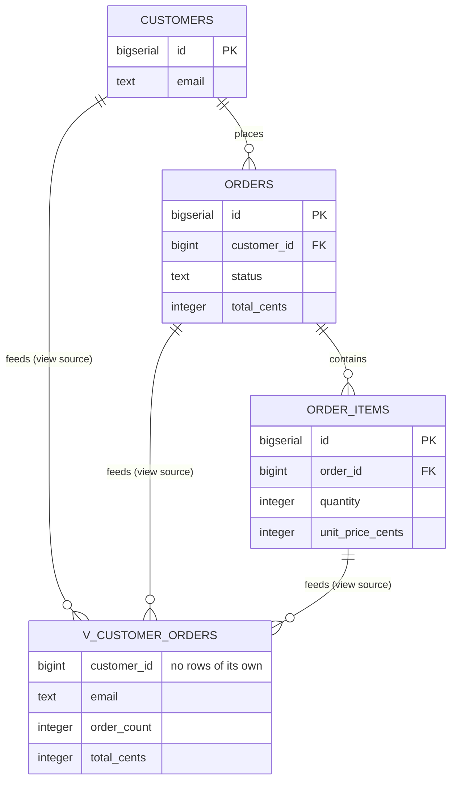

# Build a view

## What you'll build

One new node over three tables you already have: `v_customer_orders`, which
has no columns of its own to insert into. It is a `SELECT` with a name, and the
three dashed arrows feeding it are not data moving on a schedule; they are the
app telling you which tables that `SELECT` reads.

It is worth putting next to `daily_sales` from walkthrough 05 as you build it.
Both summarise orders per customer-ish thing; one stores its answer and one
recomputes it. That choice — pay at write time or pay at read time — is the
whole difference between a rollup and a view, and the diagram draws them
almost the same way on purpose.



## Before you start

You need what [Add indexes that get used](07-add-indexes.md) leaves behind:
twelve tables with `customers`, `orders` and `order_items` connected and
indexed. Press **Set up the canvas** at the top of this walkthrough in the
drawer's **Walkthrough** tab if it is not already in front of you. Keep
**PostgreSQL** selected in the dialect selector at the top.

If you would rather read the finished thing than type it, open
[`diagrams/08-build-a-view.dbviz.json`](diagrams/08-build-a-view.dbviz.json)
with **File → Open** (`Ctrl+O`), or drop the file on the canvas.

## The mental model

A view node is a `CREATE VIEW` statement with a position, the same way a table
node is a `CREATE TABLE` with one. The inspector's *View definition (SELECT …)*
field is not a description of the view — it *is* the view, and the generator's
whole job is to wrap `CREATE VIEW schema.name AS` around whatever you typed
there and print it. Nothing you can do to the four *Source tables* links
changes that text: they are drawn on the canvas as `flow` connections, and
`flow` never reaches the DDL. They exist so the diagram tells the truth about
where the view's data comes from without you having to reread the `SELECT`
every time, and so **Trace** and **Simulate** can find their way through the
tables that surround it.

That is also the whole difference from [Fill one table from another](05-fill-one-table-from-another.md),
which looks deceptively similar on the canvas — another node fed by dashed
arrows from other tables. There, the target is a real `CREATE TABLE`: rows get
written into it by an `INSERT … SELECT` you (or a job, or a trigger) actually
run, which is why that flow edge carries *derivations* the app can turn into a
skeleton and *simulate* row by row. A view has no rows to write and nothing to
schedule — the database recomputes the `SELECT` on every read, which is why a
view's flow edges carry no derivations at all; there is no "insert" for them
to describe. The trade a view makes is the opposite of a rollup table's: always
correct, never stale, and it pays the full join and aggregate cost on every
query. A rollup table pays that cost once, at write time, and something has to
own keeping it caught up. Reach for a view first; reach for the derived table
in 05 only once the view's query shows up in a slow-query log.

There is a third point on that spectrum, and PostgreSQL has it built in: a
**materialized** view, which stores its rows like a table and recomputes them
only when somebody runs `REFRESH MATERIALIZED VIEW`. It is a rollup table where
the database owns the refresh instead of your nightly job — cheap reads, and
data as of the last refresh rather than as of now. The inspector has a
checkbox for it, and step 6 tries it.

## Steps

### 1. Find the three tables the view will read

<!-- step
target: ui:palette
-->

Nothing to build here — `customers`, `orders` and `order_items` have been on
the canvas since walkthrough 05, connected and, since last walkthrough,
indexed. Press `Ctrl+K`, type `order_items`, and press `Enter` to centre the
canvas on it; the other two are its neighbours.

Look at what you have before writing a `SELECT` over it: `orders.customer_id`
reaches `customers`, `order_items.order_id` reaches `orders`, and both of those
foreign keys are indexed. Those two facts are what make the view worth having
rather than a trap — a view is only as cheap as the joins inside it, and the
joins inside this one are the ones you indexed in steps 2 to 5 of the last
walkthrough.

**You should see:** the three tables on screen, with solid crow's-foot lines
running `order_items` → `orders` → `customers`, and **Problems** reporting no
errors and no warnings.

### 2. Turn a new node into a view

<!-- step
target: ui:canvas
-->

Right-click empty canvas below the three tables and choose *Add view here*.
The new node is called `new_view` and starts with no columns at all — a view's
default is empty, not the single `id` column a table gets.

**You should see:** a node named `new_view`, selected, with the inspector open
on *View definition (SELECT …)* and *Source tables (0)* instead of a column
grid.

### 3. Name it and write the SELECT

<!-- step
target: field:View definition
goals:
  - view | v_customer_orders
  - viewsql | v_customer_orders
-->

Rename it to `v_customer_orders` (`F2`, or edit *Name* in the inspector), and
set its *Colour* to `teal` — this series' convention for views. In *View
definition (SELECT …)*, paste:

```
SELECT c.id AS customer_id,
       c.email,
       COUNT(DISTINCT o.id) AS order_count,
       COALESCE(SUM(oi.quantity * oi.unit_price_cents), 0) AS total_cents
FROM customers c
JOIN orders o ON o.customer_id = c.id
JOIN order_items oi ON oi.order_id = o.id
GROUP BY c.id, c.email
```

Paste the `SELECT` **body only** — no `CREATE VIEW v_customer_orders AS`
around it. The generator adds that wrapper itself, the same way it adds `CHECK
(…)` around a bare check expression.

**You should see:** the field's hint line — *Written into the script as
CREATE VIEW after every table* — and *Source tables (0)* still empty, because
nothing has linked the tables yet.

### 4. Detect the sources from the SQL

<!-- step
target: field:Source tables
goals:
  - flow | customers -> v_customer_orders
  - flow | orders -> v_customer_orders
  - flow | order_items -> v_customer_orders
-->

Click **Detect from SQL**, next to *Source tables*.

**You should see:** a toast reading *"Linked 3 source tables to the view."*,
*Source tables (3)* now listing `customers`, `orders` and `order_items` as
chips, and three dashed, filled-arrow connections on the canvas running from
each of those tables into `v_customer_orders`.

### 5. Add display columns (optional)

<!-- step
target: section:Columns
goals:
  - column | v_customer_orders.customer_id : BIGINT
  - column | v_customer_orders.email : TEXT
  - column | v_customer_orders.order_count : INTEGER
  - column | v_customer_orders.total_cents : INTEGER
-->

Expand *Columns (0)* on `v_customer_orders` and add four rows matching the
`SELECT` list: `customer_id` `BIGINT`, `email` `TEXT`, `order_count`
`INTEGER`, `total_cents` `INTEGER`. Leave every flag off — a view's columns
carry no `PK`/`NN`/`UQ`/`AI` meaning because none of them reach the DDL.

**You should see:** *Columns (0)* become *Columns (4) · optional, for
display*, four rows appear inside the node on the canvas, and the **SQL** tab
does not change by one character.

### 6. Tick Materialized, read the statement, and turn it back off

<!-- step
target: field:View definition
goals:
  - materialized | v_customer_orders : off
hint: Tick it, read the statement, then untick it — the tick below is for where you end up.
-->

Still on `v_customer_orders`, tick **Materialized (store the rows, refresh on
demand)** in the inspector.

**You should see:** the field hint above it change from "Written into the
script as CREATE VIEW after every table" to "…as CREATE MATERIALIZED VIEW",
the **SQL** tab's statement become `CREATE MATERIALIZED VIEW
public.v_customer_orders AS`, and the node on the canvas relabel itself
**MAT VIEW**.

The `SELECT` underneath did not change by a character. That is the whole
feature: same query, different question about *when* it runs. A plain view runs
it on every read and is always current; a materialized one runs it on `REFRESH
MATERIALIZED VIEW` and is current as of whenever that last happened.

Now switch the dialect selector at the top to **MariaDB** and look above the
script. A generator warning reads *"MariaDB has no materialized views, so
v_customer_orders was written as a regular view: its rows are recomputed on
every query instead of stored until refreshed."* — and the statement is an
ordinary view again, spelled MariaDB's way: `CREATE OR REPLACE VIEW
public.v_customer_orders AS`. The checkbox stays ticked, so switching back to
**PostgreSQL** restores the materialized statement rather than making you
remember it.

That fallback is a choice worth noticing. The app could have cleared the flag
on the dialect switch, or emitted a statement MariaDB cannot run; instead it
degrades at *generation* time and leaves the diagram alone — the same trick it
plays with enum types on SQLite, which become `CHECK (col IN (…))` without the
type disappearing from the **Types** tab.

Untick **Materialized** before moving on. This particular view is read on an
account page and wants to be current, and the rest of the series expects a
plain `CREATE VIEW`.

**You should see:** the badge back to **VIEW**, and `CREATE VIEW
public.v_customer_orders AS` in the SQL tab.

### 7. Find the view in the generated script

<!-- step
target: tab:sql
goals:
  - open | sql
  - contains | CREATE VIEW
-->

Open the bottom drawer → **SQL**, on *Whole schema*.

**You should see:** the header line change to `-- Tables: 3, views: 1, foreign
keys: 2, documented connections: 3`, all three `CREATE TABLE` statements
first, then a `-- Views` block holding `CREATE VIEW public.v_customer_orders
AS` — after every table, never in between.

## Other ways to do it

- **The `▾` next to + Table** → *View* adds an empty view node at a default
  position.
- **Right-click the canvas** → *Add view here* (what step 2 used) places it
  under the pointer.
- **Command palette** (`Ctrl+K`) → *Add view*.
- **Switch an existing table.** Select any table and use the **Table** / **View**
  switch at the top of the inspector. Its columns, checks and indexes are not
  deleted — they just stop being drawn or generated — and *View definition
  (SELECT …)* appears empty for you to fill in. Flip it back to **Table** and
  everything reappears exactly as it was.
- **Wire a source by hand.** Instead of (or alongside) **Detect from SQL**,
  drag another table's orange header handle onto the view; the inspector opens
  on the new connection already set to *Data flow*.
- **Import SQL.** Paste a `CREATE VIEW … AS SELECT …` statement (or drop a
  `.sql` file, or `Ctrl+V` on the canvas) and the importer draws a view node
  with flow links back to every table its `SELECT` names, exactly like *Detect
  from SQL* does by hand. It also accepts `CREATE MATERIALIZED VIEW`, MariaDB's
  `ALGORITHM = … DEFINER = user@host SQL SECURITY DEFINER` prefixes, and a
  trailing `WITH [CASCADED | LOCAL] CHECK OPTION` — all three parse without a
  warning, but none of the three survive into the model: a materialized view
  becomes a plain view, the algorithm/definer words are simply consumed, and
  `WITH CHECK OPTION` is dropped from the captured `SELECT` text entirely. Copy
  this walkthrough's own `CREATE VIEW public.v_customer_orders AS …` out of the
  **SQL** tab and reimport it and you get back the same view with the same
  three source links — but wrap it in `CREATE MATERIALIZED VIEW` first and the
  reimported copy is a plain `CREATE VIEW` again.
- **Hand-write the `.dbviz.json`.** A view is a table object with `"kind":
  "view"` and a `viewSql` string; see
  [`../ADVISOR_OUTPUT_FORMAT.md`](../ADVISOR_OUTPUT_FORMAT.md).

## Check your work

Open the bottom drawer → **SQL**, leave it on *Whole schema*, and scroll past
the tables. Views get their own section, after every `CREATE TABLE` and before
the appendix:

```sql
-- Views
CREATE VIEW public.v_customer_orders AS
SELECT c.id AS customer_id,
       c.email,
       COUNT(DISTINCT o.id) AS order_count,
       COALESCE(SUM(oi.quantity * oi.unit_price_cents), 0) AS total_cents
FROM customers c
JOIN orders o ON o.customer_id = c.id
JOIN order_items oi ON oi.order_id = o.id
GROUP BY c.id, c.email;
```

That ordering is not cosmetic: a view cannot be created before the tables it
reads exist, so the generator emits every table first and every view after,
and the whole script stays runnable top to bottom.

The three links **Detect from SQL** drew land in the appendix at the end,
alongside the flows you wrote by hand in walkthroughs 05 and 06:

```sql
-- [flow] customers feeds v_customer_orders (view source)
--   Named in v_customer_orders' SELECT (FROM customers c); this link was drawn by Detect from SQL, not typed by hand.
-- [flow] orders feeds v_customer_orders (view source)
-- [flow] order_items feeds v_customer_orders (view source)
```

Six flow connections on the canvas now, and they mean two different things.
The three into `daily_sales`, `book_totals` and `customer_cadence` describe a
job that has to *run*; these three describe a `SELECT` that runs itself, every
time somebody reads the view. Same kind of edge, because the diagram is saying
the same thing in both cases — "rows here come from there" — and the rest is
in what you wrote on them.

Then open **Problems**: still no errors or warnings. The three new flow edges
carry a *note*, which
satisfies the linter's "say how the data moves" rule even though they carry no
query or derivations, because a view's `SELECT` is already that explanation.

Press **Check my work** at the foot of this walkthrough for the same three
facts checked from the other side: one view, six flows, and a script that
really does contain `CREATE VIEW public.v_customer_orders AS`.

## Try it yourself

- Delete a word from the `SELECT` — misspell `order_items` as `oder_items` —
  and click **Detect from SQL** again. Nothing new links, no error appears
  anywhere in the app, and the **SQL** tab happily emits `CREATE VIEW … FROM
  customers c JOIN orders o … JOIN oder_items oi …`. Only a real database
  running that script would tell you `oder_items` does not exist.
- Click **Detect from SQL** a second time without changing anything. The toast
  changes to *"Every table in the SELECT is already linked."* — it never
  duplicates a connection.
- Drag `v_customer_orders`' orange header handle onto `customers` (a view has
  no column handles, so this is the only connection it can start — it lands as
  a *Data flow*). Open it and click **Foreign key** in the inspector's *Kind*
  switcher, then generate the script: nothing crashes, but the generator's
  warnings above the code say a view cannot take part in a foreign key, and no
  `REFERENCES` is written for it.
- Flip `orders` from **Table** to **View** in the inspector, look at what
  happens to its foreign key and its rows in the **SQL** tab, then flip it
  back and confirm nothing was lost.
- Tick **Materialized** again and turn on *Prefix DROP TABLE statements*: the
  drop line becomes `DROP MATERIALIZED VIEW IF EXISTS
  public.v_customer_orders;`, because you cannot drop a materialized view with
  plain `DROP VIEW`. Switch to SQLite and watch that same line fall back to
  `DROP VIEW`. Untick it again afterwards.

## Gotchas

- **A view with no `SELECT` is a lint warning, not an error, and it vanishes
  from the script.** *Problems* reports `View "…" has no SELECT yet, so it is
  left out of the script.` (rule `view-without-sql`) — the diagram still looks
  complete on the canvas, but the generated schema simply has one fewer
  `CREATE VIEW`, silently.
- **The app does not parse or validate the `SELECT`.** It only scans the text
  after `FROM` and `JOIN` for table names, well enough to draw arrows. A typo
  in a column, a join condition, or a table alias is invisible everywhere in
  this app and reaches the database exactly as typed, to fail there.
- **Detect from SQL only links tables that already exist in the diagram.** A
  table your `SELECT` reads but you have not drawn yet — or one you misspelled
  — is not created as a stand-in and does not appear in the "no sources found"
  toast's reasoning; it is just absent from the result, same as any other name
  the scan does not recognize.
- **`ALGORITHM=`/`DEFINER=` and `WITH CHECK OPTION` parse clean but do not
  survive.** Import SQL accepts them without a warning, but nothing in the
  model remembers a view was check-optioned — regenerate the script and you
  get back a `CREATE VIEW` without them. (`MATERIALIZED` is the exception: it
  is a real field on the view, so it survives import, the `.dbviz.json`, a
  share link and reading the schema back off PostgreSQL.) If those other
  clauses matter, keep the original DDL as your source of truth and treat this
  app's copy as a diagram, not a mirror.
- **Materialized is PostgreSQL's alone, and the flag outlives the dialect.**
  Switch to MariaDB or SQLite and the script falls back to a plain
  `CREATE VIEW` with a warning above it — neither engine has materialized
  views — rather than emitting a statement they cannot run. The checkbox stays
  ticked, so switching back to PostgreSQL restores the real statement. What it
  does *not* do is warn you that the rows are now recomputed per query unless
  you read the generator warnings.
- **A view cannot be either end of a foreign key.** The canvas already makes
  this awkward — a view has no column handles, only the header one, so any
  connection you drag onto or out of it starts as a *Data flow* — but nothing
  stops you from switching that connection's *Kind* to **Foreign key** in the
  inspector afterward. The generator is what actually catches it: it drops the
  constraint and adds a warning above the script instead of failing.

## Where to go next

- [Import an existing schema](09-import-an-existing-schema.md) — next in the
  series, and the point where somebody else's work arrives. The warehouse team
  sends over their `CREATE TABLE` script; you merge it into the diagram you
  have spent eight walkthroughs building, mistakes and all.
