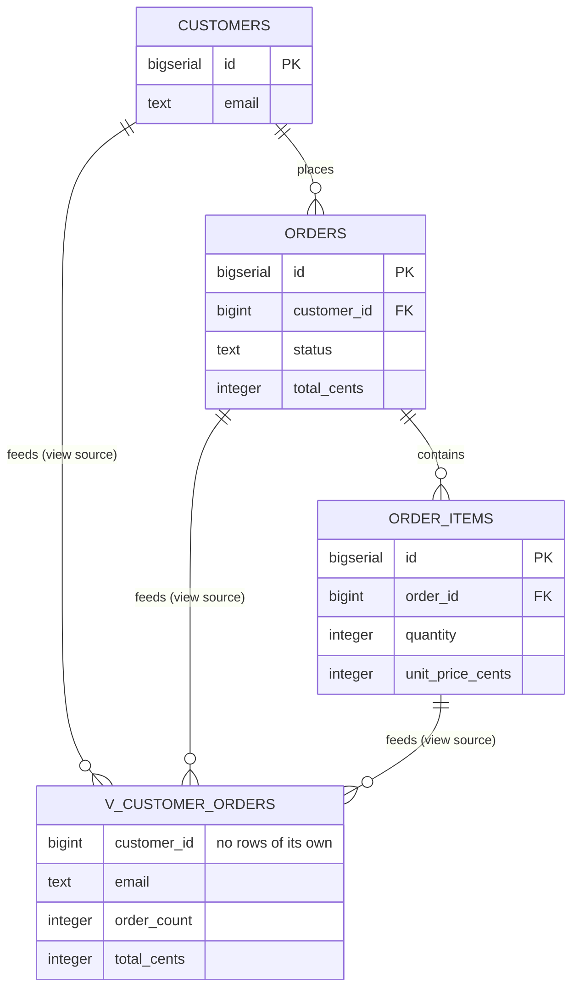

# Build a view

## What you'll build

Three ordinary tables — `customers`, `orders` and `order_items` — and a fourth
node, `v_customer_orders`, that has no columns of its own to insert into. It is
a `SELECT` with a name, and the three dashed arrows feeding it are not data
moving on a schedule; they are the app telling you which tables that `SELECT`
reads.



## Before you start

This picks up right where [Add indexes that get used](07-add-indexes.md) left
off — you will hit the same *unindexed foreign key* warning here and clear it
the same way. Have the app open on an empty diagram with **PostgreSQL**
selected in the dialect selector at the top.

If you would rather read the finished thing than type it, open
[`diagrams/08-build-a-view.dbviz.json`](diagrams/08-build-a-view.dbviz.json)
with **File → Open** (`Ctrl+O`), or drop the file on the canvas.

## The mental model

A view node is a `CREATE VIEW` statement with a position, the same way a table
node is a `CREATE TABLE` with one. The inspector's *View definition (SELECT …)*
field is not a description of the view — it *is* the view, and the generator's
whole job is to wrap `CREATE VIEW schema.name AS` around whatever you typed
there and print it. Nothing you can do to the four *Source tables* links
changes that text: they are drawn on the canvas as `flow` connections, and
`flow` never reaches the DDL. They exist so the diagram tells the truth about
where the view's data comes from without you having to reread the `SELECT`
every time, and so **Trace** and **Simulate** can find their way through the
tables that surround it.

That is also the whole difference from [Fill one table from another](05-fill-one-table-from-another.md),
which looks deceptively similar on the canvas — another node fed by dashed
arrows from other tables. There, the target is a real `CREATE TABLE`: rows get
written into it by an `INSERT … SELECT` you (or a job, or a trigger) actually
run, which is why that flow edge carries *derivations* the app can turn into a
skeleton and *simulate* row by row. A view has no rows to write and nothing to
schedule — the database recomputes the `SELECT` on every read, which is why a
view's flow edges carry no derivations at all; there is no "insert" for them
to describe. The trade a view makes is the opposite of a rollup table's: always
correct, never stale, and it pays the full join and aggregate cost on every
query. A rollup table pays that cost once, at write time, and something has to
own keeping it caught up. Reach for a view first; reach for the derived table
in 05 only once the view's query shows up in a slow-query log.

## Steps

### 1. Set up three source tables

Press `T` three times and build these columns (the keystrokes — `Enter` for
the next row, `Tab` to the type cell — are the same ones from
[Set up a table](01-set-up-a-table.md)):

**customers**

| Name | Type | Flags | Default |
| --- | --- | --- | --- |
| `id` | `BIGSERIAL` | **PK** **NN** **AI** | |
| `email` | `TEXT` | **NN** **UQ** | |
| `created_at` | `TIMESTAMPTZ` | **NN** | `now()` |

**orders**

| Name | Type | Flags | Default | Check |
| --- | --- | --- | --- | --- |
| `id` | `BIGSERIAL` | **PK** **NN** **AI** | | |
| `customer_id` | `BIGINT` | **NN** | | |
| `status` | `TEXT` | **NN** | `'pending'` | |
| `total_cents` | `INTEGER` | **NN** | `0` | `total_cents >= 0` |
| `placed_at` | `TIMESTAMPTZ` | **NN** | `now()` | |

**order_items**

| Name | Type | Flags | Default | Check |
| --- | --- | --- | --- | --- |
| `id` | `BIGSERIAL` | **PK** **NN** **AI** | | |
| `order_id` | `BIGINT` | **NN** | | |
| `quantity` | `INTEGER` | **NN** | `1` | `quantity > 0` |
| `unit_price_cents` | `INTEGER` | **NN** | | `unit_price_cents >= 0` |

Set every table's *Colour* to `blue` while you are in the inspector — the
convention this series uses for source tables.

**You should see:** three table nodes on the canvas, none of them connected
yet.

### 2. Wire the two foreign keys, then let Problems index them

Hover `orders` and drag the small handle beside `customer_id` onto the `id`
row of `customers`. Do the same from `order_items.order_id` onto `orders.id`.
Open the bottom drawer → **Problems**: you should see two *fk-without-index*
warnings, exactly the ones [Add indexes that get used](07-add-indexes.md)
covered. Click each finding's one-click fix, **Index orders(customer_id)** and
**Index order_items(order_id)**.

**You should see:** two crow's-foot lines on the canvas, and **Problems**
back to empty.

### 3. Turn a new node into a view

Right-click empty canvas below the three tables and choose *Add view here*.
The new node is called `new_view` and starts with no columns at all — a view's
default is empty, not the single `id` column a table gets.

**You should see:** a node named `new_view`, selected, with the inspector open
on *View definition (SELECT …)* and *Source tables (0)* instead of a column
grid.

### 4. Name it and write the SELECT

Rename it to `v_customer_orders` (`F2`, or edit *Name* in the inspector), and
set its *Colour* to `teal` — this series' convention for views. In *View
definition (SELECT …)*, paste:

```
SELECT c.id AS customer_id,
       c.email,
       COUNT(DISTINCT o.id) AS order_count,
       COALESCE(SUM(oi.quantity * oi.unit_price_cents), 0) AS total_cents
FROM customers c
JOIN orders o ON o.customer_id = c.id
JOIN order_items oi ON oi.order_id = o.id
GROUP BY c.id, c.email
```

Paste the `SELECT` **body only** — no `CREATE VIEW v_customer_orders AS`
around it. The generator adds that wrapper itself, the same way it adds `CHECK
(…)` around a bare check expression.

**You should see:** the field's hint line — *Written into the script as
CREATE VIEW after every table* — and *Source tables (0)* still empty, because
nothing has linked the tables yet.

### 5. Detect the sources from the SQL

Click **Detect from SQL**, next to *Source tables*.

**You should see:** a toast reading *"Linked 3 source tables to the view."*,
*Source tables (3)* now listing `customers`, `orders` and `order_items` as
chips, and three dashed, filled-arrow connections on the canvas running from
each of those tables into `v_customer_orders`.

### 6. Add display columns (optional)

Expand *Columns (0)* on `v_customer_orders` and add four rows matching the
`SELECT` list: `customer_id` `BIGINT`, `email` `TEXT`, `order_count`
`INTEGER`, `total_cents` `INTEGER`. Leave every flag off — a view's columns
carry no `PK`/`NN`/`UQ`/`AI` meaning because none of them reach the DDL.

**You should see:** *Columns (0)* become *Columns (4) · optional, for
display*, four rows appear inside the node on the canvas, and the **SQL** tab
does not change by one character.

### 7. Find the view in the generated script

Open the bottom drawer → **SQL**, on *Whole schema*.

**You should see:** the header line change to `-- Tables: 3, views: 1, foreign
keys: 2, documented connections: 3`, all three `CREATE TABLE` statements
first, then a `-- Views` block holding `CREATE VIEW public.v_customer_orders
AS` — after every table, never in between.

## Other ways to do it

- **The `▾` next to + Table** → *View* adds an empty view node at a default
  position.
- **Right-click the canvas** → *Add view here* (what step 3 used) places it
  under the pointer.
- **Command palette** (`Ctrl+K`) → *Add view*.
- **Switch an existing table.** Select any table and use the **Table** / **View**
  switch at the top of the inspector. Its columns, checks and indexes are not
  deleted — they just stop being drawn or generated — and *View definition
  (SELECT …)* appears empty for you to fill in. Flip it back to **Table** and
  everything reappears exactly as it was.
- **Wire a source by hand.** Instead of (or alongside) **Detect from SQL**,
  drag another table's orange header handle onto the view; the inspector opens
  on the new connection already set to *Data flow*.
- **Import SQL.** Paste a `CREATE VIEW … AS SELECT …` statement (or drop a
  `.sql` file, or `Ctrl+V` on the canvas) and the importer draws a view node
  with flow links back to every table its `SELECT` names, exactly like *Detect
  from SQL* does by hand. It also accepts `CREATE MATERIALIZED VIEW`, MariaDB's
  `ALGORITHM = … DEFINER = user@host SQL SECURITY DEFINER` prefixes, and a
  trailing `WITH [CASCADED | LOCAL] CHECK OPTION` — all three parse without a
  warning, but none of the three survive into the model: a materialized view
  becomes a plain view, the algorithm/definer words are simply consumed, and
  `WITH CHECK OPTION` is dropped from the captured `SELECT` text entirely. Copy
  this walkthrough's own `CREATE VIEW public.v_customer_orders AS …` out of the
  **SQL** tab and reimport it and you get back the same view with the same
  three source links — but wrap it in `CREATE MATERIALIZED VIEW` first and the
  reimported copy is a plain `CREATE VIEW` again.
- **Hand-write the `.dbviz.json`.** A view is a table object with `"kind":
  "view"` and a `viewSql` string; see
  [`../ADVISOR_OUTPUT_FORMAT.md`](../ADVISOR_OUTPUT_FORMAT.md).

## Check your work

Open the bottom drawer → **SQL**, leave it on *Whole schema*, and compare —
this is the entire output for the diagram above:

```sql
-- Build a view — customer order summary (PostgreSQL)
-- Generated by Database Visualizer
-- Tables: 3, views: 1, foreign keys: 2, documented connections: 3

CREATE TABLE public.customers (
  id BIGSERIAL PRIMARY KEY,
  email TEXT NOT NULL UNIQUE,
  created_at TIMESTAMPTZ NOT NULL DEFAULT now()
);
COMMENT ON TABLE public.customers IS 'One row per person who has ever placed an order.';

CREATE TABLE public.orders (
  id BIGSERIAL PRIMARY KEY,
  customer_id BIGINT NOT NULL,
  status TEXT NOT NULL DEFAULT 'pending',
  total_cents INTEGER NOT NULL DEFAULT 0 CHECK (total_cents >= 0),
  placed_at TIMESTAMPTZ NOT NULL DEFAULT now(),
  CONSTRAINT orders_customer_id_fkey FOREIGN KEY (customer_id) REFERENCES public.customers (id) ON DELETE CASCADE
);
CREATE INDEX orders_customer_id_idx ON public.orders (customer_id);
COMMENT ON TABLE public.orders IS 'One row per checkout.';

CREATE TABLE public.order_items (
  id BIGSERIAL PRIMARY KEY,
  order_id BIGINT NOT NULL,
  quantity INTEGER NOT NULL DEFAULT 1 CHECK (quantity > 0),
  unit_price_cents INTEGER NOT NULL CHECK (unit_price_cents >= 0),
  CONSTRAINT order_items_order_id_fkey FOREIGN KEY (order_id) REFERENCES public.orders (id) ON DELETE CASCADE
);
CREATE INDEX order_items_order_id_idx ON public.order_items (order_id);
COMMENT ON TABLE public.order_items IS 'The grain v_customer_orders aggregates: one row per line on an order.';

-- Views
CREATE VIEW public.v_customer_orders AS
SELECT c.id AS customer_id,
       c.email,
       COUNT(DISTINCT o.id) AS order_count,
       COALESCE(SUM(oi.quantity * oi.unit_price_cents), 0) AS total_cents
FROM customers c
JOIN orders o ON o.customer_id = c.id
JOIN order_items oi ON oi.order_id = o.id
GROUP BY c.id, c.email;

-- ----------------------------------------------------------------
-- Connections the schema does not enforce, and tagged queries
-- (documentation only, not executed)
-- [flow] customers feeds v_customer_orders (view source)
--   customers is named in v_customer_orders' SELECT (FROM customers c); this link was drawn by Detect from SQL, not typed by hand.
-- [flow] orders feeds v_customer_orders (view source)
--   orders is named in v_customer_orders' SELECT (JOIN orders o); this link was drawn by Detect from SQL, not typed by hand.
-- [flow] order_items feeds v_customer_orders (view source)
--   order_items is named in v_customer_orders' SELECT (JOIN order_items oi); this link was drawn by Detect from SQL, not typed by hand.
```

Then open **Problems**. It should be empty — the three flow edges carry a
*note*, which is enough to satisfy the linter's "say how the data moves" rule
even though they carry no query or derivations, because a view's `SELECT` is
already that explanation.

## Try it yourself

- Delete a word from the `SELECT` — misspell `order_items` as `oder_items` —
  and click **Detect from SQL** again. Nothing new links, no error appears
  anywhere in the app, and the **SQL** tab happily emits `CREATE VIEW … FROM
  customers c JOIN orders o … JOIN oder_items oi …`. Only a real database
  running that script would tell you `oder_items` does not exist.
- Click **Detect from SQL** a second time without changing anything. The toast
  changes to *"Every table in the SELECT is already linked."* — it never
  duplicates a connection.
- Drag `v_customer_orders`' orange header handle onto `customers` (a view has
  no column handles, so this is the only connection it can start — it lands as
  a *Data flow*). Open it and click **Foreign key** in the inspector's *Kind*
  switcher, then generate the script: nothing crashes, but the generator's
  warnings above the code say a view cannot take part in a foreign key, and no
  `REFERENCES` is written for it.
- Flip `orders` from **Table** to **View** in the inspector, look at what
  happens to its foreign key and its rows in the **SQL** tab, then flip it
  back and confirm nothing was lost.

## Gotchas

- **A view with no `SELECT` is a lint warning, not an error, and it vanishes
  from the script.** *Problems* reports `View "…" has no SELECT yet, so it is
  left out of the script.` (rule `view-without-sql`) — the diagram still looks
  complete on the canvas, but the generated schema simply has one fewer
  `CREATE VIEW`, silently.
- **The app does not parse or validate the `SELECT`.** It only scans the text
  after `FROM` and `JOIN` for table names, well enough to draw arrows. A typo
  in a column, a join condition, or a table alias is invisible everywhere in
  this app and reaches the database exactly as typed, to fail there.
- **Detect from SQL only links tables that already exist in the diagram.** A
  table your `SELECT` reads but you have not drawn yet — or one you misspelled
  — is not created as a stand-in and does not appear in the "no sources found"
  toast's reasoning; it is just absent from the result, same as any other name
  the scan does not recognize.
- **`MATERIALIZED`, `ALGORITHM=`/`DEFINER=` and `WITH CHECK OPTION` parse
  clean but do not survive.** Import SQL accepts all three without a warning,
  but nothing in the model remembers a view was materialized or check-optioned
  — regenerate the script and you get back a plain `CREATE VIEW`. If those
  clauses matter, keep the original DDL as your source of truth and treat this
  app's copy as a diagram, not a mirror.
- **A view cannot be either end of a foreign key.** The canvas already makes
  this awkward — a view has no column handles, only the header one, so any
  connection you drag onto or out of it starts as a *Data flow* — but nothing
  stops you from switching that connection's *Kind* to **Foreign key** in the
  inspector afterward. The generator is what actually catches it: it drops the
  constraint and adds a warning above the script instead of failing.

## Where to go next

- [Import an existing schema](09-import-an-existing-schema.md) — paste real
  DDL, `CREATE VIEW` included, and watch the importer draw exactly what this
  walkthrough built by hand.
- [Fill one table from another](05-fill-one-table-from-another.md) — the
  materialized alternative to a view, for the day its query gets too slow to
  run on every read.
- [Trace a path between tables](11-trace-a-path-between-tables.md) — `flow`
  edges like the ones on `v_customer_orders` are walked by a trace but never
  turn into a `JOIN` condition; see exactly what that looks like.
