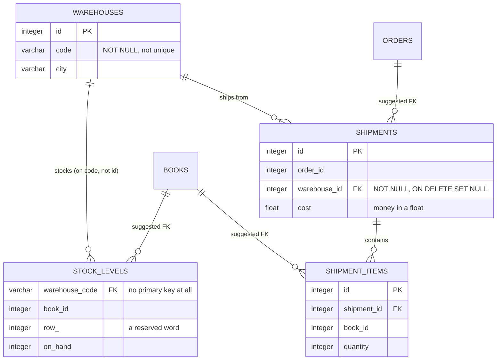

# Import an existing schema

## What you'll build

Four more tables on the same canvas, and not one of them typed by you. The
warehouse team runs its own database — `warehouses`, `stock_levels`,
`shipments`, `shipment_items` — and has sent over the `CREATE TABLE` script for
it. You paste it into **Import SQL**, choose *Add to the current diagram*, and
the bookshop you have spent eight walkthroughs building grows a warehouse side.

Then you do the two things every import needs: accept the foreign keys the
script never declared, and lay the result out.

What you will **not** do is clean it up. The script is a real one, which means
it arrives with a table that has no primary key, two indexes on the same
column, money in a `FLOAT`, and a foreign key onto a column nothing makes
unique. **Problems** will have plenty to say, and that is exactly what
[the next walkthrough](10-fix-what-problems-finds.md) is for — this is the
first time in the series the diagram ends with errors in it, on purpose.



## Before you start

You need what [Build a view](08-build-a-view.md) leaves behind: thirteen
tables, two regions, and a **Problems** tab with no errors and no warnings in
it. Press **Set up the canvas** at the top of this walkthrough in the drawer's
**Walkthrough** tab if it is not already in front of you.

That quiet **Problems** tab matters more than usual here. Everything it says
by the end of this walkthrough came in with the import, and you will be able
to tell because nothing was there before.

Have **PostgreSQL** selected in the dialect selector, since the script below
is written in PostgreSQL's spelling (`SERIAL`, `VARCHAR`, a quoted
identifier).

If you would rather read the finished thing than type it, open
[`diagrams/09-import-an-existing-schema.dbviz.json`](diagrams/09-import-an-existing-schema.dbviz.json)
with **File → Open** (`Ctrl+O`), or drop the file on the canvas.

## The mental model

**Import SQL** is not a SQL engine — it never executes anything, and it does
not understand every statement PostgreSQL does. It is closer to a compiler
that only has a front end for the *shape* of a schema: it recognizes
`CREATE TABLE`, `ALTER TABLE`, `CREATE INDEX`, `COMMENT ON`, `CREATE VIEW` and
`CREATE TYPE`, builds a table or a relationship out of each one it understands,
and quietly steps over anything else, statement by statement. That "statement
by statement" part is what makes it usable on real dumps: one line with a typo,
one `CREATE TRIGGER` it has never heard of, one partitioned table it cannot
represent, costs you a warning on that one statement, not the whole import.

That also explains why the diagram you get is never quite a photograph of the
database. Two things change on the way in. First, the app fills in what the
DDL leaves implicit — a column named `order_id` next to a table named `orders`
is a foreign key ninety-nine times out of a hundred, but plenty of real schemas
never spell out the constraint, especially ones bolted together without an
ORM. **Problems → Suggested foreign keys** reads exactly the same naming
convention you would, and offers to draw the edge the DDL was too lazy to
declare. Second, the app throws away what it cannot model at all — a generated
column, a partitioned table, an expression index — because there is no field
in the diagram to put it in. Both are one-way doors on the way in and
completely normal; the rest of this page is about knowing which is which.

## Steps

### 1. Open Import SQL and paste the script

<!-- step
target: tab:import
-->

Open the bottom drawer → **Import SQL**. Paste this into the text box on the
left (or save it as a file and use **Load .sql file** instead):

```sql
-- warehouse.sql — the warehouse team's schema, dumped years ago and barely touched since.
CREATE TABLE warehouses (
    id    SERIAL PRIMARY KEY,
    code  VARCHAR(8) NOT NULL,
    name  VARCHAR(120),
    city  VARCHAR(120)
);

CREATE TABLE stock_levels (
    warehouse_code  VARCHAR(8) NOT NULL REFERENCES warehouses (code),
    book_id         INTEGER NOT NULL,
    aisle           VARCHAR(4),
    "row"           INTEGER,
    on_hand         INTEGER DEFAULT 0,
    reorder_at      INTEGER DEFAULT 0
);

CREATE INDEX stock_levels_book_id_idx ON stock_levels (book_id);
CREATE INDEX idx_sl_book ON stock_levels (book_id);

CREATE TABLE shipments (
    id            SERIAL PRIMARY KEY,
    order_id      INTEGER NOT NULL,
    warehouse_id  INTEGER NOT NULL REFERENCES warehouses (id) ON DELETE SET NULL,
    shipped_at    TIMESTAMP,
    cost          FLOAT DEFAULT 0
);

CREATE TABLE shipment_items (
    id           SERIAL PRIMARY KEY,
    shipment_id  INTEGER NOT NULL REFERENCES shipments (id),
    book_id      INTEGER NOT NULL,
    quantity     INTEGER DEFAULT 1
);
```

Read it once before importing it. This is not a schema anyone designed in one
sitting: `stock_levels` has no primary key, `book_id` appears in two tables
with no constraint on it, `stock_levels` is indexed twice on the same column
under two different names, `"row"` is quoted because it is a reserved word,
`cost` is a `FLOAT`, and the foreign key on `stock_levels.warehouse_code`
points at `warehouses.code`, which is `NOT NULL` but not `UNIQUE`.

Import it anyway. Reading someone else's schema *as it is* is the whole job;
fixing it comes after you can see it.

**You should see:** the **Import** and **Preview only** buttons switch from
greyed out to active — nothing lands on the canvas until you click one of
them. Click **Preview only** first if you want to see the table list, the
column counts and any warnings without touching the diagram.

### 2. Import it into the diagram you already have

<!-- step
target: panel:import
goals:
  - import | warehouses, stock_levels, shipments, shipment_items
-->

Check the radio buttons above the buttons. Because the canvas is *not* empty,
*Add to the current diagram* is already selected rather than *Replace the
current diagram* — which is what you want. Click **Import**.

This is the step that makes the import part of your schema rather than a
separate drawing of somebody else's. Merge mode keeps every table, region,
type and connection you have, appends the parsed ones, and resolves references
by name across both: had the warehouse script said `REFERENCES books (id)`,
the parser would have wired it straight into *your* `books` table rather than
inventing a second one. (It does not, which is why step 3 exists.)

**You should see:** two toasts, back to back — "Imported 4 table(s), 3 foreign
key(s)." then "4 foreign keys look implied by column names. Open Problems to
add them." — and four new tables land on the canvas below everything else.

### 3. Accept three of the four suggested foreign keys

<!-- step
target: panel:problems
goals:
  - fk | stock_levels.book_id -> books.id
  - fk | shipment_items.book_id -> books.id
  - fk | shipments.order_id -> orders.id
-->

Open the bottom drawer → **Problems** and look at the right-hand *Suggested
foreign keys* column. Four entries, all badged *likely*. Click **Add foreign
key** on three of them:

| Suggestion | Why it is right |
| --- | --- |
| `stock_levels.book_id → books.id` | stock is stock *of a book*; the warehouse script simply never said so |
| `shipment_items.book_id → books.id` | same again, one table down |
| `shipments.order_id → orders.id` | a shipment exists because an order did |

Leave the fourth — `catalog_export.book_id → books.id` — exactly where it is.
That column has been deliberately unconstrained since walkthrough 02: the
export keeps rows for books you have stopped selling, and adding this foreign
key would make deleting such a book impossible. The suggestion engine reads
column names, not intent, and this is the case where it is wrong.

Do not press **Add all likely**, which would take all four.

**You should see:** three new crow's-foot lines running from the warehouse
tables up into `books` and `orders`, one suggestion still listed, and — now
that those foreign keys exist — the **Problems** list on the left grow
considerably.

### 4. Lay it out

<!-- step
target: ui:detangle
-->

The four new tables landed in a plain grid wherever there was room. Drag them
into a block underneath the rest of the diagram, or select all four with
`Shift+click` and press `L` (**Detangle**) to have the layout engine place
them.

Detangle works on the whole diagram, so expect your other tables to move too;
`Ctrl+Z` puts everything back if you would rather place these four by hand.
Positions are not part of the schema — this step is entirely for you.

**You should see:** the warehouse tables sitting together as a block, with
their three long edges running up to `books` and `orders` rather than crossing
the middle of the diagram.

### 5. Read what the import cost you

<!-- step
target: panel:problems
goals:
  - open | problems
  - lint errors | 2
-->

Open **Problems** properly and read the whole list. Two errors, ten warnings
and a note that the import brought in — plus the one note about the CRM
foreign key that has been there since walkthrough 03:

```
error    shipments → warehouses uses SET NULL, but shipments.warehouse_id is NOT NULL
error    stock_levels → warehouses references warehouses(code), which is not a primary key or UNIQUE
warning  stock_levels.book_id is INTEGER but references books.id, which is BIGSERIAL
warning  shipments.order_id is INTEGER but references orders.id, which is BIGSERIAL
warning  shipment_items.book_id is INTEGER but references books.id, which is BIGSERIAL
warning  Table "stock_levels" has no primary key
warning  Table "stock_levels" indexes (book_id) twice
warning  … five more unindexed foreign keys
note     "stock_levels.row" is a reserved word
```

Every one of those came from the script, and two of them you caused by
accepting a suggestion in step 3 — the type mismatches only exist because
there is now a foreign key for the types to disagree across. That is not an
argument against accepting them: the mismatch was always there, silently, and
the constraint is what made it visible.

**You should see:** the **Problems** tab badge lit for the first time in the
series — it counts errors, and until now there were none.

## Other ways to do it

**Import SQL** is the drawer tab, but the parser behind it — and the diagram
converter behind that — is reachable from several other places too:

- **Drop a `.sql` file on the canvas.** Same parser, same result, no drawer
  required — it adds to whatever is already there, or simply populates an
  empty canvas. The canvas also accepts a dropped **`.dbviz.json`** diagram
  (with a *Replace* / *Add tables* choice if the canvas is not empty) and a
  dropped **`.sqlite`** database file, opened and introspected right there in
  the browser. It does **not** accept a `.dbml` file — see Gotchas.
- **Paste DDL straight onto the canvas with `Ctrl+V`.** No drawer, no dialog:
  the app recognizes `CREATE TABLE` / `VIEW` / `TYPE` / `INDEX` text the
  moment it lands and always adds the result to the current diagram, even on
  an empty one. This is the fastest way to pull a couple of tables out of a
  `pg_dump` you have open in another window — copy, switch tabs, `Ctrl+V`.
- **Database → Read schema.** Open the bottom drawer → **Database**, fill in a
  connection (or **Test connection** one you already have), and click
  **Read schema** under *Import from the database*. It reads tables, columns,
  keys, indexes and foreign keys the same way — through the same converter
  Import SQL uses — and can drop them straight into a new group, ticked
  *Another database* by default, which is usually what you want for a
  database you only read from. Unlike Import SQL, this panel defaults to
  *Replace diagram* even when your diagram already has tables in it, so check
  the radio before you click.
- **Right-click the empty canvas** → **Import SQL…** opens the same drawer
  tab as the button; **Docker & database** opens the Database tab.
- **`Ctrl+K`**, then type "import" or "database" to jump to either drawer tab
  without touching the mouse.

One route skips DDL and the parser entirely: **hand-writing the
`.dbviz.json`** directly, which is how this walkthrough's own companion file
was made — you write the model the parser would have produced, instead of the
script it would have produced it from. The format is documented in
[`../ADVISOR_OUTPUT_FORMAT.md`](../ADVISOR_OUTPUT_FORMAT.md).

## Check your work

Open the bottom drawer → **SQL**, leave it on *Whole schema*, and scroll to
the four new tables. Two details give away that they came from someone else's
script rather than from your keyboard:

```sql
CREATE TABLE warehouses (
  id INTEGER GENERATED BY DEFAULT AS IDENTITY PRIMARY KEY,
  code VARCHAR(8) NOT NULL,
  name VARCHAR(120),
  city VARCHAR(120)
);

CREATE TABLE shipments (
  id INTEGER GENERATED BY DEFAULT AS IDENTITY PRIMARY KEY,
  order_id INTEGER NOT NULL,
  warehouse_id INTEGER NOT NULL,
  shipped_at TIMESTAMP,
  cost FLOAT DEFAULT 0,
  CONSTRAINT fk_shipments_warehouses FOREIGN KEY (warehouse_id) REFERENCES warehouses (id) ON DELETE SET NULL,
  CONSTRAINT fk_shipments_orders FOREIGN KEY (order_id) REFERENCES public.orders (id)
);

CREATE TABLE stock_levels (
  warehouse_code VARCHAR(8) NOT NULL,
  book_id INTEGER NOT NULL,
  aisle VARCHAR(4),
  "row" INTEGER,
  on_hand INTEGER DEFAULT 0,
  reorder_at INTEGER DEFAULT 0,
  CONSTRAINT fk_stock_levels_warehouses FOREIGN KEY (warehouse_code) REFERENCES warehouses (code),
  CONSTRAINT fk_stock_levels_books FOREIGN KEY (book_id) REFERENCES public.books (id)
);
CREATE INDEX stock_levels_book_id_idx ON stock_levels (book_id);
CREATE INDEX idx_sl_book ON stock_levels (book_id);
```

First, `CREATE TABLE warehouses` and not `CREATE TABLE public.warehouses`. The
script never named a schema, so the parser left the field empty and the
generator writes the name unqualified — while every table you typed yourself
still says `public.`. It is a small thing that tells you exactly which half of
the diagram you wrote.

Second, look at the constraint the parser built on `shipments`:
`REFERENCES public.orders (id)` — the fully qualified name of *your* `orders`
table, not a second copy of it. That is the merge working: the suggestion you
accepted in step 3 pointed at a table that was already there, and so the
diagram now has one `orders` with a warehouse-side reader, rather than two
schemas sitting side by side pretending not to know each other.

Then press **Check my work** at the foot of this walkthrough. Its last check
is unusual and worth reading:

```
lint errors | 2
```

Every other walkthrough in the series checks `lint clean`. This one asserts
that Problems reports *exactly two errors*, because a diagram that came out of
this walkthrough clean would mean the import silently fixed something, and
imports do not fix things. Passing this check means you have successfully
brought in someone else's mess.

## Reference

What the parser understands, verified against `src/lib/sql/parser.ts` rather
than assumed:

**Parses, in PostgreSQL, MariaDB and SQLite spelling:**
`CREATE TABLE` with column and table constraints (`PRIMARY KEY`, `UNIQUE`,
`CHECK`, `FOREIGN KEY … REFERENCES`, composite keys); `ALTER TABLE … ADD
CONSTRAINT`, `ADD COLUMN`, `ALTER COLUMN SET DEFAULT` / `SET NOT NULL`;
`CREATE [UNIQUE] INDEX`; `COMMENT ON TABLE` / `COMMENT ON COLUMN`; `CREATE
VIEW … AS SELECT …`; `CREATE TYPE … AS ENUM (…)` and `… AS (…)` (composite).
`pg_dump` and `mysqldump` output parses as-is — that is the point of it.
SQLite's `AUTOINCREMENT`, `[bracketed identifiers]`, `WITHOUT ROWID` and
`STRICT` are all accepted and ignored where the model has no place for them.

**Drops, with a warning you can read in the Import SQL preview:** generated /
computed columns (`GENERATED ALWAYS AS (…) STORED`), table partitioning,
expression indexes. Triggers and stored functions are skipped outright — the
warning reads "Skipped CREATE TRIGGER statement" (or `FUNCTION`, `PROCEDURE`)
so you know it saw them and chose not to.

**Survives a broken statement.** A `CREATE TABLE` with a missing comma
produces one parse error and that one table is left out; every other
statement in the script — before and after it — still lands. Try it under
**Try it yourself** below.

## Try it yourself

- Press `Ctrl+Z` back to before the import, then delete the comma after
  `code VARCHAR(8) NOT NULL` in `warehouses` and import again. **Import
  SQL**'s preview shows one error pinned to that line and `warehouses` is
  left out; `stock_levels`, `shipments` and `shipment_items` still land. This
  is the behaviour that makes pasting a 40-table dump worthwhile even when one
  `CREATE TABLE` in it uses a feature the parser has never seen.
- Add `full_location TEXT GENERATED ALWAYS AS (aisle) STORED` to
  `stock_levels` and re-import. Watch the warning name the column and say the
  expression was "not modelled and was dropped" — then check that
  `stock_levels.full_location` really is missing from the table on the canvas.
- Import the script a second time without undoing the first. Every table name
  is already taken, so you get four warnings ("Table warehouses already exists
  in the diagram; the imported copy was renamed") and four new tables called
  `warehouses_2`, `stock_levels_2` and so on. Merge mode never overwrites a
  table you already have — which is the safe default, and also why importing
  a *newer* version of a script you already imported is not an update.
  `Ctrl+Z` to undo it.
- Select `shipments` and look at the `shipped_at` column: the script said
  `TIMESTAMP`, and that is exactly what the diagram says, not the
  `TIMESTAMPTZ` the rest of your schema uses. The importer records what the
  script says, never what it thinks you meant. That one is on the list for the
  next walkthrough.

## Gotchas

- **`BIGSERIAL` does not come back as `BIGSERIAL`.** Importing a serial
  column turns it into a plain integer type with auto-increment turned on —
  that is how the model expresses "identity column" for all three dialects,
  not just PostgreSQL's `BIGSERIAL` spelling. Ask the **SQL** tab for it back
  and PostgreSQL prints `BIGINT GENERATED BY DEFAULT AS IDENTITY`: the same
  sequence-backed column, different characters. Do not diff the reimported
  script against the original expecting an exact match.
- **A bare custom-type name gets shouted at you.** Import a script that
  references an enum by its bare, unquoted name (`status order_status`, not
  `status "order_status"`) and the importer stores the column's type in upper
  case — `ORDER_STATUS` — even though the enum itself is recorded as
  lower-case `order_status`. It is harmless: the **SQL** tab matches the two
  case-insensitively and prints the correct `order_status` either way, and
  the column's type *cell* is the only place you will ever see the shouting
  version. Retype it if it bothers you; nothing depends on the casing.
- **An imported table has no schema, and that is not cosmetic.** The four
  tables you just added generate as `CREATE TABLE warehouses`, not
  `CREATE TABLE public.warehouses`, because the script never said. On a
  database with a single search path this makes no difference; on one where
  it matters, it means those four tables land somewhere the other thirteen do
  not. Fixing it is one field in the inspector (*Schema*), and the next
  walkthrough does exactly that.
- **Dropping or pasting a `.dbml` file does not work, despite what the app's
  own help (`?`) claims.** The help panel's shortcut list says `Ctrl+V`
  "also pastes DDL, DBML or a .dbviz.json" — but there is no DBML parser
  anywhere in the codebase; DBML is an *export* format only (File menu →
  Export DBML). A dropped `.dbml` file falls through to the same error every
  unrecognised file gets ("drop a .sql, .dbviz.json or .sqlite file"), and
  pasting DBML text with `Ctrl+V` does nothing at all — no import, no error.
  Convert it to SQL first, or hand-write the `.dbviz.json`.
- **File → Open always replaces — it never asks.** Dropping a `.dbviz.json`
  on the canvas offers *Replace* or *Add tables* when you already have a
  diagram open; **File → Open** (`Ctrl+O`) skips the question and replaces
  outright, the instant you pick a file. Nothing is lost — the diagram you
  had is still in **File → Open recent…** — but there is no undo for "I meant
  to add this, not swap it in." If you want to add, drop the file on the
  canvas instead of using the menu.
- **A table referenced but never defined gets a one-column placeholder.** If
  the script had said `author_id BIGINT REFERENCES people (id)` without ever
  defining `people`, the import would still succeed: a stub `people` table
  with an `id` column appears so the foreign key has somewhere to point, and
  a warning says so. Rename or delete it once you know what it should have
  been.
- **Table and column names lower-fold on PostgreSQL; type text does not.** An
  unquoted `Authors` in the script becomes `authors` in the diagram, matching
  what PostgreSQL itself would do — but the raw text used for a column's
  *type* is preserved verbatim except for the upper-casing above. Two
  differently-cased references to the same custom type still resolve to one
  type, but only because lookups compare case-insensitively, not because the
  text was normalized.

## Where to go next

- [Fix what Problems finds](10-fix-what-problems-finds.md) — next in the
  series, and it starts exactly where this one stops: two errors, ten
  warnings and one note, worked through one at a time until the tab is empty
  again. Some of them have a one-click fix; two of the worst are invisible to
  the linter entirely.
