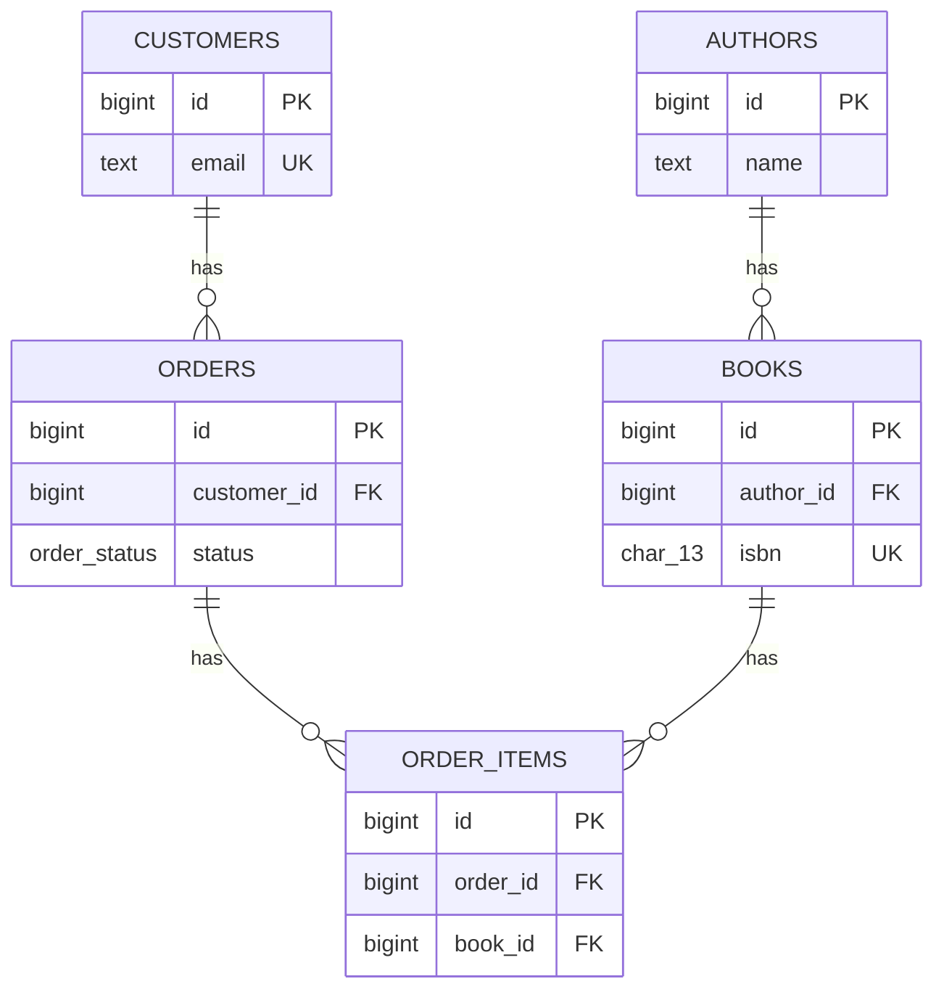

# Import an existing schema

## What you'll build

The same five-table bookshop you would get from a real database dump: `authors`,
`books`, `customers`, `orders` and `order_items`, an `order_status` enum, one
index, and a comment that survived the trip. You get there by pasting one
`CREATE TABLE` script into **Import SQL**, then doing the two things every
import is missing — accepting the foreign keys the script never declared and
tidying the layout.



## Before you start

[Set up a table](01-set-up-a-table.md) is worth reading first so the column
grid and the four flags (**PK** / **NN** / **UQ** / **AI**) are already
familiar — this walkthrough hands you a script instead of a keyboard, but the
diagram it produces is made of the same pieces. Have the app open on an empty
diagram with **PostgreSQL** selected in the dialect selector, since the script
below is written in PostgreSQL's spelling (`BIGSERIAL`, `TIMESTAMPTZ`,
`CREATE TYPE … AS ENUM`).

If you would rather read the finished thing than type it, open
[`diagrams/09-import-an-existing-schema.dbviz.json`](diagrams/09-import-an-existing-schema.dbviz.json)
with **File → Open** (`Ctrl+O`), or drop the file on the canvas.

## The mental model

**Import SQL** is not a SQL engine — it never executes anything, and it does
not understand every statement PostgreSQL does. It is closer to a compiler
that only has a front end for the *shape* of a schema: it recognizes
`CREATE TABLE`, `ALTER TABLE`, `CREATE INDEX`, `COMMENT ON`, `CREATE VIEW` and
`CREATE TYPE`, builds a table or a relationship out of each one it understands,
and quietly steps over anything else, statement by statement. That "statement
by statement" part is what makes it usable on real dumps: one line with a typo,
one `CREATE TRIGGER` it has never heard of, one partitioned table it cannot
represent, costs you a warning on that one statement, not the whole import.

That also explains why the diagram you get is never quite a photograph of the
database. Two things change on the way in. First, the app fills in what the
DDL leaves implicit — a column named `order_id` next to a table named `orders`
is a foreign key ninety-nine times out of a hundred, but plenty of real schemas
never spell out the constraint, especially ones bolted together without an
ORM. **Problems → Suggested foreign keys** reads exactly the same naming
convention you would, and offers to draw the edge the DDL was too lazy to
declare. Second, the app throws away what it cannot model at all — a generated
column, a partitioned table, an expression index — because there is no field
in the diagram to put it in. Both are one-way doors on the way in and
completely normal; the rest of this page is about knowing which is which.

## Steps

### 1. Open Import SQL and paste the script

Open the bottom drawer → **Import SQL**. Paste this into the text box on the
left (or save it as a file and use **Load .sql file** instead):

```sql
CREATE TYPE order_status AS ENUM ('pending', 'paid', 'shipped', 'cancelled');

CREATE TABLE authors (
  id BIGSERIAL PRIMARY KEY,
  name TEXT NOT NULL,
  country CHAR(2)
);

CREATE TABLE books (
  id BIGSERIAL PRIMARY KEY,
  author_id BIGINT NOT NULL REFERENCES authors (id),
  title TEXT NOT NULL,
  isbn CHAR(13) NOT NULL UNIQUE,
  price_cents INTEGER NOT NULL DEFAULT 0
);

CREATE TABLE customers (
  id BIGSERIAL PRIMARY KEY,
  email TEXT NOT NULL UNIQUE,
  created_at TIMESTAMPTZ NOT NULL DEFAULT now()
);

CREATE TABLE orders (
  id BIGSERIAL PRIMARY KEY,
  customer_id BIGINT NOT NULL REFERENCES customers (id),
  status order_status NOT NULL DEFAULT 'pending',
  total_cents INTEGER NOT NULL DEFAULT 0,
  placed_at TIMESTAMPTZ NOT NULL DEFAULT now()
);

CREATE INDEX orders_customer_id_idx ON orders (customer_id);

CREATE TABLE order_items (
  id BIGSERIAL PRIMARY KEY,
  order_id BIGINT NOT NULL,
  book_id BIGINT NOT NULL,
  quantity INTEGER NOT NULL DEFAULT 1,
  unit_price_cents INTEGER NOT NULL
);

COMMENT ON COLUMN orders.status IS 'Only these four values are valid; add new ones with ALTER TYPE order_status ADD VALUE.';
```

Notice `order_items.order_id` and `order_items.book_id` on purpose: real dumps
often skip a constraint that the application enforces instead, and this script
is no different.

**You should see:** the **Import** and **Preview only** buttons switch from
greyed out to active — nothing lands on the canvas until you click one of
them.

### 2. Import it

With the diagram empty, *Replace the current diagram* is already selected.
Click **Import**.

**You should see:** two toasts, back to back — "Imported 5 table(s), 2 foreign
key(s) and 1 type(s)." then "2 foreign keys look implied by column names. Open
Problems to add them." — and five tables land on the canvas in a plain grid.

### 3. Accept the suggested foreign keys

Open the bottom drawer → **Problems**, look at the right-hand *Suggested
foreign keys* column, and click **Add all likely** (or click **Add foreign
key** beside `order_items.order_id → orders.id` and
`order_items.book_id → books.id` one at a time — both are badged *likely*).
These two never existed in the script — the app inferred them from `order_id`
sitting next to a table called `orders`, the same way it would if you had
typed the columns yourself.

**You should see:** two new crow's-foot lines from `order_items` to `orders`
and to `books`, and the suggestions disappear from the list.

### 4. Lay it out

Press `L` (**Detangle**).

**You should see:** `authors` and `customers` move to the top rank (nothing
references them), `books` and `orders` settle underneath the table they
depend on, and `order_items` — which depends on both — drops to the bottom,
underneath the two of them.

## Other ways to do it

**Import SQL** is the drawer tab, but the parser behind it — and the diagram
converter behind that — is reachable from several other places too:

- **Drop a `.sql` file on the canvas.** Same parser, same result, no drawer
  required — it adds to whatever is already there, or simply populates an
  empty canvas. The canvas also accepts a dropped **`.dbviz.json`** diagram
  (with a *Replace* / *Add tables* choice if the canvas is not empty) and a
  dropped **`.sqlite`** database file, opened and introspected right there in
  the browser. It does **not** accept a `.dbml` file — see Gotchas.
- **Paste DDL straight onto the canvas with `Ctrl+V`.** No drawer, no dialog:
  the app recognizes `CREATE TABLE` / `VIEW` / `TYPE` / `INDEX` text the
  moment it lands and always adds the result to the current diagram, even on
  an empty one. This is the fastest way to pull a couple of tables out of a
  `pg_dump` you have open in another window — copy, switch tabs, `Ctrl+V`.
- **Database → Read schema.** Open the bottom drawer → **Database**, fill in a
  connection (or **Test connection** one you already have), and click
  **Read schema** under *Import from the database*. It reads tables, columns,
  keys, indexes and foreign keys the same way — through the same converter
  Import SQL uses — and can drop them straight into a new group, ticked
  *Another database* by default, which is usually what you want for a
  database you only read from. Unlike Import SQL, this panel defaults to
  *Replace diagram* even when your diagram already has tables in it, so check
  the radio before you click.
- **Right-click the empty canvas** → **Import SQL…** opens the same drawer
  tab as the button; **Docker & database** opens the Database tab.
- **`Ctrl+K`**, then type "import" or "database" to jump to either drawer tab
  without touching the mouse.

One route skips DDL and the parser entirely: **hand-writing the
`.dbviz.json`** directly, which is how this walkthrough's own companion file
was made — you write the model the parser would have produced, instead of the
script it would have produced it from. The format is documented in
[`../ADVISOR_OUTPUT_FORMAT.md`](../ADVISOR_OUTPUT_FORMAT.md).

## Check your work

Open the bottom drawer → **SQL**, leave it on *Whole schema*, and compare.
This is the entire generated script for the diagram above — note that
`order_items` moved to the end, after the tables its two new foreign keys
point at:

```sql
-- Import an existing schema — bookshop (PostgreSQL)
-- Generated by Database Visualizer
-- Tables: 5, foreign keys: 4

-- Custom types
CREATE TYPE order_status AS ENUM ('pending', 'paid', 'shipped', 'cancelled');

CREATE TABLE authors (
  id BIGINT GENERATED BY DEFAULT AS IDENTITY PRIMARY KEY,
  name TEXT NOT NULL,
  country CHAR(2)
);

CREATE TABLE books (
  id BIGINT GENERATED BY DEFAULT AS IDENTITY PRIMARY KEY,
  author_id BIGINT NOT NULL,
  title TEXT NOT NULL,
  isbn CHAR(13) NOT NULL UNIQUE,
  price_cents INTEGER NOT NULL DEFAULT 0,
  CONSTRAINT fk_books_authors FOREIGN KEY (author_id) REFERENCES authors (id)
);

CREATE TABLE customers (
  id BIGINT GENERATED BY DEFAULT AS IDENTITY PRIMARY KEY,
  email TEXT NOT NULL UNIQUE,
  created_at TIMESTAMPTZ NOT NULL DEFAULT now()
);

CREATE TABLE orders (
  id BIGINT GENERATED BY DEFAULT AS IDENTITY PRIMARY KEY,
  customer_id BIGINT NOT NULL,
  status order_status NOT NULL DEFAULT 'pending',
  total_cents INTEGER NOT NULL DEFAULT 0,
  placed_at TIMESTAMPTZ NOT NULL DEFAULT now(),
  CONSTRAINT fk_orders_customers FOREIGN KEY (customer_id) REFERENCES customers (id)
);
CREATE INDEX orders_customer_id_idx ON orders (customer_id);
COMMENT ON COLUMN orders.status IS 'Only these four values are valid; add new ones with ALTER TYPE order_status ADD VALUE.';

CREATE TABLE order_items (
  id BIGINT GENERATED BY DEFAULT AS IDENTITY PRIMARY KEY,
  order_id BIGINT NOT NULL,
  book_id BIGINT NOT NULL,
  quantity INTEGER NOT NULL DEFAULT 1,
  unit_price_cents INTEGER NOT NULL,
  CONSTRAINT fk_order_items_orders FOREIGN KEY (order_id) REFERENCES orders (id),
  CONSTRAINT fk_order_items_books FOREIGN KEY (book_id) REFERENCES books (id)
);
```

Then open **Problems** again. It is not empty: three *fk-without-index*
warnings remain, for `books.author_id`, `order_items.order_id` and
`order_items.book_id` — the script only ever indexed `orders.customer_id`.
That is deliberate, not a mistake in this walkthrough's example: an import is
exactly when a schema's gaps become visible, and closing them one click at a
time is the whole subject of
[Fix what Problems finds](10-fix-what-problems-finds.md).

## Reference

What the parser understands, verified against `src/lib/sql/parser.ts` rather
than assumed:

**Parses, in PostgreSQL, MariaDB and SQLite spelling:**
`CREATE TABLE` with column and table constraints (`PRIMARY KEY`, `UNIQUE`,
`CHECK`, `FOREIGN KEY … REFERENCES`, composite keys); `ALTER TABLE … ADD
CONSTRAINT`, `ADD COLUMN`, `ALTER COLUMN SET DEFAULT` / `SET NOT NULL`;
`CREATE [UNIQUE] INDEX`; `COMMENT ON TABLE` / `COMMENT ON COLUMN`; `CREATE
VIEW … AS SELECT …`; `CREATE TYPE … AS ENUM (…)` and `… AS (…)` (composite).
`pg_dump` and `mysqldump` output parses as-is — that is the point of it.
SQLite's `AUTOINCREMENT`, `[bracketed identifiers]`, `WITHOUT ROWID` and
`STRICT` are all accepted and ignored where the model has no place for them.

**Drops, with a warning you can read in the Import SQL preview:** generated /
computed columns (`GENERATED ALWAYS AS (…) STORED`), table partitioning,
expression indexes. Triggers and stored functions are skipped outright — the
warning reads "Skipped CREATE TRIGGER statement" (or `FUNCTION`, `PROCEDURE`)
so you know it saw them and chose not to.

**Survives a broken statement.** A `CREATE TABLE` with a missing comma
produces one parse error and that one table is left out; every other
statement in the script — before and after it — still lands. Try it under
**Try it yourself** below.

## Try it yourself

- Delete the comma after `name TEXT NOT NULL` in `authors` and re-import.
  **Import SQL**'s preview shows one error pinned to that line; `books`,
  `customers`, `orders` and `order_items` still import. This is the behavior
  that makes pasting a 40-table dump worthwhile even when one `CREATE TABLE`
  in it uses a feature the parser has never seen.
- Add `full_title TEXT GENERATED ALWAYS AS (title) STORED` to `books` and
  re-import. Watch the warning name the column and say the expression was
  "not modelled and was dropped" — then check that `books.full_title` really
  is missing from the table on the canvas.
- Select `orders` and look at the `status` column's type cell: it reads
  `ORDER_STATUS`, in shouting case, even though the script says
  `order_status`. Open the **Types** tab next to it — the enum itself is
  still named `order_status`, lower-case. Now check the **SQL** tab: it
  prints `status order_status`, correctly, either way. See the second Gotcha
  below for why the mismatch is real but harmless.

## Gotchas

- **`BIGSERIAL` does not come back as `BIGSERIAL`.** Importing a serial
  column turns it into a plain integer type with auto-increment turned on —
  that is how the model expresses "identity column" for all three dialects,
  not just PostgreSQL's `BIGSERIAL` spelling. Ask the **SQL** tab for it back
  and PostgreSQL prints `BIGINT GENERATED BY DEFAULT AS IDENTITY`: the same
  sequence-backed column, different characters. Do not diff the reimported
  script against the original expecting an exact match.
- **A bare custom-type name gets shouted at you.** Reference an enum by its
  bare, unquoted name (`status order_status`, not `status "order_status"`)
  and the importer stores the column's type in upper case —
  `ORDER_STATUS` — even though the enum itself is recorded as lower-case
  `order_status`. It is harmless: the **SQL** tab matches the two
  case-insensitively and prints the correct `order_status` either way, and
  the column's type *cell* is the only place you will ever see the shouting
  version. Retype it if it bothers you; nothing depends on the casing.
- **Dropping or pasting a `.dbml` file does not work, despite what the app's
  own help (`?`) claims.** The help panel's shortcut list says `Ctrl+V`
  "also pastes DDL, DBML or a .dbviz.json" — but there is no DBML parser
  anywhere in the codebase; DBML is an *export* format only (File menu →
  Export DBML). A dropped `.dbml` file falls through to the same error every
  unrecognised file gets ("drop a .sql, .dbviz.json or .sqlite file"), and
  pasting DBML text with `Ctrl+V` does nothing at all — no import, no error.
  Convert it to SQL first, or hand-write the `.dbviz.json`.
- **File → Open always replaces — it never asks.** Dropping a `.dbviz.json`
  on the canvas offers *Replace* or *Add tables* when you already have a
  diagram open; **File → Open** (`Ctrl+O`) skips the question and replaces
  outright, the instant you pick a file. Nothing is lost — the diagram you
  had is still in **File → Open recent…** — but there is no undo for "I meant
  to add this, not swap it in." If you want to add, drop the file on the
  canvas instead of using the menu.
- **A table referenced but never defined gets a one-column placeholder.** If
  the script had said `author_id BIGINT REFERENCES people (id)` without ever
  defining `people`, the import would still succeed: a stub `people` table
  with an `id` column appears so the foreign key has somewhere to point, and
  a warning says so. Rename or delete it once you know what it should have
  been.
- **Table and column names lower-fold on PostgreSQL; type text does not.** An
  unquoted `Authors` in the script becomes `authors` in the diagram, matching
  what PostgreSQL itself would do — but the raw text used for a column's
  *type* is preserved verbatim except for the upper-casing above. Two
  differently-cased references to the same custom type still resolve to one
  type, but only because lookups compare case-insensitively, not because the
  text was normalized.

## Where to go next

- [Fix what Problems finds](10-fix-what-problems-finds.md) — close the three
  missing-index warnings this import left behind, one click at a time.
