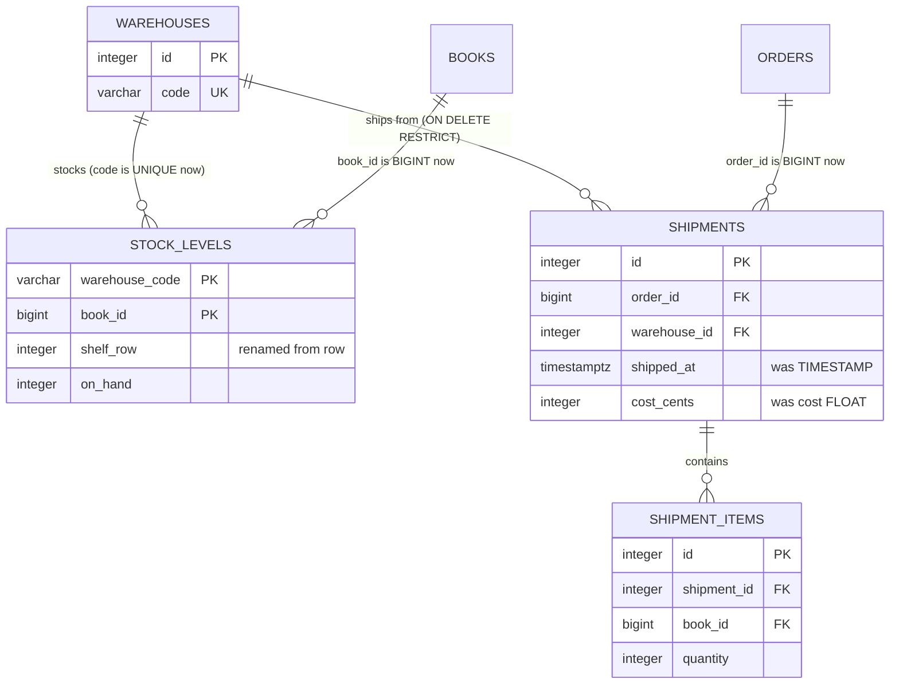

# Fix what Problems finds

## What you'll build

An empty **Problems** tab, and a warehouse schema that deserves it. The import
in walkthrough 09 brought in two errors, ten warnings and a note; you work
through all of them — some with a one-click fix, some with a fix you decline
in favour of a better one, some by hand — until the tab is quiet.

Then you fix two more things Problems never mentioned, because no linter can:
money stored in a `FLOAT`, and a timestamp with no time zone. Knowing where the
linter stops is most of what this walkthrough is for.



## Before you start

You need what [Import an existing schema](09-import-an-existing-schema.md)
leaves behind: seventeen tables, and a **Problems** tab with two errors in it.
Press **Set up the canvas** at the top of this walkthrough in the drawer's
**Walkthrough** tab if it is not already in front of you — this is the one
walkthrough in the series whose starting point is deliberately broken, so
setting it up is the only way to follow along if you skipped 09.

Have **PostgreSQL** selected in the dialect selector: two of the rules below
are dialect-specific. `fk-without-index` never fires on MariaDB, because
InnoDB creates that index for every foreign key automatically, and the
63-character identifier limit is PostgreSQL's — MariaDB's is 64, and SQLite's
is effectively 1000.

If you would rather read the finished thing than fix it yourself, open
[`diagrams/10-fix-what-problems-finds.dbviz.json`](diagrams/10-fix-what-problems-finds.dbviz.json)
with **File → Open** (`Ctrl+O`), or drop it on the canvas.

## The mental model

**Problems** is a linter for the diagram, in the same sense a linter is for
code: static analysis that runs on your keystrokes, not on a database. A table
node is a `CREATE TABLE` statement with a position — that's the whole model this
series keeps coming back to — and Problems reads that statement (and every
other table's) the moment you change it, no connection required. That's why it
can tell you `stock_levels → warehouses references warehouses(code), which is
not a primary key or UNIQUE` before you've ever run the script, but also why it
has no idea whether your live database already has an index that would make a
warning moot — more on that in Gotchas.

Every finding carries a **severity**, and the severity is really answering one
question: what happens if you ship this as-is?

- **Error** — the generated script is wrong. PostgreSQL will reject the
  statement outright (a foreign key onto a column nothing makes unique), or
  accept it and then fail the first time it fires (`ON DELETE SET NULL`
  against a column that can never be null). This is the only severity the
  `lint clean` check in this walkthrough's own front matter looks at.
- **Warning** — the script is valid SQL, but it will cost you later: a join
  that scans a table it should have indexed, a 32-bit column pointing at a
  64-bit key, an identifier PostgreSQL will silently truncate.
- **Note** — worth knowing, not wrong. A many-to-many join table, a reserved
  word, a foreign key that crosses into a database you don't own — all
  deliberate patterns this series uses elsewhere, all things Problems still
  mentions so you notice them on purpose rather than by accident.

Most rules carry a **one-click fix** — a small mutation of the diagram,
exactly like any edit you'd make by hand, which is why it's one `Ctrl+Z` away
from undone. Those fixes are further split into **safe** and not: a safe fix
only *adds* (an index, a key, a wider type), so **Fix all safe** can apply
every one of them at once without changing what an existing query means. An
unsafe fix renames or removes something, and stays a deliberate click.

The important thing this walkthrough is really teaching is the third
category — the rules that *do not exist*. Problems reads types, keys,
constraints and names. It does not read intent. `cost FLOAT` is perfectly
legal SQL and perfectly wrong for money; `shipped_at TIMESTAMP` is legal SQL
and wrong for anything that crosses a time zone. No linter will ever tell you
about either, because nothing in the schema says those columns are money and
time. An empty **Problems** tab means "nothing here is broken", never
"nothing here is a mistake".

## Steps

### 1. Read the baseline

<!-- step
target: panel:problems
goals:
  - open | problems
  - lint errors | 2
hint: This is the baseline you are about to clear, so the tick goes away as you fix things.
transient: true
-->

Open the bottom drawer → **Problems**. Fourteen findings: two errors, ten
warnings, two notes. Read the whole list once before touching anything —
Problems sorts by severity, so the two things that will actually stop the
script from running are at the top. (One of the notes, about the foreign key
into the CRM, is not from the import at all: it has been there since
walkthrough 03 and it is correct.)

Every finding names the table or connection it is about, and every table name
inside a message is a link: click one and the canvas selects and centres that
table. That is usually faster than hunting for it.

**You should see:** fourteen findings, and the tab's badge showing `2` — the
badge counts errors only, which is why it stayed dark through nine
walkthroughs of accumulating warnings.

### 2. Fix the first error with its one-click fix

<!-- step
target: panel:problems
goals:
  - unique index | warehouses (code)
-->

The first error reads:

```
stock_levels → warehouses references warehouses(code), which is not a primary
key or UNIQUE. PostgreSQL and SQLite reject the constraint.
```

`warehouses.code` is `NOT NULL`, which the warehouse team clearly thought was
enough. It is not: a foreign key needs its target to be *unique*, because
otherwise "the warehouse with code `LDN1`" might be two rows. Click the
finding's fix, **Add a unique index on warehouses(code)**.

**You should see:** the error disappear, and `warehouses` gain
*Indexes (1)* — a unique index on `code`. The SQL tab grows
`CREATE UNIQUE INDEX warehouses_code_key ON public.warehouses (code);`

### 3. Decline the second error's fix, and do it properly

<!-- step
target: field:On delete
goals:
  - ondelete | shipments -> warehouses : RESTRICT
-->

The second error reads:

```
shipments → warehouses uses SET NULL, but shipments.warehouse_id is NOT NULL,
so the action can never succeed.
```

Its one-click fix is **Allow NULL in warehouse_id**, and it is the wrong fix.
It is *safe* in the technical sense — it only widens what the column accepts —
but it answers the question backwards: a shipment without a warehouse is not a
thing that should exist, so the column is right and the `ON DELETE` is wrong.

Select the `shipments` → `warehouses` connection instead, and change **On
delete** from *SET NULL* to *RESTRICT*. Now deleting a warehouse that still has
shipments is refused, which is what anyone deleting a warehouse should want to
find out.

**You should see:** the error disappear, `warehouse_id` still `NOT NULL`, and
`ON DELETE RESTRICT` in the shipments constraint in the SQL tab. Errors: none.

### 4. Give stock_levels a primary key — but not the one offered

<!-- step
target: section:Columns
goals:
  - flags | stock_levels.warehouse_code : pk
  - flags | stock_levels.book_id : pk
-->

Next warning:

```
Table "stock_levels" has no primary key; rows cannot be addressed or
referenced reliably.
```

The fix offers **Add an id primary key**, and again: not this time. A surrogate
`id` on `stock_levels` would let the table hold the same book in the same
warehouse twice, which is exactly the mistake the missing key is hiding. The
grain of this table is one book in one warehouse.

Select `stock_levels` and tick **PK** on both `warehouse_code` and `book_id`.

**You should see:** key glyphs on both columns, `PRIMARY KEY (warehouse_code,
book_id)` in the SQL tab, and *two* findings gone rather than one — the
`fk-without-index` warning on `stock_levels(warehouse_code)` cleared itself,
because a primary key is an index and `warehouse_code` leads it.

### 5. Take the three type mismatches

<!-- step
target: panel:problems
goals:
  - column | stock_levels.book_id : BIGINT
  - column | shipment_items.book_id : BIGINT
  - column | shipments.order_id : BIGINT
-->

Three warnings, all the same shape:

```
stock_levels.book_id is INTEGER but references books.id, which is BIGSERIAL.
shipment_items.book_id is INTEGER but references books.id, which is BIGSERIAL.
shipments.order_id is INTEGER but references orders.id, which is BIGSERIAL.
```

These are the ones you caused by accepting suggestions in the last
walkthrough, and they are worth reading rather than clicking past. A 32-bit
column pointing at a 64-bit key works fine right up to row 2,147,483,647, at
which point it stops working in the worst possible way — the parent inserts,
the child cannot reference it. The warehouse script was written when `INTEGER`
looked like plenty.

Each has a safe one-click fix (**Make book_id BIGINT**, and so on). Take all
three.

**You should see:** the three warnings gone, and `BIGINT` in place of
`INTEGER` on those columns in the SQL tab.

### 6. Sweep up the indexes and the duplicate

<!-- step
target: panel:problems
goals:
  - index | shipments (order_id)
  - index | shipments (warehouse_id)
  - index | shipment_items (shipment_id)
  - index | shipment_items (book_id)
  - indexes | 11
-->

What is left is mechanical: four unindexed foreign keys and one table indexed
twice on the same column. Press **Fix all safe** at the top of the tab.

It applies every remaining safe fix in one go — the four `CREATE INDEX`es, and
the removal of the duplicate `idx_sl_book` — and leaves anything unsafe alone.
This is what the button is for: once you have made the judgement calls
yourself, the rest is bookkeeping.

**You should see:** the warning list empty, eleven indexes across the diagram,
and only notes left.

### 7. Read what is left, and rename one column anyway

<!-- step
target: section:Columns
goals:
  - column | stock_levels.shelf_row : INTEGER
  - no column | stock_levels.row
-->

No errors, no warnings, two notes. One of them is the CRM foreign key from
walkthrough 03, which is correct and stays. The other came in with the
import:

```
"stock_levels.row" is a reserved word; it will be quoted everywhere.
```

Notes are not defects. `ROW` means something to SQL, so the generator quotes
it — `"row" INTEGER` — and everything works. What it costs is every
hand-written query forever: forget the quotes once and you get a syntax error
that does not mention the column.

That is a real enough cost to act on here. Select `stock_levels`, press `F2`
on the `row` column — or click its name cell — and rename it `shelf_row`.

Renaming a column is not something Problems will do for you, and that is
deliberate: a rename is the one edit that can break something outside the
diagram, because a query somewhere may name the old column. The linter will
point at the smell; whether it is worth the blast radius is yours to decide.

**You should see:** the reserved-word note gone and `shelf_row INTEGER` —
unquoted — in the SQL tab. What is left in **Problems** is two notes, neither
of them a defect: the CRM foreign key, and `stock_levels links warehouses and
books (many-to-many)`, which appeared the moment step 4 made both of its
foreign-key columns the primary key.

### 8. Fix the two things Problems never mentioned

<!-- step
target: section:Columns
goals:
  - column | shipments.cost_cents : INTEGER
  - no column | shipments.cost
  - flags | shipments.cost_cents : nn
  - default | shipments.cost_cents : 0
  - check | shipments.cost_cents : cost_cents >= 0
  - column | shipments.shipped_at : TIMESTAMPTZ
-->

Empty tab, still-broken schema. Two columns are wrong in ways no linter can
see:

`shipments.cost` is a `FLOAT`. It is money. Binary floating point cannot
represent 0.10, so a column of shipping costs will drift by fractions of a
penny and then disagree with the accounts. Rename it `cost_cents`, change its
type to `INTEGER`, tick **NN**, set its default to `0` and its check to
`cost_cents >= 0` — the same shape as every other money column in this schema
since walkthrough 01.

`shipments.shipped_at` is a `TIMESTAMP`. It is a moment in time that a
warehouse in another time zone will read. Change it to `TIMESTAMPTZ`, like
every other timestamp in the diagram.

Neither change makes any difference to what Problems says, before or after.

**You should see:** `cost_cents INTEGER NOT NULL DEFAULT 0 CHECK (cost_cents
>= 0)` and `shipped_at TIMESTAMPTZ` in the SQL tab — and **Problems** exactly
as empty as it was when both columns were wrong.

### 9. Give the imported tables a schema

<!-- step
target: field:Schema
goals:
  - schema | warehouses : public
  - schema | stock_levels : public
  - schema | shipments : public
  - schema | shipment_items : public
  - lint clean
-->

One last inconsistency from the import: the four warehouse tables generate as
`CREATE TABLE warehouses`, while your thirteen say `CREATE TABLE
public.warehouses`. Select each of the four and type `public` into *Schema* in
the inspector.

**You should see:** every `CREATE TABLE` in the script schema-qualified, and
the constraint on `stock_levels` now reading `REFERENCES public.warehouses
(code)`.

## Other ways to do it

- **`Ctrl+K`**, then type "problems" → **Open Problems tab**, if you'd rather
  not reach for the drawer.
- **Right-click a column row** → *Primary key*, *Not null*, *Unique*,
  *Auto-increment*, or *Create index on this column* make the same edits
  several one-click fixes make (`missing-primary-key`, `fk-without-index`),
  without opening Problems at all.
- Every fix is just a diagram mutation, so anything a fix does you can also
  type directly into the `.dbviz.json` and check with
  `node scripts/validate-dbviz.mjs file.dbviz.json` before reopening it.
- **`Ctrl+K`** also jumps straight to any table by name — the same destination
  a finding's chip takes you to, if you already know which table you're after.
- **Click a table name in the message itself.** Any table the message mentions
  is a link, which is the quickest way to the *other* table in a finding about
  two of them.

## Check your work

Open the bottom drawer → **SQL**, leave it on *Whole schema*, and read the
four warehouse tables back. This is what nine steps of fixing produced:

```sql
CREATE TABLE public.warehouses (
  id INTEGER GENERATED BY DEFAULT AS IDENTITY PRIMARY KEY,
  code VARCHAR(8) NOT NULL,
  name VARCHAR(120),
  city VARCHAR(120)
);
CREATE UNIQUE INDEX warehouses_code_key ON public.warehouses (code);

CREATE TABLE public.shipments (
  id INTEGER GENERATED BY DEFAULT AS IDENTITY PRIMARY KEY,
  order_id BIGINT NOT NULL,
  warehouse_id INTEGER NOT NULL,
  shipped_at TIMESTAMPTZ,
  cost_cents INTEGER NOT NULL DEFAULT 0 CHECK (cost_cents >= 0),
  CONSTRAINT fk_shipments_warehouses FOREIGN KEY (warehouse_id) REFERENCES public.warehouses (id) ON DELETE RESTRICT,
  CONSTRAINT fk_shipments_orders FOREIGN KEY (order_id) REFERENCES public.orders (id)
);
CREATE INDEX idx_shipments_order_id ON public.shipments (order_id);
CREATE INDEX idx_shipments_warehouse_id ON public.shipments (warehouse_id);

CREATE TABLE public.stock_levels (
  warehouse_code VARCHAR(8) NOT NULL,
  book_id BIGINT NOT NULL,
  aisle VARCHAR(4),
  shelf_row INTEGER,
  on_hand INTEGER DEFAULT 0,
  reorder_at INTEGER DEFAULT 0,
  PRIMARY KEY (warehouse_code, book_id),
  CONSTRAINT fk_stock_levels_warehouses FOREIGN KEY (warehouse_code) REFERENCES public.warehouses (code),
  CONSTRAINT fk_stock_levels_books FOREIGN KEY (book_id) REFERENCES public.books (id)
);
CREATE INDEX stock_levels_book_id_idx ON public.stock_levels (book_id);
```

Compare it line by line with the same three tables in
[the previous walkthrough](09-import-an-existing-schema.md#check-your-work) if
you want to see how much of an import is really the twenty minutes after it.

Then press **Check my work** at the foot of this walkthrough. The check that
matters most is the first one:

```
lint clean
```

The walkthrough before this one asserted `lint errors | 2`. This one asserts
zero. That pair of checks is the whole arc of these two walkthroughs, written
down where CI can see it.

Two of its other checks — `cost_cents INTEGER NOT NULL DEFAULT 0 CHECK
(cost_cents >= 0)` and no `"row" INTEGER` anywhere — exist precisely because
**Problems** cannot check them for you. If a walkthrough teaches something a
linter cannot see, its checks have to.

## Try it yourself

- Switch the dialect selector to **MariaDB** and reopen **Problems**. Four of
  the warnings you cleared in step 6 would never have appeared: InnoDB creates
  an index for every foreign key automatically, so `fk-without-index` is a
  PostgreSQL and SQLite rule only. Switch back before going on.
- `Ctrl+Z` back to the broken diagram and press **Fix all safe** immediately,
  before making any judgement calls. Read what it does: it takes the *wrong*
  fix in step 3 (nullable `warehouse_id`) and the wrong one in step 4 (a
  surrogate `id` on `stock_levels`), because both are technically safe. Safe
  means "adds rather than removes", not "correct". `Ctrl+Z` back out.
- Use the severity dropdown at the top of the tab to show **Errors** only,
  then **Warnings** only. On a schema with two hundred findings this is how
  you work: clear every error, then decide which warnings are worth the
  churn.
- Delete the unique index you added in step 2 and watch the error come back
  instantly — findings are recomputed on every keystroke, not on a button.

## Reference

The thirteen findings the warehouse import produced, grouped the way
**Problems** groups them, with the exact message and what leaving it costs
you. Every rule here is one the linter can raise on any diagram — this one just
happened to collect a representative set.

### Errors

| Problems says | Costs you | Fix |
| --- | --- | --- |
| `stock_levels → warehouses references warehouses(code), which is not a primary key or UNIQUE. PostgreSQL and SQLite reject the constraint.` | `REFERENCES warehouses (code)` fails at `CREATE TABLE` time. | **Add a unique index on warehouses(code)** (safe). Step 2. |
| `shipments → warehouses uses SET NULL, but shipments.warehouse_id is NOT NULL, so the action can never succeed.` | Legal DDL that fails the moment it fires — an incident, not a review comment. | **Allow NULL in warehouse_id** (safe) — only right if a shipment can lose its warehouse; otherwise change **On delete** by hand, which is what step 3 does. |

### Warnings

| Problems says | Costs you | Fix |
| --- | --- | --- |
| `Table "stock_levels" has no primary key; rows cannot be addressed or referenced reliably.` | Nothing can reference a row of `stock_levels`, and nothing stops the same book being stocked twice in one warehouse. | **Add an id primary key** (safe) — but a surrogate key hides the duplicate; step 4 picks the real one by hand. |
| `stock_levels.book_id is INTEGER but references books.id, which is BIGSERIAL.` (and two more like it) | Valid SQL with a smaller range than the column it points at — exactly what a rushed migration leaves behind. | **Make book_id BIGINT** (safe). Step 5. |
| `shipments(order_id) references orders but has no index; PostgreSQL does not add one, so deletes on orders and joins scan shipments.` (and three more like it) | Every join on that column and every delete from the parent scans the child. | **Index shipments(order_id)** (safe), or **Fix all safe** for the lot. Step 6. |
| `Table "stock_levels" indexes (book_id) twice.` | Two indexes doing the same job: double the write cost, double the storage, zero extra query speed. | **Remove the duplicate index** (safe). Step 6. |

### Notes

| Problems says | Why it's fine to leave |
| --- | --- |
| `"stock_levels.row" is a reserved word; it will be quoted everywhere.` | `ROW` means something to SQL, so the generator quotes it and everything works. It only bites hand-written queries that forget the quotes — which is why step 7 renames it anyway. |
| `stock_levels links warehouses and books (many-to-many).` | That is the table's job: a note saying "this shape is a join table", not a defect. It appeared the moment step 4 made both foreign-key columns the primary key. |
| `customers references crm_contacts, which lives in another database; the script documents the link instead of creating a constraint.` | The point of walkthrough 03: a script cannot create a constraint into a database it does not own, so it documents the link instead. |

### And the ones that are not in the list

| What is wrong | Why Problems is silent | Where it is fixed |
| --- | --- | --- |
| `shipments.cost` is a `FLOAT` holding money | Nothing in a schema says a column is money. `FLOAT` is a legal, sensible type for plenty of columns. | Step 8, by hand |
| `shipments.shipped_at` is a `TIMESTAMP`, not `TIMESTAMPTZ` | Both are legal timestamp types; which one is right depends on whether the value crosses a time zone, which only you know. | Step 8, by hand |
| The imported tables have no schema | An unqualified table name is valid, and plenty of schemas use the default search path deliberately. | Step 9, by hand |

## Gotchas

- **The linter checks the diagram, not a database.** It cannot see live data
  or an index someone already added by hand on a real server — it only knows
  what's drawn. Diffing the diagram against an actual connection is
  **Migrate**'s job (bottom drawer → **Database** → **Migrate**), not
  Problems'.
- **A warning is not always wrong.** `missing-primary-key` fires on every
  table with no primary key, including one where that's deliberate (an
  append-only log, a staging table nobody queries by row). The rule's job is
  to make you look, not to insist on one answer.
- **An empty Problems tab is not a clean schema.** It means nothing the linter
  knows how to check is broken. Money in a `FLOAT`, a timestamp with no zone, a
  column that should have been an enum, a table that should not exist — all of
  those survive an empty tab, which is why steps 8 and 9 come after step 7.
- **A one-click fix is just another edit to the diagram.** It changes the
  diagram, not a database, and it's undoable with `Ctrl+Z` exactly like any
  other change — including the fixes you probably shouldn't take (steps 3 and 4).
- **The Problems tab's own badge only counts errors.** A table can carry
  warnings or notes and the tab shows no number at all; you have to open it to
  see the rest. Don't read "no badge" as "nothing to see."
- **`fk-without-index` never fires on MariaDB.** InnoDB creates that index for
  every foreign key automatically, so the rule is PostgreSQL- and
  SQLite-specific — see **Try it yourself**.
- **Suggested foreign keys' "Add foreign key" button doesn't know your
  intent.** It creates a plain constraint with `NO ACTION` / `NO ACTION` and an
  auto-generated name — it can't know you wanted `ON DELETE RESTRICT` or a
  specific constraint name. Check the connection afterward if you take a
  suggestion.

## Where to go next

- [Trace a path between tables](11-trace-a-path-between-tables.md) — next in
  the series. Every foreign key on this schema is now real and correct, which
  is exactly the precondition **Trace** needs: it walks the connections you
  drew, so a path is only as trustworthy as the keys under it. It also adds
  `reviews`, which gives `books` and `customers` a second route between them
  and Trace something to choose between.
