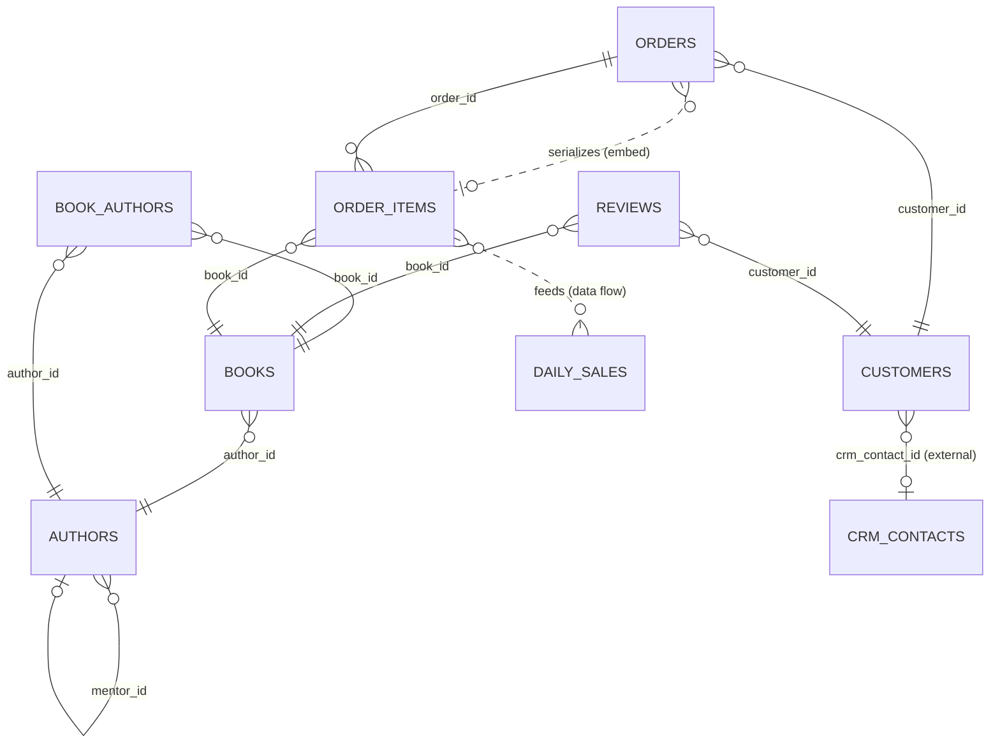

# Fix what Problems finds

## What you'll build

The same bookshop cast this whole series uses, wired the way it should be: authors
who can credit more than one book, a foreign key into a CRM your team does not
own, an order that keeps a serialized snapshot of its line items, and a data flow
that rolls `order_items` up into `daily_sales`. Every error and warning the
**Problems** tab can catch on this schema has already been resolved — you'll spend
this walkthrough reintroducing a handful of them on purpose, reading exactly what
the linter says, and deciding what to do about it.



## Before you start

Read [Connect two tables](02-connect-two-tables.md) first if you haven't — this
walkthrough assumes you already know what a foreign key's column pairs are, since
half of what **Problems** catches is about them. Have **PostgreSQL** selected in
the dialect selector: two of the rules below are dialect-specific.
`fk-without-index` never fires on MariaDB, because InnoDB creates that index for
every foreign key automatically, and the 63-character identifier limit you'll see
in this walkthrough is PostgreSQL's — MariaDB's is 64, and SQLite's is
effectively 1000.

If you would rather read the finished thing than reproduce every mistake,
open [`diagrams/10-fix-what-problems-finds.dbviz.json`](diagrams/10-fix-what-problems-finds.dbviz.json)
with **File → Open** (`Ctrl+O`), or drop it on the canvas.

## The mental model

**Problems** is a linter for the diagram, in the same sense a linter is for
code: static analysis that runs on your keystrokes, not on a database. A table
node is a `CREATE TABLE` statement with a position — that's the whole model this
series keeps coming back to — and Problems reads that statement (and every
other table's) the moment you change it, no connection required. That's why it
can tell you `order_items → orders references orders(id), which is not a
primary key or UNIQUE` before you've ever run the script, but also why it has
no idea whether your live database already has an index that would make a
warning moot — more on that in Gotchas.

Every finding carries a **severity**, and the severity is really answering one
question: what happens if you ship this as-is?

- **Error** — the generated script is wrong. PostgreSQL will reject the
  statement outright (two columns named `quantity`), or accept it and quietly
  do nothing (`ON DELETE SET NULL` against a column that can never be null).
  This is the only severity the `lint clean` check in this walkthrough's own
  front matter looks at.
- **Warning** — the script is valid SQL, but it will cost you later: a join
  that scans a table it should have indexed, an identifier PostgreSQL will
  silently truncate.
- **Note** — worth knowing, not wrong. A many-to-many join table, a reserved
  word, a foreign key that crosses into a database you don't own — all
  deliberate patterns this series uses elsewhere, all things Problems still
  mentions so you notice them on purpose rather than by accident.

Ten of the eighteen rules below carry a **one-click fix** — a small mutation of
the diagram, exactly like any edit you'd make by hand, which is why it's one
`Ctrl+Z` away from undone. The other eight tell you what's wrong and where, and
leave the decision to you, because the "fix" isn't mechanical: pairing up a
foreign key's columns, or choosing which JSONB column a serialized connection
lives in, needs a human to pick the right column.

Here is roughly where this walkthrough's diagram started, before every one of
those fixes landed — trimmed to the parts that show the mistakes, taken
verbatim from the app's own **SQL** tab rather than retyped:

```sql
CREATE TABLE public.authors (
  id BIGSERIAL PRIMARY KEY,
  name TEXT NOT NULL,
  country CHAR(2),
  mentor_id BIGINT NOT NULL,                -- NOT NULL, but nothing can be the first author
  CONSTRAINT authors_mentor_id_fkey FOREIGN KEY (mentor_id) REFERENCES public.authors (id)
);

CREATE TABLE public.books (
  id BIGSERIAL PRIMARY KEY,
  author_id INTEGER NOT NULL,               -- authors.id is BIGSERIAL (64-bit); this is 32
  ...
  CONSTRAINT books_author_id_fkey FOREIGN KEY (author_id) REFERENCES public.authors (id)
);
-- (no CREATE INDEX for author_id at all)

CREATE TABLE public.orders (
  id BIGSERIAL,                             -- never marked PRIMARY KEY
  customer_id BIGINT NOT NULL,
  ...
);
CREATE INDEX idx_orders_customer_id ON public.orders (customer_id);
CREATE INDEX idx_orders_customer_id_2 ON public.orders (customer_id);   -- the same index, twice

CREATE TABLE public.order_items (
  id BIGSERIAL PRIMARY KEY,
  order_id BIGINT NOT NULL,                 -- -> orders.id, which has no key: see above
  book_id BIGINT NOT NULL,
  quantity INTEGER NOT NULL DEFAULT 1 CHECK (quantity > 0),
  quantity INTEGER NOT NULL DEFAULT 1,      -- the same column, twice
  unit_price_at_time_of_purchase_before_any_applicable_discounts_were_taken_off_cents INTEGER NOT NULL,
  CONSTRAINT order_items_book_id_fkey FOREIGN KEY (book_id) REFERENCES public.books (id) ON DELETE SET NULL
  -- book_id is NOT NULL, so ON DELETE SET NULL can never run
);

CREATE TABLE public.daily_sales (
  
);                                           -- not valid SQL: an empty column list

CREATE TABLE public.reviews ( id BIGSERIAL PRIMARY KEY, book_id BIGINT NOT NULL, ... );
CREATE TABLE public.reviews ( id BIGSERIAL PRIMARY KEY, book_id BIGINT NOT NULL, ... );
-- reviews, twice: a duplicated table nobody renamed. Its "book_id -> books" foreign
-- key never got a target column picked either, so no REFERENCES clause was written.
```

Every one of those got a name and a message in **Problems**. The full catalog,
with the exact text and what each one costs, is in **Reference** below.

## Steps

### 1. Open the diagram and read the baseline

Open [`diagrams/10-fix-what-problems-finds.dbviz.json`](diagrams/10-fix-what-problems-finds.dbviz.json)
with **File → Open** (`Ctrl+O`), then open the bottom drawer's **Problems** tab.

**You should see:** three badges reading `0 errors`, `0 warnings`, `3 notes`; no
red badge on the **Problems** tab itself (it only appears once the error count
is above zero); and, in the right-hand **Suggested foreign keys** column, one
entry — `daily_sales.book_id` → `books.id`.

### 2. Reintroduce a type slip

Select `books`, click the type cell of the `author_id` row, and change
`BIGINT` back to `INTEGER`.

**You should see:** the warning badge tick up to `1`, and a new entry under
Warnings reading `books.author_id is INTEGER but references authors.id, which
is BIGSERIAL.`

### 3. Take the fix

Click that finding's **Make author_id BIGINT** button.

**You should see:** the warning disappear, the warning badge drop back to `0`,
and the **SQL** tab's `author_id` line read `BIGINT NOT NULL` again.

### 4. Reintroduce a missing index

Still on `books`, scroll the inspector to **Indexes (1)** and click the trash
icon (titled *Delete index*) beside `idx_books_author_id`.

**You should see:** a new warning: `books(author_id) references authors but
has no index; PostgreSQL does not add one, so deletes on authors and joins
scan books.`

### 5. Fix it with the sweep button instead

In the Problems toolbar, click **Fix all safe (1)**.

**You should see:** the warning clear, and `idx_books_author_id` reappear
under **Indexes (1)** on `books` — the same fix as the finding's own button,
reached a different way. With more than one safe fix outstanding, this button
applies all of them in a single `Ctrl+Z` step.

### 6. Reintroduce a genuine error

Select `order_items`, press `F2`, and rename it to `reviews` — the exact name
a different table three rows down already has.

**You should see:** the error badge jump to `1`, a red badge appear on the
**Problems** tab itself, and a new entry: `Two tables are named "reviews" in
schema public.` Click its chip — it reads `reviews`, and it selects the
*original* `reviews` table, not the one you just renamed: the linter reports
whichever table it reaches second while scanning the diagram in order.

### 7. Notice the offered fix targets the wrong table

Read that finding's fix, **Rename to reviews_2** — and don't click it. It
would rename the table it's pointing at (the original `reviews`) to
`reviews_2`, leaving your renamed `order_items` permanently stuck as
`reviews` and the real reviews table orphaned under the wrong name. Press
`Ctrl+Z` instead.

**You should see:** the table's name revert to `order_items`, the error badge
drop back to `0`, and the tab's red badge disappear.

### 8. Watch a note appear

Select `authors` and click **NN** on the `mentor_id` row to turn it on.

**You should see:** a new entry under Notes: `authors references itself
through a NOT NULL column, so the first row can only be inserted if it points
at itself.` Neither the error nor the warning badge changes — notes never gate
anything.

### 9. Fix it anyway, by hand

Click **NN** on `mentor_id` again to turn it back off.

**You should see:** the note disappear. There's no one-click fix for this
rule (nothing to compute: only you know whether `mentor_id` should ever be
required), so toggling the flag back is the fix.

### 10. Filter down to what's left on purpose

Set the severity dropdown to **Notes only**.

**You should see:** exactly three entries: the reserved word on
`books.condition`, the many-to-many note on `book_authors`, and the external
reference from `customers` to `crm_contacts`. Click the `book_authors` chip
(hover it first — it reads *Show on the canvas*).

**You should see:** the canvas focus on `book_authors` and the inspector
switch to it.

The chip is not the only way there. Every table name *inside* a finding's
message text is a link too — in `book_authors links authors and books
(many-to-many)`, all three names are clickable and each jumps to that table.
That matters most on the findings that name two tables, where the chip can only
take you to one of them: on a `fk-without-index` warning that opens
`daily_sales(book_id) references books but has no index; …`, the chip goes to
`daily_sales`, and clicking `books` in the message is the only one-click route
to the other end.

### 11. Read a suggestion, and know when to leave it

Set the severity dropdown back to **All severities**. In **Suggested foreign
keys**, read the one entry: `daily_sales.book_id` → `books.id`, with the
reason `book_id follows the book_id convention and books has a single primary
key`.

**You should see:** a `likely` badge and an **Add foreign key** button — which
this walkthrough does not press. `daily_sales` is a rollup fed by the data
flow below it, not a table you want a live `REFERENCES` constraint tying to
`books`; the suggestion is a naming-convention guess, not a structural finding,
so taking it is optional in a way an error never is.

## Other ways to do it

- **`Ctrl+K`**, then type "problems" → **Open Problems tab**, if you'd rather
  not reach for the drawer.
- **Right-click a column row** → *Primary key*, *Not null*, *Unique*,
  *Auto-increment*, or *Create index on this column* make the same edits
  several one-click fixes make (`missing-primary-key`, `fk-without-index`),
  without opening Problems at all.
- Every fix is just a diagram mutation, so anything a fix does you can also
  type directly into the `.dbviz.json` and check with
  `node scripts/validate-dbviz.mjs file.dbviz.json` before reopening it.
- **`Ctrl+K`** also jumps straight to any table by name — the same destination
  a finding's chip takes you to, if you already know which table you're after.
- **Click a table name in the message itself.** Any table the message mentions
  is a link, which is the quickest way to the *other* table in a finding about
  two of them.

## Check your work

Open the bottom drawer → **SQL**, leave it on *Whole schema*, and compare —
this is the app's real output for the finished diagram:

```sql
-- Fix what Problems finds — a clean bookshop (PostgreSQL)
-- Generated by Database Visualizer
-- Tables: 8, foreign keys: 9, documented connections: 2
-- 1 table(s) live in another database and are not created here; see "External sources" at the end.

CREATE TABLE public.authors (
  id BIGSERIAL PRIMARY KEY,
  name TEXT NOT NULL,
  country CHAR(2),
  mentor_id BIGINT,
  CONSTRAINT authors_mentor_id_fkey FOREIGN KEY (mentor_id) REFERENCES public.authors (id)
);
CREATE INDEX idx_authors_mentor_id ON public.authors (mentor_id);

CREATE TABLE public.books (
  id BIGSERIAL PRIMARY KEY,
  author_id BIGINT NOT NULL,
  title TEXT NOT NULL,
  isbn CHAR(13) NOT NULL UNIQUE,
  price_cents INTEGER NOT NULL DEFAULT 0 CHECK (price_cents >= 0),
  published_on DATE,
  "condition" VARCHAR(20) NOT NULL DEFAULT 'used' CHECK (condition IN ('new', 'used', 'like_new')),
  CONSTRAINT books_author_id_fkey FOREIGN KEY (author_id) REFERENCES public.authors (id)
);
CREATE INDEX idx_books_author_id ON public.books (author_id);

CREATE TABLE public.book_authors (
  book_id BIGINT NOT NULL,
  author_id BIGINT NOT NULL,
  PRIMARY KEY (book_id, author_id),
  CONSTRAINT book_authors_book_id_fkey FOREIGN KEY (book_id) REFERENCES public.books (id),
  CONSTRAINT book_authors_author_id_fkey FOREIGN KEY (author_id) REFERENCES public.authors (id)
);
CREATE INDEX idx_book_authors_author_id ON public.book_authors (author_id);

CREATE TABLE public.customers (
  id BIGSERIAL PRIMARY KEY,
  email TEXT NOT NULL UNIQUE,
  crm_contact_id BIGINT,
  created_at TIMESTAMPTZ NOT NULL DEFAULT now()
);
CREATE INDEX idx_customers_crm_contact_id ON public.customers (crm_contact_id);

CREATE TABLE public.orders (
  id BIGSERIAL PRIMARY KEY,
  customer_id BIGINT NOT NULL,
  status TEXT NOT NULL DEFAULT 'pending',
  total_cents INTEGER NOT NULL DEFAULT 0,
  placed_at TIMESTAMPTZ NOT NULL DEFAULT now(),
  items_snapshot JSONB,
  CONSTRAINT orders_customer_id_fkey FOREIGN KEY (customer_id) REFERENCES public.customers (id)
);
CREATE INDEX idx_orders_customer_id ON public.orders (customer_id);

CREATE TABLE public.order_items (
  id BIGSERIAL PRIMARY KEY,
  order_id BIGINT NOT NULL,
  book_id BIGINT NOT NULL,
  quantity INTEGER NOT NULL DEFAULT 1 CHECK (quantity > 0),
  unit_price_cents INTEGER NOT NULL,
  CONSTRAINT order_items_order_id_fkey FOREIGN KEY (order_id) REFERENCES public.orders (id),
  CONSTRAINT order_items_book_id_fkey FOREIGN KEY (book_id) REFERENCES public.books (id) ON DELETE RESTRICT
);
CREATE INDEX idx_order_items_order_id ON public.order_items (order_id);
CREATE INDEX idx_order_items_book_id ON public.order_items (book_id);

CREATE TABLE public.reviews (
  id BIGSERIAL PRIMARY KEY,
  book_id BIGINT NOT NULL,
  customer_id BIGINT NOT NULL,
  rating SMALLINT NOT NULL CHECK (rating BETWEEN 1 AND 5),
  posted_at TIMESTAMPTZ NOT NULL DEFAULT now(),
  CONSTRAINT reviews_book_id_fkey FOREIGN KEY (book_id) REFERENCES public.books (id),
  CONSTRAINT reviews_customer_id_fkey FOREIGN KEY (customer_id) REFERENCES public.customers (id)
);
CREATE INDEX idx_reviews_book_id ON public.reviews (book_id);
CREATE INDEX idx_reviews_customer_id ON public.reviews (customer_id);

-- ----------------------------------------------------------------
-- External sources: other databases this schema reads from.
-- Nothing below is executed; it is here so the script documents where the data comes from.
--
-- CRM (read-only) (1 table)
--   Vendor CRM reached over a foreign data wrapper. We only ever SELECT from it.
--   crm_contacts (contact_id, email)
--
-- References into CRM (read-only), as foreign keys would look if the tables were local:
-- ALTER TABLE public.customers ADD CONSTRAINT customers_crm_contact_id_fkey FOREIGN KEY (crm_contact_id) REFERENCES crm_contacts (contact_id);

-- ----------------------------------------------------------------
-- Connections the schema does not enforce, and tagged queries
-- (documentation only, not executed)
-- [embed] orders serializes order_items in orders.items_snapshot
-- [flow] order_items feeds daily_sales
--   Built from the derivation metadata:
--   INSERT INTO public.daily_sales (book_id, day, units, revenue_cents)
--   SELECT order_items.book_id, CAST(orders.placed_at AS DATE), SUM(order_items.quantity), SUM(order_items.quantity * order_items.unit_price_cents)
--   FROM public.order_items
--   JOIN public.orders ON orders.id = order_items.order_id
--   GROUP BY order_items.book_id, CAST(orders.placed_at AS DATE);
```

`daily_sales` itself doesn't appear in that listing — table order there follows
foreign-key dependencies, and since nothing points at it, PostgreSQL creates it
wherever the topological sort lands it; open the **SQL** tab yourself to see the
plain `CREATE TABLE public.daily_sales (day DATE NOT NULL, book_id BIGINT NOT
NULL, units INTEGER NOT NULL DEFAULT 0, revenue_cents INTEGER NOT NULL DEFAULT
0, PRIMARY KEY (day, book_id));` alongside it. `crm_contacts` never gets a
`CREATE TABLE` at all — only the external-sources comment above, since it lives
in a database this script doesn't own.

## Try it yourself

- Switch the dialect selector to **MariaDB**. Every `fk-without-index` warning
  you can produce disappears — not because the columns became indexed, but
  because InnoDB creates that index automatically for every foreign key, so
  the rule doesn't apply there. Switch back and they return.
- Rename `order_items.unit_price_cents` to something 70 characters long and
  watch `identifier-too-long` appear, then switch to **SQLite**: the warning
  vanishes even though the name didn't change, because SQLite's limit is 1000
  characters.
- Delete `idx_customers_crm_contact_id` and predict what happens before you
  look: `customers` isn't external, only its target is, so `fk-without-index`
  still fires on it.
- Rename `daily_sales.book_id` to `bookId` (camelCase). **Suggested foreign
  keys** still catches it — `suggest.ts` matches the camelCase convention as
  well as the snake_case one.

## Reference

The eighteen findings this diagram can produce, grouped the way **Problems**
groups them, with the exact message and what leaving it costs you.

### Errors

| Problems says | Costs you | Fix |
| --- | --- | --- |
| `Two tables are named "reviews" in schema public.` | The script emits `CREATE TABLE public.reviews` twice; PostgreSQL runs the first and rejects the second outright. | **Rename to X_2** (not safe — read which table it targets first; see Steps 6-7). |
| `Table "daily_sales" has no columns.` | `CREATE TABLE public.daily_sales ()` isn't valid PostgreSQL — an empty column list. | **Add an id column** (safe) — a start, not a finish. |
| `Table "reviews" has a column with no name.` | The generator skips a nameless column (with its own warning) rather than emit a broken line — it silently never reaches the database. | **Remove the column** (not safe). |
| `Table "order_items" has two columns named "quantity".` | PostgreSQL rejects the statement: `column "quantity" specified more than once`. | **Rename to X_2** (not safe — right only if they're genuinely different columns; here one is a plain duplicate, so delete it instead). |
| `Foreign key reviews → books does not pair up its columns; open the connection and pick a column on each side.` | No `REFERENCES` clause is emitted for that edge at all — invisible to the database. | none — open the connection, **Column pairs**, pick a column on each side. |
| `order_items → orders references orders(id), which is not a primary key or UNIQUE. PostgreSQL and SQLite reject the constraint.` | `REFERENCES orders (id)` fails at `CREATE TABLE` time unless `id` is a key. | **Add a unique index on orders(id)** (safe) — works, but giving `orders` a real primary key (`missing-primary-key`'s own fix) clears this finding too, in one step instead of two. |
| `order_items → books uses SET NULL, but order_items.book_id is NOT NULL, so the action can never succeed.` | Legal DDL that fails the moment it fires — an incident, not a review comment. | **Allow NULL in book_id** (safe) — only right if a line item can lose its book; otherwise change **On delete** to `RESTRICT` by hand, which is what the fixed diagram does. |
| `orders serializes order_items but no column of orders is picked to hold it. Choose one in the inspector.` | The generated script's connections appendix can't say where the JSON actually lives. | none — open the connection, **Stored in column**, pick the JSONB column. |

### Warnings

| Problems says | Costs you | Fix |
| --- | --- | --- |
| `Table "orders" has no primary key; rows cannot be addressed or referenced reliably.` | Nothing can safely reference a row of `orders` — the `fk-target-not-unique` error above is this warning's direct consequence. | **Make id the primary key**, or **Add an id primary key** if there's no `id` column yet (both safe). |
| `books(author_id) references authors but has no index; PostgreSQL does not add one, so deletes on authors and joins scan books.` | Every join on that column and every delete from `authors` scans `books`. | **Index books(author_id)** (safe). Steps 4-5. |
| `books.author_id is INTEGER but references authors.id, which is BIGSERIAL.` | Still valid SQL, but a smaller range than the column it points at — exactly what a rushed migration leaves behind. | **Make author_id BIGINT** (safe). Steps 2-3. |
| `Table "orders" indexes (customer_id) twice.` | Two indexes doing the same job: double the write cost, double the storage, zero extra query speed. | **Remove the duplicate index** (safe). |
| `Column "order_items.unit_price_at_time_of_purchase_before_any_applicable_discounts_were_taken_off_cents" is longer than 63 characters.` | PostgreSQL truncates identifiers past 63 bytes; a second long name that truncates the same way collides. | none — shorten it by hand. |
| `Data flow order_items → daily_sales has 1 derived column without a target column or expression.` | Left out of the generated `INSERT … SELECT` skeleton entirely (with its own generator warning) rather than guessed at. | none — open the flow, fill in the target column and expression. |

### Notes

| Problems says | Why it's fine to leave |
| --- | --- |
| `"books.condition" is a reserved word; it will be quoted everywhere.` | `CONDITION` means something to SQL; PostgreSQL just quotes it (`"condition"`) everywhere it appears. Only bites hand-written queries that forget the quotes. |
| `book_authors links books and authors (many-to-many).` | That's the table's job — a note, not a defect. |
| `customers references crm_contacts, which lives in another database; the script documents the link instead of creating a constraint.` | Also the point: a script can't create a constraint into a database it doesn't own, so it documents the link instead (see **Check your work**). |
| `authors references itself through a NOT NULL column, so the first row can only be inserted if it points at itself.` | Worth fixing here (nullable is simpler than bootstrapping a row that points at itself — Steps 8-9), but stays informational because plenty of self-referencing hierarchies are exactly this on purpose. |

## Gotchas

- **The linter checks the diagram, not a database.** It cannot see live data
  or an index someone already added by hand on a real server — it only knows
  what's drawn. Diffing the diagram against an actual connection is
  **Migrate**'s job (bottom drawer → **Database** → **Migrate**), not
  Problems'.
- **A warning is not always wrong.** `missing-primary-key` fires on every
  table with no primary key, including one where that's deliberate (an
  append-only log, a staging table nobody queries by row). The rule's job is
  to make you look, not to insist on one answer.
- **A one-click fix is just another edit to the diagram.** It changes the
  diagram, not a database, and it's undoable with `Ctrl+Z` exactly like any
  other change — including the fixes you probably shouldn't take (Steps 6-7).
- **The Problems tab's own badge only counts errors.** A table can carry
  warnings or notes and the tab shows no number at all; you have to open it to
  see the rest. Don't read "no badge" as "nothing to see."
- **`fk-without-index` never fires on MariaDB.** InnoDB creates that index for
  every foreign key automatically, so the rule is PostgreSQL- and
  SQLite-specific — see **Try it yourself**.
- **Suggested foreign keys' "Add foreign key" button doesn't know your
  intent.** It creates a plain constraint with `NO ACTION` / `NO ACTION` and an
  auto-generated name — it can't know you wanted `ON DELETE RESTRICT` or a
  specific constraint name. Check the connection afterward if you take a
  suggestion.

## Where to go next

- [Trace a path between tables](11-trace-a-path-between-tables.md) — now that
  every foreign key on this schema is real, ask Trace for the shortest chain
  between any two tables.
- [Add indexes that get used](07-add-indexes.md) — a deeper look at composite
  and unique indexes, and what else Problems catches about them.
- [Import an existing schema](09-import-an-existing-schema.md) — the other
  place **Suggested foreign keys** earns its keep: a DDL dump that never
  declared its constraints in the first place.
