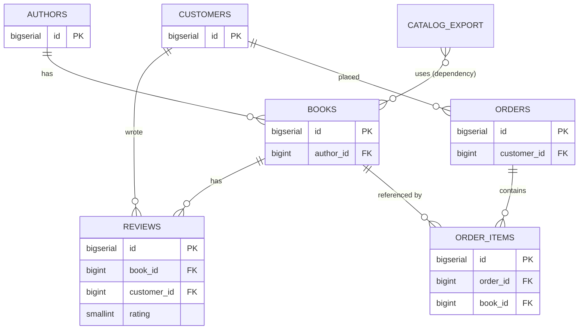

# Trace a path between tables

## What you'll build

One new table — `reviews` — and then no drawing at all. `reviews` matters
because of what it does to the *shape* of the diagram: `books` and `customers`
were already connected through `order_items` and `orders`, three hops apart,
and a review gives them a second, shorter route. Two routes between the same
pair of tables is what makes **Trace** interesting rather than obvious.

The rest of the walkthrough is what you do with a diagram once it exists:
trace three different pairs of tables, read the hop list and generated `JOIN`
for each, send one to the **Query** tab, and watch what happens when a path
runs through the `catalog_export uses books` dependency you drew back in
walkthrough 02 — the one hop on this canvas that no foreign key backs.



## Before you start

You need what [Fix what Problems finds](10-fix-what-problems-finds.md) leaves
behind: seventeen tables, and a **Problems** tab with no errors or warnings in
it. Press **Set up the canvas** at the top of this walkthrough in the drawer's
**Walkthrough** tab if it is not already in front of you.

That matters here in a way it has not before. Trace walks the
connections you drew, so a path is only ever as trustworthy as the foreign
keys under it — an unpaired or backwards key does not make Trace fail, it
makes Trace confidently wrong.

Have **PostgreSQL** selected in the dialect selector; nothing here is
dialect-specific, but the diagram is written in that dialect and switching
would translate its types for no reason.

If you would rather read the finished thing than build it, open
[`diagrams/11-trace-a-path-between-tables.dbviz.json`](diagrams/11-trace-a-path-between-tables.dbviz.json)
with **File → Open** (`Ctrl+O`), or drop the file on the canvas.

## The mental model

Trace is breadth-first search over the diagram treated as one undirected
graph. Every connection — foreign key, data flow, serialized link,
dependency — is an edge you can walk in either direction regardless of which
end is `sourceTableId` and which is `targetTableId`, and Trace returns
whichever path between your two tables uses the fewest edges. That is the
whole algorithm: it counts hops, not meaning, not row counts, not how
expensive a join would be to run. Two tables three hops apart by the route
that answers your actual question and two hops apart by a route that answers
a different question will always return the two-hop route. A shorter path is
not necessarily the one you would write by hand — read the hop list, do not
just trust the badge.

Turning a path into SQL is direct exactly where a foreign key sits: an `fk`
connection carries a pair of columns that the database guarantees line up on
every row, so the generator can write `JOIN … ON left = right` without
inventing anything. A data flow, a serialized link and a dependency carry no
such pair — nothing forces `catalog_export.book_id` to relate to any
particular row of `books` — so the generator cannot write an `ON` clause for
them at all. It
still has to include the table, because the path passed through it, so it
writes `CROSS JOIN` and leaves a comment explaining why there is nothing to
join on. The path is real; only the join condition is missing.

## Steps

### 1. Add reviews

Press `T`, name the new table `reviews`, drop it inside the `shop` region, and
give it:

| Name | Type | Flags | Default | Check |
| --- | --- | --- | --- | --- |
| `id` | `BIGSERIAL` | **PK NN AI** | | |
| `book_id` | `BIGINT` | **NN** | | |
| `customer_id` | `BIGINT` | **NN** | | |
| `rating` | `SMALLINT` | **NN** | | `rating BETWEEN 1 AND 5` |
| `posted_at` | `TIMESTAMPTZ` | **NN** | `now()` | |

Connect `book_id` to `books.id` and `customer_id` to `customers.id`, both
**On delete** *CASCADE* — a review of a deleted book is not worth keeping.
Set the second connection's **Reverse label** to `wrote`. Then clear the two
`fk-without-index` warnings the new keys raise with **Fix all safe**, exactly
as in the last walkthrough.

The shape this creates is the point. `books` and `customers` were already
connected — through `order_items` and `orders`, three hops — and now they are
also connected through `reviews`, two hops. Both routes are real, and they
answer different questions: one is "who bought this", the other is "who
reviewed this".

**You should see:** eighteen tables, thirteen indexes, **Problems** back to no
errors and no warnings, and two lines running out of `reviews` towards `books`
and `customers`.

### 2. Select two tables and trace them

Click the `books` table, then hold `Shift` and click `customers` to add it
to the selection (`Shift+click`). In the top bar, click **Trace**. With two
tables already selected it traces immediately — no pick mode, no dialog.

**You should see:** the bottom drawer opens on its **Trace** tab with a
**2 hops** badge next to the tab label, and on the canvas `books`, `reviews`
and `customers` — plus the two connections between them — light up while
every other table and connection dims. Out of eighteen tables, three stay
bright; on a diagram this size that dimming is most of the value.

### 3. Read the hop list

In the **Trace** tab, look under the table chain `books → reviews →
customers` at the two rows below it.

**You should see:** two rows, each starting with an **FK** chip:
`reviews.book_id = books.id`, then `reviews.customer_id = customers.id` —
the exact `ON` conditions the generated query below is about to use. Click
either chip and the inspector jumps to that connection.

Under **Join along the path**, the query itself:

```sql
SELECT t0.*, t1.*, t2.*
FROM books AS t0
JOIN reviews AS t1 ON t0.id = t1.book_id
JOIN customers AS t2 ON t1.customer_id = t2.id;
```

### 4. Run the join in the Query tab

On the right-hand side of the **Trace** tab, under **Join along the path**,
click **Run**.

**You should see:** the drawer switches to the **Query** tab with the
two-table `JOIN` already sitting in the editor, ready to run against a
connected database with `Ctrl+Enter`. **Copy**, next to **Run**, puts the
same text on the clipboard without leaving the **Trace** tab.

### 5. Compare it with the route Trace did not take

`books` reaches `customers` a second way: `books → order_items → orders →
customers`, three hops instead of two. Trace cannot prefer one meaning over
the other, because it never looks at what a hop means — prove it by tracing
a table that route touches and this one does not. Click `books`, then
`Shift+click` `orders`, then click **Trace** again.

**You should see:** a **2 hops** badge again, but this time the highlighted
route is `books → order_items → orders` — a different pair of connections
than the ones lit up a moment ago for `customers`, because `orders` has no
connection to `reviews` at all. Extend that route by the one hop it is
missing (`orders → customers`) and you get the three-hop path a person asking
"who bought this book" would actually mean. Trace never offers it, because
two is smaller than three.

### 6. Trace across a connection that is not a foreign key

Right-click the `catalog_export` table and choose **Trace from here…**. The
**Trace** tab opens with `catalog_export` already set as **From table…**, and
a banner on the canvas reads "From catalog_export: now click the destination
table." Click `authors`.

**You should see:** a **2 hops** badge and the table chain `catalog_export →
books → authors`. Look at the first row of the hop list: its chip reads
**uses**, not **FK**, and the text is a sentence — `catalog_export uses books
(nightly feed)` — instead of a column pair, because there is no column pair to
show. That edge has been on the canvas since walkthrough 02, documenting a
nightly job; Trace is happy to walk it even though the database knows nothing
about it.

### 7. Read the mixed join it produces

With that same trace still showing, look at **Join along the path** again.

**You should see:**

```sql
SELECT t0.*, t1.*, t2.*
FROM catalog_export AS t0
-- catalog_export uses books (nightly feed): dependency link, no join condition
CROSS JOIN books AS t1
JOIN authors AS t2 ON t1.author_id = t2.id;
```

One `JOIN … ON` and one `CROSS JOIN` with a comment, in the same query — the
generator switches per hop, not per query, based only on whether that one
connection happens to be a foreign key.

### 8. Trace from the drawer tab itself, without touching the canvas

Everything so far started on the canvas or its right-click menu. The
**Trace** tab has its own way in: set **From table…** to `shipments` and
**To table…** to `books` using the two dropdowns at its top, then click
**Trace**.

**You should see:** a **2 hops** badge and the chain `shipments →
shipment_items → books`, reached without selecting or right-clicking
anything. On a diagram this size that is usually the fastest route in — and it
is the only one that works when the table you want is scrolled off-screen,
which the warehouse block generally is.

### 9. Leave trace mode

Press `Esc`. If you are still mid-pick rather than looking at a result,
`Esc` cancels the pick instead; press it again to clear whatever trace is
showing. The **Trace** tab's own **Clear** button does the same thing with
the mouse.

**You should see:** every table and connection returns to full brightness,
the hop-count badge disappears from the drawer tab, and the **From table…**
/ **To table…** dropdowns reset to empty.

## Other ways to do it

- **Select two or more tables and right-click** → *Trace {first} → {second}*
  uses the first two tables of the selection and traces immediately, the
  same shortcut the top-bar button takes when two are already selected.
- **The Trace tab's own Pick on canvas button** turns on the same pick mode
  as clicking **Trace** with fewer than two tables selected, without moving
  your hand to the top bar.
- **`Ctrl+K`** → *Trace a path between two tables…* opens the **Trace** tab
  and turns on pick mode from the command palette.
- **Click a hop's kind chip** (**FK**, **uses**, …) in the hop list to open
  that connection in the inspector — the fastest way to check a join
  condition without leaving the trace.
- **Click a table name** in the table chain at the top of the **Trace** tab
  to select it and focus the canvas on it.

## Check your work

Trace `books` to `customers` (`Shift+click` both, then **Trace**) and
**Join along the path** should read, character for character:

```sql
SELECT t0.*, t1.*, t2.*
FROM books AS t0
JOIN reviews AS t1 ON t0.id = t1.book_id
JOIN customers AS t2 ON t1.customer_id = t2.id;
```

Trace `catalog_export` to `authors` and it should read:

```sql
SELECT t0.*, t1.*, t2.*
FROM catalog_export AS t0
-- catalog_export uses books (nightly feed): dependency link, no join condition
CROSS JOIN books AS t1
JOIN authors AS t2 ON t1.author_id = t2.id;
```

Both are copied straight from the app (bottom drawer → **Trace** → **Join
along the path**), not retyped. The first is entirely `JOIN … ON`, because
every hop on it is a foreign key. The second mixes the two kinds in one
statement, in the order the hops occur — the direct, observable proof that
the generator decides per hop, not per trace.

Press **Check my work** at the foot of this walkthrough for the same thing as
a pass/fail: three of its checks are `trace` checks, and each one fails if the
path it names has stopped existing. A `trace` check is the only kind in the
series that tests the *shape* of the schema rather than its contents — which
is exactly what a walkthrough about connectivity should be checking.

## Try it yourself

- Trace `order_items` to `authors`. It is two hops (`order_items → books →
  authors`), both foreign keys — predict the chain before you press **Trace**
  and see whether the shortest route matches what you expected.
- Delete the `reviews → books` foreign key (select it, `Delete`) and trace
  `books` to `customers` again. The badge changes from **2 hops** to
  **3 hops** and the route moves to `books → order_items → orders →
  customers` — the same two tables, a completely different question answered.
  `Ctrl+Z` brings it back.
- Trace `customers` to `crm_contacts`. The path crosses into the external
  region from walkthrough 03, and the generated query carries a warning
  comment saying it will not run as one statement — a trace never refuses to
  cross a database boundary, it just tells you.
- Trace two tables that are not connected at all. Every table on this canvas
  is reachable from every other, so add a disconnected table first, then read
  the message the **Trace** tab shows instead of a result.

## Gotchas

- **Shortest is not smartest.** Trace has no idea that `order_items → orders`
  means "purchased" and `reviews` means "reviewed." It only counts edges. A
  schema with a shortcut connection between two tables for an unrelated
  reason will happily route your trace through it.
- **Only foreign keys ever produce an `ON` clause.** Data flows, serialized
  links and dependencies are walked like any other edge but always come out
  as `CROSS JOIN` plus a comment — there is no configuration that makes them
  joinable, because none of them carry a guaranteed pair of equal columns.
- **A `CROSS JOIN` in generated SQL is not a mistake to fix.** It is the
  generator being honest that the path crossed a connection with nothing to
  join on. Running the query as-is produces a full cross product across that
  hop; that is rarely what you want to execute, only to read.
- **Direction on the canvas is ignored.** Trace treats every connection as
  two-way, so it does not matter which table is `sourceTableId` and which is
  `targetTableId` — only that a connection exists between them.
- **A path that crosses into an external group will not run as one
  statement.** The generator adds a warning comment above the query instead;
  none of this diagram's tables are external, so you will not see it here —
  see [Group tables](03-group-tables.md) for when you will.
- **Trace finds *a* shortest path, not *every* shortest path.** If two routes
  tie in hop count, you get one of them and no indication a tie existed.
  This diagram was built so the two examples above are not ties — change it
  and that guarantee goes away.

## Where to go next

- [Read a big diagram](12-read-a-big-diagram.md) — next in the series, and
  overdue. There are eighteen tables on this canvas now, and the last few
  walkthroughs have been quietly relying on `Ctrl+K` to find anything. Focus,
  collapse, Detangle and regions are how you read a diagram this size on
  purpose instead of by search.
