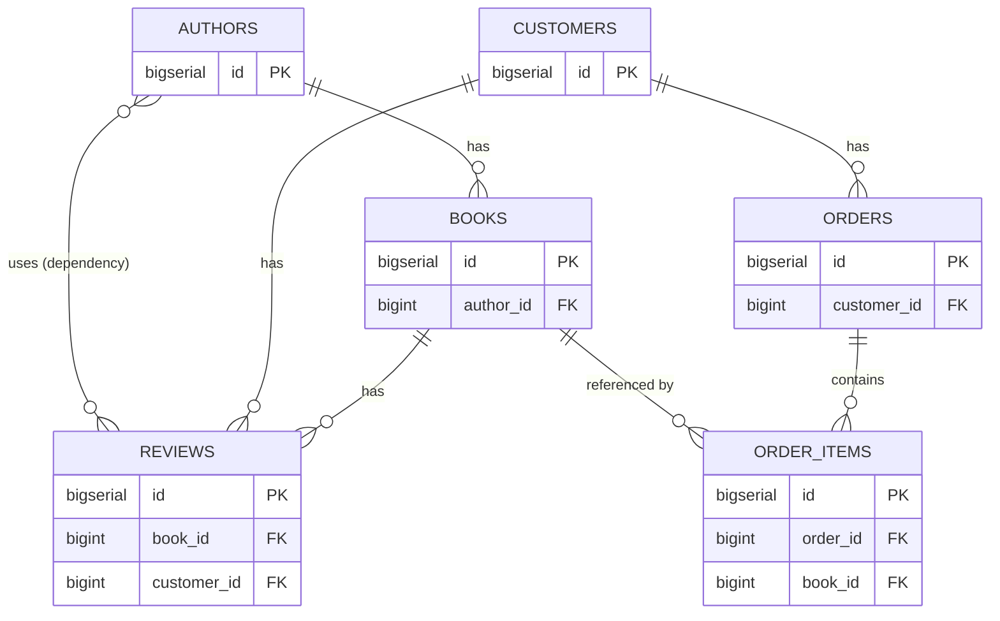

# Trace a path between tables

## What you'll build

Six bookshop tables, already connected: `authors`, `books`, `reviews`,
`customers`, `orders` and `order_items`. Nothing to draw here — the point of
this walkthrough is what you do with a diagram once it exists. One extra
connection is worth noticing before you start: `authors` **uses** `reviews`,
a dependency with no shared column, added so *Trace* has something to walk
that a foreign key cannot explain.



By the end you will have traced two different pairs of tables, read the hop
list and generated `JOIN` for each, sent one straight to the **Query** tab,
and seen the one line a non-foreign-key hop is allowed to produce.

## Before you start

Read [Connect two tables](02-connect-two-tables.md) first if you have not —
this walkthrough assumes you already know what a foreign key, a data flow, a
serialized link and a dependency are, and only that a dependency is one of
the three kinds a database does not enforce. Have **PostgreSQL** selected in
the dialect selector; nothing here is dialect-specific, but the companion
diagram is written in that dialect and switching would translate its types
for no reason.

If you would rather read the finished thing than type it, open
[`diagrams/11-trace-a-path-between-tables.dbviz.json`](diagrams/11-trace-a-path-between-tables.dbviz.json)
with **File → Open** (`Ctrl+O`), or drop the file on the canvas.

## The mental model

Trace is breadth-first search over the diagram treated as one undirected
graph. Every connection — foreign key, data flow, serialized link,
dependency — is an edge you can walk in either direction regardless of which
end is `sourceTableId` and which is `targetTableId`, and Trace returns
whichever path between your two tables uses the fewest edges. That is the
whole algorithm: it counts hops, not meaning, not row counts, not how
expensive a join would be to run. Two tables three hops apart by the route
that answers your actual question and two hops apart by a route that answers
a different question will always return the two-hop route. A shorter path is
not necessarily the one you would write by hand — read the hop list, do not
just trust the badge.

Turning a path into SQL is direct exactly where a foreign key sits: an `fk`
connection carries a pair of columns that the database guarantees line up on
every row, so the generator can write `JOIN … ON left = right` without
inventing anything. A data flow, a serialized link and a dependency carry no
such pair — nothing forces `authors.id` to relate to any particular row of
`reviews` — so the generator cannot write an `ON` clause for them at all. It
still has to include the table, because the path passed through it, so it
writes `CROSS JOIN` and leaves a comment explaining why there is nothing to
join on. The path is real; only the join condition is missing.

## Steps

### 1. Select two tables and trace them

Click the `books` table, then hold `Shift` and click `customers` to add it
to the selection (`Shift+click`). In the top bar, click **Trace**. With two
tables already selected it traces immediately — no pick mode, no dialog.

**You should see:** the bottom drawer opens on its **Trace** tab with a
**2 hops** badge next to the tab label, and on the canvas `books`, `reviews`
and `customers` — plus the two connections between them — light up while
every other table and connection dims.

### 2. Read the hop list

In the **Trace** tab, look under the table chain `books → reviews →
customers` at the two rows below it.

**You should see:** two rows, each starting with an **FK** chip:
`reviews.book_id = books.id`, then `reviews.customer_id = customers.id` —
the exact `ON` conditions the generated query below is about to use. Click
either chip and the inspector jumps to that connection.

### 3. Run the join in the Query tab

On the right-hand side of the **Trace** tab, under **Join along the path**,
click **Run**.

**You should see:** the drawer switches to the **Query** tab with the
two-table `JOIN` already sitting in the editor, ready to run against a
connected database with `Ctrl+Enter`. **Copy**, next to **Run**, puts the
same text on the clipboard without leaving the **Trace** tab.

### 4. Compare it with the route Trace did not take

`books` reaches `customers` a second way: `books → order_items → orders →
customers`, three hops instead of two. Trace cannot prefer one meaning over
the other, because it never looks at what a hop means — prove it by tracing
a table that route touches and this one does not. Click `books`, then
`Shift+click` `orders`, then click **Trace** again.

**You should see:** a **2 hops** badge again, but this time the highlighted
route is `books → order_items → orders` — a different pair of connections
than the ones lit up a moment ago for `customers`, because `orders` has no
connection to `reviews` at all. Extend that route by the one hop it is
missing (`orders → customers`) and you get the three-hop path a person asking
"who bought this book" would actually mean. Trace never offers it, because
two is smaller than three.

### 5. Trace across a connection that is not a foreign key

Right-click the `authors` table and choose **Trace from here…**. The
**Trace** tab opens with `authors` already set as **From table…**, and a
banner on the canvas reads "From authors: now click the destination table."
Click `customers`.

**You should see:** a **2 hops** badge and the table chain `authors →
reviews → customers` — shorter than the three-hop route through `books` that
also connects them, because the dependency you noticed at the start cuts a
corner. Look at the first row of the hop list: its chip reads **uses**, not
**FK**, and the text is a sentence — `authors uses reviews (featured-authors
carousel)` — instead of a column pair, because there is no column pair to
show.

### 6. Read the mixed join it produces

With that same trace still showing, look at **Join along the path** again.

**You should see:**

```sql
SELECT t0.*, t1.*, t2.*
FROM authors AS t0
-- authors uses reviews (featured-authors carousel): dependency link, no join condition
CROSS JOIN reviews AS t1
JOIN customers AS t2 ON t1.customer_id = t2.id;
```

One `JOIN … ON` and one `CROSS JOIN` with a comment, in the same query — the
generator switches per hop, not per query, based only on whether that one
connection happens to be a foreign key.

### 7. Trace from the drawer tab itself, without touching the canvas

Everything so far started on the canvas or its right-click menu. The
**Trace** tab has its own way in: set **From table…** to `orders` and
**To table…** to `reviews` using the two dropdowns at its top, then click
**Trace**.

**You should see:** a **2 hops** badge and the chain `orders → customers →
reviews` — a third pair, reached without selecting or right-clicking
anything, useful when the tables you want are off-screen or you would rather
type than scroll.

### 8. Leave trace mode

Press `Esc`. If you are still mid-pick rather than looking at a result,
`Esc` cancels the pick instead; press it again to clear whatever trace is
showing. The **Trace** tab's own **Clear** button does the same thing with
the mouse.

**You should see:** every table and connection returns to full brightness,
the hop-count badge disappears from the drawer tab, and the **From table…**
/ **To table…** dropdowns reset to empty.

## Other ways to do it

- **Select two or more tables and right-click** → *Trace {first} → {second}*
  uses the first two tables of the selection and traces immediately, the
  same shortcut the top-bar button takes when two are already selected.
- **The Trace tab's own Pick on canvas button** turns on the same pick mode
  as clicking **Trace** with fewer than two tables selected, without moving
  your hand to the top bar.
- **`Ctrl+K`** → *Trace a path between two tables…* opens the **Trace** tab
  and turns on pick mode from the command palette.
- **Click a hop's kind chip** (**FK**, **uses**, …) in the hop list to open
  that connection in the inspector — the fastest way to check a join
  condition without leaving the trace.
- **Click a table name** in the table chain at the top of the **Trace** tab
  to select it and focus the canvas on it.

## Check your work

Trace `books` to `customers` (`Shift+click` both, then **Trace**) and
**Join along the path** should read, character for character:

```sql
SELECT t0.*, t1.*, t2.*
FROM books AS t0
JOIN reviews AS t1 ON t0.id = t1.book_id
JOIN customers AS t2 ON t1.customer_id = t2.id;
```

Trace `authors` to `customers` and it should read:

```sql
SELECT t0.*, t1.*, t2.*
FROM authors AS t0
-- authors uses reviews (featured-authors carousel): dependency link, no join condition
CROSS JOIN reviews AS t1
JOIN customers AS t2 ON t1.customer_id = t2.id;
```

Both are copied straight from the app (bottom drawer → **Trace** → **Join
along the path**), not retyped. The first is entirely `JOIN … ON`, because
every hop on it is a foreign key. The second mixes the two kinds in one
statement, in the order the hops occur — the direct, observable proof that
the generator decides per hop, not per trace.

## Try it yourself

- Trace `order_items` to `authors`. It is three hops (`order_items → books →
  authors`), all foreign keys — predict the chain before you press **Trace**
  and see whether the tie-free shortest route matches what you expected.
- Delete the `authors → reviews` dependency (select it, `Delete`) and trace
  `authors` to `customers` again. The badge changes from **2 hops** to
  **3 hops** and the route now goes through `books` — the dependency was not
  decoration, it was genuinely the shorter path. `Ctrl+Z` brings it back.
- Trace two tables that are not connected at all — there are none in this
  diagram, so add a disconnected seventh table first, or open a fresh
  diagram with just two unlinked tables. Read the message the **Trace** tab
  shows instead of a result.
- Rename `reviews` to something else in the inspector and watch the hop list
  and the generated `JOIN` update their table names on the next trace,
  without re-tracing anything by hand.

## Gotchas

- **Shortest is not smartest.** Trace has no idea that `order_items → orders`
  means "purchased" and `reviews` means "reviewed." It only counts edges. A
  schema with a shortcut connection between two tables for an unrelated
  reason will happily route your trace through it.
- **Only foreign keys ever produce an `ON` clause.** Data flows, serialized
  links and dependencies are walked like any other edge but always come out
  as `CROSS JOIN` plus a comment — there is no configuration that makes them
  joinable, because none of them carry a guaranteed pair of equal columns.
- **A `CROSS JOIN` in generated SQL is not a mistake to fix.** It is the
  generator being honest that the path crossed a connection with nothing to
  join on. Running the query as-is produces a full cross product across that
  hop; that is rarely what you want to execute, only to read.
- **Direction on the canvas is ignored.** Trace treats every connection as
  two-way, so it does not matter which table is `sourceTableId` and which is
  `targetTableId` — only that a connection exists between them.
- **A path that crosses into an external group will not run as one
  statement.** The generator adds a warning comment above the query instead;
  none of this diagram's tables are external, so you will not see it here —
  see [Group tables](03-group-tables.md) for when you will.
- **Trace finds *a* shortest path, not *every* shortest path.** If two routes
  tie in hop count, you get one of them and no indication a tie existed.
  This diagram was built so the two examples above are not ties — change it
  and that guarantee goes away.

## Where to go next

- [Read a big diagram](12-read-a-big-diagram.md) — focus, collapse and
  neighborhood tools for when a schema has too many tables to trace by eye.
- [Group tables](03-group-tables.md) — what happens to a traced path when it
  has to cross into a database you do not own.
- [Fix what Problems finds](10-fix-what-problems-finds.md) — the six
  `fk-without-index` warnings this diagram would have shown before its
  indexes were added.
