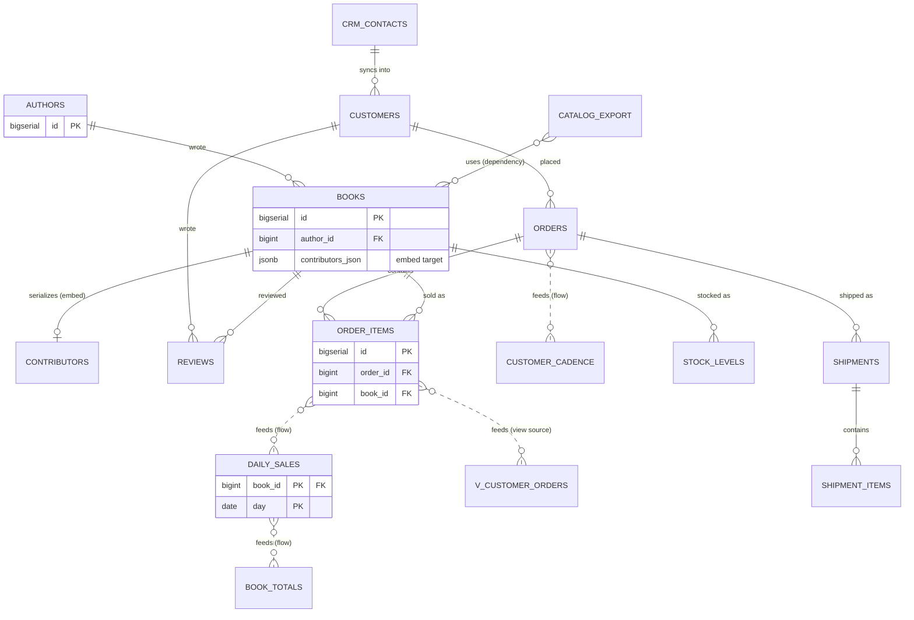

# Read a big diagram

## What you'll build

Two more regions, and a way of looking at what you already have. Twelve
walkthroughs in, this canvas holds eighteen tables, seventeen foreign keys,
six data flows, an embed, a dependency, a view, two custom types and four
groups by the time you are done — a schema that has comfortably outgrown a
single glance.

Nothing new gets typed. This walkthrough is the tools that make a diagram this
size readable: collapsing, focus, Detangle, hand alignment, the command
palette, and boxing the two clusters that are still loose — `catalog` and
`warehouse` — into regions of their own.



## Before you start

You need what [Trace a path between tables](11-trace-a-path-between-tables.md)
leaves behind: the whole eighteen-table schema, two regions, no errors or
warnings in **Problems**. Press **Set up the canvas** at the top of this walkthrough in the
drawer's **Walkthrough** tab if it is not already in front of you.

This is the first walkthrough where **Set up the canvas** is worth pressing
even if you have followed every one before it — the diagram it loads has the
tables laid out on a grid, which makes the layout tools below easier to see
working than a canvas you have already tidied by hand.

Have **PostgreSQL** selected in the dialect selector; the diagram uses a
Postgres enum, a composite type and `NUMERIC`, which the other two dialects
spell differently.

If you would rather read the finished thing than click through it yourself,
open [`diagrams/12-read-a-big-diagram.dbviz.json`](diagrams/12-read-a-big-diagram.dbviz.json)
with **File → Open** (`Ctrl+O`), or drop the file on the canvas.

## The mental model

None of the tools in this walkthrough change the diagram. Collapsing a table,
focusing on a neighbourhood, running Detangle, zooming out — every one of them
is a way of *looking at* the same tables and connections, not a way of
editing them. That's worth holding onto, because it means you can be
aggressive: collapse everything to headers, dim half the canvas, drag a
region across the screen, and nothing in the generated SQL moves. The one
partial exception is **position** and **collapse state** — like the colour
you set on a table, they are saved in the `.dbviz.json` so the diagram opens
the way you left it, but they never appear in a `CREATE TABLE` statement.

The closest thing you already know is a code editor's folding gutter, or a
spreadsheet's outline view. Folding a function doesn't change what it does; it
changes how much of the file is competing for your eyes at once. A table's
three collapse states are the same idea applied to columns, and Focus mode is
the same idea applied to the graph: instead of hiding lines of code you don't
care about right now, it fades tables more than one relationship away from
the one you're looking at.

## Steps

### 1. Cycle one table's collapse state by hand

<!-- step
target: table:order_items
hint: The chevron cycles all columns → keys only → header only, so three clicks land you back where you started.
-->

Find `order_items` on the canvas — `Ctrl+K`, type its name, `Enter` is the
quickest way. Click the chevron (`⌄`) at the right of its header. It cycles
**All columns → Keys only → Header only → All columns**, one click per state.
Click it three times to land back where you started.

**You should see:** the row list under `order_items` shrink to just `id`,
`order_id` and `book_id` with a `+2 more columns` line underneath, then
collapse to a single "5 columns" line, then come back to every column — and
the chevron's own shape change each time (a caret, then a right-facing arrow,
then a down-facing one) to hint at which state you're in.

### 2. Collapse — or expand — every table at once

<!-- step
target: ui:view-menu
-->

Open **View → All tables**. It offers three commands: **Show every column**,
**Keys only** and **Headers only**. Choose **Keys only**. Every table on the
canvas — not just the one you have selected — drops to keys, including
`authors` and `crm_contacts` which had nothing to do with step 1.

**You should see:** the whole canvas shrink to key columns only, and the
`+N more columns` hint appear under every table that has non-key columns to
hide. Pick **Show every column** to put it back before continuing.

### 3. Zoom out past the automatic threshold

<!-- step
target: ui:canvas
-->

Zoom out (scroll, pinch, or the `−` control at the bottom-left) until the
whole diagram fits with room to spare. Once the zoom level drops below **35%**
(`0.35`), every table on the canvas collapses to its header, overriding
whatever each one's own chevron says — and the chevron itself disappears, so
there is nothing to click until you zoom back in. Zoom back in past that
threshold now.

**You should see:** every table snap to a bare header line the moment you
cross the threshold, and their real collapse states (the "Keys only" tables
from step 1, the "All columns" ones you never touched) come back exactly as
they were once you zoom back in — the automatic collapse never touched what
was actually saved.

### 4. Focus on one table's neighbourhood

<!-- step
target: table:books
goals:
  - focus | books
-->

Click `books` to select it, then press `.`. Everything more than one hop away
dims: `authors`, `contributors`, `catalog_export`, `order_items`, `reviews`,
`daily_sales` and `stock_levels` are all one hop from `books`, so they stay
bright, while `orders`, `customers`, `customer_cadence`, `shipments` and the
CRM tables fade. That is the tool this diagram most needs — eighteen tables is
too many to hold at once, and seven is not. Press `]` twice to widen the
neighbourhood to three hops, then `[` once to narrow it back to two. Press
`Esc` to clear the focus entirely.

**You should see:** a small banner appear over the canvas reading "Focus:
books · N hops" with `−`/`+`/`×` controls that do the same thing as `[`, `]`
and `Esc`; the canvas also reframes to fit whatever is currently in focus each
time the hop count changes. Widen it all the way — `]` stops responding once
you reach **6 hops**, the maximum the app tracks.

### 5. Untangle the layout with Detangle

<!-- step
target: ui:detangle
-->

Drag a few tables into an overlapping mess — it doesn't matter which, you're
about to fix it. Press `L`. Detangle re-lays out every table so that whatever
a connection points at (the referenced side of a foreign key, the source of a
data flow) ends up ranked before the table that points at it, and it orders
each rank to minimise how many connections cross. The `catalog` and `shop`
regions come back as tidy blocks — Detangle treats a group's tables as a
single cluster, so members never end up scattered across the layout or
sitting inside another group's rectangle. Open the small `▾` beside
**Detangle** and try **Top to bottom** instead of the default **Left to
right**, then press `F` to fit the result to the window.

**You should see:** the diagram resolve into layers — `authors`,
`contributors` and the external CRM tables at one end, `daily_sales`,
`book_totals`, `customer_cadence` and `v_customer_orders` at the other — with
the `shop` and CRM rectangles intact around their tables the whole time, and
the canvas reframing when you press `F`.

### 6. Tidy a cluster by hand

<!-- step
target: ui:canvas
-->

`Shift+drag` a box around `daily_sales` and `book_totals` so both are
selected (a plain drag on empty canvas does the same thing; `Shift` just adds
to whatever was already selected). Right-click either one and choose **Align
left edges**. With three or more tables selected, the same menu also offers
**Distribute horizontally** and **Distribute vertically**, spacing the middle
ones evenly between the two outer ones — select `order_items`, `daily_sales`
and `book_totals` and try **Distribute vertically** next. Turn on **View → Snap
to grid**, then nudge the selected table with the `Arrow keys` (10 px a
press) and `Shift+Arrow keys` (50 px).

**You should see:** the two tables snap to a shared left edge in one step (one
`Ctrl+Z` undoes it), the three-table selection space itself evenly top to
bottom, and — once snap is on — nudged tables land on round coordinates
instead of wherever the arrow key math puts them.

### 7. Jump straight to a table or an action

<!-- step
target: ui:palette
goals:
  - select table | customer_cadence
-->

Press `Ctrl+K`. Type `cadence` — the only match is the `customer_cadence`
table, and pressing `Enter` selects it and frames it on the canvas, the same
place `Zoom to table` in the right-click menu goes. Clear the query and type
`keys only` instead: the palette finds **Collapse all tables (keys only)**
alongside every table whose columns happen to contain those words. Run
anything once, reopen the palette with an empty query, and that action floats
to the top of its group — the palette remembers the last few things you ran,
in this browser, and offers them first.

**You should see:** the result list narrow as you type, tables and actions
mixed together and grouped under headings like "Go to" and "Layout"; picking
a table pans and zooms the canvas to it without dimming anything else — that
camera move is not the same thing as the focus mode from step 4.

### 8. Read the connections by colour and cardinality

<!-- step
target: ui:view-menu
goals:
  - cardinality | on
-->

Open **View → Cardinality labels** and tick it. Look at the foreign key from
`order_items` into `orders`: a small `N` sits at the `order_items` end and `1`
at the `orders` end, reading "many order_items rows per order." Notice
`stock_levels`'s header carries an **N:M** badge — the app noticed both of its
primary-key columns are foreign keys into two different tables, which is
exactly what a join table is, and it is the only table on this canvas shaped
that way.

Then read the colours, which this series has been applying consistently since
walkthrough 01: **blue** for source tables you write to directly, **orange**
for derived tables that only a flow ever fills (`daily_sales`, `book_totals`,
`customer_cadence`, `catalog_export`), **teal** for the view, **purple** for
the external CRM tables and their region, **green** for the imported warehouse
tables, and **yellow** for sticky notes. None of it reaches the database. All
of it is how you find the derived tables in one glance instead of reading
eighteen names.

**You should see:** `N` / `1` labels on every foreign key, no labels at all on
the dashed flow edges (there is no cardinality to compute when nothing
constrains uniqueness), and one **N:M** badge on `stock_levels`.

### 9. Box the last two clusters into regions

<!-- step
target: ui:add-group
goals:
  - group | catalog : authors, books, contributors, catalog_export
  - group | warehouse : warehouses, stock_levels, shipments, shipment_items
  - groups | shop, CRM (read-only), catalog, warehouse
-->

Two clusters are still loose. Select `authors`, `books`, `contributors` and
`catalog_export` (`Shift+click` each) and press `G`. Name the region
`catalog`, colour it `indigo`.

Then select the four warehouse tables — `warehouses`, `stock_levels`,
`shipments`, `shipment_items` — press `G` again, name that one `warehouse`,
colour it `green`, and leave *These tables live in another database*
**unticked**: the warehouse team's script came from another database, but you
imported it into this one, and walkthrough 10 fixed it up as your own.

**You should see:** four regions on the canvas — `shop`, `CRM (read-only)`,
`catalog` and `warehouse` — and no change whatsoever in the **SQL** tab except
the two extra tables that were already there. Regions are for reading; only
*external* changes what gets generated.

## Other ways to do it

- **Right-click a table** → *All columns* / *Keys only* / *Header only* does
  what the chevron does, plus *Zoom to table* — a camera move, not focus.
- **Right-click the canvas** → *Detangle layout*, *Snap to grid*,
  *Cardinality labels* and *Group tables by schema* sit alongside the usual
  *Add table here* / *Select all tables*.
- **`Ctrl+K`** reaches nearly everything in this walkthrough by name:
  "collapse all", "headers only", "detangle top to bottom", "focus on the
  selected table", "clear focus", "snap to grid", "cardinality labels", "fit
  to window" — type a few letters of any of them.
- **The sidebar** (left panel) lists every table, grouped the same way the
  canvas groups them, with a search box that filters by table *or* column
  name; right-click a row for the same table menu as the canvas.
- **Multi-select with `Shift+click`** works as well as `Shift+drag` for
  picking the tables an Align or Distribute command should act on.
- **Hand-edit the `.dbviz.json`**: a table's `collapsed` field
  (`"keys"` / `"header"` / omitted for all columns) is exactly what the
  chevron writes, and `schema` on a table plus a `groups` entry is exactly
  what *Group tables by schema* writes — both are documented in
  [`../ADVISOR_OUTPUT_FORMAT.md`](../ADVISOR_OUTPUT_FORMAT.md).

## Check your work

Nothing you did in this walkthrough changes the generated script except the
two new regions, and regions do not reach the script at all. That is the
check: open the bottom drawer → **SQL** and confirm the `CREATE TABLE`
statements are the same ones walkthrough 11 produced. Searching it for
`catalog` or `warehouse` finds nothing but the table named `catalog_export`.

What did change is the header comment, which is the fastest read on a diagram
this size:

```sql
-- Bookshop — after 12 Read a big diagram (PostgreSQL)
-- Generated by Coditect
-- Tables: 15, views: 1, foreign keys: 15, documented connections: 8
-- 2 table(s) live in another database and are not created here; see "External sources" at the end.
```

Fifteen created tables out of eighteen on the canvas, fifteen enforced foreign
keys out of seventeen drawn, and eight connections that document rather than
enforce. Every one of those gaps is something you chose deliberately in an
earlier walkthrough — the external CRM pair, the foreign key that would cross
a database boundary, the embed, the dependency and the six flows.

Then press **Check my work** at the foot of this walkthrough. Its first check
is the one that matters here:

```
groups | shop, CRM (read-only), catalog, warehouse
```

Four regions, in the order they were created. And **Problems** should still
report no errors and no warnings — only the two notes it has carried since
walkthrough 10.

## Try it yourself

- Collapse every table to **Header only**, then press `L`. Compare the result
  to Detangling at full size — Detangle and the Align/Distribute tools always
  size a table by its own saved collapse state, never by what the current
  zoom happens to be drawing, so collapsed-and-Detangled doesn't come out
  cramped once you expand everything again.
- Select `authors`, focus it with `.`, and press `]` eight times. Watch the
  hop counter — and the `+` button — stop responding at 6.
- Turn off **Cardinality labels**. The `N` / `1` badges disappear from every
  foreign key, but the **N:M** badge on `stock_levels`'s header stays put —
  it isn't a cardinality label, it's a property of the table itself.
- Right-click the `warehouse` region's title bar and choose **Remove region,
  keep tables**. The four tables stay exactly where they are, with no
  rectangle around them, and nothing else on the canvas moves — a region owns
  no geometry of its own. `Ctrl+Z` brings it back.

## Gotchas

- **Clicking a table in the command palette or the sidebar is not focus
  mode.** Both just pan and zoom the camera to that table ("Zoom to table");
  nothing else on the canvas dims. Press `.` yourself if you want the
  neighbourhood highlighted.
- **Below the 35% zoom threshold, the collapse chevron disappears entirely** —
  not just locked to "Header only." There is nothing to click until you zoom
  back in, which is easy to miss the first time you're staring at a
  zoomed-out diagram wondering why a table won't expand.
- **The focus neighbourhood tops out at 6 hops.** On an eighteen-table diagram
  that's often "the whole graph anyway," but on a larger one, `]` will simply
  stop responding rather than widening further.
- **Snap to grid only affects drags from the moment you turn it on.** Turning
  it on does not retroactively move anything already off-grid — there's no
  "snap everything now" command, only the checkbox that changes what future
  drags do.
- **Group tables by schema skips two kinds of table on purpose:** anything
  already in a group (so it won't steal `crm_contacts` out of the external
  CRM region), and anything with a blank `schema`. If a table you expected to
  see grouped doesn't show up, check its *Schema* field in the inspector
  before assuming the command is broken.
- **Detangle can rearrange a group's tables, but it never invents a group.**
  If an imported schema has no `schema` values at all, Detangle will still
  untangle the connections, but you'll want *Group tables by schema* — or a
  region you draw yourself with `G` — to get any regions at all.

## Where to go next

- [Run the schema on a real database](13-run-the-schema-on-a-real-database.md)
  — next in the series, and the point of all of it. Everything you have drawn
  over twelve walkthroughs becomes a PostgreSQL database running in a Docker
  container, seeded with rows, migrated after a change, and read back.
