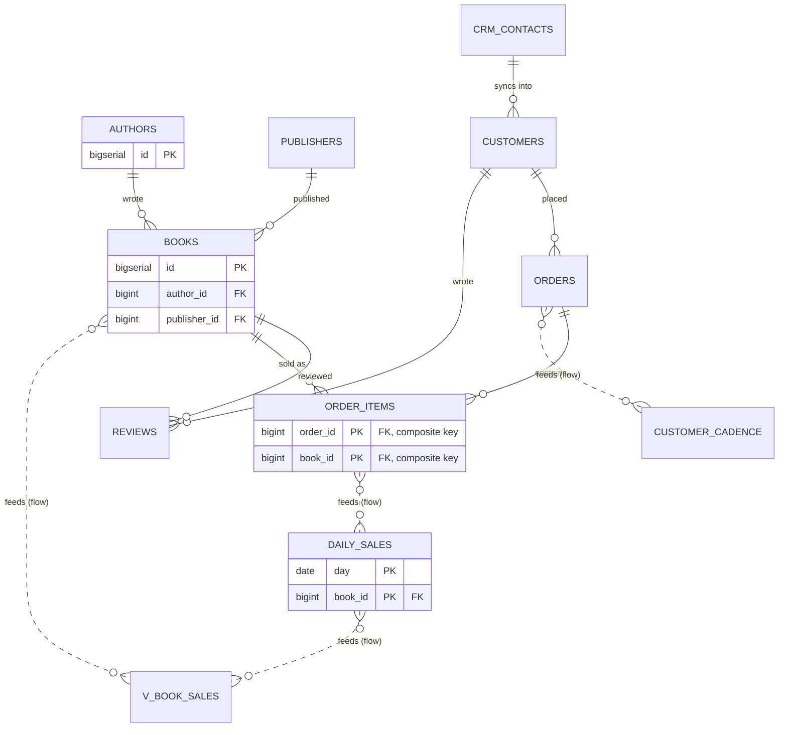

# Read a big diagram

## What you'll build

Nothing new gets typed in this one. You'll open a bookshop schema that has
outgrown a single glance — eleven tables across two schemas, an external CRM,
two rollups and a view — and use the tools that make a diagram like that
readable: collapsing, focus, Detangle, hand alignment, the command palette and
the colour conventions this series has been using all along.



## Before you start

Read [Connect two tables](02-connect-two-tables.md) first if you haven't —
this walkthrough assumes you already know what a foreign key handle and a
data-flow link look like on the canvas, because it spends no time re-teaching
either. Have **PostgreSQL** selected in the dialect selector; the companion
diagram uses a Postgres enum and `NUMERIC`, which the other two dialects spell
differently.

If you would rather read the finished thing than click through it yourself,
open [`diagrams/12-read-a-big-diagram.dbviz.json`](diagrams/12-read-a-big-diagram.dbviz.json)
with **File → Open** (`Ctrl+O`), or drop the file on the canvas.

## The mental model

None of the tools in this walkthrough change the diagram. Collapsing a table,
focusing on a neighbourhood, running Detangle, zooming out — every one of them
is a way of *looking at* the same tables and connections, not a way of
editing them. That's worth holding onto, because it means you can be
aggressive: collapse everything to headers, dim half the canvas, drag a
region across the screen, and nothing in the generated SQL moves. The one
partial exception is **position** and **collapse state** — like the colour
you set on a table, they are saved in the `.dbviz.json` so the diagram opens
the way you left it, but they never appear in a `CREATE TABLE` statement.

The closest thing you already know is a code editor's folding gutter, or a
spreadsheet's outline view. Folding a function doesn't change what it does; it
changes how much of the file is competing for your eyes at once. A table's
three collapse states are the same idea applied to columns, and Focus mode is
the same idea applied to the graph: instead of hiding lines of code you don't
care about right now, it fades tables more than one relationship away from
the one you're looking at.

## Steps

### 1. Cycle one table's collapse state by hand

Find `order_items` on the canvas — it opens collapsed to **Keys only**, so
you'll see just `order_id` and `book_id` with a `+2 more columns` line
underneath. Click the chevron (`⌄`) at the right of its header. It cycles
**All columns → Keys only → Header only → All columns**, one click per state.
Click it twice more to land back on **Keys only**.

**You should see:** the row list under `order_items` grow to all four columns,
then collapse to a single "4 columns" line, then come back to the two key
rows — and the chevron's own shape change each time (a caret, then a
right-facing arrow, then a down-facing one) to hint at which state you're in.

### 2. Collapse — or expand — every table at once

Open **View → All tables**. It offers three commands: **Show every column**,
**Keys only** and **Headers only**. Choose **Keys only**. Every table on the
canvas — not just the one you have selected — drops to keys, including
`authors` and `crm_contacts` which had nothing to do with step 1.

**You should see:** the whole canvas shrink to key columns only, and the
`+N more columns` hint appear under every table that has non-key columns to
hide. Pick **Show every column** to put it back before continuing.

### 3. Zoom out past the automatic threshold

Zoom out (scroll, pinch, or the `−` control at the bottom-left) until the
whole diagram fits with room to spare. Once the zoom level drops below **35%**
(`0.35`), every table on the canvas collapses to its header, overriding
whatever each one's own chevron says — and the chevron itself disappears, so
there is nothing to click until you zoom back in. Zoom back in past that
threshold now.

**You should see:** every table snap to a bare header line the moment you
cross the threshold, and their real collapse states (the "Keys only" tables
from step 1, the "All columns" ones you never touched) come back exactly as
they were once you zoom back in — the automatic collapse never touched what
was actually saved.

### 4. Focus on one table's neighbourhood

Click `books` to select it, then press `.`. Everything more than one hop away
— `authors`, `publishers`, `order_items`, `reviews`, `daily_sales` and
`v_book_sales` are all one hop, so they stay bright; `orders`, `customers`,
`customer_cadence` and `crm_contacts` fade. Press `]` twice to widen the
neighbourhood to three hops, then `[` once to narrow it back to two. Press
`Esc` to clear the focus entirely.

**You should see:** a small banner appear over the canvas reading "Focus:
books · N hops" with `−`/`+`/`×` controls that do the same thing as `[`, `]`
and `Esc`; the canvas also reframes to fit whatever is currently in focus each
time the hop count changes. Widen it all the way — `]` stops responding once
you reach **6 hops**, the maximum the app tracks.

### 5. Untangle the layout with Detangle

Drag a few tables into an overlapping mess — it doesn't matter which, you're
about to fix it. Press `L`. Detangle re-lays out every table so that whatever
a connection points at (the referenced side of a foreign key, the source of a
data flow) ends up ranked before the table that points at it, and it orders
each rank to minimise how many connections cross. The `catalog` and `shop`
regions come back as tidy blocks — Detangle treats a group's tables as a
single cluster, so members never end up scattered across the layout or
sitting inside another group's rectangle. Open the small `▾` beside
**Detangle** and try **Top to bottom** instead of the default **Left to
right**, then press `F` to fit the result to the window.

**You should see:** the diagram resolve into layers — `authors`, `publishers`
and the external `crm_contacts` at one end, `daily_sales`, `customer_cadence`
and `v_book_sales` at the other — with the two group rectangles intact around
their tables the whole time, and the canvas reframing when you press `F`.

### 6. Tidy a cluster by hand

`Shift+drag` a box around `daily_sales` and `customer_cadence` so both are
selected (a plain drag on empty canvas does the same thing; `Shift` just adds
to whatever was already selected). Right-click either one and choose **Align
top edges**. With three or more tables selected, the same menu also offers
**Distribute horizontally** and **Distribute vertically**, spacing the middle
ones evenly between the two outer ones — select `books`, `daily_sales` and
`v_book_sales` and try **Distribute vertically** next. Turn on **View → Snap
to grid**, then nudge the selected table with the `Arrow keys` (10 px a
press) and `Shift+Arrow keys` (50 px).

**You should see:** the two tables snap to a shared top edge in one step (one
`Ctrl+Z` undoes it), the three-table selection space itself evenly top to
bottom, and — once snap is on — nudged tables land on round coordinates
instead of wherever the arrow key math puts them.

### 7. Jump straight to a table or an action

Press `Ctrl+K`. Type `cadence` — the only match is the `customer_cadence`
table, and pressing `Enter` selects it and frames it on the canvas, the same
place `Zoom to table` in the right-click menu goes. Clear the query and type
`keys only` instead: the palette finds **Collapse all tables (keys only)**
alongside every table whose columns happen to contain those words. Run
anything once, reopen the palette with an empty query, and that action floats
to the top of its group — the palette remembers the last few things you ran,
in this browser, and offers them first.

**You should see:** the result list narrow as you type, tables and actions
mixed together and grouped under headings like "Go to" and "Layout"; picking
a table pans and zooms the canvas to it without dimming anything else — that
camera move is not the same thing as the focus mode from step 4.

### 8. Read the connections, then rebuild a schema group

Open **View → Cardinality labels** — it's already checked; this diagram
ships with it on. Look at the foreign key from `order_items` into `orders`:
a small `N` sits at the `order_items` end and `1` at the `orders` end,
reading "many order_items rows per order." Notice `order_items`'s header
also carries an **N:M** badge — the app noticed both of its primary-key
columns are foreign keys into two different tables, which is exactly what a
join table is. Then check the colours: `authors` through `reviews` are
**blue** (source tables), `daily_sales` and `customer_cadence` are **orange**
(derived — nothing writes to them directly, a flow does), `v_book_sales` is
**teal** (a view), and `crm_contacts` plus its region are **purple**
(external — read, never created).

Now right-click the `shop` region's title bar, choose **Remove region, keep
tables**, and watch the four tables stay exactly where they are with no
rectangle around them. Right-click empty canvas and choose **Group tables by
schema**.

**You should see:** the `shop` region reappear around the same four tables in
one action. **Group tables by schema** scans every table that isn't already
in a group, buckets the ones that share a `schema` value, and creates one
region per bucket — which is exactly how both `catalog` and `shop` got here
in the first place.

## Other ways to do it

- **Right-click a table** → *All columns* / *Keys only* / *Header only* does
  what the chevron does, plus *Zoom to table* — a camera move, not focus.
- **Right-click the canvas** → *Detangle layout*, *Snap to grid*,
  *Cardinality labels* and *Group tables by schema* sit alongside the usual
  *Add table here* / *Select all tables*.
- **`Ctrl+K`** reaches nearly everything in this walkthrough by name:
  "collapse all", "headers only", "detangle top to bottom", "focus on the
  selected table", "clear focus", "snap to grid", "cardinality labels", "fit
  to window" — type a few letters of any of them.
- **The sidebar** (left panel) lists every table, grouped the same way the
  canvas groups them, with a search box that filters by table *or* column
  name; right-click a row for the same table menu as the canvas.
- **Multi-select with `Shift+click`** works as well as `Shift+drag` for
  picking the tables an Align or Distribute command should act on.
- **Hand-edit the `.dbviz.json`**: a table's `collapsed` field
  (`"keys"` / `"header"` / omitted for all columns) is exactly what the
  chevron writes, and `schema` on a table plus a `groups` entry is exactly
  what *Group tables by schema* writes — both are documented in
  [`../ADVISOR_OUTPUT_FORMAT.md`](../ADVISOR_OUTPUT_FORMAT.md).

## Check your work

Open the bottom drawer → **SQL**. The whole script runs past 140 lines for a
schema this size, so here's an excerpt — the composite-key join table, the
composite-key rollup it feeds, and the top of the external-sources appendix —
copied straight out of the tab rather than retyped:

```sql
CREATE TABLE shop.order_items (
  order_id BIGINT NOT NULL,
  book_id BIGINT NOT NULL,
  quantity INTEGER NOT NULL DEFAULT 1 CHECK (quantity > 0),
  unit_price_cents INTEGER NOT NULL,
  PRIMARY KEY (order_id, book_id),
  CONSTRAINT order_items_order_id_fkey FOREIGN KEY (order_id) REFERENCES shop.orders (id) ON DELETE CASCADE,
  CONSTRAINT order_items_book_id_fkey FOREIGN KEY (book_id) REFERENCES catalog.books (id)
);

CREATE TABLE daily_sales (
  day DATE NOT NULL,
  book_id BIGINT NOT NULL,
  units INTEGER NOT NULL DEFAULT 0,
  revenue_cents BIGINT NOT NULL DEFAULT 0,
  PRIMARY KEY (day, book_id),
  CONSTRAINT daily_sales_book_id_fkey FOREIGN KEY (book_id) REFERENCES catalog.books (id)
);

-- ----------------------------------------------------------------
-- External sources: other databases this schema reads from.
-- Nothing below is executed; it is here so the script documents where the data comes from.
--
-- CRM (read-only) (1 table)
--   Vendor CRM, reached over a foreign data wrapper. We only ever SELECT from it, so nothing here is created by the generated script.
--   crm_contacts (contact_id, email)
```

Then open **Problems**. It reports zero errors — that's what `lint clean`
means — but a schema this size still has warnings: eight "no index" notices
on foreign-key columns, and one info line naming `order_items` as a
many-to-many join. None of those are what this walkthrough is about; reading
a big diagram is a different job from tidying every finding in it, and
[Fix what Problems finds](10-fix-what-problems-finds.md) is where that job
lives.

## Try it yourself

- Collapse every table to **Header only**, then press `L`. Compare the result
  to Detangling at full size — Detangle and the Align/Distribute tools always
  size a table by its own saved collapse state, never by what the current
  zoom happens to be drawing, so collapsed-and-Detangled doesn't come out
  cramped once you expand everything again.
- Select `authors`, focus it with `.`, and press `]` eight times. Watch the
  hop counter — and the `+` button — stop responding at 6.
- Turn off **Cardinality labels**. The `N` / `1` badges disappear from every
  foreign key, but the **N:M** badge on `order_items`'s header stays put —
  it isn't a cardinality label, it's a property of the table itself.

## Gotchas

- **Clicking a table in the command palette or the sidebar is not focus
  mode.** Both just pan and zoom the camera to that table ("Zoom to table");
  nothing else on the canvas dims. Press `.` yourself if you want the
  neighbourhood highlighted.
- **Below the 35% zoom threshold, the collapse chevron disappears entirely** —
  not just locked to "Header only." There is nothing to click until you zoom
  back in, which is easy to miss the first time you're staring at a
  zoomed-out diagram wondering why a table won't expand.
- **The focus neighbourhood tops out at 6 hops.** On an eleven-table diagram
  that's often "the whole graph anyway," but on a larger one, `]` will simply
  stop responding rather than widening further.
- **Snap to grid only affects drags from the moment you turn it on.** Turning
  it on does not retroactively move anything already off-grid — there's no
  "snap everything now" command, only the checkbox that changes what future
  drags do.
- **Group tables by schema skips two kinds of table on purpose:** anything
  already in a group (so it won't steal `crm_contacts` out of the external
  CRM region), and anything with a blank `schema`. If a table you expected to
  see grouped doesn't show up, check its *Schema* field in the inspector
  before assuming the command is broken.
- **Detangle can rearrange a group's tables, but it never invents a group.**
  If an imported schema has no `schema` values at all, Detangle will still
  untangle the connections, but you'll want *Group tables by schema* — or a
  region you draw yourself with `G` — to get any regions at all.

## Where to go next

- [Run the schema on a real database](13-run-the-schema-on-a-real-database.md)
  — the next thing to do with a schema this size once you can read it.
- [Group tables](03-group-tables.md) — regions from the ground up, including
  what makes one "external."
- [Import an existing schema](09-import-an-existing-schema.md) — the moment a
  real import usually needs everything in this walkthrough at once.
