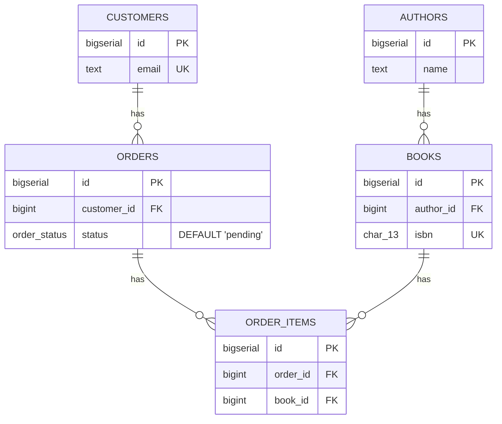

# Run the schema on a real database

## What you'll build

A five-table bookshop schema — `authors`, `customers`, `books`, `orders` and
`order_items`, with an `order_status` enum and four foreign keys — that you
create inside a real PostgreSQL container instead of only reading its SQL in
the drawer. By the end you will have started the container, run the schema
into it, queried it, seeded it with generated rows, changed the diagram and
migrated the live database to match, and pulled the schema back out again.



## Before you start

This one assumes [Import an existing schema](09-import-an-existing-schema.md):
you should already be comfortable with DDL going into and out of the app. Here
it goes into and out of an actual database instead.

You need Docker running and reachable — on Linux that usually means the
daemon is up and your user can talk to `/var/run/docker.sock`. If you would
rather point at a PostgreSQL server you already have running somewhere, skip
every Docker step below and jump straight to *Connecting*; nothing else in
this walkthrough cares how the database got there.

The dialect selector at the top of the app must read **PostgreSQL** — the
companion diagram is written in PostgreSQL's spelling (`BIGSERIAL`,
`TIMESTAMPTZ`, a real `CREATE TYPE … AS ENUM`), and the container you start
below defaults to the same engine.

Open [`diagrams/13-run-the-schema-on-a-real-database.dbviz.json`](diagrams/13-run-the-schema-on-a-real-database.dbviz.json)
with **File → Open** (`Ctrl+O`), or drop the file on the canvas, rather than
typing five tables by hand — this walkthrough is about the **Database** drawer
tab, not about modeling.

## The mental model

Every panel below is one thing you would type at a `psql` prompt, automated
and shown to you before it runs: connect, run the `CREATE TABLE` script,
`SELECT` something back, `INSERT` some rows, and — once the diagram and the
database have drifted apart — diff the live catalog against your notes and
write the `ALTER` statements that close the gap. Nothing here talks to the
database in a way you could not do yourself; the app just remembers the
exact SQL and lets you read it before it runs.

That is also why the app draws a hard line between dialects. PostgreSQL and
MariaDB are real network services: the local API server the dev command
starts (`npm run dev`, listening on port 8787) opens a TCP connection to
whatever host and port you give it and runs your statements there — which is
also why that server only ever binds to `127.0.0.1`. It executes arbitrary
DDL against databases you point it at, so it is deliberately not reachable
from outside your machine. SQLite is not that: pick it in the dialect
selector and there is no server, no Docker, and no network connection at all
— the database is a WebAssembly build of SQLite (`sql.js`) running inside
this browser tab, and it persists between reloads because the app saves it
to this browser's storage rather than to a server's disk. **Query**,
**Migrate** and **Seed** talk to that in-browser database through the exact
same interface they use for a real server, so everything below reads the
same either way — only *Create the schema* and *Read schema* skip the Docker
column, because there is no container to start.

## Steps

### 1. Open the Database drawer tab

Click **Database** in the top bar, or press `Ctrl+K` and type "database".

**You should see:** the bottom drawer switch to two columns — **Docker** on
the left (a status badge, a list of containers, and a form to create one) and
**Connection** on the right (Engine, Host, Port, Database, User, Password,
then *Test connection*, *Create the schema*, **Migrate**, *Seed data* and
*Import from the database*, stacked top to bottom).

### 2. Start a PostgreSQL container

If **Docker** shows *unavailable*, the API server could not reach the daemon
— it looks at `/var/run/docker.sock`, or `DOCKER_HOST` if you have set it —
and you should skip to step 3 with a database you already have running
instead. Otherwise, open **Create a new database container** and leave the
defaults: **Engine** *PostgreSQL*, **Image** `postgres:16`, **Container
name** `dbviz-postgresql`, **Host port** `5432`, **Database** `app`. Click
**Create & start PostgreSQL**.

**You should see:** a container card appear with a pulsing dot while the
image pulls, a toast reading `Container "dbviz-postgresql" started; waiting
for PostgreSQL to accept connections…`, and once it answers, the **Connection**
fields on the right fill themselves in and a second toast reads `PostgreSQL
is ready on port 5432.`

### 3. Point the connection at the database and test it

Whether you started a container above or already had one, look at the six
fields on the right: **Engine**, **Host**, **Port**, **Database**, **User**,
**Password** — this is a separate dialect switch from the diagram's own, so
it can point at a MariaDB server while the diagram stays PostgreSQL (the app
warns you when they disagree). Click **Test connection**.

**You should see:** a green check and the server's version string next to the
button, e.g. `PostgreSQL 16.x on x86_64-pc-linux-gnu…`. This connection —
including the password — is remembered in this browser's local storage
across reloads, separately from the `.dbviz.json` file, so it never leaves
this machine and never gets saved into the diagram you might hand to someone
else.

### 4. Create the schema

Scroll to **Create the schema**. Leave *Drop existing tables first* unticked
(there is nothing to drop yet) and *Stop on first error* ticked, then click
**Run 19 statements**.

**You should see:** a confirmation dialog naming the statement count and
noting the run happens inside one transaction that is rolled back on any
failure (PostgreSQL only — MariaDB's DDL commits statement by statement, so
the dialog says so instead). After you confirm, a scrollable list appears
with one line per statement — a green check or red cross, the SQL, and how
long it took — and a toast reads `Schema created: 19 statements ran.`

The order is not the order the tables sit on the canvas: the enum type is
created first (a column can only use a type that already exists), then
tables in dependency order — `authors` and `customers` before `books` and
`orders`, and `order_items` last, since it references both — with indexes,
foreign keys and comments following each table. None of these five tables
sit in an external group, so all of them get created; a table you had marked
*These tables live in another database* would be left out of this list
entirely and documented in an "External sources" appendix instead.

### 5. Run a read-only query

Open the **Query** drawer tab. Type:

```sql
SELECT * FROM order_items LIMIT 100;
```

Press `Ctrl+Enter` to run it (or select part of the text first to run only
that part). Try `Tab` inside the editor — it inserts two spaces rather than
moving focus, so writing multi-line SQL does not fight you.

**You should see:** an empty results grid with the five real column headers —
there are no rows yet, since nothing has been seeded. Open the *Insert a
tagged query or snippet…* dropdown: because this diagram has no data-flow
edges or tagged queries yet, it offers exactly one entry per table,
`SELECT * FROM <table> LIMIT 100;`. Without ticking **Allow writes**, only
`SELECT`, `WITH`, `EXPLAIN`, `SHOW`, `DESCRIBE` and a few other read-only
leaders are accepted at all — the server wraps whatever you send in a
transaction and rolls it back once it has read the result, so a stray
`UPDATE` cannot both run *and* stick (see `QueryRequest` in
`src/shared/types.ts`). Ticking it lets other statements through and commits
them instead. Results are capped at *Max rows* (500 by default, up to 5000);
the grid says *truncated* when you hit it.

### 6. Seed the database with generated rows

Open the **Database** tab again and scroll to **Seed data**. Leave *Rows per
table* at `10` and *Seed* at `1`, then click **Insert rows**.

**You should see:** a result list of `INSERT` statements (one batch per
table, largest tables split into chunks of 50 rows) and a toast reading
`Inserted 50 rows.` Go back to the **Query** tab and re-run the same
`SELECT * FROM order_items LIMIT 100;` — now it returns rows.

The generator respects the schema rather than guessing: every `book_id` and
`order_id` in `order_items` points at a row that really exists in `books`
and `orders`, `isbn` and `email` never repeat because they are marked
**UQ**, and `orders.status` only ever gets one of the four `order_status`
values. Column *names* steer plausible content too — `email` becomes
`alan.hopper1@example.com`, `created_at` becomes a recent timestamp — and
the same seed number always produces the same rows, so a seed script can
live next to the schema and be re-run. Two real rows it produces for seed
`1`, 10 rows per table:

```sql
-- authors (10 rows, first 2 shown)
INSERT INTO public.authors (id, name, country) VALUES
  (1, 'Yukihiro Lovelace', 'JP'),
  (2, 'Guido Wilson', 'CA');
  -- … 8 more rows

-- order_items (10 rows, first 2 shown)
INSERT INTO public.order_items (id, order_id, book_id, quantity, unit_price_cents) VALUES
  (1, 10, 1, 450, 243),
  (2, 1, 6, 461, 796);
  -- … 8 more rows
```

### 7. Add a column to the diagram

Select the `orders` table and add a nullable column: name it
`internal_notes`, type `TEXT`, no flags ticked. Leave everything else alone.

**You should see:** a new row in the `orders` column grid, and the **SQL**
tab's `CREATE TABLE public.orders` gains `internal_notes TEXT` — but nothing
has touched the database yet. A diagram edit only ever changes the
`.dbviz.json`.

### 8. Compare with the database and run the migration

Back in the **Database** tab, scroll to **Migrate** and click **Compare with
database**.

**You should see:** one change, grouped under `orders`: *Add column
orders.internal_notes*, badged **safe**. Click **Show script**:

```sql
-- Migration for Run the schema on a real database — bookshop orders (PostgreSQL)
-- Generated by Database Visualizer from the difference between the diagram and the database.
-- Review before running: the diagram knows the schema, not the data.

-- Columns
-- Add column orders.internal_notes
ALTER TABLE public.orders ADD COLUMN internal_notes TEXT;
```

Tick it (safe changes are ticked by default) and click **Run 1 statements**.
You should see the same green-check result list as schema creation, and the
comparison re-run automatically afterward, now reporting no changes.

**Migrate** always compares the *whole* schema this way — new and dropped
tables, added or dropped columns, retyped columns, nullability and default
changes, foreign keys and indexes — and writes dialect-correct `ALTER`
statements for each: `ALTER COLUMN … TYPE` on PostgreSQL, `MODIFY COLUMN` on
MariaDB, and, for anything SQLite cannot alter in place, a full
create-copy-drop-rename rebuild of the table. Anything that can lose rows —
a dropped table, a dropped column, a narrowed type — is grouped at the
bottom and starts **unticked**, with a *data loss* badge, so running the
default selection can never destroy data by accident. Crucially, **Migrate**
only ever looks at the diagram and the database's catalog, never at the
rows inside it — it cannot know that dropping a column would discard data
you cared about beyond what the risk badge already tells you. Read the
script before you run it, every time, the same way you would read a
migration a colleague wrote.

### 9. Read the schema back into the diagram

Scroll to **Import from the database**. Leave *Replace diagram* selected
(the default) with *Put them in a group* and *Another database* both ticked,
and click **Read schema**.

**You should see:** the canvas clears and redraws with the same five tables,
freshly laid out, all inside one region named after the connected database
(`app`) with *These tables live in another database* already ticked — and a
toast reading `Imported 5 tables from PostgreSQL 16.x.`. `internal_notes`
comes back too, since it now really exists in the database; table and
column comments come back as well, since PostgreSQL stores them as real
`COMMENT ON` objects. Sticky notes, table colours and canvas positions do
not — those never left the `.dbviz.json` in the first place, so the database
never had them to give back. Press `Ctrl+Z` to get your hand-built diagram
back.

## Other ways to do it

- **Skip Docker entirely.** Nothing in **Connection** requires a container
  you created here — point **Host** / **Port** / **User** / **Password** at
  any PostgreSQL or MariaDB you can reach and click **Test connection**.
- **`docker compose up --build`** runs the whole app, server included, inside
  its own container; `docker-compose.yml` mounts the host's Docker socket in
  so container management keeps working, and sets `DEFAULT_DB_HOST` to
  `host.docker.internal` so a database that container creates (bound to
  `127.0.0.1` on the *host*) is still reachable from inside the app's own
  container — the Connection form pre-fills with that host automatically.
- **Right-click empty canvas** → *Docker & database* opens this same drawer
  tab, and `Ctrl+K` → "database" or "query" jumps straight to either one.
- A **Trace** result's *Join along the path*, and a connection's *Tagged
  query*, both have their own **Run** button that sends that SQL straight
  into the **Query** tab, already filled in and already run.
- Don't want to click **Run** on the generated schema or migration at all?
  **Copy** or **Download** either script and paste it into `psql` yourself —
  the app never requires you to execute anything through it.
- **Import SQL** (paste a `pg_dump`) is the other way to pull a schema in,
  when you have the dump file but the database itself is not reachable from
  here.

## Check your work

Open **SQL** in the bottom drawer with the diagram in its original,
unmodified state (before step 7's extra column) and compare — this is the
entire output, statement for statement:

```sql
-- Run the schema on a real database — bookshop orders (PostgreSQL)
-- Generated by Database Visualizer
-- Tables: 5, foreign keys: 4

-- Custom types
CREATE TYPE order_status AS ENUM ('pending', 'paid', 'shipped', 'cancelled');

CREATE TABLE public.authors (
  id BIGSERIAL PRIMARY KEY,
  name TEXT NOT NULL,
  country CHAR(2)
);
COMMENT ON TABLE public.authors IS 'One row per person who wrote something we sell.';
COMMENT ON COLUMN public.authors.country IS 'ISO 3166-1 alpha-2. Nullable: we often do not know.';

CREATE TABLE public.books (
  id BIGSERIAL PRIMARY KEY,
  author_id BIGINT NOT NULL,
  title TEXT NOT NULL,
  isbn CHAR(13) NOT NULL UNIQUE,
  price_cents INTEGER NOT NULL DEFAULT 0 CHECK (price_cents >= 0),
  published_on DATE,
  CONSTRAINT books_author_id_fkey FOREIGN KEY (author_id) REFERENCES public.authors (id)
);
CREATE INDEX books_author_id_idx ON public.books (author_id);
COMMENT ON TABLE public.books IS 'One row per edition we stock.';
COMMENT ON COLUMN public.books.isbn IS 'The natural key. UNIQUE, but not the primary key: ISBNs get reassigned and mistyped.';
COMMENT ON COLUMN public.books.price_cents IS 'Integer cents, never a float.';

CREATE TABLE public.customers (
  id BIGSERIAL PRIMARY KEY,
  email TEXT NOT NULL UNIQUE,
  created_at TIMESTAMPTZ NOT NULL DEFAULT now()
);
COMMENT ON TABLE public.customers IS 'One row per person who has placed at least one order.';

CREATE TABLE public.orders (
  id BIGSERIAL PRIMARY KEY,
  customer_id BIGINT NOT NULL,
  status order_status NOT NULL DEFAULT 'pending',
  total_cents INTEGER NOT NULL DEFAULT 0 CHECK (total_cents >= 0),
  placed_at TIMESTAMPTZ NOT NULL DEFAULT now(),
  CONSTRAINT orders_customer_id_fkey FOREIGN KEY (customer_id) REFERENCES public.customers (id)
);
CREATE INDEX orders_customer_id_idx ON public.orders (customer_id);
COMMENT ON TABLE public.orders IS 'One row per checkout. status walks pending -> paid -> shipped, or -> cancelled.';

CREATE TABLE public.order_items (
  id BIGSERIAL PRIMARY KEY,
  order_id BIGINT NOT NULL,
  book_id BIGINT NOT NULL,
  quantity INTEGER NOT NULL DEFAULT 1 CHECK (quantity > 0),
  unit_price_cents INTEGER NOT NULL CHECK (unit_price_cents >= 0),
  CONSTRAINT order_items_order_id_fkey FOREIGN KEY (order_id) REFERENCES public.orders (id) ON DELETE CASCADE,
  CONSTRAINT order_items_book_id_fkey FOREIGN KEY (book_id) REFERENCES public.books (id)
);
CREATE INDEX order_items_order_id_idx ON public.order_items (order_id);
CREATE INDEX order_items_book_id_idx ON public.order_items (book_id);
COMMENT ON TABLE public.order_items IS 'The grain: one row per book within one order.';
COMMENT ON COLUMN public.order_items.unit_price_cents IS 'Copied from books.price_cents at order time, so a later price change never rewrites history.';
```

19 statements in all. Open **Problems** and it is empty — every foreign key
here has its own index, which is exactly what keeps this diagram out of the
*fk-without-index* warning you would otherwise see on PostgreSQL.

## Gotchas

- **A CHECK overrides the column-name guess when Seed picks a range.** Every
  numeric column here (`price_cents >= 0`, `quantity > 0`, and so on) has a
  bound from its CHECK, and once a column is constrained that way the
  generator stops trying to guess a *realistic* value from the name and
  just picks anything the CHECK allows, capped at 1000 when the CHECK sets
  no ceiling. That is why the sample above seeds a `quantity` of 450 — a
  valid row, not a realistic one. Add an upper bound
  (`quantity BETWEEN 1 AND 10`) if you want seed data that looks plausible,
  not merely legal.
- **The connection form remembers your password.** It lives in this
  browser's local storage, not in the `.dbviz.json` — which is good (a
  diagram you share never carries credentials) and also a reason not to
  point this at a database guarding anything real from a shared machine.
- **"Stop on first error" only exists for schema creation and Migrate.**
  Seeding always stops on the first failed `INSERT`, with no toggle,
  because a partially seeded table with broken foreign-key ordering is
  rarely useful to keep.
- **Read schema defaults to *Replace diagram*, with the import grouped and
  marked external.** Click **Read schema** without changing anything and
  your hand-built diagram is gone — recoverable with `Ctrl+Z`, but gone from
  the canvas until you undo. And because the import is marked external by
  default, a **Create the schema** run straight afterward reports 0
  statements: everything you just read in is now treated as living in
  another database.
- **MariaDB DDL commits as it goes.** "Runs inside one transaction, rolled
  back on failure" is a PostgreSQL guarantee. On MariaDB, a schema or
  migration script that fails partway through leaves every statement before
  the failure applied — there is no automatic rollback to undo it.
- **Migrate cannot see rows.** It diffs the diagram against the database's
  *catalog* — table and column definitions — never the data in them. A
  change it calls "safe" is safe for the schema; whether it is safe for
  what is already stored is a judgment only you can make by reading the
  script.

## Where to go next

- [Export, share and save](14-export-share-and-save.md) — turn this same
  diagram into a shareable link, a checkpoint, or a file, instead of a live
  database.
- [Fix what Problems finds](10-fix-what-problems-finds.md) — the linter that
  caught the missing foreign-key indexes before this diagram ever reached a
  real database.
- [Group tables](03-group-tables.md) — more on the external-group flag this
  walkthrough's **Read schema** step turns on by default.
