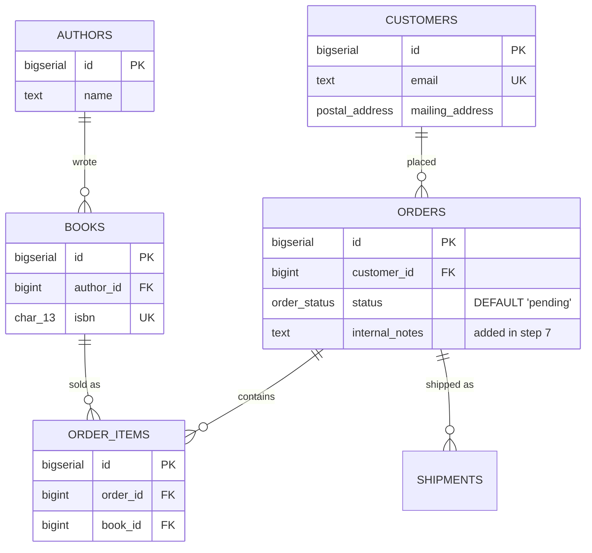

# Run the schema on a real database

## What you'll build

The schema you have spent twelve walkthroughs drawing, running for real.
Fifteen tables, a view, two custom types, fifteen foreign keys and thirteen
indexes go into a PostgreSQL container; the two CRM tables do not, because
they were marked external in walkthrough 03 and the generator has been leaving
them out ever since.

By the end you will have started the container, created the schema in it,
queried it, seeded it with generated rows, changed the diagram and migrated
the live database to match, and pulled the schema back out again.



## Before you start

You need what [Read a big diagram](12-read-a-big-diagram.md) leaves behind:
the whole eighteen-table schema, four regions, nothing broken in **Problems**. Press **Set up the
canvas** at the top of this walkthrough in the drawer's **Walkthrough** tab if
it is not already in front of you.

This walkthrough is the payoff for every earlier one, and it will show it. The
enum from walkthrough 04 becomes a real `CREATE TYPE`; the external region
from 03 is why two tables are missing from the database and nothing complains;
the indexes from 07 are created alongside their tables; the type fixes from 10
are why the foreign keys are accepted at all. If any of those had been left
wrong, this is the walkthrough where PostgreSQL would tell you.

You need Docker running and reachable — on Linux that usually means the
daemon is up and your user can talk to `/var/run/docker.sock`. If you would
rather point at a PostgreSQL server you already have running somewhere, skip
every Docker step below and jump straight to *Connecting*; nothing else in
this walkthrough cares how the database got there.

The dialect selector at the top of the app must read **PostgreSQL** — the
diagram is written in PostgreSQL's spelling (`BIGSERIAL`, `TIMESTAMPTZ`, a
real `CREATE TYPE … AS ENUM`), and the container you start below defaults to
the same engine.

## The mental model

Every panel below is one thing you would type at a `psql` prompt, automated
and shown to you before it runs: connect, run the `CREATE TABLE` script,
`SELECT` something back, `INSERT` some rows, and — once the diagram and the
database have drifted apart — diff the live catalog against your notes and
write the `ALTER` statements that close the gap. Nothing here talks to the
database in a way you could not do yourself; the app just remembers the
exact SQL and lets you read it before it runs.

That is also why the app draws a hard line between dialects. PostgreSQL and
MariaDB are real network services: the local API server the dev command
starts (`npm run dev`, listening on port 8787) opens a TCP connection to
whatever host and port you give it and runs your statements there — which is
also why that server only ever binds to `127.0.0.1`. It executes arbitrary
DDL against databases you point it at, so it is deliberately not reachable
from outside your machine. SQLite is not that: pick it in the dialect
selector and there is no server, no Docker, and no network connection at all
— the database is a WebAssembly build of SQLite (`sql.js`) running inside
this browser tab, and it persists between reloads because the app saves it
to this browser's storage rather than to a server's disk. **Query**,
**Migrate** and **Seed** talk to that in-browser database through the exact
same interface they use for a real server, so everything below reads the
same either way — only *Create the schema* and *Read schema* skip the Docker
column, because there is no container to start.

## Steps

### 1. Open the Database drawer tab

Click **Database** in the top bar, or press `Ctrl+K` and type "database".

**You should see:** the bottom drawer switch to two columns — **Docker** on
the left (a status badge, a list of containers, and a form to create one) and
**Connection** on the right (Engine, Host, Port, Database, User, Password,
then *Test connection*, *Create the schema*, **Migrate**, *Seed data* and
*Import from the database*, stacked top to bottom).

### 2. Start a PostgreSQL container

If **Docker** shows *unavailable*, the API server could not reach the daemon
— it looks at `/var/run/docker.sock`, or `DOCKER_HOST` if you have set it —
and you should skip to step 3 with a database you already have running
instead. Otherwise, open **Create a new database container** and leave the
defaults: **Engine** *PostgreSQL*, **Image** `postgres:16`, **Container
name** `dbviz-postgresql`, **Host port** `5432`, **Database** `app`. Click
**Create & start PostgreSQL**.

**You should see:** a container card appear with a pulsing dot while the
image pulls, a toast reading `Container "dbviz-postgresql" started; waiting
for PostgreSQL to accept connections…`, and once it answers, the **Connection**
fields on the right fill themselves in and a second toast reads `PostgreSQL
is ready on port 5432.`

### 3. Point the connection at the database and test it

Whether you started a container above or already had one, look at the six
fields on the right: **Engine**, **Host**, **Port**, **Database**, **User**,
**Password** — this is a separate dialect switch from the diagram's own, so
it can point at a MariaDB server while the diagram stays PostgreSQL (the app
warns you when they disagree). Click **Test connection**.

**You should see:** a green check and the server's version string next to the
button, e.g. `PostgreSQL 16.x on x86_64-pc-linux-gnu…`. This connection —
including the password — is remembered in this browser's local storage
across reloads, separately from the `.dbviz.json` file, so it never leaves
this machine and never gets saved into the diagram you might hand to someone
else.

### 4. Create the schema

Scroll to **Create the schema**. Leave *Drop existing tables first* unticked
(there is nothing to drop yet) and *Stop on first error* ticked, then click
**Run 57 statements**.

**You should see:** a confirmation dialog naming the statement count and
noting the run happens inside one transaction that is rolled back on any
failure (PostgreSQL only — MariaDB's DDL commits statement by statement, so
the dialog says so instead). After you confirm, a scrollable list appears
with one line per statement — a green check or red cross, the SQL, and how
long it took — and a toast reads `Schema created: 57 statements ran.`

Read the order rather than just watching it scroll, because it is the whole
diagram sorted into something a database will accept. Both custom types are
created first (a column can only use a type that already exists), then tables
in dependency order — `authors` and `customers` before `books` and `orders`,
`order_items` after both — with each table's indexes, foreign keys and
comments following it, and `v_customer_orders` last of all, because a view
cannot be created before the tables it reads.

Count the tables in the list: fifteen, not eighteen. `crm_contacts` and
`crm_accounts` are in the external region from walkthrough 03, so the
generator has never created them and does not start now. The one generator
warning at the top of the **SQL** tab says why: a foreign key cannot cross
into a database you do not own, so `customers.crm_contact_id` is documented
rather than enforced. This is the moment that decision becomes real — had they
not been marked external, PostgreSQL would be creating two tables here that
already exist somewhere else.

### 5. Run a read-only query

Open the **Query** drawer tab. Type:

```sql
SELECT * FROM order_items LIMIT 100;
```

Press `Ctrl+Enter` to run it (or select part of the text first to run only
that part). Try `Tab` inside the editor — it inserts two spaces rather than
moving focus, so writing multi-line SQL does not fight you.

**You should see:** an empty results grid with the five real column headers —
there are no rows yet, since nothing has been seeded. Open the *Insert a
tagged query or snippet…* dropdown: it offers one `SELECT * FROM <table>
LIMIT 100;` per table, and above them the tagged query you wrote on the
`order_items → daily_sales` flow in walkthrough 05 — the `ON CONFLICT` upsert,
ready to run against a database that now actually has those tables in it. Without ticking **Allow writes**, only
`SELECT`, `WITH`, `EXPLAIN`, `SHOW`, `DESCRIBE` and a few other read-only
leaders are accepted at all — the server wraps whatever you send in a
transaction and rolls it back once it has read the result, so a stray
`UPDATE` cannot both run *and* stick (see `QueryRequest` in
`src/shared/types.ts`). Ticking it lets other statements through and commits
them instead. Results are capped at *Max rows* (500 by default, up to 5000);
the grid says *truncated* when you hit it.

### 6. Seed the database with generated rows

Open the **Database** tab again and scroll to **Seed data**. Leave *Rows per
table* at `10` and *Seed* at `1`, then click **Insert rows**.

**You should see:** a result list of `INSERT` statements (one batch per
table, largest tables split into chunks of 50 rows) and a toast naming how
many rows landed — ten per table, across every table the schema created. Go back to the **Query** tab and re-run the same
`SELECT * FROM order_items LIMIT 100;` — now it returns rows.

The generator respects the schema rather than guessing: every `book_id` and
`order_id` in `order_items` points at a row that really exists in `books`
and `orders`, `isbn` and `email` never repeat because they are marked
**UQ**, and `orders.status` only ever gets one of the four `order_status`
values — the enum you defined in walkthrough 04 constrains the fixture data
as tightly as it constrains everything else. Column *names* steer plausible content too — `email` becomes
`alan.hopper1@example.com`, `created_at` becomes a recent timestamp — and
the same seed number always produces the same rows, so a seed script can
live next to the schema and be re-run. Two real rows it produces for seed
`1`, 10 rows per table:

```sql
-- authors (10 rows, first 2 shown)
INSERT INTO public.authors (id, name, country) VALUES
  (1, 'Yukihiro Lovelace', 'JP'),
  (2, 'Guido Wilson', 'CA');
  -- … 8 more rows

-- order_items (10 rows, first 2 shown)
INSERT INTO public.order_items (id, order_id, book_id, quantity, unit_price_cents) VALUES
  (1, 10, 1, 450, 243),
  (2, 1, 6, 461, 796);
  -- … 8 more rows
```

### 7. Add a column to the diagram

Select the `orders` table and add a nullable column: name it
`internal_notes`, type `TEXT`, no flags ticked. Leave everything else alone.

**You should see:** a new row in the `orders` column grid, and the **SQL**
tab's `CREATE TABLE public.orders` gains `internal_notes TEXT` — but nothing
has touched the database yet. A diagram edit only ever changes the
`.dbviz.json`.

### 8. Compare with the database and run the migration

Back in the **Database** tab, scroll to **Migrate** and click **Compare with
database**.

**You should see:** one change, grouped under `orders`: *Add column
orders.internal_notes*, badged **safe**. Click **Show script**:

```sql
-- Migration for Run the schema on a real database — bookshop orders (PostgreSQL)
-- Generated by Database Visualizer from the difference between the diagram and the database.
-- Review before running: the diagram knows the schema, not the data.

-- Columns
-- Add column orders.internal_notes
ALTER TABLE public.orders ADD COLUMN internal_notes TEXT;
```

Tick it (safe changes are ticked by default) and click **Run 1 statements**.
You should see the same green-check result list as schema creation, and the
comparison re-run automatically afterward, now reporting no changes.

**Migrate** always compares the *whole* schema this way — new and dropped
tables, added or dropped columns, retyped columns, nullability and default
changes, foreign keys and indexes — and writes dialect-correct `ALTER`
statements for each: `ALTER COLUMN … TYPE` on PostgreSQL, `MODIFY COLUMN` on
MariaDB, and, for anything SQLite cannot alter in place, a full
create-copy-drop-rename rebuild of the table. Anything that can lose rows —
a dropped table, a dropped column, a narrowed type — is grouped at the
bottom and starts **unticked**, with a *data loss* badge, so running the
default selection can never destroy data by accident. Crucially, **Migrate**
only ever looks at the diagram and the database's catalog, never at the
rows inside it — it cannot know that dropping a column would discard data
you cared about beyond what the risk badge already tells you. Read the
script before you run it, every time, the same way you would read a
migration a colleague wrote.

### 9. Read the schema back into the diagram

Scroll to **Import from the database**. Leave *Replace diagram* selected
(the default) with *Put them in a group* and *Another database* both ticked,
and click **Read schema**.

**You should see:** the canvas clears and redraws with the fifteen tables the
database actually has, freshly laid out, all inside one region named after the
connected database (`app`) with *These tables live in another database*
already ticked — and a toast reading `Imported 15 tables from PostgreSQL
16.x.`. `internal_notes` comes back too, since it now really exists in the
database; table and column comments come back as well, since PostgreSQL stores
them as real `COMMENT ON` objects.

What does *not* come back is most of what makes the diagram worth having.
Sticky notes, table colours, canvas positions, the four regions, the embed,
the dependency and all six data flows with their derivations are gone —
because none of them were ever in the database. The `.dbviz.json` is the only
place they exist, which is the single best argument for keeping it in version
control next to the migrations.

Press `Ctrl+Z` to get your hand-built diagram back — and notice how much
`Ctrl+Z` just restored.

## Other ways to do it

- **Skip Docker entirely.** Nothing in **Connection** requires a container
  you created here — point **Host** / **Port** / **User** / **Password** at
  any PostgreSQL or MariaDB you can reach and click **Test connection**.
- **`docker compose up --build`** runs the whole app, server included, inside
  its own container; `docker-compose.yml` mounts the host's Docker socket in
  so container management keeps working, and sets `DEFAULT_DB_HOST` to
  `host.docker.internal` so a database that container creates (bound to
  `127.0.0.1` on the *host*) is still reachable from inside the app's own
  container — the Connection form pre-fills with that host automatically.
- **Right-click empty canvas** → *Docker & database* opens this same drawer
  tab, and `Ctrl+K` → "database" or "query" jumps straight to either one.
- A **Trace** result's *Join along the path*, and a connection's *Tagged
  query*, both have their own **Run** button that sends that SQL straight
  into the **Query** tab, already filled in and already run.
- Don't want to click **Run** on the generated schema or migration at all?
  **Copy** or **Download** either script and paste it into `psql` yourself —
  the app never requires you to execute anything through it.
- **Import SQL** (paste a `pg_dump`) is the other way to pull a schema in,
  when you have the dump file but the database itself is not reachable from
  here.

## Check your work

The database is the check here, not the SQL tab. Open the **Query** tab and
ask PostgreSQL what it actually has:

```sql
SELECT table_name
FROM information_schema.tables
WHERE table_schema = 'public'
ORDER BY table_name;
```

Fifteen tables and one view come back — and `crm_contacts` and `crm_accounts`
are not among them, exactly as designed. Then ask about the column you
migrated:

```sql
SELECT column_name, data_type, is_nullable
FROM information_schema.columns
WHERE table_name = 'orders'
ORDER BY ordinal_position;
```

`internal_notes`, `text`, `YES` — the last row, added by an `ALTER TABLE`
rather than by recreating anything, with the rows seeded in step 6 still
sitting in the table underneath it.

One more, because it is the whole series in one query:

```sql
SELECT enum_range(NULL::order_status);
```

`{pending,paid,shipped,cancelled}` — the enum you typed into the **Types** tab
in walkthrough 04, now a real type in a real catalog.

Back in the app, press **Check my work** at the foot of this walkthrough. It
checks the diagram rather than the database — both custom types, thirteen
indexes, `internal_notes` present, the two CRM tables still absent from the
generated script, and **Problems** clean — which between them cover
everything the database just confirmed from the other side.

## Gotchas

- **A CHECK overrides the column-name guess when Seed picks a range.** Every
  numeric column here (`price_cents >= 0`, `quantity > 0`, and so on) has a
  bound from its CHECK, and once a column is constrained that way the
  generator stops trying to guess a *realistic* value from the name and
  just picks anything the CHECK allows, capped at 1000 when the CHECK sets
  no ceiling. That is why the sample above seeds a `quantity` of 450 — a
  valid row, not a realistic one. Add an upper bound
  (`quantity BETWEEN 1 AND 10`) if you want seed data that looks plausible,
  not merely legal.
- **The connection form remembers your password.** It lives in this
  browser's local storage, not in the `.dbviz.json` — which is good (a
  diagram you share never carries credentials) and also a reason not to
  point this at a database guarding anything real from a shared machine.
- **"Stop on first error" only exists for schema creation and Migrate.**
  Seeding always stops on the first failed `INSERT`, with no toggle,
  because a partially seeded table with broken foreign-key ordering is
  rarely useful to keep.
- **Read schema defaults to *Replace diagram*, with the import grouped and
  marked external.** Click **Read schema** without changing anything and
  your hand-built diagram is gone — recoverable with `Ctrl+Z`, but gone from
  the canvas until you undo. And because the import is marked external by
  default, a **Create the schema** run straight afterward reports 0
  statements: everything you just read in is now treated as living in
  another database.
- **MariaDB DDL commits as it goes.** "Runs inside one transaction, rolled
  back on failure" is a PostgreSQL guarantee. On MariaDB, a schema or
  migration script that fails partway through leaves every statement before
  the failure applied — there is no automatic rollback to undo it.
- **Migrate cannot see rows.** It diffs the diagram against the database's
  *catalog* — table and column definitions — never the data in them. A
  change it calls "safe" is safe for the schema; whether it is safe for
  what is already stored is a judgment only you can make by reading the
  script.

## Where to go next

- [Export, share and save](14-export-share-and-save.md) — the last walkthrough
  in the series, and the one that answers "so what do I do with this file
  now?" Everything the database could not give back in step 9 is what those
  export formats are for.
