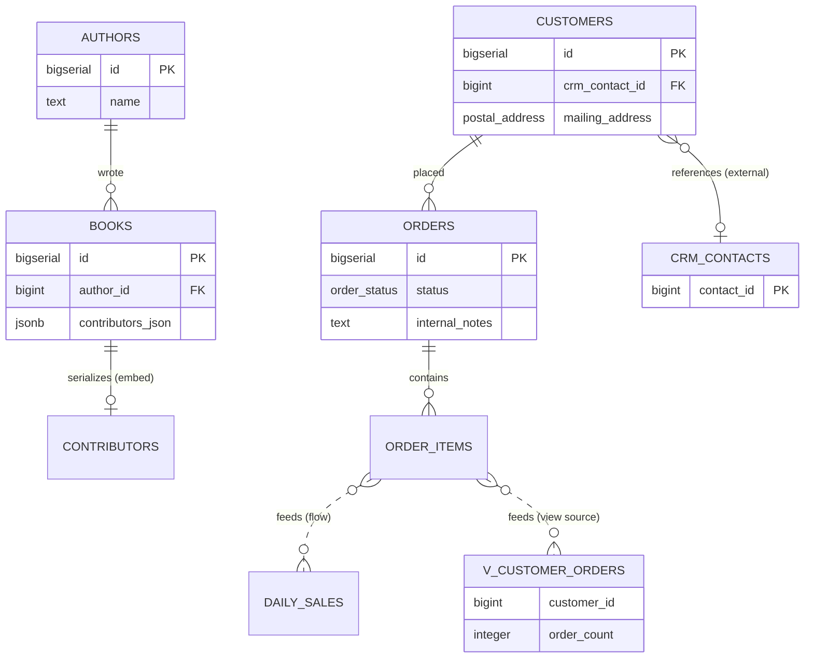
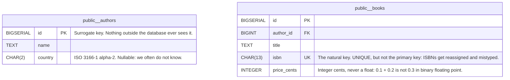

# Export, share and save

## What you'll build

Nothing new goes on the canvas this time — and for once that is the whole
point. The diagram is finished: eighteen tables, four regions, two custom
types, a view, six data flows, an embed, a dependency, thirteen indexes and a
handful of sticky notes, built one walkthrough at a time since walkthrough 00.

This walkthrough puts it through every route the app has for getting a
diagram *out*: the four text formats in the SQL tab, a PNG and an SVG, a
shareable link, a `.dbviz.json` file, and the app's own library and
checkpoints. By the end you will know, from having actually looked, which of
the things you spent thirteen walkthroughs adding — the foreign keys, the
enum, the composite type, the view, the regions, the flows and their
derivations, the notes, the colours, the positions — survive each route, and
which quietly do not.

That last question is the one that matters. Walkthrough 13 ended by reading
the schema back out of PostgreSQL and losing most of the diagram in the
process. These formats lose different things, and knowing which is which is
how you choose what to hand somebody.



## Before you start

You need what [Run the schema on a real database](13-run-the-schema-on-a-real-database.md)
leaves behind — the finished diagram. Press **Set up the canvas** at the top
of this walkthrough in the drawer's **Walkthrough** tab if it is not already
in front of you.

This is the only walkthrough in the series whose **Set up the canvas** and
**Open the finished diagram** buttons load the same file, because exporting a
diagram does not change it. Its **Check my work** button is checking that you
still have the schema you built, not that you built something new.

Have **PostgreSQL** selected in the dialect selector at the top — it is the
only dialect that turns `order_status` and `postal_address` into real
`CREATE TYPE` statements, which matters for several of the comparisons below.

## The mental model

Everything the SQL tab shows you is generated fresh from the diagram on every
keystroke — there is no separate saved copy underneath it. But "generated
fresh" is not the same as "generated completely." Think of each export format
as a compiler target rather than a copy: SQL, Markdown, Mermaid and DBML are
each a narrower language than the diagram, built to be read by something
else — a database engine, a wiki, GitHub's Markdown renderer, dbdiagram.io —
and each one only understands some of what a diagram can hold. The generator
does what any compiler does with a feature the target language lacks: it
either translates it into the nearest equivalent, writes it as a comment, or
drops it silently. A PNG or SVG is narrower still — a picture has no schema
at all, just shapes where the schema used to be.

`.dbviz.json` is not a compile target. It is the diagram's own file format, so
opening one again is not an import that does its best — it is the exact state
you saved, restored. If the other formats are like `git log --format=...` —
real, useful views of your history that cannot themselves be checked out and
continued — `.dbviz.json` is the commit itself. That distinction is the whole
reason this walkthrough exists: once you know which bucket a format falls
into, you know in advance what it can be used for and what you would lose by
relying on it alone.

## Steps

### 1. Read the whole-schema SQL script

<!-- step
target: tab:sql
goals:
  - open | sql
  - contains | CREATE TYPE order_status AS ENUM
-->

Open the bottom drawer's **SQL** tab. Leave the format selector on *SQL
script*, the scope on **Whole schema**, and *Prefix DROP TABLE statements*
unticked.

```sql
-- Custom types
CREATE TYPE order_status AS ENUM ('pending', 'paid', 'shipped', 'cancelled');
CREATE TYPE postal_address AS (street TEXT, city TEXT, postal_code TEXT, country CHAR(2));

CREATE TABLE public.authors (
  id BIGSERIAL PRIMARY KEY,
  name TEXT NOT NULL,
  country CHAR(2) CHECK (country = upper(country))
);
```

Scroll to the bottom and you will find a commented `-- External sources`
block that documents `crm_contacts` and `crm_accounts` — table names, columns,
the note on their group — without a `CREATE TABLE` for either anywhere; after
that a block documenting the embed, the dependency and all six data-flow edges
as comments, because none of the three is ever a constraint; and last a
`-- dbviz:connections` block saying the same thing again as JSON, which is the
one **Import SQL** reads when this file comes back.

**You should see:** the badge reading `PostgreSQL` and `57 statements`, the
hint above the code area explaining that the script carries its connections in
its trailing comments, and the script running from two `CREATE TYPE`s through
fifteen real tables and one `CREATE VIEW` before the three commented
appendices.

### 2. Switch to the Markdown data dictionary

<!-- step
target: panel:sql
-->

Change the format selector to *Markdown data dictionary*. The `public.authors`
section reads:

```markdown
One row per person who wrote something we sell.

| Column | Type | Nullable | Default | Key | Check | Comment |
| --- | --- | --- | --- | --- | --- | --- |
| id | BIGSERIAL | no |  | PK, AUTO |  | Surrogate key. Nothing outside the database ever sees it. |
| name | TEXT | no |  |  |  |  |
| country | CHAR(2) | yes |  |  | CHECK (country = upper(country)) | ISO 3166-1 alpha-2. Nullable: we often do not know. |

**Referenced by** [books](#publicbooks)
```

Its first line is the one to notice:
`PostgreSQL · 17 tables · 1 view · 80 columns · 17 foreign keys · 2 custom
types · 4 groups`. Seventeen tables, not fifteen — unlike the SQL script, the
data dictionary documents the external CRM tables too, because documenting is
the whole job.

**You should see:** the hint above the code area reading "A README-ready
reference with one section per table," a table of contents at the top, one
`###` section per table with its columns, indexes and checks as Markdown
tables, and a **Custom types**, **Groups** and **Relationships** section
further down — this single file is closer to the diagram than any of the
other exports.

### 3. Switch to Mermaid and copy it

<!-- step
target: panel:sql
-->

Change the format selector to *Mermaid ER diagram*, then click **Copy**.



Further down, every connection — whatever its kind — becomes a line, and the
enum column becomes just another attribute:

```mermaid
    public__authors ||..o{ public__books : "books_author_id_fkey"
    public__books }o..o{ public__contributors : "contributors_json"
    public__catalog_export }o..o{ public__books : "nightly feed"
    public__order_items }o..o{ public__v_customer_orders : "view source"
```

Look at those four lines together. The first is a foreign key the database
enforces; the second is the embed from walkthrough 02, the third the
dependency, the fourth a view source — and Mermaid draws all four the same
way, because its ER syntax has one kind of relationship. Everything this
series taught you to distinguish between collapses here into a single dashed
line with a label.

**You should see:** a toast reading "Mermaid ER diagram copied to the
clipboard," and — if you paste it into a scratch GitHub issue or
mermaid.live — a rendered entity-relationship diagram with no colours, no
positions, and `order_status` typed as a bare column rather than a set of
four named values.

### 4. Switch to DBML

<!-- step
target: panel:sql
-->

Change the format selector to *DBML*.

```dbml
Enum order_status {
  pending
  paid
  shipped
  cancelled
}
```

**You should see:** the hint "Opens in dbdiagram.io and dbdocs," and — unlike
Mermaid — a real `Enum` block. Scroll down: all four regions come across as
`TableGroup` blocks, and `crm_contacts` is still an ordinary `Table` inside
one whose note begins *"Lives in another database; not created by the schema
script."* DBML has no field for "external," so that fact survives only as
prose. `postal_address` fares worse still — a composite type has nowhere to go
in DBML at all, so it is written out as a standalone `Note` block:

```dbml
Note type_postal_address {
  'Composite type postal_address (street TEXT, city TEXT, postal_code TEXT, country CHAR(2))'
}
```

### 5. Export a picture

<!-- step
target: ui:file-menu
-->

Open **File → Export PNG**.

**You should see:** a toast reading "Exported PNG." and a downloaded
`export-share-and-save-bookshop.png` — the tables, the CRM group's region and
the yellow sticky note, coloured and positioned exactly as they sit on your
canvas right now. **File → Export SVG**, one row below it, does the same
thing as a vector instead of a bitmap, which is the one to reach for if the
picture is going into something that will be resized.

### 6. Nudge the note and watch the dot appear

<!-- step
target: ui:diagram-name
-->

Click the sticky note once to select it, then press `Arrow keys` to nudge it
a few pixels.

**You should see:** a small dot appear right after "DB Visualizer" in the top
bar, next to the diagram name. Hover it and the tooltip reads "Changed since
the last save (Ctrl+S)" — this diagram was opened from a real file, so the
app can tell it now disagrees with that file.

### 7. Save the file again

<!-- step
target: ui:file-menu
-->

Press `Ctrl+S` (or **File → Save as .dbviz.json**).

**You should see:** a toast reading "Diagram saved.", a re-downloaded
`.dbviz.json` named after the diagram, and the dot from the previous step
gone — saving is what makes "changed since the last save" false again.

### 8. Reopen the original and confirm it replaces the canvas

<!-- step
target: ui:file-menu
-->

Press `Ctrl+O` again, but this time pick
[`diagrams/13-run-the-schema-on-a-real-database.dbviz.json`](diagrams/13-run-the-schema-on-a-real-database.dbviz.json)
— the file **Set up the canvas** loaded — rather than the copy you just
downloaded.

**You should see:** the note jump back to where it started. The nudged
position only ever existed on the canvas and in the file you saved a moment
ago; opening a different `.dbviz.json` throws all of that away in one step,
with no prompt asking whether to keep anything from what was on the canvas a
moment before.

### 9. Check the library

<!-- step
target: ui:file-menu
-->

Open **File → Open recent…**.

**You should see:** two cards named "Export, share and save — bookshop," both
updated within the last few minutes. One is badged "open" — the file you
reopened in the last step. The other, right beside it with its own thumbnail,
is the state the canvas was in a moment before that, nudge and all: opening a
file never throws away what was on the canvas; it gives the old state its own
place in the library first.

### 10. Copy a share link

<!-- step
target: ui:file-menu
-->

Open **File → Copy share link**.

**You should see:** a toast reading "Share link copied. Anyone who opens it
gets a copy of this diagram." Paste it anywhere and it is one very long URL —
for this particular diagram, about 2,500 characters of compressed data after
the `#d=`, next to a `.dbviz.json` file that is closer to 12,600 bytes on
disk.

### 11. Save a checkpoint

<!-- step
target: section:Checkpoints
-->

Open the inspector with nothing selected (click empty canvas) to land on the
**Diagram** panel, and use *Checkpoints (0)* — or **File → Save checkpoint…**
— to save one, accepting the suggested timestamp name.

**You should see:** a toast reading `Saved checkpoint "…". Restore it from the
Diagram panel in the inspector.`, and the count in *Checkpoints (0)* become
*Checkpoints (1)* with your new entry listed underneath, its own **Restore**
button beside it.

## Other ways to do it

- **Command palette** (`Ctrl+K`): every action above has an entry — type
  "export" to see all four text formats plus PNG and SVG in one list, or
  "share", "checkpoint", "save", "open".
- **Right-click a table** → *Show in SQL tab* selects that table and opens
  the drawer (it stays on *Whole schema* until you also click **Selected
  table** yourself), or **Copy as** → *CREATE TABLE* / *CREATE VIEW* to skip the
  drawer entirely and put that statement on the clipboard — with the enum types
  it needs, and without a foreign key to a table you did not copy, so it runs on
  its own.
- **Right-click a selection or a group region** → **Copy as** offers the same
  four formats for several tables at once: *SQL script*, *Markdown*,
  *Markdown + SQL* and *Diagram JSON*. Each one covers the tables you picked and
  only the connections between them; a foreign key pointing at a table you left
  behind is listed as left out rather than emitted. A plain `Ctrl+C` does all
  three at once — the DDL for a text editor, the Markdown dictionary for an
  editor that takes rich text, and the tables themselves for another canvas.
- **Right-click empty canvas** → *SQL script* opens the same **SQL** tab as
  the command palette's *Open SQL tab* entry.
- **The table inspector** has its own **Preview** toggle under an *SQL*
  section, plus a **Drawer** button that jumps to the full tab — handy when
  you only want to glance at one table's DDL without leaving the inspector.
- **Drop a `.dbviz.json` file** on the canvas instead of `Ctrl+O`. On an empty
  canvas it opens outright, same as `Ctrl+O`; on a canvas that already has
  tables it asks *Replace* or *Add tables* — a merge option `Ctrl+O` does not
  offer.
- **The workspace library** (`File → Open recent…`) also has **Download
  .dbviz.json** on every entry, so you can grab a file for work you never
  explicitly saved.
- **Add a second diagram** with the **+** at the end of the tab strip above the
  canvas, and press `Ctrl+S` again: one file now holds both, under a
  `"sheets"` array, and opening it brings both tabs back. With a single diagram
  the file stays exactly the shape shown above. A share link still carries one
  diagram — opening one adds it to your workspace as another tab rather than
  replacing what you had.
- **Hand-write a `.dbviz.json`** instead of exporting one from the app —
  [`../ADVISOR_OUTPUT_FORMAT.md`](../ADVISOR_OUTPUT_FORMAT.md) documents every
  field, and `node scripts/validate-dbviz.mjs file.dbviz.json` checks it
  before you open it.

## Check your work

Open the bottom drawer → **SQL**, leave the format on *SQL script* and the
scope on *Whole schema*, and read the four header lines. On a schema this
size they are the fastest possible summary of everything the series built:

```sql
-- Bookshop — after 13 Run the schema on a real database (PostgreSQL)
-- Generated by Database Visualizer
-- Tables: 15, views: 1, foreign keys: 15, documented connections: 8
-- 2 table(s) live in another database and are not created here; see "External sources" at the end.
```

Then scroll to the very end, where the two appendices are — the part no other
export format has:

```sql
-- ----------------------------------------------------------------
-- External sources: other databases this schema reads from.
--
-- CRM (read-only) (2 tables)
--   crm_contacts (contact_id, email, account_id)
--   crm_accounts (account_id, name, tier)
--
-- References into CRM (read-only), as foreign keys would look if the tables were local:
-- ALTER TABLE public.customers ADD CONSTRAINT customers_crm_contact_id_fkey FOREIGN KEY (crm_contact_id) REFERENCES public.crm_contacts (contact_id) ON DELETE SET NULL;

-- ----------------------------------------------------------------
-- Connections the schema does not enforce, and tagged queries
-- (documentation only, not executed)
-- [embed] books serializes contributors in books.contributors_json (contributors_json)
-- [flow] orders feeds customer_cadence (nightly rollup)
-- [uses] catalog_export uses books (nightly feed)
-- [flow] order_items feeds daily_sales (nightly rollup)
-- [flow] daily_sales feeds book_totals (lifetime rollup)
-- [flow] customers feeds v_customer_orders (view source)
```

Eight connections that a database cannot be told about, written down anyway.
Every one of them is a decision from an earlier walkthrough — the embed from
02, the dependency from 02, the rollups from 05 and 06, the view sources from
08 — and this appendix is the only place in any export where all of them
survive in one piece.

Below it sits a third appendix, the same eight connections plus the fifteen
foreign keys once more, this time as JSON inside `--` comments:

```sql
-- ----------------------------------------------------------------
-- Connection metadata: the same connections once more, in the form Import SQL
-- reads. …
-- dbviz:connections v1
-- {
--   "connections": [
--     {
--       "kind": "flow",
--       "verb": "feeds",
--       "from": "orders",
--       "to": "customer_cadence",
--       "name": "nightly rollup",
--       "note": "Full rebuild, not incremental: …",
--       "derivations": [
--         {
--           "target": "order_count",
--           "expression": "*",
--           "aggregate": "COUNT",
--           "groupBy": [ "customer_id" ],
--           "filter": "status <> 'cancelled'"
--         }
--       ]
--     }
--   ]
-- }
-- dbviz:end
```

The appendix above it is for you; this one is for the app. Download the
script, paste it into **Import SQL** and every connection comes back — all six
flows with their derived columns, the embed on `books.contributors_json`, the
dependency, and the verb and note on each foreign key. The two `crm_*` tables
and the two foreign keys reaching into them do not, because the script never
creates those tables; positions, colours and the sticky note do not either,
because they are not connections. That is a much shorter list of losses than
the one at the top of this walkthrough would have led you to expect, and it is
the reason a `.sql` file is now a route back into the app rather than only a
route out.

Then open **Problems**. It reports one finding, at the *info* level, not an
error or a warning: `customers references crm_contacts, which lives in
another database; the script documents the link instead of creating a
constraint.` That is the linter confirming the external group is working as
intended, not something to fix.

Finally, press **Check my work** at the foot of this walkthrough. Its checks
are the same shape as walkthrough 13's, because exporting a diagram does not
change it — four regions, both custom types, the view, every connection, lint
clean. Passing them means the thing you have been carrying since walkthrough
00 arrived at the end intact.

## Try it yourself

- Tick *Prefix DROP TABLE statements* on the SQL tab and watch `DROP VIEW IF
  EXISTS public.v_customer_orders;`, fifteen `DROP TABLE … CASCADE;` lines and
  two `DROP TYPE IF EXISTS` lines appear above the script, in the order that
  lets each drop succeed before the thing it depends on is already gone.
- Select `orders` on the canvas, then click **Table: orders** under *Selected
  table* in the SQL tab. Only that table's `CREATE TABLE`, its index and its
  comment remain — nothing from the other fourteen tables or the view.
- Switch the dialect selector at the top to **MariaDB**, then revisit the SQL
  and DBML tabs: `order_status` stops being a named type and becomes an
  inlined `ENUM(...)` on the column instead. `Ctrl+Z` undoes the whole
  translation and puts PostgreSQL back.
- Paste the share link you copied into a private/incognito browser window.
  It opens with no sign-in, no server round trip beyond loading the app
  itself, and no file to have sent anyone.

## Reference

What each format keeps from this diagram, verified by generating all of them
from the file above rather than guessed:

| Format | Foreign keys | Flows & derivations | `order_status` enum | `postal_address` composite | `v_customer_orders` view | Regions | Sticky notes | Positions & colours |
| --- | --- | --- | --- | --- | --- | --- | --- | --- |
| `.dbviz.json` | structured | structured, in full | structured | structured | structured | structured, with the external flag | yes | yes |
| SQL script | real `CONSTRAINT`s (the cross-group one as a commented `ALTER TABLE`) | commented `INSERT … SELECT` in the appendix, and structured in the metadata block | real `CREATE TYPE` | real `CREATE TYPE` | real `CREATE VIEW` | commented "External sources" appendix | no | no |
| Markdown | a Relationships table | listed in the Relationships table | a Custom types table | a Custom types table | SELECT shown in a fenced block | a Groups table | no | no |
| Mermaid | crow's-foot lines | one more line, indistinguishable from the rest | flattened to a plain column type | flattened to a plain column type | drawn as an entity | one `%% external:` comment, no region | no | no |
| DBML | `Ref` lines | dropped | real `Enum` block | a standalone `Note` block | a `Table` whose note carries the SELECT | `TableGroup` blocks, external only as a note | no | no |
| PNG / SVG | crow's-foot lines with `1` / `N` cardinality labels, no column or constraint names | drawn as a dashed edge | drawn as a column's type label, no values listed | same | drawn as a node | drawn as the region | drawn, as they appear on canvas | yes, exactly as arranged |

Read the `.dbviz.json` row against every other one. It is the only format that
keeps *everything* — the positions, the colours, the sticky notes, the regions
and their external flag — and the only one you can open again and carry on
working in. The SQL script is the one other format you can come back through:
its trailing comments keep the derivations and the difference between a foreign
key, an embed, a flow and a dependency, so a script committed next to the
migrations is documentation the app can read back rather than a picture nobody
can. Markdown, Mermaid and DBML are still one-way, and so is a PNG.

## Gotchas

- **Markdown, Mermaid and DBML are one-way.** Edit the downloaded `.md`,
  `.mmd` or `.dbml` file and nothing comes back into the diagram; **Import
  SQL** cannot read a data dictionary, a Mermaid diagram or DBML. A `.sql`
  script does come back, connections and all — but only what it contains: the
  tables of an external group are commented, not created, so the foreign keys
  into them have nothing to land on and are left behind with them.
- **The metadata block is a comment, and only that.** Nothing runs it, the
  statement count in the toolbar does not include it, and deleting it leaves a
  script that still creates the schema — you just get bare foreign keys back
  when you import it. Hand-edit it and break the JSON and the import says so
  and carries on with the DDL.
- **The unsaved-changes dot only tracks a file, not the browser.** It appears
  when a diagram opened from (or saved to) a real `.dbviz.json` has changed
  since. A diagram opened from **Open recent…** or a share link is not
  "file-backed" the same way, so the dot never shows for it however much you
  edit — the library's own autosave has nothing to compare against, because
  there is no file on your disk to disagree with.
- **`Ctrl+O` and dropping a file behave differently.** `Ctrl+O` always
  replaces the canvas outright, with no prompt. Dropping a `.dbviz.json` onto
  a canvas that already has tables asks *Replace* or *Add tables* — the only
  route of the two that can merge one diagram into another.
- **Mermaid throws the enum's values away.** `order_status` becomes a bare
  column type; the fact that it is a closed set of four strings at all is
  gone, along with everything else about it. DBML and the SQL script both
  keep it as a real type.
- **DBML has no concept of "external."** The note on the `TableGroup` says
  `crm_contacts` lives elsewhere, but the `Table crm_contacts` block itself is
  written exactly like any other table — dbdiagram.io has no equivalent of
  the group's *These tables live in another database* checkbox.
- **A share link puts the whole diagram in the URL, compressed but not
  encrypted.** Anyone who can read the link can read the diagram. Paste it
  into a public channel and the diagram is public; very large diagrams can
  also run into truncation in some chat apps well before the app's own
  30,000-character soft limit.
- **The library and checkpoints live in this browser's IndexedDB, not on a
  server.** Clearing site data, a private window, or a different browser or
  device starts with none of it. Only a downloaded `.dbviz.json` — or a
  checkpoint you restore and then save — travels with you.

## Where to go next

That is the bookshop: fifteen walkthroughs, built once and never restarted. The
canvas you are looking at is the same one walkthrough 00 opened with two tables
on it.

- [Add an extension](15-add-an-extension.md) is the coda, and the one thing the
  bookshop still cannot do: a column type PostgreSQL does not have on its own.
  It is also the only walkthrough that adds to the canvas after this one.

Otherwise, where to go from here is your own schema. A few of these are worth
re-reading with it in front of you rather than the bookshop:

- [Fill one table from another](05-fill-one-table-from-another.md) — the
  hardest single idea in the series, and the one most worth applying to a
  rollup you already maintain by hand.
- [Fix what Problems finds](10-fix-what-problems-finds.md) — point it at a
  schema you inherited rather than one you built, and read the list.
- [Run the schema on a real database](13-run-the-schema-on-a-real-database.md)
  — the shortest path from "I drew a thing" to "it runs".

Every walkthrough's **Set up the canvas** button still works, so any of them
can be reopened at its own starting point without disturbing what you are
working on.
