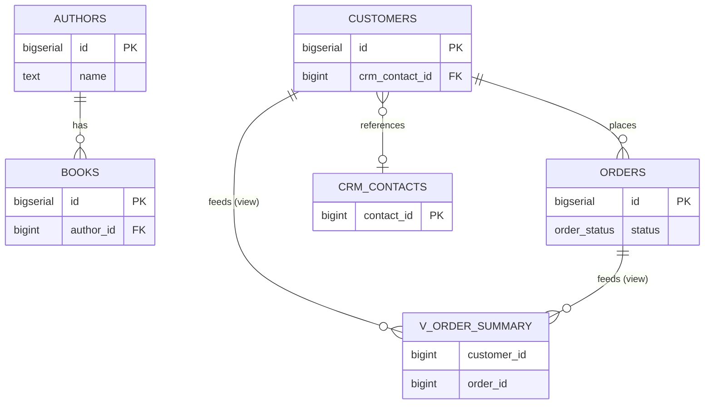
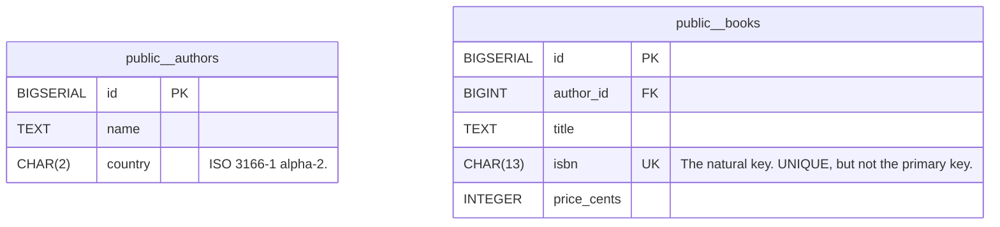

# Export, share and save

## What you'll build

Nothing new goes on the canvas this time. You open a small, already-finished
bookshop schema — `authors`, `books`, `customers` and `orders`, a read-only
`crm_contacts` table sitting in an external CRM group, an `order_status` enum,
a `v_order_summary` view, and one sticky note — and put it through every route
the app has for getting a diagram *out*: the four text formats in the SQL tab,
a PNG and an SVG, a shareable link, a `.dbviz.json` file, and the app's own
library and checkpoints. By the end you will know, from having actually looked,
which of those seven things — the foreign key, the enum, the view, the group,
the note, the colours, the positions — survives each route and which does not.



## Before you start

Read [Your first diagram](00-your-first-diagram.md) first if you have not
already; this walkthrough assumes you know your way around the canvas and the
bottom drawer but does not otherwise depend on any other walkthrough. Have
**PostgreSQL** selected in the dialect selector at the top — it is the only
dialect that turns `order_status` into a real `CREATE TYPE`, which matters for
one of the comparisons below.

Unlike the earlier walkthroughs, there is nothing to type here. Open
[`diagrams/14-export-share-and-save.dbviz.json`](diagrams/14-export-share-and-save.dbviz.json)
with **File → Open** (`Ctrl+O`), or drop the file on the canvas, before you
start on the steps: this walkthrough is entirely about what you do with a
diagram once it exists, not about building one.

## The mental model

Everything the SQL tab shows you is generated fresh from the diagram on every
keystroke — there is no separate saved copy underneath it. But "generated
fresh" is not the same as "generated completely." Think of each export format
as a compiler target rather than a copy: SQL, Markdown, Mermaid and DBML are
each a narrower language than the diagram, built to be read by something
else — a database engine, a wiki, GitHub's Markdown renderer, dbdiagram.io —
and each one only understands some of what a diagram can hold. The generator
does what any compiler does with a feature the target language lacks: it
either translates it into the nearest equivalent, writes it as a comment, or
drops it silently. A PNG or SVG is narrower still — a picture has no schema
at all, just shapes where the schema used to be.

`.dbviz.json` is not a compile target. It is the diagram's own file format, so
opening one again is not an import that does its best — it is the exact state
you saved, restored. If the other formats are like `git log --format=...` —
real, useful views of your history that cannot themselves be checked out and
continued — `.dbviz.json` is the commit itself. That distinction is the whole
reason this walkthrough exists: once you know which bucket a format falls
into, you know in advance what it can be used for and what you would lose by
relying on it alone.

## Steps

### 1. Read the whole-schema SQL script

Open the bottom drawer's **SQL** tab. Leave the format selector on *SQL
script*, the scope on **Whole schema**, and *Prefix DROP TABLE statements*
unticked.

```sql
CREATE TYPE order_status AS ENUM ('pending', 'paid', 'shipped', 'cancelled');

CREATE TABLE public.authors (
  id BIGSERIAL PRIMARY KEY,
  name TEXT NOT NULL,
  country CHAR(2)
);
```

Scroll to the bottom and you will find a commented `-- External sources`
block that documents `crm_contacts` — table name, columns, the note on its
group — without a `CREATE TABLE` for it anywhere, and after that a block
documenting the two data-flow edges that feed `v_order_summary` as comments,
because a data flow is never a constraint.

**You should see:** the badge reading `PostgreSQL` and `16 statements`, and
the script running from `CREATE TYPE` through four real tables and one
`CREATE VIEW` before the two commented appendices.

### 2. Switch to the Markdown data dictionary

Change the format selector to *Markdown data dictionary*. The `public.authors`
section reads:

```markdown
One row per person who wrote something we sell.

| Column | Type | Nullable | Default | Key | Check | Comment |
| --- | --- | --- | --- | --- | --- | --- |
| id | BIGSERIAL | no |  | PK, AUTO |  |  |
| name | TEXT | no |  |  |  |  |
| country | CHAR(2) | yes |  |  |  | ISO 3166-1 alpha-2. |

**Referenced by** [books](#publicbooks)
```

**You should see:** the hint above the code area reading "A README-ready
reference with one section per table," a table of contents at the top, one
`###` section per table with its columns, indexes and checks as Markdown
tables, and a **Groups** table and a **Relationships** table further down —
this single file is closer to the diagram than any of the other exports.

### 3. Switch to Mermaid and copy it

Change the format selector to *Mermaid ER diagram*, then click **Copy**.



Further down, the foreign key becomes a crow's-foot line and the enum column
becomes just another attribute:

```mermaid
    public__authors ||..o{ public__books : "books_author_id_fkey"
    public__orders }o..o{ public__v_order_summary : "view source"
```

**You should see:** a toast reading "Mermaid ER diagram copied to the
clipboard," and — if you paste it into a scratch GitHub issue or
mermaid.live — a rendered entity-relationship diagram with no colours, no
positions, and `order_status` typed as a bare column rather than a set of
four named values.

### 4. Switch to DBML

Change the format selector to *DBML*.

```dbml
Enum order_status {
  pending
  paid
  shipped
  cancelled
}
```

**You should see:** the hint "Opens in dbdiagram.io and dbdocs," and — unlike
Mermaid — a real `Enum` block. Scroll down and `crm_contacts` is still an
ordinary `Table` block with a note on its `TableGroup` saying it lives
elsewhere; DBML has no field for "external," so that fact survives only as
prose.

### 5. Export a picture

Open **File → Export PNG**.

**You should see:** a toast reading "Exported PNG." and a downloaded
`export-share-and-save-bookshop.png` — the tables, the CRM group's region and
the yellow sticky note, coloured and positioned exactly as they sit on your
canvas right now. **File → Export SVG**, one row below it, does the same
thing as a vector instead of a bitmap, which is the one to reach for if the
picture is going into something that will be resized.

### 6. Nudge the note and watch the dot appear

Click the sticky note once to select it, then press `Arrow keys` to nudge it
a few pixels.

**You should see:** a small dot appear right after "DB Visualizer" in the top
bar, next to the diagram name. Hover it and the tooltip reads "Changed since
the last save (Ctrl+S)" — this diagram was opened from a real file, so the
app can tell it now disagrees with that file.

### 7. Save the file again

Press `Ctrl+S` (or **File → Save as .dbviz.json**).

**You should see:** a toast reading "Diagram saved.", a re-downloaded
`export-share-and-save-bookshop.dbviz.json`, and the dot from the previous
step gone — saving is what makes "changed since the last save" false again.

### 8. Reopen the original and confirm it replaces the canvas

Press `Ctrl+O` again, but this time pick the original file from **Before you
start**, not the copy you just downloaded.

**You should see:** the note jump back to where it started. The nudged
position only ever existed on the canvas and in the file you saved a moment
ago; opening a different `.dbviz.json` throws all of that away in one step,
with no prompt asking whether to keep anything from what was on the canvas a
moment before.

### 9. Check the library

Open **File → Open recent…**.

**You should see:** two cards named "Export, share and save — bookshop," both
updated within the last few minutes. One is badged "open" — the file you
reopened in the last step. The other, right beside it with its own thumbnail,
is the state the canvas was in a moment before that, nudge and all: opening a
file never throws away what was on the canvas; it gives the old state its own
place in the library first.

### 10. Copy a share link

Open **File → Copy share link**.

**You should see:** a toast reading "Share link copied. Anyone who opens it
gets a copy of this diagram." Paste it anywhere and it is one very long URL —
for this particular diagram, about 2,500 characters of compressed data after
the `#d=`, next to a `.dbviz.json` file that is closer to 12,600 bytes on
disk.

### 11. Save a checkpoint

Open the inspector with nothing selected (click empty canvas) to land on the
**Diagram** panel, and use *Checkpoints (0)* — or **File → Save checkpoint…**
— to save one, accepting the suggested timestamp name.

**You should see:** a toast reading `Saved checkpoint "…". Restore it from the
Diagram panel in the inspector.`, and the count in *Checkpoints (0)* become
*Checkpoints (1)* with your new entry listed underneath, its own **Restore**
button beside it.

## Other ways to do it

- **Command palette** (`Ctrl+K`): every action above has an entry — type
  "export" to see all four text formats plus PNG and SVG in one list, or
  "share", "checkpoint", "save", "open".
- **Right-click a table** → *Show in SQL tab* selects that table and opens
  the drawer (it stays on *Whole schema* until you also click **Selected
  table** yourself), or *Copy CREATE TABLE* / *Copy CREATE VIEW* to skip the
  drawer entirely and put just that statement on the clipboard.
- **Right-click empty canvas** → *SQL script* opens the same **SQL** tab as
  the command palette's *Open SQL tab* entry.
- **The table inspector** has its own **Preview** toggle under an *SQL*
  section, plus a **Drawer** button that jumps to the full tab — handy when
  you only want to glance at one table's DDL without leaving the inspector.
- **Drop a `.dbviz.json` file** on the canvas instead of `Ctrl+O`. On an empty
  canvas it opens outright, same as `Ctrl+O`; on a canvas that already has
  tables it asks *Replace* or *Add tables* — a merge option `Ctrl+O` does not
  offer.
- **The diagram library** (`File → Open recent…`) also has **Download
  .dbviz.json** on every entry, so you can grab a file for a diagram you never
  explicitly saved.
- **Hand-write a `.dbviz.json`** instead of exporting one from the app —
  [`../ADVISOR_OUTPUT_FORMAT.md`](../ADVISOR_OUTPUT_FORMAT.md) documents every
  field, and `node scripts/validate-dbviz.mjs file.dbviz.json` checks it
  before you open it.

## Check your work

Open the bottom drawer → **SQL**, leave the format on *SQL script* and the
scope on *Whole schema*, and compare. This is the entire output for the
diagram above:

```sql
-- Export, share and save — bookshop (PostgreSQL)
-- Generated by Database Visualizer
-- Tables: 4, views: 1, foreign keys: 2, documented connections: 2
-- 1 table(s) live in another database and are not created here; see "External sources" at the end.

-- Custom types
CREATE TYPE order_status AS ENUM ('pending', 'paid', 'shipped', 'cancelled');

CREATE TABLE public.authors (
  id BIGSERIAL PRIMARY KEY,
  name TEXT NOT NULL,
  country CHAR(2)
);
COMMENT ON TABLE public.authors IS 'One row per person who wrote something we sell.';
COMMENT ON COLUMN public.authors.country IS 'ISO 3166-1 alpha-2.';

CREATE TABLE public.books (
  id BIGSERIAL PRIMARY KEY,
  author_id BIGINT NOT NULL,
  title TEXT NOT NULL,
  isbn CHAR(13) NOT NULL UNIQUE,
  price_cents INTEGER NOT NULL DEFAULT 0 CHECK (price_cents >= 0),
  CONSTRAINT books_author_id_fkey FOREIGN KEY (author_id) REFERENCES public.authors (id) ON DELETE RESTRICT
);
CREATE INDEX books_author_id_idx ON public.books (author_id);
COMMENT ON TABLE public.books IS 'One row per edition we stock.';
COMMENT ON COLUMN public.books.isbn IS 'The natural key. UNIQUE, but not the primary key.';

CREATE TABLE public.customers (
  id BIGSERIAL PRIMARY KEY,
  email TEXT NOT NULL UNIQUE,
  crm_contact_id BIGINT,
  created_at TIMESTAMPTZ NOT NULL DEFAULT now()
);
CREATE INDEX customers_crm_contact_id_idx ON public.customers (crm_contact_id);
COMMENT ON TABLE public.customers IS 'Shoppers. crm_contact_id points into the CRM group below.';
COMMENT ON COLUMN public.customers.crm_contact_id IS 'References crm_contacts, which lives in another database.';

CREATE TABLE public.orders (
  id BIGSERIAL PRIMARY KEY,
  customer_id BIGINT NOT NULL,
  status order_status NOT NULL DEFAULT 'pending',
  total_cents INTEGER NOT NULL DEFAULT 0,
  placed_at TIMESTAMPTZ NOT NULL DEFAULT now(),
  CHECK (total_cents >= 0),
  CONSTRAINT orders_customer_id_fkey FOREIGN KEY (customer_id) REFERENCES public.customers (id) ON DELETE CASCADE
);
CREATE INDEX orders_customer_id_idx ON public.orders (customer_id);
COMMENT ON TABLE public.orders IS 'One row per order. status is the order_status enum below.';

-- Views
CREATE VIEW public.v_order_summary AS
SELECT c.id AS customer_id,
       c.email,
       o.id AS order_id,
       o.status,
       o.total_cents,
       o.placed_at
FROM customers c
JOIN orders o ON o.customer_id = c.id;

-- ----------------------------------------------------------------
-- External sources: other databases this schema reads from.
-- Nothing below is executed; it is here so the script documents where the data comes from.
--
-- CRM (read-only) (1 table)
--   Vendor CRM, reached over a foreign data wrapper. Marking the group external keeps crm_contacts out of the generated CREATE TABLE script.
--   crm_contacts (contact_id, email)
--
-- References into CRM (read-only), as foreign keys would look if the tables were local:
-- ALTER TABLE public.customers ADD CONSTRAINT customers_crm_contact_id_fkey FOREIGN KEY (crm_contact_id) REFERENCES crm_contacts (contact_id) ON DELETE SET NULL;

-- ----------------------------------------------------------------
-- Connections the schema does not enforce, and tagged queries
-- (documentation only, not executed)
-- [flow] customers feeds v_order_summary (view source)
--   Linked by v_order_summary's Detect from SQL: customers is joined in its FROM clause.
-- [flow] orders feeds v_order_summary (view source)
--   Linked by v_order_summary's Detect from SQL: orders is joined in its FROM clause.
```

Then open **Problems**. It reports one finding, at the *info* level, not an
error or a warning: `customers references crm_contacts, which lives in
another database; the script documents the link instead of creating a
constraint.` That is the linter confirming the external group is working as
intended, not something to fix.

## Try it yourself

- Tick *Prefix DROP TABLE statements* on the SQL tab and watch `DROP VIEW IF
  EXISTS public.v_order_summary;`, four `DROP TABLE … CASCADE;` lines and
  `DROP TYPE IF EXISTS order_status;` appear above the script, in the order
  that lets each drop succeed before the thing it depends on is already gone.
- Select `orders` on the canvas, then click **Table: orders** under *Selected
  table* in the SQL tab. Only that table's `CREATE TABLE`, its index and its
  comment remain — nothing from `authors`, `customers` or the view.
- Switch the dialect selector at the top to **MariaDB**, then revisit the SQL
  and DBML tabs: `order_status` stops being a named type and becomes an
  inlined `ENUM(...)` on the column instead. `Ctrl+Z` undoes the whole
  translation and puts PostgreSQL back.
- Paste the share link you copied into a private/incognito browser window.
  It opens with no sign-in, no server round trip beyond loading the app
  itself, and no file to have sent anyone.

## Reference

What each format keeps from this diagram, verified by generating all of them
from the file above rather than guessed:

| Format | Foreign keys | `order_status` enum | `v_order_summary` view | CRM group | Sticky note | Positions & colours |
| --- | --- | --- | --- | --- | --- | --- |
| `.dbviz.json` | structured | structured | structured | structured, with the external flag | yes | yes |
| SQL script | real `CONSTRAINT`s (the cross-group one as a commented `ALTER TABLE`) | real `CREATE TYPE` | real `CREATE VIEW` | commented "External sources" appendix | no | no |
| Markdown | a Relationships table | a Custom types table | SELECT shown in a fenced block | a Groups table | no | no |
| Mermaid | crow's-foot lines | flattened to a plain column type | drawn as an entity | one `%% external:` comment, no region | no | no |
| DBML | `Ref` lines | real `Enum` block | a `Table` whose note carries the SELECT | a `TableGroup` note (table itself still looks ordinary) | no | no |
| PNG / SVG | crow's-foot lines with `1` / `N` cardinality labels, no column or constraint names | drawn as a column's type label, no values listed | drawn as a node | drawn as the region | drawn, as it appears on canvas | yes, exactly as arranged |

## Gotchas

- **Every export except `.dbviz.json` is one-way.** Edit the downloaded
  `.sql`, `.md`, `.mmd` or `.dbml` file and nothing comes back into the
  diagram. **Import SQL** can read a `CREATE TABLE` script back in; it cannot
  read a data dictionary, a Mermaid diagram or DBML.
- **The unsaved-changes dot only tracks a file, not the browser.** It appears
  when a diagram opened from (or saved to) a real `.dbviz.json` has changed
  since. A diagram opened from **Open recent…** or a share link is not
  "file-backed" the same way, so the dot never shows for it however much you
  edit — the library's own autosave has nothing to compare against, because
  there is no file on your disk to disagree with.
- **`Ctrl+O` and dropping a file behave differently.** `Ctrl+O` always
  replaces the canvas outright, with no prompt. Dropping a `.dbviz.json` onto
  a canvas that already has tables asks *Replace* or *Add tables* — the only
  route of the two that can merge one diagram into another.
- **Mermaid throws the enum's values away.** `order_status` becomes a bare
  column type; the fact that it is a closed set of four strings at all is
  gone, along with everything else about it. DBML and the SQL script both
  keep it as a real type.
- **DBML has no concept of "external."** The note on the `TableGroup` says
  `crm_contacts` lives elsewhere, but the `Table crm_contacts` block itself is
  written exactly like any other table — dbdiagram.io has no equivalent of
  the group's *These tables live in another database* checkbox.
- **A share link puts the whole diagram in the URL, compressed but not
  encrypted.** Anyone who can read the link can read the diagram. Paste it
  into a public channel and the diagram is public; very large diagrams can
  also run into truncation in some chat apps well before the app's own
  30,000-character soft limit.
- **The library and checkpoints live in this browser's IndexedDB, not on a
  server.** Clearing site data, a private window, or a different browser or
  device starts with none of it. Only a downloaded `.dbviz.json` — or a
  checkpoint you restore and then save — travels with you.

## Where to go next

- [Group tables, and read another database](03-group-tables.md) — more on
  what marking a group external actually changes, before you lean on it the
  way this walkthrough's CRM group does.
- [Import an existing schema](09-import-an-existing-schema.md) — the reverse
  direction: bringing someone else's DDL in, instead of sending yours out.
- [Run the schema on a real database](13-run-the-schema-on-a-real-database.md)
  — for when a file or a link is not enough and the tables need to actually
  exist somewhere.
