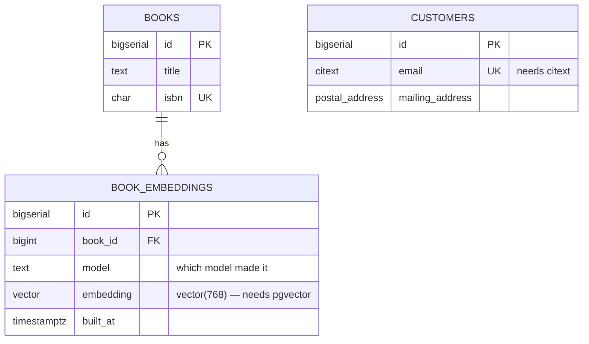

# Add an extension

## What you'll build

One new table, `book_embeddings`, whose whole reason to exist is a column
PostgreSQL cannot make on its own: `embedding vector(768)`. And one existing
column, `customers.email`, retyped from `TEXT` to `CITEXT` so that
`Ada@example.com` and `ada@example.com` stop being two different customers.

Neither works until the diagram says so. Both types come from extensions —
pgvector and citext — and this walkthrough is about declaring that dependency,
watching **Problems** insist on it, and seeing the two `CREATE EXTENSION` lines
appear at the top of the script ahead of everything that needs them.



## Before you start

You need what [Export, share and save](14-export-share-and-save.md) leaves
behind, which is the same canvas walkthrough 13 finished with: eighteen tables
in four regions, two custom types and a view. Press **Set up the canvas** at
the top of this walkthrough in the drawer's **Walkthrough** tab if it is not
already in front of you.

Have **PostgreSQL** selected in the dialect selector. It is the only one of the
three that installs extensions from a schema script at all; the last section
says what the other two do instead.

If you would rather read the finished thing than type it, open
[`diagrams/15-add-an-extension.dbviz.json`](diagrams/15-add-an-extension.dbviz.json)
with **File → Open** (`Ctrl+O`), or drop the file on the canvas.

## The mental model

An extension is a dependency of the *schema*, not of a table. That is why it
lives beside the custom types rather than on any node: `vector` is enabled once
for the database, and after that every table may use it.

The relationship to [walkthrough 04's custom types](04-create-an-enum.md) is
worth getting straight, because the two look alike in the column's type box and
are opposites underneath. A custom type is something **this diagram defines** —
the `order_status` enum exists because a `CREATE TYPE` in this script makes it,
and the whole definition travels in the `.dbviz.json`. An extension type is
something **the engine supplies** — `vector` exists because someone installed
pgvector on the server, and this diagram can only say that it needs it. So the
diagram stores an extension's *name* and nothing else. What `vector` provides —
its types, its functions, its `hnsw` and `ivfflat` index methods — is not in
your file. It comes from a catalog the app keeps separately, which is why a
diagram you share stays small and still opens for someone who has never heard
of pgvector: they get the right SQL, they just get no autocomplete.

The other half of the model is ordering. `CREATE EXTENSION` has to run before
anything that names a type it supplies, so the generator puts every extension
at the very top of the script — ahead of the `CREATE TYPE`s, ahead of the first
table. That is the same dependency ordering the script already does for foreign
keys, one level further up.

## Steps

### 1. Add the book_embeddings table

<!-- step
target: ui:add-table
goals:
  - table | book_embeddings
  - column | book_embeddings.book_id : BIGINT
  - column | book_embeddings.model : TEXT
  - column | book_embeddings.embedding : vector(768)
  - column | book_embeddings.built_at : TIMESTAMPTZ
hint: Type the type exactly as `vector(768)` — the length is part of it.
-->

Press `T` (or **+ Table**) and name it `book_embeddings`. It arrives with an
`id`; add four more columns:

| Column | Type | Flags |
| --- | --- | --- |
| `book_id` | `BIGINT` | **NN** |
| `model` | `TEXT` | **NN** |
| `embedding` | `vector(768)` | **NN** |
| `built_at` | `TIMESTAMPTZ` | **NN**, default `now()` |

The `vector(768)` cell is the interesting one, and it is worth noticing that
the app lets you type it without complaint. The type box is free text, exactly
as it was for `order_status` in walkthrough 04 — nothing validates a type as
you type it.

**You should see:** a new table on the canvas with five columns, and its type
box holding the literal text `vector(768)`.

### 2. Give it a foreign key to books

<!-- step
target: column:book_embeddings.book_id
goals:
  - fk | book_embeddings.book_id -> books.id
-->

Hover `book_embeddings`, drag the handle beside `book_id` onto the `id` row of
`books`. In the inspector set **On delete** to `CASCADE`: an embedding of a
book that no longer exists is not worth keeping.

Then, in **Indexes**, add a unique index on `book_id` and `model` together.
That is the grain of the table — one embedding per book per model — and it is
also the index the foreign key wants.

**You should see:** a solid line from `book_embeddings` to `books`, and
`book_embeddings` sitting inside the dashed `catalog` region, because it landed
next to `books` and regions take in whatever is inside them.

### 3. Open Problems and read the error

<!-- step
target: tab:problems
transient: true
goals:
  - open | problems
  - lint errors | 1
-->

Open the bottom drawer's **Problems** tab.

**You should see:** one error, which is the whole point of this walkthrough:

> `book_embeddings.embedding is vector(768), a type pgvector provides, but the
> diagram does not enable "vector". The CREATE TABLE will fail.`

That is not a guess about spelling. The app knows `vector` is a type pgvector
supplies and knows this diagram never asked for pgvector, so it knows the
statement it would generate cannot run. Beside the message is a chip naming
`book_embeddings.embedding` and a **Enable vector** button.

### 4. Enable vector from the fix

<!-- step
target: tab:problems
goals:
  - extension | vector
  - lint clean
-->

Click **Enable vector**.

**You should see:** the error disappear, **Problems** drop back to its usual
two *info* notes, and the **Types** tab in the drawer grow its count badge by
one — because the extension went into the same panel the custom types live in.

### 5. Look at what the extension brought with it

<!-- step
target: panel:types
goals:
  - extension | vector
hint: Scroll past the custom types; Extensions is the section under them.
-->

Open the **Types** tab and scroll to **Extensions**. Expand the `vector` card
with the chevron.

The card is the catalog talking. *Types* offers `vector(1536)`, `halfvec(1536)`
and `sparsevec(1536)`; *Index methods* names `hnsw` and `ivfflat`; *Operator
classes* lists `vector_l2_ops` and friends; and the note explains the trap that
an index has to name the operator class matching the distance you query with.
None of that is in your file — it is what the app knows about pgvector.

Fill in *Why this schema needs it*: `book_embeddings.embedding: 768-dimension
embeddings for "books like this one".` A year from now that sentence is the
difference between "we can drop this" and "nobody remembers".

**You should see:** the statement this turns into, in the box at the foot of
the card:

```sql
CREATE EXTENSION IF NOT EXISTS vector;
```

Now go back to `book_embeddings` and click into the `embedding` type box. The
autocomplete offers `vector(1536)`, `halfvec(1536)` and `sparsevec(1536)`,
which it did not before you enabled the extension.

### 6. Retype customers.email as CITEXT

<!-- step
target: column:customers.email
transient: true
goals:
  - column | customers.email : CITEXT
-->

Select `customers` and change the type of `email` from `TEXT` to `CITEXT`.
Leave the **UQ** flag on — it is the reason to do this at all. `CITEXT`
compares case-insensitively, so the unique index stops letting the same person
sign up twice with different capitalisation. The alternative, a unique index on
`lower(email)`, is an expression index, which this app cannot draw.

**You should see:** **Problems** go back to one error, this time about
`customers.email` and the `citext` extension. The same rule, a second time,
without you having to remember which extension `CITEXT` comes from.

### 7. Enable citext, this time from the Extensions section

<!-- step
target: panel:types
goals:
  - extension | citext
  - extensions | vector, citext
  - lint clean
-->

Do this one the long way, to see the other route. In **Types → Extensions**,
type `citext` into the box at the top of the section and press **Add**. The box
autocompletes from the catalog, and the chips under it are one-click shortcuts
for extensions this diagram does not have yet.

Give it a comment too: `customers.email compares case-insensitively, so the
UNIQUE index does too.`

**You should see:** two cards in **Extensions**, and **Problems** clean again.

### 8. Read the top of the script

<!-- step
target: tab:sql
goals:
  - open | sql
  - contains | CREATE EXTENSION IF NOT EXISTS vector;
  - contains | email CITEXT NOT NULL UNIQUE
-->

Open the **SQL** tab, whole schema.

**You should see:** the extensions named in the header, and enabled in their
own block before the custom types and the first table:

```sql
-- Bookshop — after 15 Add an extension (PostgreSQL)
-- Generated by Database Visualizer
-- Tables: 16, views: 1, foreign keys: 16, documented connections: 8
-- Extensions: vector, citext
-- 2 table(s) live in another database and are not created here; see "External sources" at the end.

-- Extensions
CREATE EXTENSION IF NOT EXISTS vector;
CREATE EXTENSION IF NOT EXISTS citext;

-- Custom types
CREATE TYPE order_status AS ENUM ('pending', 'paid', 'shipped', 'cancelled');
```

## Other ways to do it

- **Import a script that already says so.** Paste `CREATE EXTENSION vector;`
  into **Import SQL** along with the tables and the extension comes in with
  them. `CREATE EXTENSION IF NOT EXISTS "uuid-ossp" WITH SCHEMA extensions
  VERSION '1.1'` parses with all three of its options, and MariaDB's
  `INSTALL SONAME 'ha_connect'` is read the same way.
- **Read them off a live database.** With a connection set up as in
  [walkthrough 13](13-run-the-schema-on-a-real-database.md), **Types →
  Extensions → Where definitions come from → Read from the database** lists
  what that server has installed and what it could install, as chips you can
  click to add. This is the authoritative route: a PostgreSQL server that has
  pgvector installed knows exactly which types and index methods it added, and
  says so, which beats anything the app has guessed.
- **Load a definition pack.** For an extension the app does not ship a
  definition for, load a JSON file describing it, from disk or a URL — the
  format is [`../EXTENSION_PACK_FORMAT.md`](../EXTENSION_PACK_FORMAT.md), with
  an example in [`../examples/`](../examples/). **Keep as a pack** in the same
  section saves what a server told you, so it survives a reload.
- **Hand-write it.** In a `.dbviz.json`, `extensions` is an array of
  `{ "id", "name" }` beside `customTypes`; see
  [`../ADVISOR_OUTPUT_FORMAT.md`](../ADVISOR_OUTPUT_FORMAT.md).
- **Copy the tables out.** `Ctrl+C` on `book_embeddings` and `Ctrl+V` in
  another diagram brings the `vector` declaration with it, the same way it
  brings a custom type the copied columns use.

## Check your work

Open **SQL**, whole schema, and look for three things: the `-- Extensions`
block at the top, the vector column in `book_embeddings`, and `CITEXT` on
`customers.email`.

```sql
CREATE TABLE public.book_embeddings (
  id BIGSERIAL PRIMARY KEY,
  book_id BIGINT NOT NULL,
  model TEXT NOT NULL,
  embedding vector(768) NOT NULL,
  built_at TIMESTAMPTZ NOT NULL DEFAULT now(),
  CONSTRAINT book_embeddings_book_id_fkey FOREIGN KEY (book_id) REFERENCES public.books (id) ON DELETE CASCADE
);
CREATE UNIQUE INDEX book_embeddings_book_id_model_idx ON public.book_embeddings (book_id, model);
```

Notice what the generator did *not* do to `vector(768)`: it passed it through
untouched. Enabling an extension does not make the app understand its types, it
makes the app stop objecting to them — the type text is yours, exactly as
typed, the same contract as every other type in the diagram.

Then press **Check my work** at the foot of this walkthrough. It asserts both
extensions by name, both types in the generated script, the connection counts,
and a clean **Problems** tab.

## Try it yourself

- Delete the `vector` extension card and watch the error come back — then undo
  it with `Ctrl+Z`. The check is live: it is recomputed from the diagram on
  every change, not at generate time.
- Add `pg_trgm` and read its card. It provides no types at all — only functions
  and the `gin_trgm_ops` operator class that makes an unanchored
  `LIKE '%dune%'` on `books.title` use an index instead of scanning. Then
  notice that this app cannot express that index, because an index here is a
  list of columns with no method and no operator class. That is a real limit,
  and the honest place to record it is a sticky note next to `books`.
- Switch the dialect to **MariaDB** and look at the **SQL** tab. The two
  extensions are still declared, the script still says so, and neither
  generates a statement.
- Add an extension the app has never heard of — `my_internal_ext` — and watch
  the card say *no definition* while the `CREATE EXTENSION` line appears
  anyway. That split is the whole design: names generate SQL, definitions only
  help you type.

## Gotchas

- **`CREATE EXTENSION` usually needs privileges an application role does not
  have.** On the Docker containers from walkthrough 13 you are the superuser,
  so it just works; against a managed database it may not, and the extension
  has to be enabled by someone who can before your schema will apply.
- **The extension has to be installed on the server first.** `CREATE EXTENSION
  vector` fails with *extension "vector" is not available* unless the pgvector
  files are on that machine. The statement enables an extension in a database;
  it does not fetch one.
- **A vector column's length is part of its type.** `vector(768)` and
  `vector(1536)` are not interchangeable, and an index can only be built on a
  column whose length is declared. Leaving it off gives you a column that
  accepts any length and cannot be indexed.
- **MariaDB and SQLite do not install extensions from a schema script.**
  MariaDB's equivalent is `INSTALL SONAME`, which loads a plugin into the whole
  server, needs SUPER and only has to be done once; SQLite's modules are
  compiled in or loaded by the client before it opens the file. On both, the
  declaration documents the dependency and the script carries the exact
  statement as a comment rather than running it with your schema.
- **A definition is not a promise.** The bundled catalog describes pgvector as
  it generally is, not as your server has it. If the version matters, read the
  definitions off the server itself; that answer comes from the server's own
  catalogs and outranks everything the app ships with.
- **Removing a definition pack does not remove anything from your diagram.**
  The extensions you declared stay declared and keep generating the same SQL;
  they only lose their autocomplete and their card contents.

## Where to go next

This is the last walkthrough in the series. Two things are worth doing next
with what it leaves you:

- [Run the schema on a real database](13-run-the-schema-on-a-real-database.md)
  again, now that the script has two `CREATE EXTENSION` lines in it — a
  `postgres:16` container has citext but not pgvector, so the apply fails on
  the first line and shows you exactly what a missing extension looks like from
  the other side.
- [Fix what Problems finds](10-fix-what-problems-finds.md) is the companion to
  step 3: the same panel, the same one-click fixes, over the rest of the rules.
