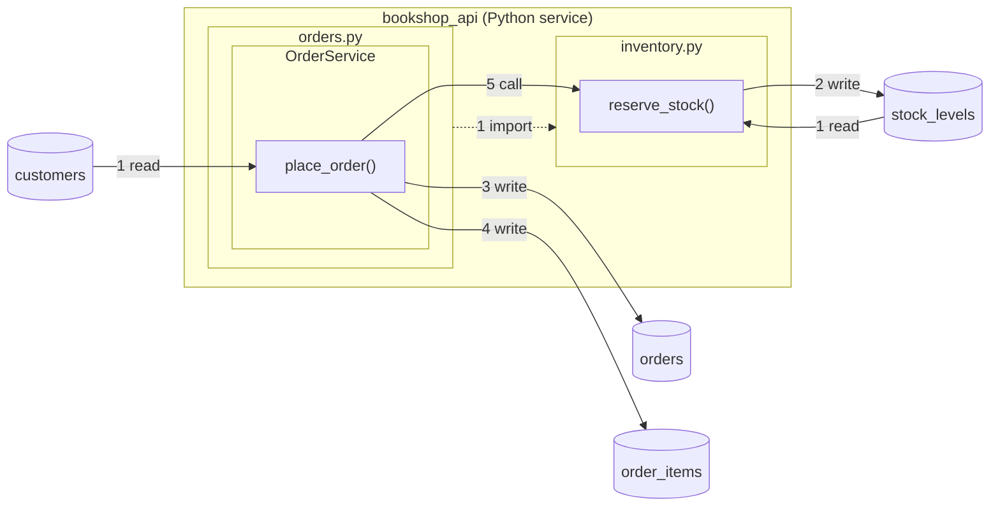

# Map the code that talks to it

## What you'll build

Not one new table. Every walkthrough so far has added to what the database
holds; this one draws what *uses* it. `bookshop_api` is the web service the
shop front talks to, and its checkout route reads `customers`, writes `orders`
and `order_items`, and reserves stock by calling a function in another file.
By the end, that sentence is on the canvas as a program holding two modules,
one of them holding a class, and two functions with a numbered arrow for every
table they touch and one for the call between them.



## Before you start

You need the canvas [Add an extension](15-add-an-extension.md) leaves behind:
nineteen tables in four regions, two custom types, a view and two extensions.
Press **Set up the canvas** at the top of this walkthrough in the drawer's
**Walkthrough** tab if it is not already in front of you. Any dialect works;
the map is documentation and generates no SQL of its own, but keep
**PostgreSQL** so the statements you type into the steps match the rest of the
series.

If you would rather read the finished thing than type it, open
[`diagrams/16-map-the-code-that-talks-to-it.dbviz.json`](diagrams/16-map-the-code-that-talks-to-it.dbviz.json)
with **File → Open** (`Ctrl+O`), or drop the file on the canvas.

## The mental model

You have met a **program** before, in passing: walkthrough 02's `catalog_export`
is read by a nightly job, and the *Programs* section of the README describes a
node whose ordered steps say what it reads, computes and writes. A code map is
that same node, opened up. A **module** is a file; a **class** is a class; a
**function** is the node whose steps actually run the statements. Each one
sits *inside* another, the way a function sits inside a class inside a file
inside a service, and the app draws the containers as regions around their
members, exactly as walkthrough 03's group is a region around its tables.

That analogy is worth holding on to, because it carries the rule that makes
the map trustworthy: **nothing about the picture is stored except the nodes,
what each sits inside, and their steps.** A region is the bounding box of what
is in it. An arrow is a step. There is no arrow you can draw that is not a
step on some node, and no way for an arrow to say something the step does not,
so the map cannot rot into a diagram of calls that no longer happen the way a
whiteboard photo does.

Two more ideas and the rest is typing. First, three new kinds of step name
code instead of a table: **call** (hand control to a function, a class or a
program), **import** (depend on a module) and **extends** (inherit from a
class). They are numbered in step order like a read or a write, so `1 read
customers, 2 compute, 3 write orders, 4 write order_items, 5 call
reserve_stock` reads off a node the way a round trip did. Second, a container
can be **collapsed** to one node, and when it is, every arrow into or out of
what it hides is redrawn from the folded node, arrows that then say the same
thing gathered into one. Fold the whole service and you are back to the plain
program node of walkthrough 02, one arrow per table; unfold it and the arrows
go back to the functions that own them.

## Steps

### 1. Add the program

<!-- step
target: ui:add-program
goals:
  - code | program bookshop_api
-->

Open the `▾` beside **+ Table** and, under *Code map*, choose **Program**. The
inspector opens with the cursor in *Name*: type `bookshop_api`. Leave
*Language* on **Python**, set *Runs as* to **Service**, put
`services/api/main.py` in *Where the code lives* and, in *What it is for*,
`The web API the shop front talks to. Checkout is its place_order route.`

**You should see:** a new node below the tables, headed `bookshop_api` with a
*Service* badge and *no steps yet* inside it. New programs land under
everything already placed; drag it to the left of the tables, where its arrows
will have room.

### 2. Put a module inside it

<!-- step
target: ui:add-module
goals:
  - code | module bookshop_api/orders.py
-->

With `bookshop_api` still selected, open the same `▾` menu and choose
**Module**. A module, class or function added from that menu goes inside
whatever code node is selected, as long as that node can hold it. Name it
`orders.py`, and put `services/api/orders.py` in *Path*.

**You should see:** `bookshop_api` stop being a node. It is now a **region**, a
box with its name on a title strip, drawn around the new `orders.py` node,
which says *nothing inside yet*. The inspector's *Inside* picker on `orders.py`
reads `bookshop_api`: that is the one stored fact the region is drawn from.

### 3. Put a class in the module

<!-- step
target: ui:add-class
goals:
  - code | class bookshop_api/orders.py/OrderService
-->

With `orders.py` selected, `▾` → **Class**. Name it `OrderService`, and in
*Signature or location* type `class OrderService`.

**You should see:** `orders.py` become a region of its own inside
`bookshop_api`'s, with `OrderService` the node inside it. Two nested boxes,
one node. Each region is exactly as big as what it holds plus a margin, and it
grows when you add to it.

### 4. Add the function

<!-- step
target: ui:add-function
goals:
  - code | function bookshop_api/orders.py/OrderService/place_order
-->

With `OrderService` selected, `▾` → **Function**. Name it `place_order` and
give it its signature, `def place_order(self, email, cart) -> int`, and its
purpose: `Turns a cart into an order and its lines, then reserves the stock
for each line.`

**You should see:** three nested regions and one node. `place_order` is a
leaf: a function holds nothing, so the inspector shows no *Inside* section for
it, and anything you add from the `▾` menu while it is selected lands beside
it at the top level rather than in it.

### 5. Say what it reads and writes

<!-- step
target: field:Steps, in order
goals:
  - reads table | place_order -> customers
  - writes table | place_order -> orders
  - writes table | place_order -> order_items
hint: The compute step draws nothing, so the arrow numbers skip it on purpose.
-->

Under *Steps, in order* press **+ Read** and pick `customers` in the box beside
it; under *Columns it touches* tick `id` and `email`, and in *The statement it
runs* type `SELECT id FROM customers WHERE email = %s`. Then **+ Compute**,
with the note `total the cart in cents`. Then **+ Write** on `orders`, columns
`customer_id`, `status` and `total_cents`, statement
`INSERT INTO orders (customer_id, status, total_cents) VALUES (%s, 'pending', %s) RETURNING id`.
Then **+ Write** on `order_items` with its four non-key columns.

**You should see:** three numbered arrows: `1 read` from `customers` into
`place_order`, `3 write` and `4 write` from `place_order` out to `orders` and
`order_items`. There is no `2`: the compute step is work the database never
sees, so it draws nothing and the numbering says so.

### 6. Add the second module

<!-- step
target: ui:add-module
goals:
  - code | module bookshop_api/inventory.py
hint: Select the program first. A module added while a function is selected lands at the top level, because a function cannot hold one.
-->

Click `bookshop_api`'s title strip to select the program, then `▾` →
**Module**. Name it `inventory.py`, path `services/api/inventory.py`, purpose
`Stock bookkeeping. Nothing here knows what an order is.`

**You should see:** a second node inside `bookshop_api`'s region, beside or
below `orders.py`'s. If it landed outside the region instead, you had the
wrong thing selected: either drag it into the region, or set *Inside* to
`bookshop_api` in the inspector. Both do the same thing, because the region is
drawn from that one field.

### 7. Add the function that reserves stock

<!-- step
target: ui:add-function
goals:
  - code | function bookshop_api/inventory.py/reserve_stock
-->

With `inventory.py` selected, `▾` → **Function**. Name it `reserve_stock`,
signature `def reserve_stock(conn, book_id, warehouse_code, quantity) -> None`,
purpose `Locks the stock row, checks there is enough, and takes the quantity
off on_hand.`

**You should see:** `inventory.py` become a region with `reserve_stock` inside
it. The sidebar's **Code** section now shows the whole tree, indented:
`bookshop_api`, then `orders.py` and `OrderService` and `place_order`, then
`inventory.py` and `reserve_stock`.

### 8. Give it its round trip

<!-- step
target: field:Steps, in order
goals:
  - reads table | reserve_stock -> stock_levels
  - writes table | reserve_stock -> stock_levels
-->

**+ Read** on `stock_levels` (`book_id`, `warehouse_code`, `on_hand`), with the
statement `SELECT on_hand FROM stock_levels WHERE book_id = %s AND warehouse_code = %s FOR UPDATE`
and the note `lock the row first`. Then **+ Write** on `stock_levels`, column
`on_hand`, statement
`UPDATE stock_levels SET on_hand = on_hand - %s WHERE book_id = %s AND warehouse_code = %s`.

**You should see:** two arrows between `reserve_stock` and `stock_levels`, one
each way, and *round trip: stock_levels* under the node's steps. That footer
is walkthrough 02's `catalog_export` job in reverse: the same table read and
then written by the same code, which is the shape of every lock-check-update.

### 9. Draw the call

<!-- step
target: code:bookshop_api/orders.py/OrderService/place_order
goals:
  - calls | place_order -> reserve_stock
-->

Hover `place_order` and drag the handle at the right end of its header onto
`reserve_stock`. Dropping on another code node adds a **Call** step to the node
you dragged *from*, and opens it in the inspector; in its *Note* type `once per
line, inside the same transaction`.

**You should see:** a dashed arrow labelled `5 call` leaving `place_order`,
crossing out of `orders.py`'s region and into `inventory.py`'s, ending on
`reserve_stock`. The step is the fifth on `place_order`, after the writes,
because that is the order the code does them in; drag it up the list with its
grip and the number on the arrow follows.

### 10. Record the import

<!-- step
target: field:Steps, in order
goals:
  - select code | bookshop_api/orders.py
  - imports | orders.py -> inventory.py
-->

Click `orders.py`'s title strip to select the module. Under *Steps, in order*
press **+ Import** and pick `bookshop_api/inventory.py` from the box beside it.
A module's steps are its imports; the statements belong on the functions.

**You should see:** a dotted arrow with an open head from `orders.py`'s title
strip to `inventory.py`'s, labelled `1 import`. The two arrows between the
modules now say different things: the import is a dependency between files,
the call is a hand-off at run time, and a reader looking for "what breaks if I
delete `inventory.py`" wants both.

### 11. Collapse the whole service

<!-- step
target: code:bookshop_api
transient: true
goals:
  - code collapsed | bookshop_api : on
-->

Right-click `bookshop_api`'s title strip and choose **Collapse to one node**
(the strip's own chevron button and the **Collapse** button in the inspector's
*Inside (2)* section do the same).

**You should see:** the three regions and four nodes replaced by one program
node, badged with the number of nodes it hides, sitting where the region's
top-left corner was so nothing else moves. Its arrows are gathered: one to
`customers`, one each to `orders` and `order_items`, one each way to
`stock_levels`, each labelled with the operation rather than a step number.
The call and the import are not drawn at all, because both ends are inside the
node now. This is the picture a plain program from walkthrough 02 would have
given you, and it is what a reader who only cares *whether* the service
touches a table wants.

### 12. Expand it and trace through it

<!-- step
target: tab:trace
goals:
  - code collapsed | bookshop_api : off
  - open | trace
  - traced | place_order -> stock_levels
-->

Right-click the folded node and choose **Expand: show the 5 nodes inside**.
Then open the drawer's **Trace** tab, pick
`bookshop_api/orders.py/OrderService/place_order` under *Code* in the *From…*
box and `stock_levels` in *To…*, and press **Trace**.

**You should see:** the path lit on the canvas, running through the call, and
this in the panel instead of a `JOIN`:

```sql
-- This path runs through code, so there is no single query for it.
-- place_order → stock_levels:
--   1. place_order calls reserve_stock (step 5)
--   2. reserve_stock reads stock_levels (step 1)
```

Walkthrough 11's trace between two tables produced a query because every hop
was a key. A hop that is a function call is not something the database can
join across, so the panel says what the path is rather than inventing a
statement for it.

### 13. Read the script

<!-- step
target: tab:sql
goals:
  - open | sql
  - contains | "kind": "function"
-->

Open the **SQL** tab, whole schema, and scroll to the end.

**You should see:** the same sixteen `CREATE TABLE`s as before, and, inside
the `-- dbviz:connections` block after them, a `"programs"` array holding every
node of the map. Nothing about the code reached the DDL. Each node names the
container it sits in as a **path**, `"parent": "bookshop_api/orders.py"`, and
each call names its target the same way, because a path is the one identity a
node has that survives being imported into a diagram whose ids came from
somewhere else.

## Other ways to do it

- **Right-click the canvas** for *Add program here*, *Add module here*, *Add
  class here* and *Add function here*: the node lands where you clicked, at
  the top level. Drag it into a region to put it inside; drag it out to move
  it up a level. Right-click a node inside a container for *Move out of
  orders.py*.
- **The command palette.** `Ctrl+K` and type *module*: *Add module (a box in
  the code map)* puts one inside the selected code node. Typing a node's name
  jumps to it; the entries read `Function: bookshop_api/orders.py/OrderService/place_order`.
- **From the container.** Select a module or class and the inspector's *Inside
  (N)* section lists its members with **+ Module**, **+ Class** and **+
  Function** buttons under them, offering only the kinds that container can
  hold. Right-click a node for *Add a function inside* and the like.
- **Draw steps by dragging.** From a table's column handle onto a function
  adds a read on that column; from the function's header onto a table adds a
  write; between two code nodes it is a call, or an import when the drag leaves
  a module, or an extends between two classes.
- **Hand-write it.** In a `.dbviz.json` a code node is a `programs` entry with
  `kind` and `parentId`; a call is a step with `op: "call"` and a `codeId`.
  [`../CODE_MAP_FORMAT.md`](../CODE_MAP_FORMAT.md) is the whole format, and
  `node scripts/validate-dbviz.mjs` checks the containment and the targets
  before you open the file.
- **Import a script the app exported.** Paste it into **Import SQL** and the
  block from step 13 brings the map back, nodes first and parents second, so
  the order of the array does not matter. A parent or target the script does
  not describe is reported and the node or step kept.
- **Copy and paste.** `Ctrl+C` on `orders.py` copies the module with the class
  and function inside it; `Ctrl+V` in another diagram re-points their steps
  at that diagram's copies of the tables and keeps the steps whose tables did
  not come along.

## Check your work

Open **SQL**, whole schema, and read the `"programs"` entry for `place_order`
inside the `-- dbviz:connections` block at the end:

```sql
--     {
--       "name": "place_order",
--       "kind": "function",
--       "parent": "bookshop_api/orders.py/OrderService",
--       "language": "python",
--       "entrypoint": "def place_order(self, email, cart) -> int",
--       "comment": "Turns a cart into an order and its lines, then reserves the stock for each line.",
--       "steps": [
--         {
--           "op": "read",
--           "table": "customers",
--           "columns": [
--             "id",
--             "email"
--           ],
--           "sql": "SELECT id FROM customers WHERE email = %s",
--           "note": "who is buying"
--         },
--         {
--           "op": "compute",
--           "note": "total the cart in cents"
--         },
--         {
--           "op": "write",
--           "table": "orders",
--           "columns": [
--             "customer_id",
--             "status",
--             "total_cents"
--           ],
--           "sql": "INSERT INTO orders (customer_id, status, total_cents) VALUES (%s, 'pending', %s) RETURNING id"
--         },
--         {
--           "op": "write",
--           "table": "order_items",
--           "columns": [
--             "order_id",
--             "book_id",
--             "quantity",
--             "unit_price_cents"
--           ],
--           "sql": "INSERT INTO order_items (order_id, book_id, quantity, unit_price_cents) VALUES (%s, %s, %s, %s)",
--           "note": "one row per cart line"
--         },
--         {
--           "op": "call",
--           "target": "bookshop_api/inventory.py/reserve_stock",
--           "note": "once per line, inside the same transaction"
--         }
--       ]
--     },
```

Every step is there with its statement, and the DDL above the block is the
same as it was at the end of walkthrough 15. **File → Export Markdown** gets a
`## Code` section that walks the same tree, and every table the map touches
gets a *touched from outside the database* list saying which function does
what to it.

Then press **Check my work** at the foot of this walkthrough. It asserts the
program and the function by path, the call, the import, a read and a write, a
trace that runs through the call, the connection counts you had before, and a
clean **Problems** tab.

## Try it yourself

- **Select `orders.py` and press *Show the Python starter*.** It is not the
  module's one import step on its own: it is the file, with `class
  OrderService` in it and `place_order` inside that, because that is what the
  diagram says lives there. The import step became `import inventory` at the
  top rather than a stub, and `inventory.py` is not in the file at all — it is
  a module, so it is a file of its own with a starter of its own. Select
  `OrderService` and you get the class; select `place_order` and you get the
  one function as a script, which is what a leaf is good for.
- **Give `reserve_stock` and `place_order` different signatures.**
  `reserve_stock`'s *Signature or location* already reads `def
  reserve_stock(conn, book_id, warehouse_code, quantity) -> None`, so its
  starter is written under exactly that signature and uses the `conn` it is
  handed. `place_order`'s does not name a connection, so its body opens one.
  Clear a signature altogether and the starter writes a plain one from the
  name.
- **Delete `inventory.py`** (right-click it → *Delete module and the 1 node
  inside*) and open **Problems**. `place_order`'s call step is now an error,
  *calls something that is no longer in the diagram*, with a **Remove the
  step** fix; the step, its note and any code you typed are still there until
  you take it. `Ctrl+Z` puts the module back and the arrow with it.
- **Collapse only `orders.py`.** The call arrow now leaves the folded module
  rather than `place_order`, without a number, while `reserve_stock`'s two
  arrows to `stock_levels` are untouched. Fold `inventory.py` too and the call
  runs between two folded modules.
- **Add a second function to `inventory.py`** that also reads `stock_levels`,
  then collapse the module: the two reads become one arrow carrying a count.
  That gathering is the whole reason collapsing is worth having on a big map.
- **Make `orders.py` import itself**, or have `inventory.py` import
  `orders.py` back, and read what **Problems** says about circular imports.
  Then press the full-stop key with `place_order` selected: **Focus** treats
  the tables it touches and the function it calls as its neighbours.

## Gotchas

- **A member goes inside the selected node only if that node can hold it.**
  With `place_order` selected, `▾` → **Module** puts the module at the top
  level, because a function is a leaf. Nothing is lost: set *Inside* in the
  inspector, or drag the node into the region.
- **The map is documentation.** Nothing in it reaches a `CREATE TABLE`, and
  the DBML export, which has only tables, keeps each node as a note. If the
  code is the recommendation, the place for it is each step's *Code* box and
  the generated starter, not the schema.
- **You cannot draw an arrow.** Every arrow is a step; to remove one, remove
  the step. Every region is the box around its members; to move a node out of
  a module, move the node, not the box.
- **A trace through code has no query.** The **Trace** tab prints the hops
  instead, and the button that would run the join in the **Query** tab is
  disabled for that path, because there is no statement the database could run
  for *place_order calls reserve_stock*.
- **Names are unique per container, not per diagram.** `OrderService.save` and
  `Customer.save` are fine; two `save`s in one class are a **Problems** warning.
  Everything that names a node from outside its file uses the path, and a bare
  name in a check or goal resolves only while exactly one node carries it.
- **A step's statement is text.** Rename `stock_levels` and the arrows follow,
  because they are drawn from the step's table reference; the `UPDATE
  stock_levels` you typed does not, exactly as a tagged query does not.
- **`place_order` is called by nothing, and Problems says so** as an info
  note, once the map has any call in it. That is the right thing to be told:
  the web framework reaches it through a route the map cannot see, which is
  why *Signature or location* is where the route belongs.
- **A collapsed container's members keep their positions.** Expanding it puts
  them back where they were, and the folded node takes the region's top-left
  corner when it folds, so nothing else on the canvas moves either way.

## Where to go next

This is the end of the series, and the canvas in front of you is the whole
bookshop: nineteen tables, four regions, two custom types, a view, two
extensions, and now the service that uses them. Three things are worth doing
with it:

- [Trace a path between tables](11-trace-a-path-between-tables.md) again, now
  picking a function as one end. Every table a trace can reach from
  `place_order` is a table a change to that function can break.
- [Export, share and save](14-export-share-and-save.md) once more, to see the
  `## Code` section in the Markdown and the map ride along in a share link,
  which carries the whole diagram.
- [Fix what Problems finds](10-fix-what-problems-finds.md) is the companion to
  the *Try it yourself* experiments here: the same panel, with the map's own
  rules — a container holding what it cannot, a call to nothing, a circular
  import — alongside the schema's.
