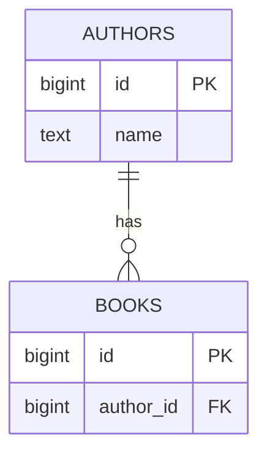

# TODO sentence case, no full stop

## What you'll build

TODO two or three sentences. What is on the canvas at the end, and what it is
for. Then the sketch:



## Before you start

You need what [TODO previous walkthrough](PP-previous-slug.md) leaves behind:
TODO one sentence naming the tables and features this one builds on. Press
**Set up the canvas** at the top of this walkthrough in the drawer's
**Walkthrough** tab if it is not already in front of you.

TODO which dialect is selected in the top bar and why it matters here.

If you would rather read the finished thing than type it, open
[`diagrams/NN-todo-slug.dbviz.json`](diagrams/NN-todo-slug.dbviz.json) with
**File → Open** (`Ctrl+O`), or drop the file on the canvas.

## The mental model

TODO the *why*, anchored to something the reader already knows — the SQL this
becomes, a data structure, a filesystem, a spreadsheet. One or two paragraphs,
no steps.

## Steps

### 1. TODO imperative title

<!-- step
target: ui:add-table
goals:
  - table | TODO
-->

TODO the action, naming the exact control.

**You should see:** TODO the observable change on screen.

### 2. TODO imperative title

<!-- step
target: section:Columns
goals:
  - column | TODO.TODO : TEXT
-->

TODO

**You should see:** TODO

### 3. TODO imperative title

<!-- step
target: tab:sql
goals:
  - open | sql
-->

TODO

**You should see:** TODO

## Other ways to do it

TODO every other route to the same result: the keyboard, the right-click menu,
the command palette (`Ctrl+K`), **Import SQL**, dropping a file, hand-written
`.dbviz.json`.

## Check your work

TODO how the reader proves it worked. Open the bottom drawer → **SQL** and
compare — copy this block from the app, do not write it from memory. On a
large stage, quote only the part this walkthrough changed and say so:

```sql
-- TODO paste the real generated script
```

Then press **Check my work** at the foot of this walkthrough: TODO one line on
what its checks pin down that the script above does not make obvious.

## Gotchas

- TODO what bites, why, and what to do instead.
- TODO
- TODO

## Where to go next

- TODO [Title](NN-slug.md) — the next walkthrough in the series, and one line
  on what it does with what you just built.
